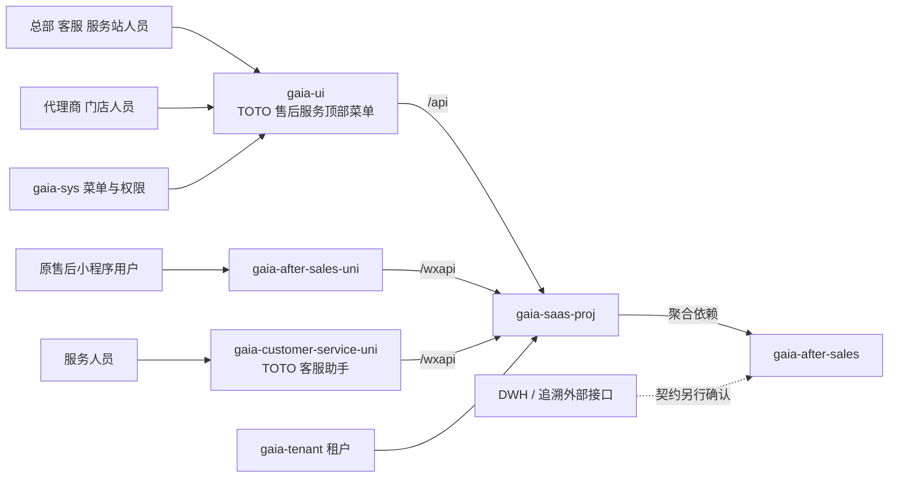

# TOTO 售后服务仓库与系统关系

更新日期：2026-09-24（两个小程序暂停远程关联；其他现场记录保留原时点）

## 核心关系

虚线表示规划或待确认关系，不代表当前已经建立调用链。两个小程序已有独立代码仓库；真实小程序 API、身份和业务页面仍按功能 Spec 接入。

## 直接开发或接入的仓库

| 仓库 | 本机位置 | 负责内容 | 当前动作边界 |
| --- | --- | --- | --- |
| `gaia-after-sales` | `Gaia/backend/gaia-after-sales` | 售后领域、管理端 API、小程序 API；客服后端也放在这里 | 继续使用；不新建客服后端仓库 |
| `gaia-after-sales-uni` | `Gaia/mobile/gaia-after-sales-uni` | 消费者小程序与 H5 | 独立本地 Git；2026-09-24 解除远程关联，继续本地提交；与服务人员端同步维护共同底座，消费者业务和 AppID 独立 |
| `gaia-customer-service-uni` | `Gaia/mobile/gaia-customer-service-uni` | “TOTO客服助手”服务人员小程序与 H5 | 2026-09-17 从消费者端 `289800f` 复制共同底座，配置 AppID `wx3023d326070260ec`；2026-09-24 解除远程关联，继续本地提交；真实身份和 W01～W16 业务尚未接入 |
| `gaia-ui` | `Gaia/frontend/gaia-ui` | 统一管理后台与代理商工作台；共用“TOTO 售后服务”顶部菜单、API 调用、动态菜单和权限体系 | 按[目录与菜单设计](../02-技术设计/03-gaia-ui目录与菜单设计.md)落入 `src/views/afterSales`；按角色隔离入口和数据 |
| `gaia-saas-proj` | `Gaia/backend/gaia-saas-proj` | 聚合售后 API 并提供运行环境 | 首个真实接口出现后增加版本和依赖并验证扫描、权限、租户 |
| `gaia-sys` | 旧 Gaia 工程的系统管理仓库 | 顶级菜单、角色、按钮和 API 权限 | 优先配置；只有交付要求初始化数据或代码时才改仓库 |

### 小程序远程地址留存与恢复

2026-09-24 按项目要求移除两个现有仓库的 `origin`，不删除本地分支、提交和工作区改动。移除前，两个当前工作分支均为 `feature/20260907_蓝鲸售后服务_志远_喆宇`，本地提交与已有远程跟踪引用的差异均为 0／0；这只表示当时的本地引用状态，不代表远端之后没有新提交。

| 仓库 | 恢复时使用的 `origin` 地址 |
| --- | --- |
| `gaia-after-sales-uni` | `https://codeup.aliyun.com/ehsure/gaia/gaia-after-sales-uni.git` |
| `gaia-customer-service-uni` | `https://codeup.aliyun.com/ehsure/gaia/gaia-customer-service-uni.git` |

收到恢复关联指令后，分别在对应仓库执行 `git remote add origin <上表地址>`、`git fetch origin`，核对当前分支与远端同名分支的提交关系，再按实际情况正常合并或变基，最后 `git push -u origin HEAD`。若远端分支不存在，正常推送会创建它；若远端已有不同提交，先解决差异，不强制推送。只有已经 `git commit` 的本地改动会随推送同步，未提交的工作区改动不会同步。

## 必须复用、默认不修改的基础

| 仓库或领域 | 可复用能力 | 使用原则 |
| --- | --- | --- |
| `gaia-tenant` | 租户识别、动态数据源、租户菜单权限同步 | 核对 TOTO 环境，不自建租户机制 |
| `gaia-base` | 统一响应、异常、Redis、文件和安全组件 | 真实需求出现时按需依赖，不重复造基础设施 |
| `gaia-dms` | 现有销售出库实现参考 | 不作为售后业务数据源；外部销售核验另行确认接口 |
| `gaia-fulllink` | 现有追溯实现参考 | 不直接关联业务表；追溯核验按独立外部接口契约接入 |
| `gaia-dms-uni` | 已有 TOTO 租户配置与小程序实现 | 只作环境和交互参考 |
| `gaia-traceability-uni` | UniApp/Vue 3 兼容工程和构建基础 | 只读参考，不复制追溯业务和发布配置 |

`gaia-member`、`gaia-md`、`gaia-store`、`gaia-dms`、`gaia-bm` 只有在现有查询或协作能力确实不足时才进入修改范围。`gaia-common-ui`、`gaia-mes` 和 `gaia-springboot-starter-parent` 不属于默认修改范围；工厂设备维修模型不能直接当作产品售后模型。

## 代码保护与现场约束

- `gaia-ui/src/views/common` 是公共子仓库，未经用户单独明确授权不得修改或提交。
- 代理商工作台不是独立应用：沿用 Gaia 登录和 `gaia-ui` 动态菜单；授权门店选择放在业务上下文或页头，不另建登录菜单。
- `gaia-ui` 当前本地 `master` 落后 `origin/master` 17 个提交，并有 `src/views/common` 改动；开始后台开发前先处理分支基线，不能覆盖现有工作。
- `gaia-saas-proj` 当前存在 `.gitignore` 修改和未跟踪 `logs/`；售后接入必须保留这些既有内容，且不得自动提交。
- `gaia-after-sales-uni` 的通用底座整治纳入本次本地提交，验证与限制见[整治 Spec](../specs/2026-09-14-小程序通用底座整治.md)；后续开发前仍须检查实际工作树。
- 两个小程序共同底座和公共配置机制的变更必须在同一任务同步修改并分别验证；应用名称、AppID、版本台账、业务路由和页面保持独立，完整边界以两个仓库同名 `docs/shared-foundation.md` 为准。
- `gaia-after-sales` 当前为本地 `main` 且干净；其最新文档提交不代表任何业务切片已完成。
- 提交、推送、微信上传和发布均不由功能 Spec 或跨仓开发授权自动包含。

## 数据与接口归属原则

- 售后域独立持有商品、分类、代理商、门店、顾客、服务资源、库存、工单及其业务关系和快照，不直接引用主系统业务主档。
- 统一认证权限／租户平台按原方案复用；DWH、出库和追溯核验仅按另行确认的外部接口契约接入，不默认与主系统同步。代码已完成独立化整改，目标环境待迁移与验收，见 [业务数据独立边界与核查](../specs/2026-09-11-业务数据独立边界与已开发功能核查.md)。
- 管理端入口按现有 `/api/**` 体系；小程序入口按 `/wxapi/**` 体系。具体命名空间、身份和权限在单切片 Spec 中确认。
- 如果最终只是门店退换货且不存在独立工单生命周期，应重新评估是否由 `gaia-store` 承载；如果要独立部署售后服务，再评估独立 Web 启动模块。

技术版本和装配方式见[技术架构与技术栈](03-技术架构与技术栈.md)。
