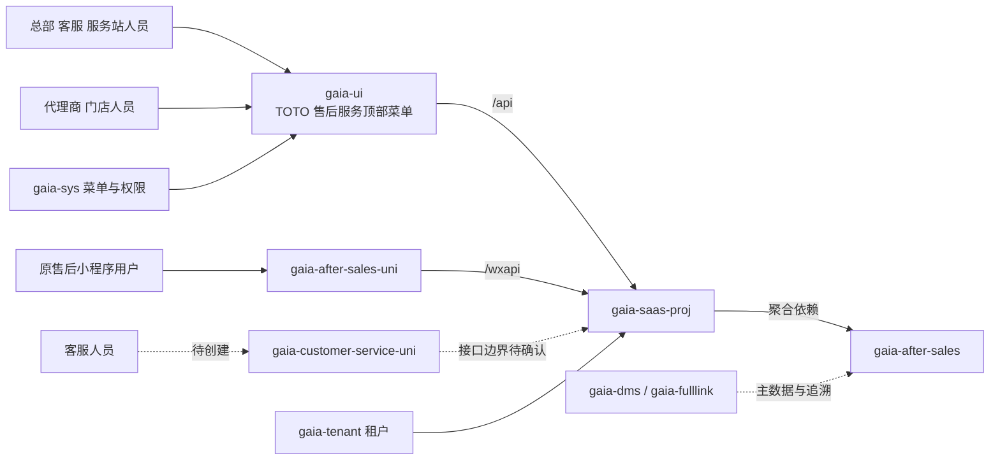

# TOTO 售后服务仓库与系统关系

更新日期：2026-09-07

## 核心关系

虚线表示规划或待确认关系，不代表当前已经建立调用链。

## 直接开发或接入的仓库

| 仓库 | 本机位置 | 负责内容 | 当前动作边界 |
| --- | --- | --- | --- |
| `gaia-after-sales` | `Gaia/backend/gaia-after-sales` | 售后领域、管理端 API、小程序 API；客服后端也放在这里 | 继续使用；不新建客服后端仓库 |
| `gaia-after-sales-uni` | `Gaia/mobile/gaia-after-sales-uni` | 原 TOTO 售后小程序与 H5 | 保持独立，不承载新客服助手 |
| `gaia-customer-service-uni` | `Gaia/mobile/gaia-customer-service-uni` | “TOTO客服助手” | 2026-09-07 本地目录为空，尚非 Git 仓库；先确认身份、页面、登录、权限和技术基线 |
| `gaia-ui` | `Gaia/frontend/gaia-ui` | 统一管理后台与代理商工作台；共用“TOTO 售后服务”顶部菜单、API 调用、动态菜单和权限体系 | 按[目录与菜单设计](../02-技术设计/03-gaia-ui目录与菜单设计.md)落入 `src/views/afterSales`；按角色隔离入口和数据 |
| `gaia-saas-proj` | `Gaia/backend/gaia-saas-proj` | 聚合售后 API 并提供运行环境 | 首个真实接口出现后增加版本和依赖并验证扫描、权限、租户 |
| `gaia-sys` | 旧 Gaia 工程的系统管理仓库 | 顶级菜单、角色、按钮和 API 权限 | 优先配置；只有交付要求初始化数据或代码时才改仓库 |

## 必须复用、默认不修改的基础

| 仓库或领域 | 可复用能力 | 使用原则 |
| --- | --- | --- |
| `gaia-tenant` | 租户识别、动态数据源、租户菜单权限同步 | 核对 TOTO 环境，不自建租户机制 |
| `gaia-base` | 统一响应、异常、Redis、文件和安全组件 | 真实需求出现时按需依赖，不重复造基础设施 |
| `gaia-dms` | TOTO 销售出库导入及经销分销数据 | 优先读取或联调，确认字段权威来源 |
| `gaia-fulllink` | 出库、产品码、RFID/制造编号与追溯信息 | 优先联调，不直接复制主数据所有权 |
| `gaia-dms-uni` | 已有 TOTO 租户配置与小程序实现 | 只作环境和交互参考 |
| `gaia-traceability-uni` | UniApp/Vue 3 兼容工程和构建基础 | 只读参考，不复制追溯业务和发布配置 |

`gaia-member`、`gaia-md`、`gaia-store`、`gaia-dms`、`gaia-bm` 只有在现有查询或协作能力确实不足时才进入修改范围。`gaia-common-ui`、`gaia-mes` 和 `gaia-springboot-starter-parent` 不属于默认修改范围；工厂设备维修模型不能直接当作产品售后模型。

## 代码保护与现场约束

- `gaia-ui/src/views/common` 是公共子仓库，未经用户单独明确授权不得修改或提交。
- 代理商工作台不是独立应用：沿用 Gaia 登录和 `gaia-ui` 动态菜单；授权门店选择放在业务上下文或页头，不另建登录菜单。
- `gaia-ui` 当前本地 `master` 落后 `origin/master` 17 个提交，并有 `src/views/common` 改动；开始后台开发前先处理分支基线，不能覆盖现有工作。
- `gaia-saas-proj` 当前存在 `.gitignore` 修改和未跟踪 `logs/`；售后接入必须保留这些既有内容，且不得自动提交。
- `gaia-after-sales-uni` 当前通用 UI 与工程治理改动尚未提交；业务开发应以其当前工作树为基线，不能误当成干净仓库。
- `gaia-after-sales` 当前为本地 `main` 且干净；其最新文档提交不代表任何业务切片已完成。
- 提交、推送、微信上传和发布均不由功能 Spec 或跨仓开发授权自动包含。

## 数据与接口归属原则

- 售后域持有售后工单、过程状态、服务结果和必要业务快照。
- 产品、会员、门店、经销商、出库与追溯事实优先由原业务域提供，售后侧只引用或保存经确认的快照。
- 管理端入口按现有 `/api/**` 体系；小程序入口按 `/wxapi/**` 体系。具体命名空间、身份和权限在单切片 Spec 中确认。
- 如果最终只是门店退换货且不存在独立工单生命周期，应重新评估是否由 `gaia-store` 承载；如果要独立部署售后服务，再评估独立 Web 启动模块。

技术版本和装配方式见[技术架构与技术栈](03-技术架构与技术栈.md)。
