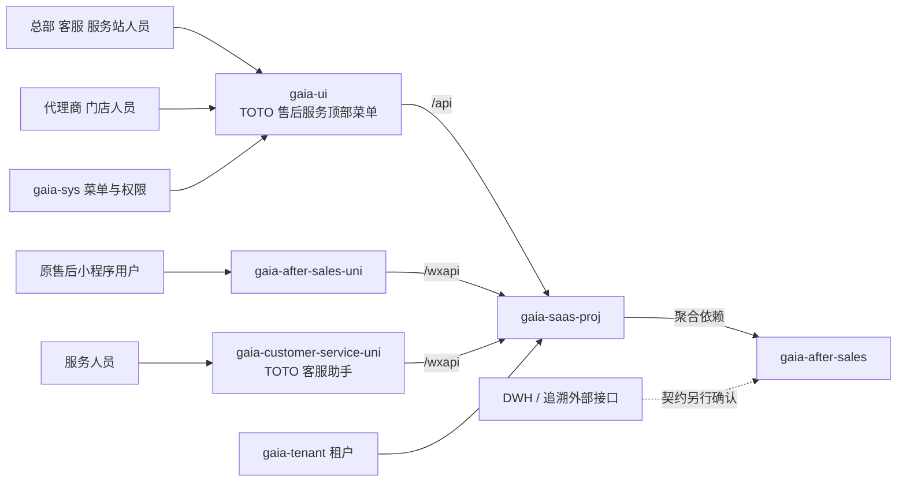

# TOTO 售后服务仓库与系统关系

更新日期：2026-09-28（两个小程序 origin 切换到个人 GitHub，保留 Codeup 地址及双向切换流程；其他现场记录保留原时点）

## 核心关系


```mermaid
flowchart LR
  ADMIN["总部 客服 服务站人员"] --> UI["gaia-ui\nTOTO 售后服务顶部菜单"]
  DEALER["代理商 门店人员"] --> UI
  CONSUMER["原售后小程序用户"] --> MINI["gaia-after-sales-uni"]
  SERVICE["服务人员"] --> CSMINI["gaia-customer-service-uni\nTOTO 客服助手"]
  UI -->|/api| HOST["gaia-saas-proj"]
  MINI -->|/wxapi| HOST
  CSMINI -->|/wxapi| HOST
  HOST -->|聚合依赖| AFTER["gaia-after-sales"]
  SYS["gaia-sys 菜单与权限"] --> UI
  TENANT["gaia-tenant 租户"] --> HOST
  EXT["DWH / 追溯外部接口"] -.契约另行确认.-> AFTER
```

虚线表示规划或待确认关系，不代表当前已经建立调用链。两个小程序已有独立代码仓库；真实小程序 API、身份和业务页面仍按功能 Spec 接入。

## 直接开发或接入的仓库

| 仓库 | 本机位置 | 负责内容 | 当前动作边界 |
| --- | --- | --- | --- |
| `gaia-after-sales` | `Gaia/backend/gaia-after-sales` | 售后领域、管理端 API、小程序 API；客服后端也放在这里 | 继续使用；不新建客服后端仓库 |
| `gaia-after-sales-uni` | `Gaia/mobile/gaia-after-sales-uni` | 消费者小程序与 H5 | 独立 Git；2026-09-28 origin 切换到个人 GitHub，Codeup 地址保留用于切回；与服务人员端同步维护共同底座，消费者业务和 AppID 独立 |
| `gaia-customer-service-uni` | `Gaia/mobile/gaia-customer-service-uni` | “TOTO客服助手”服务人员小程序与 H5 | 2026-09-17 从消费者端 `289800f` 复制共同底座，配置 AppID `wx3023d326070260ec`；2026-09-28 origin 切换到个人 GitHub，Codeup 地址保留用于切回；业务实现状态见[服务人员进度](../03-开发管理/06-服务人员小程序开发进度.md) |
| `gaia-ui` | `Gaia/frontend/gaia-ui` | 统一管理后台与代理商工作台；共用“TOTO 售后服务”顶部菜单、API 调用、动态菜单和权限体系 | 按[目录与菜单设计](../02-技术设计/03-gaia-ui目录与菜单设计.md)落入 `src/views/afterSales`；按角色隔离入口和数据 |
| `gaia-saas-proj` | `Gaia/backend/gaia-saas-proj` | 聚合售后 API 并提供运行环境 | 首个真实接口出现后增加版本和依赖并验证扫描、权限、租户 |
| `gaia-sys` | 旧 Gaia 工程的系统管理仓库 | 顶级菜单、角色、按钮和 API 权限 | 优先配置；只有交付要求初始化数据或代码时才改仓库 |

### 小程序远程地址留存与恢复

本节是两个小程序 **GitHub／Codeup 地址和远程切换操作的统一入口**。两者各自对应同一个本地仓库的不同托管位置，不是消费者端与服务人员端互相同步。默认只保留一个活动远程 `origin`，按用户指定平台切换；地址切换不会把代码自动同步到另一个平台。

#### 地址与当前状态

| 仓库 | GitHub HTTPS（当前 origin） | Codeup HTTPS（切回时使用） |
| --- | --- | --- |
| 消费者 `gaia-after-sales-uni` | `https://github.com/zhiyuan23/gaia-after-sales-uni.git` | `https://codeup.aliyun.com/ehsure/gaia/gaia-after-sales-uni.git` |
| 服务人员 `gaia-customer-service-uni` | `https://github.com/zhiyuan23/gaia-customer-service-uni.git` | `https://codeup.aliyun.com/ehsure/gaia/gaia-customer-service-uni.git` |

用户提供的 GitHub SSH 地址也保留如下；具备对应账号的 SSH 权限时，可以用于同一 `origin`：

- 消费者：`git@github.com:zhiyuan23/gaia-after-sales-uni.git`
- 服务人员：`git@github.com:zhiyuan23/gaia-customer-service-uni.git`

2026-09-24 曾移除两个仓库的 `origin`，保留本地分支、提交和工作区。2026-09-28 按用户要求重新关联个人 GitHub：本机 SSH 验证返回 `Permission denied (publickey)`，现有 GitHub 登录使用 HTTPS，因此采用上表 HTTPS 地址。两个地址的 `git ls-remote --symref` 均成功，未返回 HEAD／分支引用，当前远端尚无可比较的分支；尚未推送本地代码，也未设置上游分支。Codeup 地址来自此前留存记录，本次未验证其访问权限或分支现状。

本次两端工作区均干净，当前分支均为 `feature/20260907_蓝鲸售后服务_志远_喆宇`；消费者 HEAD 为 `7854f2f`，服务人员 HEAD 为 `9ea55d0`。这些是本机核对快照，不代表同事机器的状态。远程配置保存在各仓库本地 `.git/config`，不会随文档提交自动应用到其他人的工作区。

#### 让 Codex 切换

你或同事可以直接给 Codex 下列指令，指定单个仓库时只处理该仓库：

> 按 TOTO 文档 `00-项目资料/02-仓库与系统关系.md` 的“小程序远程地址留存与恢复”，把两个小程序的 origin 切换到 GitHub，检查 fetch／push 地址和连接，不提交、不推送，更新文档中的当前状态。

> 按 TOTO 文档 `00-项目资料/02-仓库与系统关系.md` 的“小程序远程地址留存与恢复”，把两个小程序的 origin 切回 Codeup，检查 fetch／push 地址和连接，不提交、不推送，更新文档中的当前状态。

Codex 执行约定：

1. 定位本工作区 `Gaia/mobile/` 下对应独立仓库，读取仓库约束，检查 `git status --short --branch`、`git branch -vv`、`git remote -v`。保留全部已有改动、分支和提交。
2. 根据上表选择目标地址：已有 `origin` 用 `git remote set-url origin <地址>`，没有时用 `git remote add origin <地址>`。不要删除再重建仓库，也不要改全局 Git 配置。
3. 检查 `git remote get-url --all origin` 和 `git remote get-url --push --all origin`，fetch 和 push 都必须仅指向所选平台的对应仓库。若存在单独的 `remote.origin.pushurl`、多个 URL、`remote.pushDefault` 或当前分支的 `pushRemote`，核对后仅在本仓库纠正会导致推到旧平台的配置。常规配置无需额外设置 push URL，默认随 origin URL 切换。
4. 使用 `git ls-remote --symref origin HEAD 'refs/heads/*'` 只读验证连接及分支。失败时如实报告认证或网络问题，不能把“URL 已配置”当作“连接成功”。GitHub 可在同一仓库的 SSH／HTTPS 地址间选择本机已有认证可用的方式；同事需要自己的仓库访问权限，不共享密码、Token 或私钥。
5. 切换地址不等于同步历史。需要比较提交时先 `git fetch --prune origin` 刷新所选平台的远程跟踪引用；切换前留下的 `origin/*` 和上游状态可能属于旧平台，不能直接据此判断领先／落后。检查当前分支与目标同名分支关系；目标分支不存在时明确记录，不擅自改为 `main`，不自动合并、变基、重置或强推。
6. 回读配置，确认分支、HEAD 和工作区未被更改，记录操作日期、平台、验证结果及必要限制。切换指令本身不授权 commit、push、微信上传或发布。

#### 手动切换命令

以下在 **Gaia 工作区根目录**执行，适用于两个仓库已有 `origin` 的情况；若不存在，把对应命令中的 `set-url` 改为 `add`。

切到 GitHub（HTTPS）：

```bash
git -C mobile/gaia-after-sales-uni remote set-url origin https://github.com/zhiyuan23/gaia-after-sales-uni.git
git -C mobile/gaia-customer-service-uni remote set-url origin https://github.com/zhiyuan23/gaia-customer-service-uni.git
```

切回 Codeup：

```bash
git -C mobile/gaia-after-sales-uni remote set-url origin https://codeup.aliyun.com/ehsure/gaia/gaia-after-sales-uni.git
git -C mobile/gaia-customer-service-uni remote set-url origin https://codeup.aliyun.com/ehsure/gaia/gaia-customer-service-uni.git
```

切换后逐仓执行上一节的地址、连接和工作区检查。若配置了独立 push URL，单独 `set-url` 不会改变它，必须先按执行约定第 3 项处理。

需要把本地提交同步到目标平台时，须另外明确要求推送。届时先 fetch 并检查差异：目标同名分支不存在或可以正常快进时，在对应仓库执行 `git push -u origin HEAD`；存在分叉或无共同历史时先说明差异并确定整合方案，不使用强推覆盖。未提交的工作区改动不会随 push 同步。

## 必须复用、默认不修改的基础

| 仓库或领域 | 可复用能力 | 使用原则 |
| --- | --- | --- |
| `gaia-tenant` | 租户识别、动态数据源、租户菜单权限同步 | 核对 TOTO 环境，不自建租户机制 |
| `gaia-base` | 统一响应、异常、Redis、文件和安全组件 | 真实需求出现时按需依赖，不重复造基础设施 |
| `gaia-dms` | 现有销售出库实现参考 | 不作为售后业务数据源；外部销售核验另行确认接口 |
| `gaia-fulllink` | 现有追溯实现参考 | 不直接关联业务表；追溯核验按独立外部接口契约接入 |
| `gaia-dms-uni` | 已有 TOTO 租户配置与小程序实现 | 只作环境和交互参考 |
| `gaia-traceability-uni` | UniApp/Vue 3 兼容工程和构建基础 | 只读参考，不复制追溯业务和发布配置 |

`gaia-member`、`gaia-md`、`gaia-store`、`gaia-dms`、`gaia-bm` 只有在现有查询或协作能力确实不足时才进入修改范围。`gaia-common-ui`、`gaia-mes` 和 `gaia-springboot-starter-parent` 不属于默认修改范围；工厂设备维修模型不能直接当作产品售后模型。

## 代码保护与现场约束

- `gaia-ui/src/views/common` 是公共子仓库，未经用户单独明确授权不得修改或提交。
- 代理商工作台不是独立应用：沿用 Gaia 登录和 `gaia-ui` 动态菜单；授权门店选择放在业务上下文或页头，不另建登录菜单。
- `gaia-ui` 当前本地 `master` 落后 `origin/master` 17 个提交，并有 `src/views/common` 改动；开始后台开发前先处理分支基线，不能覆盖现有工作。
- `gaia-saas-proj` 当前存在 `.gitignore` 修改和未跟踪 `logs/`；售后接入必须保留这些既有内容，且不得自动提交。
- `gaia-after-sales-uni` 的通用底座整治纳入本次本地提交，验证与限制见[整治 Spec](../specs/2026-09-14-小程序通用底座整治.md)；后续开发前仍须检查实际工作树。
- 两个小程序共同底座和公共配置机制的变更必须在同一任务同步修改并分别验证；应用名称、AppID、版本台账、业务路由和页面保持独立，完整边界以两个仓库同名 `docs/shared-foundation.md` 为准。
- `gaia-after-sales` 当前为本地 `main` 且干净；其最新文档提交不代表任何业务切片已完成。
- 提交、推送、微信上传和发布均不由功能 Spec 或跨仓开发授权自动包含。

## 数据与接口归属原则

- 售后域独立持有商品、分类、代理商、门店、顾客、服务资源、库存、工单及其业务关系和快照，不直接引用主系统业务主档。
- 统一认证权限／租户平台按原方案复用；DWH、出库和追溯核验仅按另行确认的外部接口契约接入，不默认与主系统同步。代码已完成独立化整改，目标环境待迁移与验收，见 [业务数据独立边界与核查](../specs/2026-09-11-业务数据独立边界与已开发功能核查.md)。
- 管理端入口按现有 `/api/**` 体系；小程序入口按 `/wxapi/**` 体系。具体命名空间、身份和权限在单切片 Spec 中确认。
- 如果最终只是门店退换货且不存在独立工单生命周期，应重新评估是否由 `gaia-store` 承载；如果要独立部署售后服务，再评估独立 Web 启动模块。

技术版本和装配方式见[技术架构与技术栈](03-技术架构与技术栈.md)。
