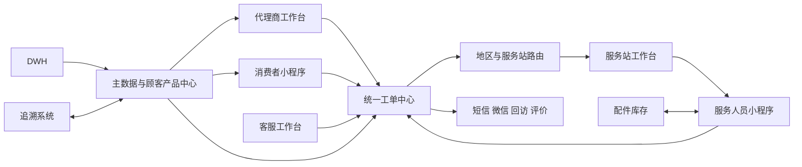
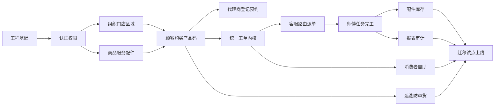

# TOTO售后服务功能纵览

版本：V1.0  
更新日期：2026-09-07  
文档状态：需求基线草案  
文档用途：项目总入口、范围导航和 AI 开发上下文索引

[返回 TOTO 全栈开发导航](../README.md)

面向业务人员的讲解版见[业务阅读指南](../04-业务阅读/00-阅读指南.md)，按极简总览、业务流程、系统功能结构阅读；本目录继续维护详细需求和规则。

## 1 文档定位

本文档是 TOTO 售后服务功能需求文档集的总入口，用于快速理解整体业务、系统边界、功能规模、实施顺序及当前缺口。项目长期事实、仓库现状和历史决策仍以知识库项目主页及其分主题页面为准；开发导航、功能契约和执行进度统一从[工作区入口](../README.md)进入。详细业务规则、字段、验收标准和技术方案放在对应子文档中。

使用 AI 开发某项功能时，应先读取本文档，再读取对应子文档。归档中的合并版仅用于追溯，不作为最新需求源。

日常从[开发进度总览](../03-开发管理/00-开发进度与下一步.md)查看整体状态，并下钻到各功能端入口级明细。开发时使用[页面清单](08-页面清单.md)和 [AI 开发需求索引](09-AI开发需求索引.md)，定位菜单、需求原文和任务依赖；Web 端结构见 [`gaia-ui` 目录与菜单设计](../02-技术设计/03-gaia-ui目录与菜单设计.md)，小程序结构见[小程序目录与页面路由设计](../02-技术设计/04-小程序目录与页面路由设计.md)。原始材料及菜单差异见[来源核对](../00-项目资料/04-原始资料索引与需求核对.md)。先建立已知入口，再按依赖开发业务。

## 2 项目目标

建设一套统一的 TOTO 售后服务系统，将现有 WL 安装服务系统、客服中心系统、代理商后台、消费者小程序和安装师傅小程序整合为统一业务中台和多端应用，并连接 DWH、追溯系统、微信、短信、地图和对象存储。

目标系统覆盖：

- 安装、维修、指导三类售后业务。
- 消费者自助、代理商代客、客服代客三个建单入口。
- 顾客登记、购买登记、产品实例、安装码、RFID 和 QR 码关系。
- 地区路由、服务站分配、师傅派单、上门服务、完工审核、回访评价。
- 防窜货、配件库存、权限审计、报表和数据迁移。

## 3 系统功能全景

### 3.1 统一管理后台

统一管理后台与代理商工作台共用 `gaia-ui` 的“TOTO 售后服务”一级顶部菜单；总部、客服、服务站及代理商/门店用户按角色看到不同子菜单。目录和正式显示名称见 [`gaia-ui` 目录与菜单设计](../02-技术设计/03-gaia-ui目录与菜单设计.md)。

- 主档：代理商、门店、家装公司、服务站、服务区域、商品、分类、系列、服务商品和配件。
- 顾客与产品：顾客、地址、购买、产品实例、安装码和隐私同意。
- 客服工单：受理、顾客识别、地区路由、派单、跟进、异常、审核、回访和投诉。
- 防窜货：RFID 或 QR 查询、异常规则、安装码全过程和人工复核。
- 配件库存：仓库、站点和个人库存，领料、退料、调拨、耗用和盘点。
- 系统治理：用户、角色、功能权限、数据范围、字段脱敏、日志、导入导出和报表。

### 3.2 代理商工作台

代理商工作台不是独立前端应用，而是上述 `gaia-ui` 顶部菜单中的角色门户。

- 登录后选择授权门店。
- 线下门店、线上门店或内购虚拟门店的顾客购买登记。
- 顾客扫码填写或店员代填，采集短信验证和隐私签名。
- 编辑、确认购买商品并生成或绑定安装码。
- 查询顾客、商品、预约状态、VIP 和送安一体信息。
- 针对部分产品预约安装，支持附加服务、再次预约和退货。

### 3.3 消费者小程序

- 注册 TOTO 产品和完善购买信息。
- 查看安装码、我的产品、购买记录和服务记录。
- 自助预约维修或指导，上传故障图片或视频。
- 查询授权门店和维修网点。
- 联系 400 或 800 客服及微信客服。
- 维护个人资料、地址、通知偏好和隐私授权。
- 完成服务评价和问卷。

### 3.4 服务人员小程序

- 按待完工、待发布、待审核、待交单和断联任务查看工单。
- 查看预约地址、期望时间、联系人、产品、服务项目和沟通记录。
- 执行已预约、取消、断联、改期、缺件、修改和完工动作。
- 上门签到、扫码回传 RFID 或 QR、记录过程资料和客户确认。
- 查看配件库存，办理领料、退料和调拨。
- 查询延保资料、技术资料，提交问题反馈和切换企业。

## 4 核心业务闭环

### 4.1 产品登记闭环

门店选择、商品登记、顾客填写或店员代填、短信验证、隐私签名、销售及出库校验、生成产品实例、生成或绑定安装码。

### 4.2 售后服务闭环

维修工单支持诊断、缺件、领料和二次上门。指导工单支持远程指导或上门指导。

### 4.3 防窜货闭环

系统组合销售订单、出库、RFID 或 QR、门店购买、产品注册、预约和上门回传，识别无购买登记、无出库、重复注册、代理商不一致、安装区域越权和跨渠道等异常，并支持人工复核。

## 5 功能规模

当前需求基线共包含：

| 类别 | 数量或范围 |
| --- | --- |
| 编号化功能点 | 122 个 |
| 核心业务规则 | 15 条 |
| 首期关键验收场景 | 15 个 |
| 实施 Epic | 14 个 |
| 上线前阻断问题 | 10 个 |
| 建议团队排期 | 16 周 |
| 单人配合 AI 排期 | 24 至 28 周 |

### 5.1 首期 P0

- 认证、角色、权限和数据范围。
- 代理商、门店、商品、服务站和服务区域主档。
- 顾客、购买、产品实例、安装码和隐私同意。
- 安装、维修、指导统一工单和状态机。
- 地区路由、服务站派单、师傅执行、完工审核和评价。
- 配件库存、领退料和工单耗用。
- RFID 或 QR 接口、防窜货基础规则和异常复核。
- 操作日志、登录日志、查询、导入导出、下载中心和核心报表。

### 5.2 二期建议

- 会员行为标签和营销推送。
- 独立产品满意度问卷和高级分析。
- 智能派单、路线优化和容量预测。
- 客服知识推荐和工单摘要。
- 收费、支付、退款和服务商结算。
- 高级投诉、质检和绩效。

## 6 当前已确认与缺口

### 6.1 已确认

- 现有系统分为 WL 安装服务系统和客服中心系统。
- 代理商后台承接门店代客登记和安装预约。
- 消费者小程序提供产品注册、维修或指导预约、网点和个人中心。
- 服务人员小程序提供任务、配件、资料和个人中心。
- 三类服务共用地区划分、服务站、师傅、上门、回访和评价闭环。
- 防窜货基于销售、出库、购买、注册、预约和上门回传数据。
- 目标需要兼容 RFID 和 QR 码。

### 6.2 上线前必须补齐

- 客服中心后台的完整菜单、角色、队列和真实状态流转。
- 三个入口允许创建的服务类型。
- 总部、客服、服务站和师傅之间的派单责任。
- 待发布、待审核和待交单的准入条件。
- 服务区域匹配规则。
- 三类工单的必填资料和完工标准。
- 附加服务、配件收费、支付、退款和结算范围。
- QR 正式格式及追溯接口。
- DWH 数据范围、频率和 SLA。
- 历史数据迁移范围和旧系统保留方式。

## 7 实施路线

原需求草案估算团队 16 周、单人配合 AI 24～28 周，尚非已确认工期。当前按开发进度总览的顺序推进，试点和业务交付安排在具备前置条件后确定。

## 8 子文档导航

### 8.1 产品需求

1. [项目范围与目标](01-项目范围与目标.md)
2. [角色权限与总体架构](02-角色权限与总体架构.md)
3. [核心业务流程与状态机](03-核心业务流程与状态机.md)
4. [统一管理后台需求](04-统一管理后台需求.md)
5. [代理商工作台需求](05-代理商工作台需求.md)
6. [消费者小程序需求](06-消费者小程序需求.md)
7. [服务人员小程序需求](07-服务人员小程序需求.md)
8. [页面清单](08-页面清单.md)
9. [AI 开发需求索引](09-AI开发需求索引.md)

### 8.2 技术设计

1. [数据模型接口与业务规则](../02-技术设计/01-数据模型接口与业务规则.md)
2. [非功能报表与技术方案](../02-技术设计/02-非功能报表与技术方案.md)
3. [`gaia-ui` 目录与菜单设计](../02-技术设计/03-gaia-ui目录与菜单设计.md)

### 8.3 开发管理

1. [开发进度总览](../03-开发管理/00-开发进度与下一步.md)：统一进度入口。
2. [统一管理后台开发进度](../03-开发管理/04-统一管理后台开发进度.md)
3. [代理商工作台开发进度](../03-开发管理/05-代理商工作台开发进度.md)
4. [消费者小程序开发进度](../03-开发管理/06-消费者小程序开发进度.md)
5. [服务人员小程序开发进度](../03-开发管理/07-服务人员小程序开发进度.md)
6. [测试验收迁移与上线](../03-开发管理/01-测试验收迁移与上线.md)
7. [风险与待确认事项](../03-开发管理/02-风险与待确认事项.md)
8. [AI 开发执行规范](../03-开发管理/03-AI开发执行规范.md)

### 8.4 归档

- [原始合并版需求规格与实施计划](../99-归档/TOTO售后服务一体化系统_AI开发需求规格与实施计划_V1.0合并版.md)

## 9 AI 使用规则

AI Agent 开始任务前按以下顺序读取：

1. 开发进度与下一步、本文及 `08-页面清单.md`、`09-AI开发需求索引.md`，确认本次模块、入口和具体需求编号。
2. 当前功能所属的产品需求子文档。
3. `01-数据模型接口与业务规则.md` 中的相关实体和规则。
4. `02-风险与待确认事项.md`，检查是否依赖未确认业务。
5. `03-AI开发执行规范.md`，按单任务模板实施和验证。

遇到未确认的业务规则时，AI 不得自行固化默认值或新增虚构 API。菜单阶段保留明确占位；业务阶段记录阻塞范围，继续不依赖该规则的已授权工作。

## 10 文档维护规则

- 本文档只维护全局范围、功能地图、规模、里程碑和子文档索引。
- 具体字段、规则和验收只在对应子文档维护，避免多处冲突。
- 子文档变更如果影响整体范围、功能数量、排期或阻断项，必须同步更新本文档。
- 所有需求使用稳定编号，代码、接口、测试和变更记录引用编号。
- 归档文件只读保存，不接受后续需求更新。
