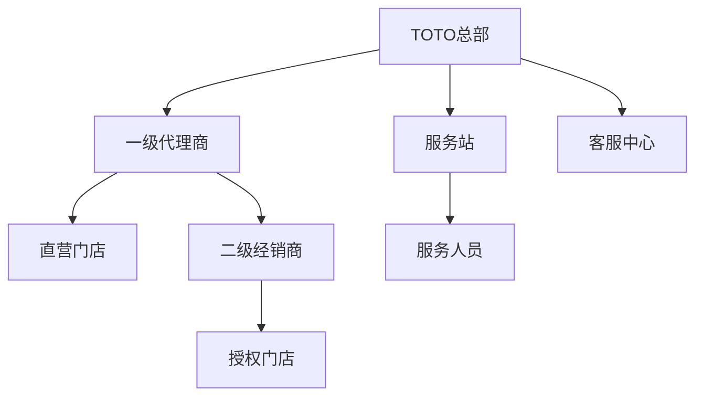
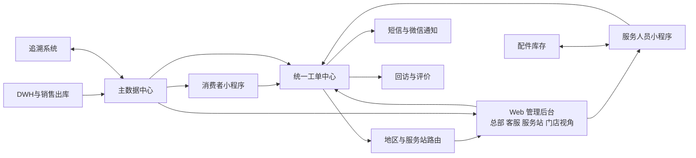

# TOTO售后服务角色权限与总体架构

版本：V1.0  
更新日期：2026-09-12
文档状态：需求基线草案  

本文件定义组织层级、用户角色、权限模型、应用载体和总体业务架构。

项目按 3 个应用载体组织：一个 Web 管理后台、消费者小程序和服务人员小程序。原“统一管理后台”和“代理商工作台”共用 `gaia-ui` 的“TOTO 售后服务”一级顶部菜单，是同一 Web 应用中的不同角色视角；按角色分配子菜单、按钮、接口和数据范围。具体结构见 [`gaia-ui` 目录与菜单设计](../02-技术设计/03-gaia-ui目录与菜单设计.md)。

[返回功能纵览](00-功能纵览.md)

## 6 用户、组织和权限

### 6.1 组织层级

#### 6.1.1 服务站与维修师傅关系

2026-09-12 用户确认，适用于服务站与维修人员主档（ADM-MD-004、STA-002／FS-007）：**主组织关系采用 1:N：一个服务站可管理多个维修人员，一个维修人员有且只有一个主属服务站，不将主组织关系设计成多对多。** 本节记录已确认的业务规则，不代表相关功能已经实现或验收。

组织归属与实际可执行的服务范围分别管理：

| 关系或能力 | 规则与范围 |
| --- | --- |
| 主组织归属 | 服务站 1:N 维修人员；每位维修人员只归属一个主属服务站，作为人员管理和默认派单权限的组织依据 |
| 可服务区域 | 为后续支持多个可服务区域保留扩展能力；跨区域执行工单不改变主属服务站 |
| 跨站支援 | 为后续支持其他服务站的工单保留扩展能力；支援关系不构成多个平等的组织隶属关系 |
| 临时调度 | 为后续按授权临时安排跨区域或跨站任务保留扩展能力；临时执行任务不改变主属服务站 |

这样设计有利于以下管理口径保持清晰：

- **派单权限**：以主属服务站明确日常人员管理和默认派单边界；跨站支援另行校验授权，不因可服务某区域就自动获得其他站的全部派单或数据权限。
- **工单责任**：区分工单责任服务站、实际执行师傅和师傅主属服务站；跨站执行不自动改变工单责任主体。
- **绩效、费用和统计**：分别保留工单责任归属与人员组织归属，便于核算工作量、绩效和费用，避免跨站支援造成重复归属或口径混淆；具体分摊和结算规则待后续确认。
- **人员管理**：主属服务站承担日常人员、排班和状态管理；支援与临时调度在明确授权下协调，避免多个站同时作为正式管理主体。

例如：张师傅主属浑南服务站，经授权支援和平服务站的工单时，工单责任服务站为和平服务站、执行人为张师傅、师傅主属服务站仍为浑南服务站，并区分为跨站支援。

后续扩展不推翻上述 1:N 主组织模型；支援审批、有效期、调度冲突和绩效／费用分摊等具体规则在对应功能契约中确认。本次只保留扩展方向，不要求提前实现扩展功能。数据建模约束见[服务站与维修人员主数据关系](../02-技术设计/01-数据模型接口与业务规则.md#station-technician-model)。

### 6.2 角色

| 角色 | 主要职责 | 数据范围 |
| --- | --- | --- |
| TOTO 超级管理员 | 全局配置、权限、审计和数据治理 | 全部 |
| TOTO 业务管理员 | 主档、防窜货、会员、问卷和运营查询 | 授权区域或全部 |
| 客服主管 | 队列、派单规则、改派、升级、审核和 SLA | 授权队列和区域 |
| 客服专员 | 受理咨询、代客建单、联系记录和跟进 | 本人或队列工单 |
| 服务站管理员 | 接收区域工单、派师傅、审核和异常处理 | 本服务站 |
| 代理商管理员 | 管理本代理商用户、门店及代客业务 | 本代理商及下属门店 |
| 门店店员 | 顾客登记、商品登记、预约安装和退货 | 当前门店 |
| 服务人员 | 接单、联系客户、上门、服务记录、完工、配件 | 本人任务及库存 |
| 消费者 | 注册产品、发起预约、查询记录、评价 | 本人数据 |
| 审计或只读用户 | 查询和导出授权数据 | 按授权范围 |

### 6.3 权限模型

采用 RBAC 加数据范围控制：

- 功能权限：菜单、页面、按钮和接口四级权限。
- 数据权限：全部、区域、组织、服务站、门店、本人和自定义范围。
- 字段权限：手机号、地址、姓名等敏感字段按角色脱敏。
- 导出权限：单独授权，导出文件加入操作者和时间水印。
- 关键操作：改派、取消、退款、退货、修改码关系、删除主档等需要原因并记录审计日志。

2026-09-08 用户确认的菜单查看规则：**系统管理员／TOTO 超级管理员可以查看全部菜单**，包括售后服务全部工作视角、49 个功能项及关联全局系统入口，无需兼任业务岗位；服务站管理员、代理商管理员仍按各自组织和岗位范围分配。完整目录见[后台菜单与角色权限手册](../02-技术设计/09-后台菜单与岗位权限矩阵.md)。菜单查看范围不自动授予全部写入、审批、导出或跨租户数据访问权限；此规则已纳入菜单手册和前端导航，正式租户分发与账号授权仍待联调。

## 7 总体业务架构

### 7.1 应用载体、角色视角和模块

| 应用载体 | 角色视角或参与者 | 模块 | 首期 |
| --- | --- | --- | --- |
| `gaia-ui` Web 管理后台 | 总部运营、客服作业、服务站作业、门店业务 | 主档、工单、顾客、登记预约、库存、防窜货、会员、权限和报表 | 是 |
| 消费者小程序 | 消费者 | 产品注册、维修或指导预约、网点、服务记录、评价、我的 | 是 |
| 服务人员小程序 | 安装、维修、指导服务人员 | 任务、状态、完工、配件、资料、个人中心 | 是 |
| 外部支撑能力（非应用端） | DWH、追溯、短信、微信、地图及第三方客服 | 数据同步、身份、通知、定位和外部客服 | 是 |
| Web 管理后台 | 总部运营 | 会员标签和营销推送 | 二期 |
| Web 管理后台 | 总部运营 | 问卷配置、投放和分析 | 二期，首期保留评价问卷 |
