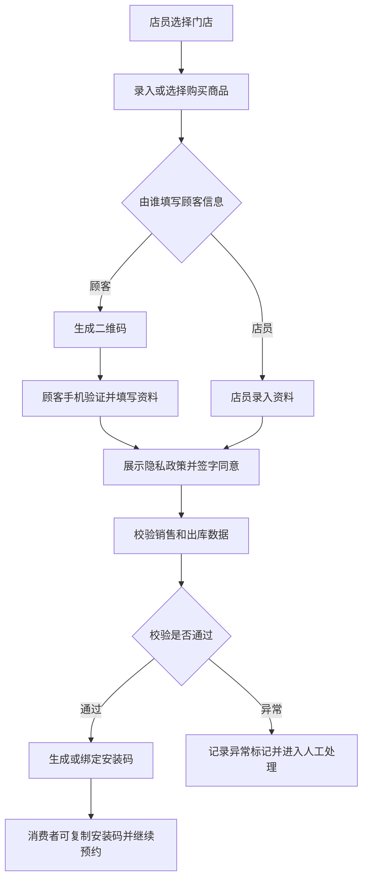
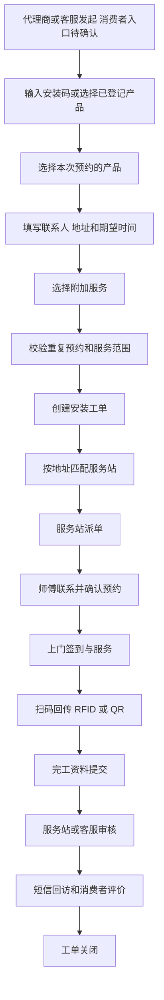
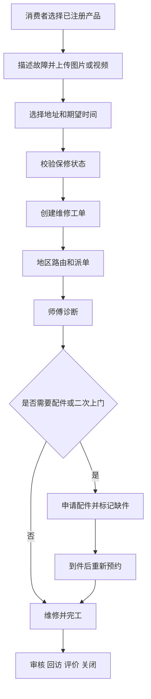
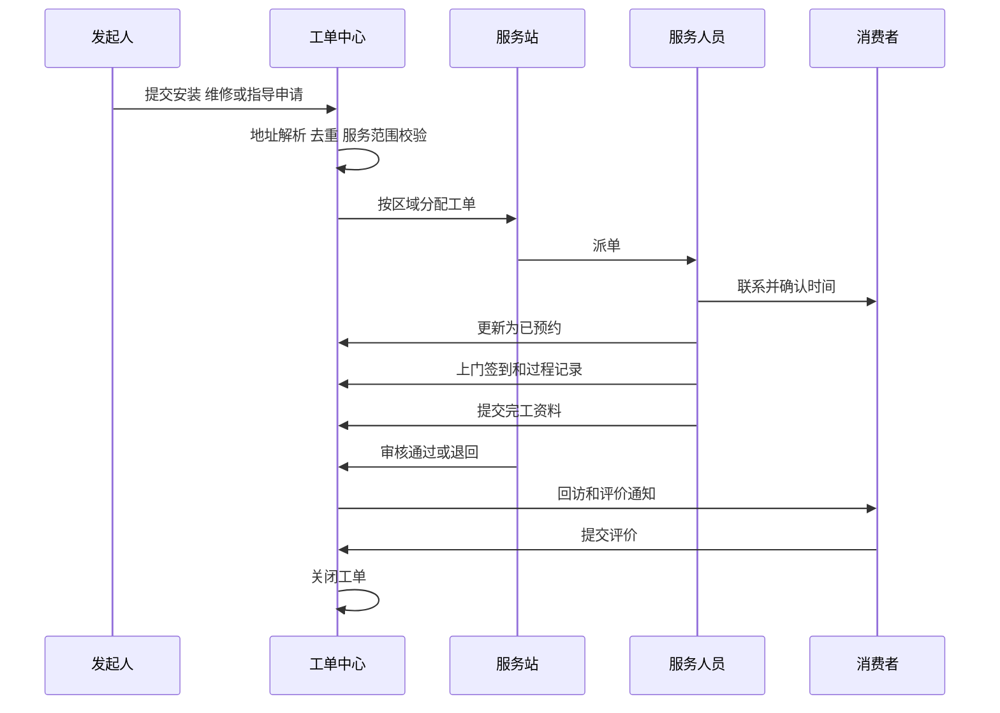

# TOTO售后服务核心业务流程与状态机

版本：V1.0  
更新日期：2026-09-08  
文档状态：需求基线草案  

本文件定义产品登记、安装、维修、指导、派单、防窜货流程及统一工单状态。

本文流程与统一状态表是目标设计草案，不代表截图已验证每一步。2026-09-08 全量截图补证及与草案的差异见[截图流程边界](#screenshot-flows)；各端字段、按钮及来源已写入对应功能需求。

[返回功能纵览](00-功能纵览.md)

## 8 核心业务流程

### 8.1 产品购买登记和安装码

业务规则：

- 门店必须属于当前用户的数据范围。
- 一条购买登记可包含多个产品和数量，每个可追踪产品应形成产品实例。
- 产品类型支持组合品和单品，组合品可记录机能型号、底座型号、水箱型号及扩展型号。
- 使用方式包括本人使用和为朋友购买。
- 必填信息至少包含购买人手机号、使用者姓名、使用地址省市区和详细地址。
- 顾客填写时使用短信验证码确认手机号，提交前展示隐私政策并保留同意版本、签名、时间和来源。
- 系统应防止同一销售明细、商品条码、RFID 或 QR 码重复绑定。
- 退货后保留历史关系，产品实例标记为已退货，不做物理删除。

### 8.2 安装预约

安装预约支持针对部分产品发起。现有资料明确出现的附加服务包括电源改造和拆旧。附加服务是否收费、价格、支付和结算规则待确认。

### 8.3 维修预约

### 8.4 指导服务

指导支持远程指导和上门指导。创建时选择服务方式。远程指导可由客服或服务人员处理并记录沟通结果。上门指导复用地区路由、派单、预约、服务记录和评价流程。

### 8.5 工单派发和执行

### 8.6 防窜货判定

现状判断依据包括销售订单、RFID、仓库发货数据、门店购买信息、商品注册申请信息、预约安装信息和上门安装回传。目标系统应同时支持 RFID 与 QR 码。

建议规则：

| 规则编号 | 异常条件 | 默认等级 |
| --- | --- | --- |
| AC-01 | 没有购买登记 | 中 |
| AC-02 | 没有出库记录 | 高 |
| AC-03 | 商品条码、RFID 或 QR 码重复注册 | 高 |
| AC-04 | 出库代理商与门店代理商不一致 | 中 |
| AC-05 | 安装地址不在门店代理商授权区域 | 中 |
| AC-06 | 安装地址不在出库代理商授权区域 | 高 |
| AC-07 | 零售型与项目型渠道交叉 | 中 |
| AC-08 | 码中的订单、行号、品番与 DWH 不一致 | 高 |

每条命中规则必须保存规则版本、输入快照、判定结果和人工复核结果。规则可配置启停和等级，但规则逻辑的变更必须审计。

## 9 工单状态模型

### 9.1 统一状态

| 状态 | 说明 | 允许的主要动作 |
| --- | --- | --- |
| 草稿 | 信息未提交 | 编辑、删除草稿、提交 |
| 待受理 | 已提交，等待客服或系统处理 | 受理、驳回、补充资料 |
| 待分配服务站 | 地址或规则待匹配 | 自动分配、人工分配 |
| 待派单 | 服务站已接收 | 派师傅、转服务站、取消 |
| 待发布 | 已形成可发布任务 | 发布、撤回 |
| 待接单 | 等待服务人员接收 | 接单、拒单、改派 |
| 待完工 | 服务人员已接单 | 已预约、改期、断联、缺件、取消、修改、完工 |
| 已预约 | 已与客户确认时间 | 上门、改期、取消、断联 |
| 缺件 | 等待配件 | 领料、到件、重新预约、取消 |
| 改期 | 需要重新约定时间 | 重新预约、取消 |
| 断联 | 无法联系客户 | 重试联系、恢复、关闭 |
| 待审核 | 已提交完工资料 | 审核通过、退回修改 |
| 待交单 | 审核通过，等待纸质或财务交单 | 交单、退回 |
| 待回访 | 服务完成，等待回访或评价 | 回访、发送评价、关闭 |
| 已关闭 | 业务完成 | 查看、投诉、复开 |
| 已取消 | 业务终止 | 查看、按权限重开 |

### 9.2 状态要求

- 状态迁移由后端校验，前端不能直接指定任意目标状态。
- 每次迁移记录操作者、来源端、前后状态、时间、原因、备注和附件。
- 取消、拒单、改派、改期、断联、缺件、审核退回和复开必须选择原因。
- “待发布、待审核、待交单”来源于现有师傅小程序，具体责任人和准入条件需与客服中心确认。
- 状态名称可在 UI 中按角色显示别名，但数据库使用统一枚举。

### 9.3 截图补证与目标流程的差异

核对日期：2026-09-08；原图逐份索引见[SS-01～SS-64](../00-项目资料/04-原始资料索引与需求核对.md#ss-01)。下列流程箭头表示相关页面的可见衔接，不表示已实操验证提交、接口和事务。

| 业务 | 本批能确认的旧系统信息 | 仍不能从截图确定的规则 |
| --- | --- | --- |
| 商品与顾客登记 | 商品确认前显示“请先确认商品”；有编辑商品／确认商品／稍后确认，确认后的视图出现顾客微信扫码填写。店员代填图显示隐私已确认、手机验证码和下一步（SS-06～SS-10、SS-14） | 稍后确认保存什么、何时生成购买记录／安装码、顾客是否可在未确认商品时继续登记、跨端刷新与确认锁定策略。8.1 的销售／出库校验和异常流转是目标方案，截图未证明旧系统在此执行 |
| 隐私签署 | 隐私正文 → 显示签字栏 → 手写、清空、同意／不同意；代填页面展示“隐私授权确认：已确认”（SS-08～SS-10） | 签署顺序是否强制、店员代签资格、拒绝后如何退出及是否保存草稿；历史条款中的撤回／注销描述不等于已验证其实现 |
| 消费者回填 | 登记页展示购买摘要、购买人、使用方式和使用者地址；另一结果视图展示多项商品及一个可复制安装码（SS-03、SS-04） | 码的生成、唯一性、有效期和使用次数规则。不能据相邻截图证明后端校验和创建时点 |
| 安装预约 | 代理商页可勾选多个产品，展示联系人、两个备用电话与提交入口（SS-12）；消费者服务文案仅明确维修、指导等预约（SS-01、SS-02） | 消费者安装预约仍待 Q-002 确认；SS-12 下半页未拍全，期望时间／附加服务等继续按其他来源核实 |
| 防窜货 | 旧查询页明确提供未登记购买、代理商不一致、安装区域不符、跨渠道、重复商品条形码筛选（SS-17） | 旧界面并未完整证明 AC-01～08 的全部算法；重复商品条形码不能直接等同于所有类型的重复注册，跨渠道也不能据控件定义为固定两类渠道 |
| 任务状态 | “待完工”页内卡片可标“已预约”或“驳回”；“取消任务”是独立页签，并有恢复取消任务入口（SS-25、SS-31～SS-34）；改状态面板有取消原因（SS-40） | 页签队列、联系预约状态、审核结果之间的模型应先确认；9.1 的单一状态表尚未解决这种组合关系，不能直接照表生成互斥状态枚举。取消恢复目标状态、审批和重新派单待确认 |
| 完工 | 图片上传 → 产品信息 → 单据信息 → 确认费用；产品信息有制造编号扫码、RFID扫码／无RFID、购买渠道等字段（SS-24） | 其余三步未展开，图片必填、单据／里程、费用计算及审核责任人仍待确认。“制造编号”与既有“序列编号”的字段映射、无RFID例外须核实 |
| 服务方式 | 完工产品信息的服务方式示例为“免费”（SS-24） | 与8.4远程／上门不是同一个含义；数据模型需要分别确认收费属性和履约方式，不能直接复用同名字段 |
| 配件领用 | 配件查询 → 按库房／人员库存选择 → 查看待提交领料单 → 调整数量 → 提交入口；领料记录另有领料中、已领料、已拒绝、已撤销（SS-50～SS-59） | 其他服务人员来源是否形成调拨、跨来源是否拆单、锁库存及审批时点、领用／退料／耗用对库存的影响无法从静态图确认 |

任务地图及排序、取消恢复归入既有 WAPP-001／004／006，完工分步归入 WAPP-011；本次补充不增加入口或功能编号计数，不改变各业务切片的验收状态。
