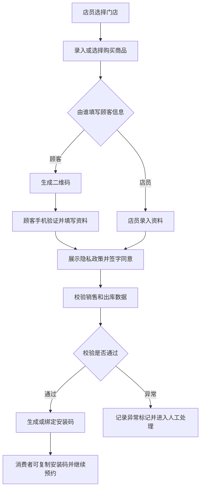
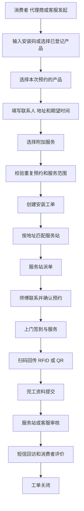
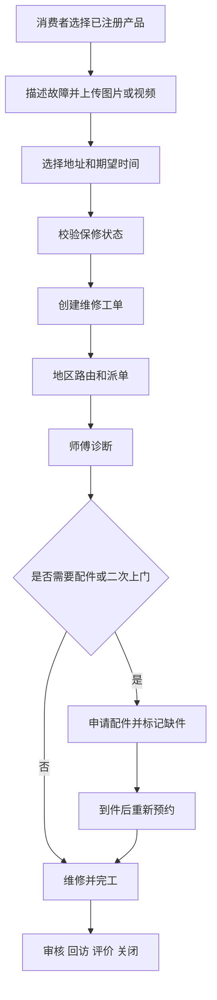
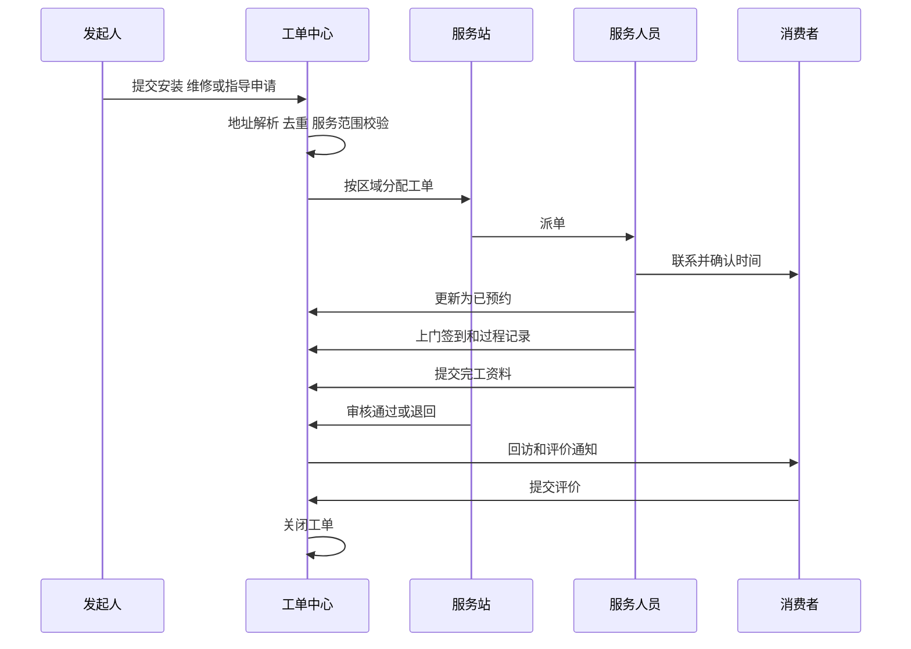

# TOTO售后服务核心业务流程与状态机

版本：V1.0  
更新日期：2026-09-07  
文档状态：需求基线草案  

本文件定义产品登记、安装、维修、指导、派单、防窜货流程及统一工单状态。

[返回功能纵览](00-功能纵览.md)

## 8 核心业务流程

### 8.1 产品购买登记和安装码

业务规则：

- 门店必须属于当前用户的数据范围。
- 一条购买登记可包含多个产品和数量，每个可追踪产品应形成产品实例。
- 产品类型支持组合品和单品，组合品可记录机能型号、底座型号、水箱型号及扩展型号。
- 使用方式包括本人使用和为朋友购买。
- 必填信息至少包含购买人手机号、使用者姓名、使用地址省市区和详细地址。
- 顾客填写时使用短信验证码确认手机号，提交前展示隐私政策并保留同意版本、签名、时间和来源。
- 系统应防止同一销售明细、商品条码、RFID 或 QR 码重复绑定。
- 退货后保留历史关系，产品实例标记为已退货，不做物理删除。

### 8.2 安装预约

安装预约支持针对部分产品发起。现有资料明确出现的附加服务包括电源改造和拆旧。附加服务是否收费、价格、支付和结算规则待确认。

### 8.3 维修预约

### 8.4 指导服务

指导支持远程指导和上门指导。创建时选择服务方式。远程指导可由客服或服务人员处理并记录沟通结果。上门指导复用地区路由、派单、预约、服务记录和评价流程。

### 8.5 工单派发和执行

### 8.6 防窜货判定

现状判断依据包括销售订单、RFID、仓库发货数据、门店购买信息、商品注册申请信息、预约安装信息和上门安装回传。目标系统应同时支持 RFID 与 QR 码。

建议规则：

| 规则编号 | 异常条件 | 默认等级 |
| --- | --- | --- |
| AC-01 | 没有购买登记 | 中 |
| AC-02 | 没有出库记录 | 高 |
| AC-03 | 商品条码、RFID 或 QR 码重复注册 | 高 |
| AC-04 | 出库代理商与门店代理商不一致 | 中 |
| AC-05 | 安装地址不在门店代理商授权区域 | 中 |
| AC-06 | 安装地址不在出库代理商授权区域 | 高 |
| AC-07 | 零售型与项目型渠道交叉 | 中 |
| AC-08 | 码中的订单、行号、品番与 DWH 不一致 | 高 |

每条命中规则必须保存规则版本、输入快照、判定结果和人工复核结果。规则可配置启停和等级，但规则逻辑的变更必须审计。

## 9 工单状态模型

### 9.1 统一状态

| 状态 | 说明 | 允许的主要动作 |
| --- | --- | --- |
| 草稿 | 信息未提交 | 编辑、删除草稿、提交 |
| 待受理 | 已提交，等待客服或系统处理 | 受理、驳回、补充资料 |
| 待分配服务站 | 地址或规则待匹配 | 自动分配、人工分配 |
| 待派单 | 服务站已接收 | 派师傅、转服务站、取消 |
| 待发布 | 已形成可发布任务 | 发布、撤回 |
| 待接单 | 等待服务人员接收 | 接单、拒单、改派 |
| 待完工 | 服务人员已接单 | 已预约、改期、断联、缺件、取消、修改、完工 |
| 已预约 | 已与客户确认时间 | 上门、改期、取消、断联 |
| 缺件 | 等待配件 | 领料、到件、重新预约、取消 |
| 改期 | 需要重新约定时间 | 重新预约、取消 |
| 断联 | 无法联系客户 | 重试联系、恢复、关闭 |
| 待审核 | 已提交完工资料 | 审核通过、退回修改 |
| 待交单 | 审核通过，等待纸质或财务交单 | 交单、退回 |
| 待回访 | 服务完成，等待回访或评价 | 回访、发送评价、关闭 |
| 已关闭 | 业务完成 | 查看、投诉、复开 |
| 已取消 | 业务终止 | 查看、按权限重开 |

### 9.2 状态要求

- 状态迁移由后端校验，前端不能直接指定任意目标状态。
- 每次迁移记录操作者、来源端、前后状态、时间、原因、备注和附件。
- 取消、拒单、改派、改期、断联、缺件、审核退回和复开必须选择原因。
- “待发布、待审核、待交单”来源于现有师傅小程序，具体责任人和准入条件需与客服中心确认。
- 状态名称可在 UI 中按角色显示别名，但数据库使用统一枚举。
