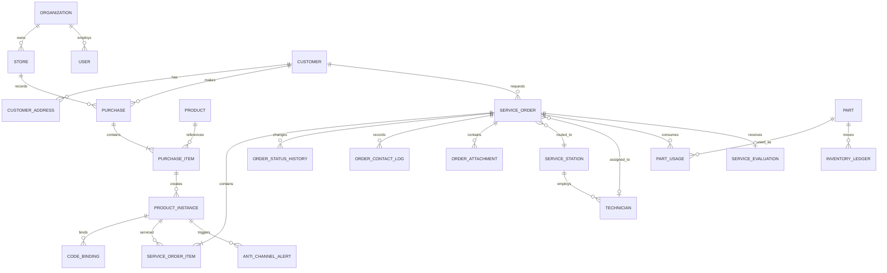

# TOTO售后服务数据模型接口与业务规则

版本：V1.0  
更新日期：2026-09-09\
文档状态：需求基线草案  

本文件定义核心实体、数据约束、外部集成、API 原则和业务校验规则。

[返回功能纵览](../01-功能需求/00-功能纵览.md)

## 12 数据模型

### 12.1 核心实体关系



### 12.2 核心表建议

| 表或聚合 | 关键字段 | 说明 |
| --- | --- | --- |
| organization | id、type、parent_id、sap_code、name、status | TOTO、代理商、经销商、服务站等组织 |
| store | id、organization_id、sap_store_code、name、store_type、physical_type、virtual_type、status、delivery_install_flag | 门店主档 |
| service_area | id、station_id、region_codes、geofence、priority、effective_from、effective_to | 服务区域和优先级 |
| user | id、account、mobile、name、status、last_login_at | 后台和工作台账号 |
| role、permission、user_role | role_type、data_scope、permission_code | RBAC 与数据范围 |
| customer | id、mobile_hash、mobile_ciphertext、name_ciphertext、member_no、status | 顾客敏感字段加密存储 |
| customer_address | id、customer_id、province、city、district、street、detail_ciphertext、lng、lat | 常用或使用地址 |
| product | id、barcode、functional_model、base_model、tank_model、spec、color、category_id、series_id、status | 商品主档 |
| purchase | id、store_id、customer_id、purchase_date、source、operator_id、vip_flag、use_for、status | 购买登记头 |
| purchase_item | id、purchase_id、product_id、quantity、return_quantity、sales_order_no、sales_order_line | 购买明细 |
| product_instance | id、purchase_item_id、serial_no、installation_code、warranty_start、warranty_end、status | 可追踪实物 |
| code_binding | id、instance_id、code_type、code_value_hash、code_ciphertext、source、bound_at、status | RFID、QR、商品条码和序列号 |
| consent_record | id、customer_id、policy_version、scene、signature_url、agreed_at、revoked_at、source | 隐私同意证据 |
| service_order | id、order_no、type、source、customer_id、address_id、station_id、technician_id、expected_at、status、priority、sla_deadline | 统一工单 |
| service_order_item | id、order_id、instance_id、service_product_id、problem_desc、warranty_result | 工单产品 |
| order_status_history | id、order_id、from_status、to_status、reason_code、remark、operator、created_at | 状态历史 |
| order_contact_log | id、order_id、channel、result、content、contact_at、operator | 沟通记录 |
| order_attachment | id、order_id、stage、file_type、url、sha256、created_by | 图片、视频、签名和凭证 |
| service_result | id、order_id、diagnosis、solution、result_code、completed_at、customer_signature | 完工结果 |
| service_evaluation | id、order_id、score、tags、comment、submitted_at | 服务评价 |
| anti_channel_alert | id、instance_id、rule_code、severity、input_snapshot、status、reviewer | 防窜货异常 |
| part | id、part_no、name、factory、unit_price、status | 配件主档 |
| inventory_account | id、owner_type、owner_id、part_id、available_qty、locked_qty | 库存余额 |
| inventory_ledger | id、account_id、business_type、business_no、in_qty、out_qty、balance_after、occurred_at | 不可变库存流水 |
| material_order | id、type、source_owner、target_owner、status、related_order_id | 领料、退料或调拨单 |
| integration_event | id、event_type、aggregate_id、payload、status、retry_count、next_retry_at | 集成事件和重试 |

### 12.3 数据约束

- 所有业务表使用不可变主键，外部编号单独建唯一索引。
- 工单号、安装码和导入批次号由服务端生成，不依赖前端时间。
- 手机号、姓名、详细地址、签名等敏感数据加密存储，搜索使用哈希或受控索引。
- 状态历史、库存流水、审计日志和隐私同意记录不允许物理删除。
- 主档停用优先于删除，已经被业务引用的记录禁止删除。
- 所有表包含创建人、创建时间、更新人、更新时间和乐观锁版本。
- 外部同步数据保存 source_system、source_id、source_updated_at 和 raw_version。
- 文件存对象存储，数据库保存元数据、哈希、业务关系和访问权限。

<a id="mindmap-data"></a>

### 12.4 脑图字段来源与快照边界（2026-09-09）

[防窜货五组字段](../01-功能需求/04-统一管理后台需求.md#mindmap-anti-fields)是查询投影的需求，不是已建表或正式 API 契约。后续 ADM-AC-001、顾客产品领域和集成切片须逐字段确认来源及关联方式：

| 来源信息 | 建模／接口要求 | 尚待核定 |
| --- | --- | --- |
| 售后回传与出库 | 保存回传记录、码关联及出库记录各自的来源标识、数据时间和版本；商品、订单及区域显示业务发生时快照 | RFID／QR／商品条码关联键、出库单号与销售订单号关系、DWH／追溯字段主责 |
| 门店购买与家装 | 购买记录关联门店、分销商、门店代理商、购买人、安装码；家装地址、公司、外部订单号保留来源快照 | 家装系统接口、跨系统订单键；不向共享门店或商品主档塞入购买事实 |
| 注册信息 | 独立保存注册记录及注册人、注册日期、使用地址省市区、注册购买日期、安装码、渠道、项目名称和商品／出库上下文 | “研报申请”的准确含义及数据源；未确认前不创建延保或审批实体 |
| 预约与上门 | 预约人、预约地址和日期与上门联系人、上门地址和日期分开；服务预约号关联实际履约记录 | 预约日期是期望时段还是确认时段；原“保修日期”是起保日、截止日或其他字段 |
| 会员推送结果 | 每个目标会员关联任务、批次、渠道和发送／回执记录，保存渠道原始状态、规范化结果及失败原因 | 渠道是否能证明接收、回执状态映射、重试／多次发送的聚合口径 |

购买人、使用者、注册人、预约人和上门联系人不能因手机号相同而自动合并或相互覆盖；注册购买日期与门店购买日期也须保留各自来源。来源记录一对多时返回明细集合，不能只取最新一条掩盖重复登记／出库等异常。源系统未提供的数据应返回明确缺失状态，不从主档现值伪造历史事实。API 与导出沿用本人／组织数据范围及敏感字段权限；存储仍按 12.3 的来源元数据、版本和敏感数据约束落实。

以上为实现约束补充，物理字段、接口和迁移须在对应切片确认；此次没有调整共享表结构或覆盖权威主档。未决事项统一见 [Q-MM-03～05](../03-开发管理/02-风险与待确认事项.md#mindmap-questions)。

## 13 接口和集成

### 13.1 集成清单

| 集成方 | 方向 | 数据 | 方式 | 关键要求 |
| --- | --- | --- | --- | --- |
| DWH | DWH 到本系统为主 | 代理商、门店、销售订单、出库、仓库 | 定时增量加按需查询 | 幂等、断点续传、对账 |
| 追溯系统 | 双向 | RFID、QR、商品、订单、流向、服务回传 | API 加事件 | 同时兼容 RFID 和 QR 参数 |
| 微信小程序 | 双向 | 登录、手机号、订阅消息、二维码场景值 | 微信开放能力 | openid 与业务账号解耦 |
| 短信平台 | 本系统到平台 | 验证码、预约、派单、回访通知 | API | 模板、限流、回执和重试 |
| 地图服务 | 双向 | 地址解析、坐标、距离、导航 | API | 坐标系统一、缓存和降级 |
| 对象存储 | 双向 | 图片、视频、签名、导出文件 | SDK 或 API | 私有桶、临时签名、防病毒 |
| 现有客服渠道 | 双向 | 电话或微信会话、来源号 | API 或人工过渡 | 未完成调研前采用适配层 |

### 13.2 QR 码建议格式

现有材料示例：`销售订单号;行号;品番;序号`。系统应将原文作为证据保存，同时解析为结构化字段。

建议解析结果：

```json
{
  "raw": "2001327528;50;TCF33320GCN#W;8-1",
  "salesOrderNo": "2001327528",
  "salesOrderLine": "50",
  "productModel": "TCF33320GCN#W",
  "serialSegment": "8-1",
  "codeType": "QR",
  "schemaVersion": "1"
}
```

二维码结构、签名和防伪校验方式待追溯系统确认。不要只依赖分号切割作为安全校验。

### 13.3 API 设计原则

- 使用版本化 REST API，事件推送使用 Webhook 或消息队列。
- 写接口支持 `Idempotency-Key`，避免小程序重试造成重复购买或工单。
- 列表统一使用分页、排序、过滤和字段级权限。
- 状态变更使用专用动作接口，例如 `POST /orders/{id}/actions/complete`，不使用通用更新接口改状态。
- 返回统一错误码、用户提示和链路追踪标识。
- 外部回调验证签名、时间戳和重放窗口。
- 批量导入采用上传、预检、确认、执行、结果下载五步流程。
- 大文件和导出使用异步任务，不占用同步请求。

### 13.4 建议 API 分组

| 分组 | 示例 |
| --- | --- |
| auth | 登录、刷新令牌、退出、验证码、微信登录 |
| organizations | 代理商、门店、服务站、服务区域 |
| catalog | 分类、商品、系列、配套品、服务商品、配件 |
| customers | 顾客、地址、购买、产品实例、安装码、同意记录 |
| service-orders | 建单、查询、派单、状态动作、沟通、附件、完工、评价 |
| anti-channel | 码查询、异常查询、规则、复核 |
| inventory | 库存、流水、领料、退料、调拨、盘点 |
| membership | 会员、标签、问卷、推送 |
| system | 用户、角色、权限、字典、参数、日志、导入导出 |
| integrations | DWH、追溯、短信、微信、地图、Webhook |

## 14 业务校验规则

| 编号 | 规则 |
| --- | --- |
| BR-001 | 创建购买登记前必须确认当前门店有效且用户有权限。 |
| BR-002 | 同一商品实例只能存在一个有效安装码。 |
| BR-003 | 同一产品实例和服务类型只能存在一个活动工单，复开除外。 |
| BR-004 | 可对一次购买中的部分产品预约，未选产品保持未预约状态。 |
| BR-005 | 已退货产品不可新建安装工单，维修是否允许需按售后政策配置。 |
| BR-006 | 地址必须完成省市区结构化；地图解析失败允许人工确认，但必须留痕。 |
| BR-007 | 分配服务站时按有效区域、优先级、服务能力和容量匹配。 |
| BR-008 | 服务人员接单后才可预约和上门，特殊强派需主管权限。 |
| BR-009 | 完工必须包含服务结果；安装或维修还需产品码回传和规定照片。 |
| BR-010 | 缺件必须关联配件需求；恢复任务前记录到件或替代方案。 |
| BR-011 | 审核退回后保留原完工版本和退回原因。 |
| BR-012 | 评价只能由工单顾客或有效授权人提交。 |
| BR-013 | 退货、取消、改派、改期、断联、拒单和人工覆盖规则必须记录原因。 |
| BR-014 | 导入数据先预检，错误行不进入正式业务表。 |
| BR-015 | 接口同步使用外部业务键和版本号实现幂等。 |
