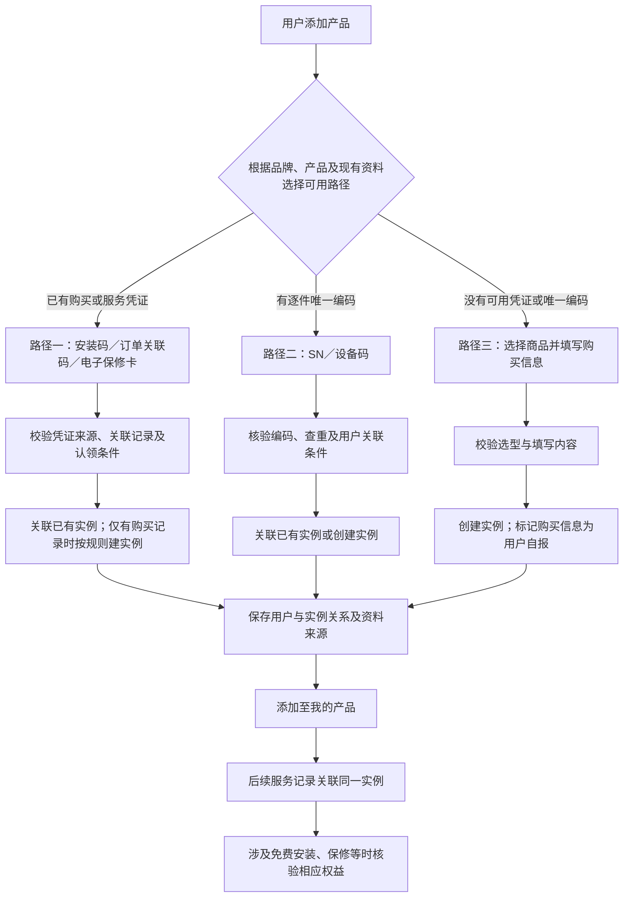
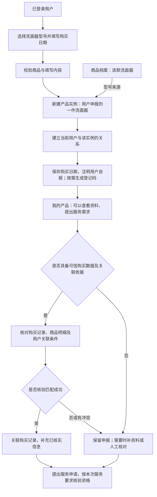
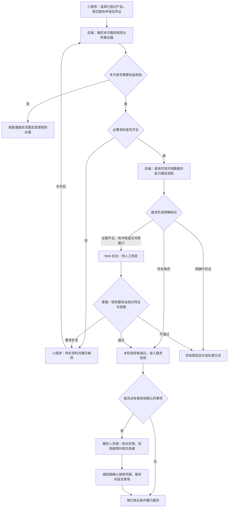

# 商品注册与绑定逻辑及流程

> 2026-09-12 归位说明：本页承接原注册绑定专题全文，保留讨论结论、边界和待确认项；分阶段图示见[注册绑定流程](../05-业务流程/01-商品注册与绑定.md)。本次目录调整不改变方案逻辑或实施状态。

更新日期：2026-09-12

全项目从注册绑定到服务关闭的衔接见[售后全流程总览](../05-业务流程/00-售后全流程总览.md)。[阶段 01 商品注册与绑定](../05-业务流程/01-商品注册与绑定.md)展开三条登记路径及建单交接，[阶段 03](../05-业务流程/03-受理与服务资格核验.md)引用本文的核验细则，详细规则仍在本文维护。

> 本文整理本次商品注册与绑定讨论，供后续产品设计和接口契约评审使用。目标是支持通用商品售后，同时兼容 TOTO 的安装码绑定、手动选择商品登记两种方式。现有程序、原型及文档中的安装码逻辑尚未经用户业务验证，不作为本方案的既定约束。

## 1. 文档范围与结论口径

| 项目 | 内容 |
| --- | --- |
| 编号、类型与标题 | CR-20260912-01 · 需求变更建议 · 通用商品注册与绑定路径 |
| 应用载体／角色视角 | 消费者小程序；Web 管理后台提供数据及人工核验支撑；服务人员端提供现场核对依据／跨视角 |
| 模块与入口 | 产品登记、我的产品；C04、C05、C06、C10、C11；关联服务申请、受理及现场核验，核验操作的具体入口由后续 Spec 定位 |
| 关联需求／Spec | CAPP-003、CAPP-004、CAPP-005、CAPP-012；暂无本方案专属实施 Spec |
| 来源与日期 | 用户于 2026-09-12 提供旧 TOTO 小程序截图和实际操作说明，并讨论通用注册模型；同日继续补充申报真实性、购买记录匹配、系统／人工／现场核验及执行位置，本文保留可供团队阅读的文字结论 |
| 优先级／状态 | 优先级待排期；建议细节待确认，未进入实施 |
| 负责人 | 待分配 |
| 评审／验证标准 | 三条路径均能说明实例如何产生或关联；手动登记与权益核验分开；TOTO 两条路径可映射；关键场景见第 9 节 |
| 证据与结论 | 本次讨论及用户说明支持设计方向；未进行旧系统接口验证、真实绑定测试或业务验收 |

**用户明确的目标与现状：**

- 系统面向通用商品售后，同时兼容 TOTO，先分析合理方式再设计，不完全沿用现有安装码实现。
- 据用户实际操作说明，旧 TOTO 小程序的“智能坐便系列”通过安装码绑定；其他产品通过分类、系列、产品及购买日期登记。
- 用户提供的安装码页面显示“免费安装码”，提示从购买短信中获取，并提供“找不到安装码”入口。未展示的提交结果、找回方法、校验和权益规则不视为已验证。

**本次整理的方案建议：**三条登记路径汇入统一产品实例；区分商品识别、用户关联、购买信息核验与服务权益。下文描述目标设计建议，不代表新增接口、审核流程、状态字段或所有扩展能力已经正式定版。

## 2. 先区分六个概念

| 概念 | 表示什么 | 不应据此推断什么 |
| --- | --- | --- |
| 商品档案 | 品牌、分类、系列、型号等，一款商品一份档案 | 同型号不等于同一件实物 |
| 产品实例 | 一件已建档产品的系统记录，是后续售后历史的关联对象 | 有实例记录不等于实物或购买情况已核实 |
| 实物唯一编码 | 厂商或可信来源赋予具体实物的 SN、设备码等 | 唯一码本身不一定证明购买人、购买日期或服务资格 |
| 系统登记码 | 系统按需生成、用于对外定位产品实例的编号 | 编号唯一不等于实物没有被重复登记，也不自动授予认领权限 |
| 绑定凭证 | 用于校验、查找已有购买／产品记录并辅助认领的凭证，如安装码、订单关联码、电子保修卡 | 凭证不一定由本系统生成，也不一定每件产品一个 |
| 服务权益 | 特定产品在适用条件下享有的免费安装、保修、延保等资格 | 登记成功不等于权益已核实或已生效 |

内部用稳定的产品实例 ID 关联售后记录，对外是否展示登记码按场景决定，不要求每次添加产品都让用户保存一个码。公开的查询编号与用于认领的凭证应区分职责，不能默认知道编号就能查看个人资料或变更归属。

例如用户购买两台同型号产品：两台共享一个商品档案，但应有两条产品实例。若有可靠 SN，可分别关联各自的 SN；没有 SN，也可以分别建档并生成登记码，但系统只能确认两条登记记录不同，尚不能凭此保证两条记录对应不同实物。

## 3. 三条路径总览

三条路径按信息来源划分，不是优劣排序。实物码擅长识别“哪一台”，订单等凭证擅长说明“买了什么、何时购买”，两者可以共同完善同一实例。

图中校验节点通过后才进入后续步骤；查不到、凭证失效或归属冲突时，应停留在相应分支重试、补资料或请求协助，不直接进入绑定成功。切换手动登记也不能绕过原有的权益限制。

### 3.1 路径一：凭已有凭证绑定

**适用条件：**门店、品牌、订单平台或本系统已经持有可核验的购买／产品／服务记录。

1. 用户输入或扫描安装码、订单关联码、电子保修卡等。
2. 系统按凭证类型及来源校验，确定对应的购买记录、产品范围或权益。
3. 按适用规则完成认领核验，只向用户展示其可查看的内容。
4. 已有产品实例时复用；只有可信购买明细时，按明确的产品及数量规则创建实例，避免反复认领重复建档。
5. 核对或补充必要信息，保存用户与实例的关系，进入“我的产品”。

凭证可以由本系统或外部系统生成。外部码需要明确的校验接口或数据映射，不能因为格式相似就当作本系统有效码。一码对应单件、多件、整笔购买还是某项权益，按来源契约处理。

### 3.2 路径二：通过实物唯一编码登记

**适用条件：**实物具有可信、可识别的逐件唯一编号，而非只表示型号的普通商品条码。

1. 扫描或输入 SN／设备码，确认编码来源、唯一范围及对应商品。
2. 查找已有实例；已有且归属允许时关联，没有时按规则创建实例。
3. 按需补充购买日期、购买凭证或使用者资料，并记录各项信息的来源。
4. 完成用户关联，进入“我的产品”。

扫码只是输入方式。扫到型号条码时仅辅助选择商品；扫到设备唯一码时走本路径；扫到订单等绑定凭证时走路径一。二维码中有一个字符串，不足以证明它可信或逐件唯一。SN 的唯一范围还需考虑品牌或编码来源。

### 3.3 路径三：选择商品手动登记

**适用条件：**没有可用绑定凭证或实物唯一编码，但能够确认商品型号。

1. 从分类、系列、商品中选择型号；没有系列的商品不强制经过系列层级。
2. 填写购买日期等必要信息；不要求用户虚构门店或订单。
3. 校验商品有效性及填写内容，创建产品实例，关联当前用户。
4. 保存“用户自报”的资料来源，按需生成系统登记码。
5. 产品立即进入“我的产品”；后续按服务场景补充核验。

**这里的关联由本次登记创建，不要求预先存在一条实物记录，也不必先由客服找到或审核一条购买订单。** 如果用户后来提供可信订单或 SN，应在核验无冲突后补充到原实例；发现已存在另一条相关实例时进入核对处理，不静默覆盖归属或合并历史。

## 4. 手动登记到底关联了什么

### 4.1 创建的是用户申报档案

以“用户登记一件洗面器”为例：

登记完成后系统知道：哪个账号登记了什么型号、申报了什么购买信息、后续哪些服务属于这条档案。它尚未自动证明：真实购买日期、所有权、保修起算日期，以及是否存在同一实物的其他登记。

因此不应仅凭“同账号＋同型号＋同购买日期”禁止再次登记，用户可能确实购买了两件同款；也不能仅凭不同的系统登记码就认定是不同实物。请求重试应避免重复创建，实物重复则依赖额外的可靠证据和后续核对。

**实例必须关联系统中有效的商品档案，但建立实例时不一定已经证明现实中存在对应实物，或者该实物属于当前用户。** 购买日期只是申报字段，不是创建真实购买事实的依据。

| 登记内容 | 此时能够确认 | 此时不能确认 |
| --- | --- | --- |
| 选择商品型号 | 商品目录存在该型号 | 用户实际拥有该型号产品 |
| 提交账号 | 该账号发起了登记 | 账号持有人就是购买人或合法使用者 |
| 填写购买日期 | 用户申报了这个日期 | 真实购买日期、保修起算日期 |
| 生成产品实例与登记码 | 已建立一条可关联服务历史的记录 | 实物存在、购买真实或服务权益成立 |

真实购买者与随手填写者都可能建立外观相同的申报档案，仅凭这两条记录无法区分真伪。建议允许用户先保存档案、查看资料和提出服务需求，在产生实际服务或权益时达到相应的核验要求。发现错误或虚假资料后按规则纠正、标记或停用，不抹除已有服务历史。

若某品牌把注册定义为正式保修激活，或注册成功立即发放权益，则该场景需要在激活／发放前核验，不能直接套用“只填型号和日期即完成全部手续”的路径。

### 4.2 是否自动匹配门店购买记录

**手动登记不默认依赖门店购买记录，也不保证提交后自动匹配。** 只有接入可信记录，并具备足够的身份及购买关联依据时，才尝试核验并补充关联。

| 可用资料 | 建议匹配逻辑 | 结论边界 |
| --- | --- | --- |
| 订单号／购买凭证，且可查到可信记录 | 核对商品、数量、购买明细及购买人或授权使用者关系 | 核验成功后关联相应记录；知道订单号不自动获得认领权限 |
| 已验证手机号，门店记录中有对应手机号 | 在授权范围内查找候选记录，再核对具体购买明细及关联条件 | 手机号命中只是候选依据，不能直接将全部记录绑定给用户 |
| 只有商品型号和购买日期 | 仅用于辅助查找或缩小候选范围 | 同日同型号可能有多笔购买，不足以认定购买真实或属于本人 |
| 没有接入购买记录 | 保留用户申报，后续服务需要时再补凭证或人工核验 | 不能宣称已与门店订单匹配 |

“匹配不到”不等于“没有购买”。可能在其他渠道购买、记录尚未上传、填写存在偏差，或购买人与使用者不同。此时保留申报来源；有多条候选、数量冲突或已有实例时进入核对，不取第一条直接绑定，也不重复创建已存在的购买实例。

如果门店已提供完整购买记录及可认领凭证，优先引导消费者走路径一，直接认领已有记录，减少重复填写与模糊匹配。手动登记后再核验成功的，应补充原档案并处理已有实例关系，而非简单再建一份。

## 5. 登记成功与权益审核分开

**不建议把所有手动登记都交给客服审核。** 是否需要核验和人工介入，应取决于用户要办理的业务及证据是否充分。

### 5.1 按本次服务确定核验内容

需要分别判断“是否可以受理／提供服务”“是否免费”“故障是否属于保修范围”。实例存在或某一项资料核实通过，不能代替全部判断。

| 场景 | 建议处理 | 人工介入时点 |
| --- | --- | --- |
| 添加产品、维护资料、查看使用指导 | 基础校验后登记；保留资料来源 | 通常不需要 |
| 提出维修需求 | 可先受理，后续确认产品、故障、服务范围及费用 | 受理或现场服务需要核实时 |
| 申请免费安装 | 核对适用产品、有效安装凭证、关联关系和权益使用情况 | 缺少可信接口、证据异常或规则要求时 |
| 申请保修维修、延保等 | 核对购买依据、适用起算日及期限；故障是否属于保修范围可能需现场检测 | 自动核验不足、凭证需人工核对，或故障需现场判定时 |
| 重复认领、他人已绑定、购买人与使用者不一致 | 暂停有冲突的关联操作，进入补充核验 | 按归属及授权规则处理 |
| 购买日期或型号存在争议 | 保留原申报与核验依据，核对后纠正 | 无法自动确认时 |

“不符合某项免费权益”不等于删除产品档案，也不等于拒绝所有售后。其他服务及收费选择仍按业务政策处理，不自动变成收费订单。

真实购买且有符合要求证据的，按核验结果办理；随手登记、没有相应依据的，不能仅靠档案和自填日期获得免费服务；真实购买但凭证丢失的，应查询可用记录或按品牌认可的替代依据核验，不能直接判为虚假登记。

### 5.2 “按政策核验”具体执行什么

这里的政策应落实为明确的业务规则，按品牌、适用产品和服务类型确定。以下是规则维度，具体值、凭据及例外仍需业务确认，不假定已有完整政策配置系统。

| 判断项 | 系统／核验人员需要检查的内容 |
| --- | --- |
| 服务适用范围 | 该品牌、产品及服务地区是否支持本次安装、维修或指导 |
| 证据要求 | 接受哪种订单、安装凭证、购买凭证或替代证明；哪些资料可复用，缺哪些需补充 |
| 关联关系 | 证据中的商品、数量与本次实例是否对应；申请人与购买人／使用者是否符合授权条件 |
| 时间条件 | 从何种已核实事实起算，是否仍在适用期限；不直接采用未经核实的自填日期 |
| 权益有效性 | 凭证或权益是否有效、已使用或撤销；能取得可靠信息时核对退货等影响 |
| 故障及服务内容 | 是否需要现场确认实物、故障原因和保修范围，哪些结论不能在受理时提前承诺 |

系统自动核验以可信数据和确定规则为前提。凭证图片已上传、日期格式正确、型号文字相似等，都不等于真实性或服务资格已通过。没有接口或证据不足时进入补资料／人工核验，不能当作自动通过，也不能仅因接口不可用直接认定不符合资格。

### 5.3 核验在哪里执行、由谁操作

| 执行位置 | 职责与输出 |
| --- | --- |
| 消费者小程序 | 选择产品和服务、提交适用凭证、补充资料；查看待核验、待补充及办理结果，不在前端自行授予权益 |
| 后端服务 | 按品牌、产品和服务类型执行规则；查询可信数据、保存核验结果，控制后续受理／安排条件；不能只依赖前端隐藏按钮 |
| Web 管理后台“服务受理／工单详情” | 建议承载待人工核验队列及处理入口；客服或有权限的服务站人员查看申报资料、原始凭证、系统结果和冲突项，作出通过、要求补充或不通过的决定，并记录依据与理由 |
| 服务人员端 | 师傅按要求核对现场型号、铭牌／SN、故障等并提交检测依据；最终判定权限按岗位规则确定，不默认所有师傅都可批准免费权益 |

上述是建议的功能位置，不代表当前页面已有这些核验操作。优先结合现有受理及工单流程设计，不另建平行审批系统；申请、工单与核验节点如何衔接由后续 Spec 明确。

### 5.4 服务申请与核验流程图

需要现场检测时，受理阶段只通过能够确认的资格。例如可显示“购买资料已核实，故障保修范围待检测”，不能把安排上门等同于确认本次全部免费。检测后的费用或替代服务方案按业务流程取得用户确认，再继续相应服务。

### 5.5 首期无可信接口时的处理

若首期尚未接入订单、品牌保修或安装权益系统，涉及免费资格的申请可先采用“提交申请 → 后台待核验 → 客服核对适用凭证 → 通过后安排服务”。缺资料先补充，无法作出结论时保留待核验并解释原因，不制造核验成功。

人工应有明确的证据标准和例外处理规则，不能仅凭主观判断或用户申报日期放行。后续接入可信数据后，再将证据充分且规则确定的判断自动化；普通咨询及不依赖该权益的服务仍按自身受理规则办理。

### 5.6 核验结果保存在哪里

**核验结论关联本次服务申请，已核实事实补充到原产品档案。** 两类信息分别保存，避免一次通过后该产品永久享有所有免费服务。

| 保存对象 | 建议保留内容 | 后续如何使用 |
| --- | --- | --- |
| 产品实例及关联资料 | 用户原申报、已核实购买事实、可信订单关联、实物信息及证据来源 | 可复用事实，补充原档案；纠正时保留来源和历史 |
| 本次服务申请的核验记录 | 核验服务及权益、所用规则／版本、证据、结论与原因、执行方式、处理人及时间、尚需现场确认的事项 | 解释本次为何通过、补充或不通过，供受理、现场和后续追溯使用 |

下一次服务可复用已核实资料，但仍需按当时规则和权益状态判断，例如保修是否已到期、免费安装是否已经使用、原凭证是否撤销。后续设计分别表达用户关联、购买／实物核验、当次服务资格，不用单一“已认证”状态覆盖全部事实。具体字段、状态枚举和权限在实施契约中定义。

## 6. TOTO 两条路径如何兼容

| TOTO 现有方式（用户说明） | 通用路径 | 对用户的表达 | 尚需核实的规则 |
| --- | --- | --- | --- |
| 智能坐便系列输入购买短信中的免费安装码 | 路径一：已有凭证绑定 | 保留“免费安装码”和“找不到安装码” | 发码方、验证方式、一码范围、认领条件、关联产品及权益 |
| 其他产品选择分类、系列、产品及购买日期 | 路径三：手动登记 | 保留简便选型和购买日期填写 | 必填资料、后续权益凭据与核验时点 |

建议由品牌及适用产品范围决定入口名称、允许的路径、必填项和核验要求。TOTO 可先按产品入口分流，其他品牌可按其商品资料组织入口，不要求所有品牌展示相同的三选一页面。

截图中的“智能坐便系列”是消费者可见的产品入口，不能仅凭名称认定它对应后台商品系列这一层级，目录映射需核实。

TOTO 的免费安装码可能标识产品、购买记录或安装权益。确认前不强制采用“一件实例一个安装码”的现有实现，也不将旧码替换为新系统登记码。应保留码的来源、原值和实际关联对象，按核实结果接入。

找不到安装码时可以提供帮助；是否允许自助找回、是否允许先手动登记、如何补认领，应另行确认。即使允许手动建档，也不能自动获得安装码对应的免费权益。

## 7. 现有程序和文档如何使用

- [安装码与商品标识及售后使用说明](../specs/2026-09-12-安装码管理恢复与标识关系核查.md#implementation-details)描述此前的实现核查时点。其发码格式、一码一实例、消费者仅查看说明等内容不作为本次通用方案的强制业务规则。
- [两端小程序设计说明](../04-页面原型/小程序/01-两端小程序设计说明.md)及可点击页面是原型材料。本文不据原型推断真实接口、绑定结果或免费服务资格已经实现。
- [消费者需求](../01-功能需求/06-消费者小程序需求.md)中的 CAPP-003／004／005／012 是后续整合入口；完成评审后再同步具体规则与实施 Spec。
- 本次只整理业务方案与流程，不修改程序、数据表、现有接口、原型行为或研发验收状态，也不新增业务入口计数。

## 8. 设计实施前待确认

以下是 CR-20260912-01 的待确认清单，不另建平行需求编号。

| 待确认项 | 需要明确的内容 |
| --- | --- |
| TOTO 安装码来源与关联范围 | 谁生成、哪里验证；关联单件、多件、购买记录还是权益；旧码如何兼容；沿用既有 Q-SS-10 核对 |
| 各路径的认领授权 | 登录与核验要求；购买人、使用者、代办、转赠及他人已绑定时如何处理 |
| 实物编码与数据接入 | 支持哪些品牌和编码来源、唯一范围、可信校验方式及接口；不能把格式检查当作验真 |
| 手动登记最小资料 | 购买日期未知时的处理、凭证是否选填、何时需要联系人及地址 |
| 购买数据匹配 | 有哪些可信门店／订单来源、候选查询及身份授权条件、商品数量映射、匹配冲突与已有实例处理 |
| 权益与审核责任 | 免费安装、保修、延保各自依据、期限起算与替代证明；后台核验岗位、允许的处理动作、现场判定权限及费用确认 |
| 核验节点与留痕 | 服务申请／工单何时生成及何时允许安排；补资料与人工核验节点、规则版本及证据留存、旧事实复用与再次核验 |
| 凭证生命周期及历史档案 | 过期、撤销、重发、退货、换货；重复实例的核对、纠正与服务历史保留 |
| 首期范围 | 先落地 TOTO 两条路径还是同时接入某种 SN／订单来源；不能将全部通用扩展示例视为首期承诺 |

## 9. 后续设计评审场景

下表是建议检查项，不是已完成测试或业务验收记录。

| 场景 | 应能明确展示的结果 |
| --- | --- |
| 有效安装码关联已有记录 | 核验后关联正确产品；反复提交不重复建实例；展示范围符合授权 |
| 同一凭证覆盖多件商品 | 按已确认的码粒度处理完整产品关系，不擅自只取第一件 |
| 扫到型号条码 | 辅助选型，继续补购买信息；不宣称已识别唯一实物 |
| 扫到可信 SN | 查找或创建正确实例；已有归属冲突时不直接改绑 |
| 无码手动登记 | 创建用户自己的实例，保存申报日期及来源；不强制等待客服审核 |
| 同型号购买两件 | 允许建立两条合理实例；网络重试不会额外创建一条 |
| 手动登记后补充可信凭证 | 核验后补充原档案；遇到已有实例或归属冲突进入核对 |
| 自填日期后申请保修 | 根据适用政策核实权益，不直接用自填日期授予保修资格 |
| 真实购买与随手填写形成相同申报档案 | 不声称能凭档案区分真伪；涉及免费服务时以适用证据核验，登记本身不授予权益 |
| 仅凭型号和日期命中门店记录 | 不自动认领；继续核对购买明细、数量和申请人关联依据 |
| 门店记录未匹配或来源接口不可用 | 保留申报；需要时补资料或人工核验，不判定未购买或自动通过 |
| 免费安装资料齐全但无自动核验接口 | 进入后台待人工核验，由有权限人员查看依据并留痕，资格通过后安排 |
| 核验中要求补资料或不通过 | 小程序显示缺项或理由；补充后可继续核验，不删除档案，不自动创建收费订单 |
| 保修购买资料通过但故障待检测 | 只通过已核实的阶段，保留现场确认项，不能提前承诺全部免费 |
| 同一产品再次申请服务 | 复用已核实事实，重新判断当次期限、权益有效性及使用情况，保留本次核验记录 |
| 安装码失效、找不到或服务权益不成立 | 有明确解释及可用帮助；不因失败静默降级为绑定成功或免费服务 |

[返回业务指南](../06-业务指南/00-项目概览.md) · [返回工作区入口](../README.md)
