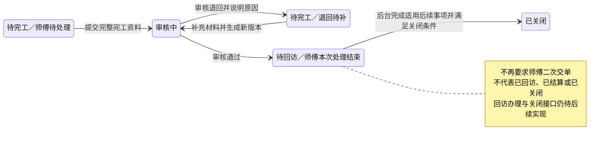
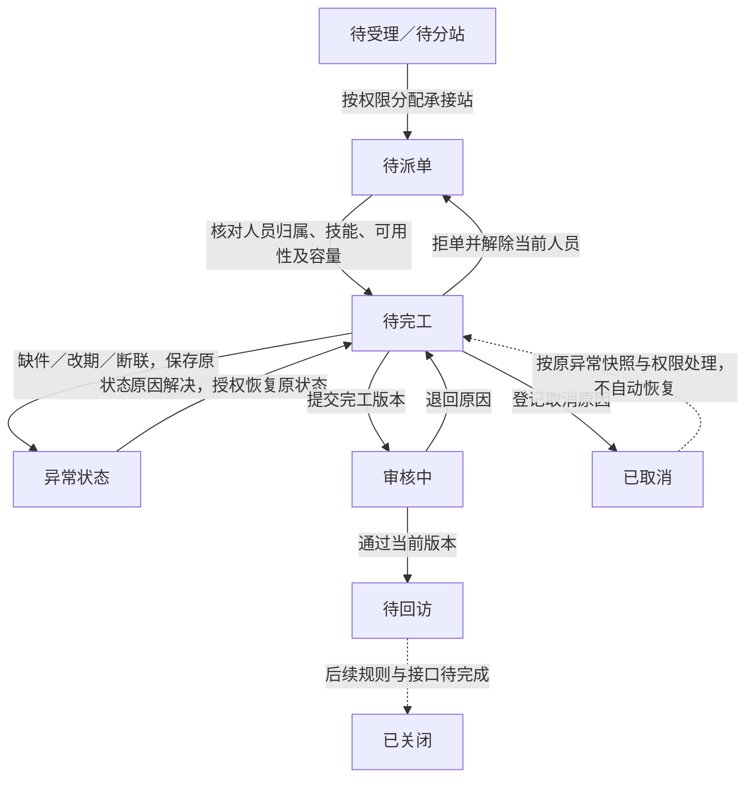
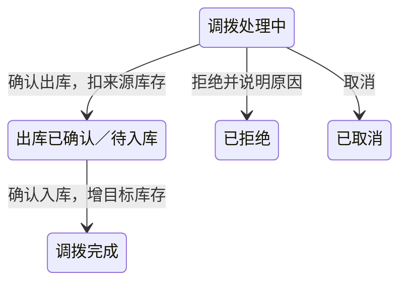

# 服务工单状态机与单据状态说明

更新日期：2026-09-15。适用于服务工单、完工提交／审核记录及相关配件单据。用户已确认取消默认二次交单，并确认配件入库、领料、退料详细状态规则；其余尚未落地的规则在下文单独标明。本文件是状态语义与流转说明，研发证据见[完工审核 Spec](../specs/2026-09-10-派单异常与完工审核全栈首版.md#8-2026-09-13-取消默认二次交单)和[配件库存 Spec](../specs/2026-09-10-配件库存独立系统全栈首版.md)。

## 1. 怎样理解状态机

状态机规定四件事：**当前状态、执行动作、允许条件、目标状态**。例如“审核中 + 有审核权限的人通过当前版本 → 待回访”。页面上的状态名称可以更贴近角色，但不能绕过后端状态和权限检查。

| 信息层次 | 回答的问题 | 示例 |
| --- | --- | --- |
| 工单主状态 | 整张工单推进到哪里 | 待派单、待完工、待审核、待回访、已关闭 |
| 处理标签／事实 | 师傅当前要处理什么 | 已预约、缺件、断联、正在服务、退回待补；按处理事实归入对应页面分类 |
| 提交版本与审核结果 | 哪一版材料被怎样处理 | 第 1 版退回、第 2 版通过；版本和审核记录不覆盖 |
| 页面分类 | 当前角色怎样找到任务 | 师傅端待处理、待补资料、审核中、历史任务；它们不是新增数据库枚举 |
| 配件单状态 | 配件申请或实物流转到哪里 | 领料处理中、调拨已出库、耗用已完成；不等于服务工单状态 |

现有后端仍包含 `APPOINTED`、`MISSING_PARTS` 等细分枚举，原型则将其组织为处理标签。本轮只简化审核后的主线，不把所有历史枚举合并或批量改写数据库。

## 2. 本轮确定的主流程

图中的退回待补与待完工使用同一个后端状态 `PENDING_COMPLETION`，由最新审核结果区分。最后一条“待回访 → 已关闭”是目标业务衔接，当前正式工单工作流尚无该关闭动作接口；原型只由手机外的后台结果模拟器演示，不提供给师傅操作。

## 3. 工单状态字典

| 后端值 | 业务名称 | 含义／下一步 | 师傅端如何展示 | 当前边界 |
| --- | --- | --- | --- | --- |
| `PENDING_ACCEPTANCE` | 待受理 | 客服核对服务需求 | 不进入普通师傅任务 | 已有建单初始状态 |
| `PENDING_STATION` | 待分配服务站 | 按区域或人工选择承接站 | 不进入普通师傅任务 | 保留枚举；不代表所有入口必经 |
| `PENDING_DISPATCH` | 待派单 | 承接站已确定，待指派人员 | 未下发本人不展示 | 已有分站／派单切片 |
| `PENDING_RELEASE` | 待发布 | 旧系统任务下发相关阶段 | 不展示 | 保留枚举；独立发布步骤未确认 |
| `PENDING_CLAIM` | 待接单／抢单 | 按派单模式确认接收者 | 按未来明确模式决定 | 保留枚举；不把接单与抢单混成已确认功能 |
| `PENDING_COMPLETION` | 待完工 | 已指派师傅，完成服务并提交资料；审核退回也回到此状态 | 待处理；最新审核退回时单独归待补资料 | 已有提交／退回流转；当前源码不要求先经过独立发布、接单接口 |
| `APPOINTED` | 已预约 | 已确认服务时间 | 待处理中的预约标签与日程 | 后端保留枚举；原型以确认日期字段组织，不视为另一组工单 |
| `MISSING_PARTS` | 缺件 | 协调配件，恢复后继续履约 | 待处理中的等待配件 | 已有异常动作与恢复；不得因申请领料自动视为库存到货 |
| `RESCHEDULED` | 改期 | 重新联系并确认时间 | 待处理中的改期 | 已有异常动作；真实确认预约仍需端到端接入 |
| `UNREACHABLE` | 断联 | 重新联系并记录结果 | 待处理中的待再次联系 | 已有异常动作；不得自动关闭 |
| `PENDING_REVIEW` | 待审核 | 等待授权审核人员核对当前完工版本 | 审核中；只查看进度与原材料 | 已有正式审核接口 |
| `PENDING_FOLLOW_UP` | 待回访 | 完工审核已通过，服务中心继续后续跟进 | 历史任务 → 后续跟进；显示审核通过 | **本轮改为审核通过的直接目标**；回访／结算／关闭尚未全部实现 |
| `CLOSED` | 已关闭 | 满足本类工单的正式关闭条件 | 历史任务 → 已关闭 | 保留状态；本轮不新增自动关闭或通用复开接口 |
| `CANCELLED` | 已取消 | 本次任务已取消 | 历史任务 → 已取消 | 已有异常取消；恢复申请／权限不能由客户端自行决定 |
| `PENDING_HANDOVER` | 待交单（历史状态） | 旧实现审核通过后的遗留值 | 不产生新的师傅交单待办 | **退出新流程**；Web 保留查询及原值，需业务核对后另行治理旧数据 |

“草稿”表示尚未提交的输入资料，不是当前正式工单工作流的新增持久化枚举。师傅可见范围同时取决于身份、组织归属和正式下发；状态本身不能授予工单查看权限。

### 3.1 师傅首页分类与正在服务区域

| 展示位置 | 收录规则 | 主要操作 |
| --- | --- | --- |
| 待处理 | 尚需联系、预约、服务或异常跟进的本人任务；排除审核退回 | 按当前情况联系、服务或跟进 |
| 待补资料 | 待完工且最新完工审核退回，尚未重提 | 查看退回原因、补材料、重新提交 |
| 审核中 | 完工材料已提交，等待审核 | 查看提交版本和审核进度 |
| 历史任务 | 已审核通过待后台跟进、已关闭、已取消 | 查看后续进度和历史记录 |
| 正在服务独立区域 | 待处理中的已开始服务任务，仍计入待处理 | 继续服务／继续填写完工资料 |

四个分类互斥，合计等于授权可见任务；独立区域只是把正在服务的任务提到顶部，下方列表不重复显示，并注明“其中 N 单正在服务，已在上方展示”。切换分类或搜索不隐藏当前服务区域。地图保持完整筛选结果，因此仍包含置顶任务；日程保留预约日期与记录。

当前原型以现场签到、提交到达说明或明确开始远程指导标识服务开始；仅查看服务页不开始。提交完工后移到审核中，异常、取消或变更预约后移出当前服务区，已采集材料保留。继续按钮按工单恢复服务页或完工步骤与草稿。此为会话内交互，尚无正式服务开始／暂停接口；不把“正在服务”新增为后端主状态。

现有需求没有确认同一师傅只能有一张正在服务的工单。首页独立区域按单卡呈现：主卡固定展示接口首条（服务端按开始服务时间倒序返回，即最近开始服务的一单），超过一单时其余任务收进主卡下方“其他 N 单处理中”的折叠列表，展开后每单仍保留继续处理任务和详情入口，只做视觉收起、不隐藏单据。单工单并发限制如需成立，应另明确暂停、再次上门与服务端一致性规则，不能由首页隐藏其他单据实现。

## 4. 主要动作与迁移条件

异常恢复箭头返回待完工仅展示从待完工发生异常的例子，实际恢复目标取已保存的异常前状态；不能把任何取消单一律恢复到待完工。虚线表示条件性或未完成接入的衔接。发布／接单为待确认模式，未强行插入当前人工派单主线。

| 动作 | 发起方 | 条件与材料 | 结果 |
| --- | --- | --- | --- |
| 提交完工 | 授权履约人员；现有真实接口由 Web 切片提供 | 工单已派人且待完工；当前版本有效；服务结果、有效产品码、照片及签名引用满足校验 | 创建不可变提交版本，进入待审核 |
| 审核退回 | 有完工审核权限的人员 | 当前处于待审核；当前版本有效；必须填写原因 | 记录审核决定，回待完工；原提交保留 |
| 补充重提 | 授权履约人员 | 按退回意见修正，继续通过完工提交用例 | 创建下一版材料，重新待审核；不得覆盖原版或重复扣库存 |
| 审核通过 | 有完工审核权限的人员 | 当前处于待审核且有提交版本；当前版本有效 | 同一事务写审核记录、状态和审计，直接待回访；不再进入待交单 |
| 后续回访／办结 | 客服及适用后台责任人 | 回访、评价、费用及关闭条件按各自已确认契约 | 属后续业务，不要求师傅重复交单；本轮未新增正式办理接口 |

重复审核、过期版本、无权限写入必须拒绝。待回访、历史待交单和已关闭工单不能通过旧异常快照直接复开，也不再返回师傅履约动作。审核通过没有再次扣减配件库存的副作用。

## 5. 完工材料与交单的区别

完工时一次提交审核所需信息与凭证。审核通过后，系统继续使用该版本办理后续事项，师傅本次处理结束。

本项目当前没有确认审核通过后还需交回纸质原件或生成额外凭证，因此取消默认交单页、交单待办和交单提交动作。以后若明确存在纸质原件移交，应按适用工单新增具体事项及责任，不能直接恢复所有工单的强制二次交单。

历史 `PENDING_HANDOVER` 暂不批量改为待回访或已关闭：旧数据可能存在真实原件／结算交接，需核对审核记录、材料、责任及遗留事项后制定迁移清单。此次只改变新审核通过的目标状态，保留旧数据及审计原值，未执行数据库变更。

## 6. 配件单据的状态独立管理

2026-09-15 确认的配件管理详细需求优先于旧实现和旧文档。后台[库存服务实现](../../../backend/gaia-after-sales/gaia-after-sales-core/src/main/java/com/ehsure/gaia/afterSales/inventory/appservice/InventoryAppService.java)及 Web 页面已按下表改造；2026-09-19 服务人员小程序与移动专用配件门面开始接入领退料、单据及 W04 耗用，增量迁移和共享环境验收仍未执行。

| 单据 | 当前状态流转 | 库存变化发生在何时 |
| --- | --- | --- |
| 配件入库单 | `PENDING`（待提交）→ `COMPLETED`（已完成）；待提交可编辑或物理删除 | 提交动作同一事务增加服务站库存；完成后仅查看 |
| 领料单／退料单 | `PROCESSING`（处理中）→ `COMPLETED`（已完成）；或 `REJECTED`／`CANCELLED` | 服务站管理员通过后直接完成，同一事务处理服务站和服务人员双方库存；拒绝不改库存，且不再增加领／退料人“确认收件”步骤 |
| 调拨单 | `PROCESSING` → `OUTBOUND_CONFIRMED`（出库已确认）→ `COMPLETED`；出库前可拒绝／取消 | 出库扣来源，入库增目标；两步分开 |
| 耗用单 | 创建时 `COMPLETED` | 当前库存服务创建耗用单时扣减；正式完工与耗用联合事务仍需按对应 Spec 接入验证 |
| 盘点单 | `PENDING`（待确认）→ `COMPLETED`；或取消 | 确认盘点时按实盘差异调整 |

师傅领料、退料申请提交后为处理中，申请人可在管理员处理前撤销；管理员通过后直接完成。移动端源码已接专用接口，仍需完成迁移、真实会话与管理员审批、微信和真机验证，不能用源码或原型状态替代联调证据。配件入库、领退料和耗用均不会因为取消“服务交单”而取消。

## 7. 对应程序与验证入口

- [后端工单服务](../../../backend/gaia-after-sales/gaia-after-sales-core/src/main/java/com/ehsure/gaia/afterSales/workOrder/appservice/WorkOrderWorkflowAppService.java)：审核通过改为待回访，保留事务、版本和状态历史。
- [后端集成测试](../../../backend/gaia-after-sales/gaia-after-sales-api/src/test/java/com/ehsure/gaia/afterSales/customer/CustomerIntegrationTest.java)：通过后无二次提交、审核记录与状态历史一致；权限、重复审核、旧状态只读与旧异常快照复开拦截。
- [师傅原型](../04-页面原型/小程序/index.html#w-tasks)：待处理／待补资料／审核中／历史任务；正在服务独立置顶；删除交单页，旧链接转进度。
- [实施记录与验证边界](../specs/2026-09-10-派单异常与完工审核全栈首版.md#8-2026-09-13-取消默认二次交单)：后端、Web、原型各自结果与尚未接入的环节。
