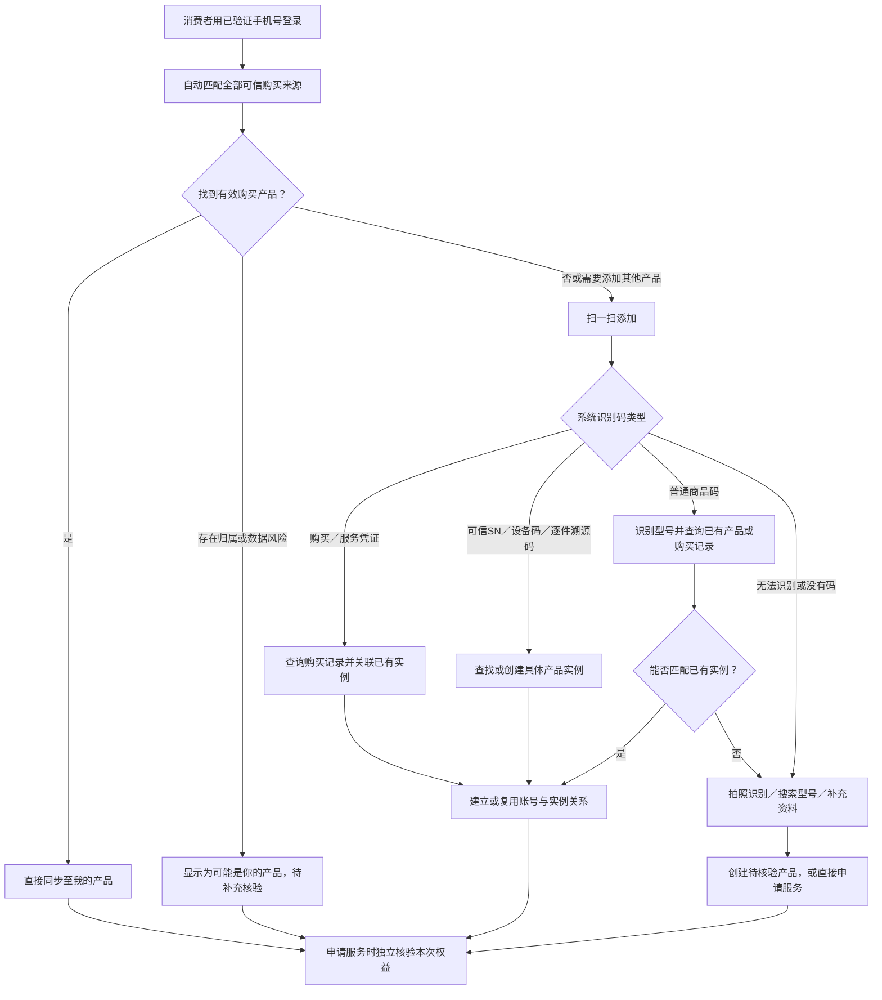

# 消费者产品自动关联与智能认领方案

更新日期：2026-09-14

> 本文记录已经确认的三种产品绑定方式。功能行为与验收口径见[消费者产品自动同步与智能添加 Spec](../specs/2026-09-14-消费者产品自动同步与智能添加.md)。当前实现状态见[消费者小程序开发进度](../03-开发管理/05-消费者小程序开发进度.md)；注册与服务资格的完整边界见[商品注册与绑定逻辑及流程](08-商品注册绑定与服务资格核验.md)。

## 1. 方案结论

| 项目 | 内容 |
| --- | --- |
| 编号、类型与标题 | CR-20260914-01 · 需求变更方案 · 消费者产品自动关联与智能认领 |
| 应用与入口 | 消费者小程序为主；C03～C07、C10、C11，关联 Web D03～D07、A16～A18、A38 |
| 关联需求 | CAPP-001、CAPP-003、CAPP-004、CAPP-005、CAPP-011、CAPP-012；承接 CR-20260912-01 |
| 状态 | 核心方案与原型交互已确认；用户自报购买与后台核验首版已开发待环境验收，自动同步与扫码未实施 |
| 目标 | 尽量自动展示消费者购买产品，降低主动认领和手工录入，所有方式汇入同一产品实例及用户关系 |

最终采用三种方式：

1. **已验证手机号自动同步购买产品**：作为默认方式。
2. **一码通扫智能添加**：覆盖手机号未匹配但产品或凭证有码的情况。
3. **无码产品辅助添加**：覆盖旧产品、无码产品和数据未接入场景。

短信、微信和购买二维码不再作为独立绑定方式。它们仅用于提醒或现场兜底，不是消费者完成绑定的必要步骤。

## 2. 统一流程



三种方式都是找到或补充同一产品实例的方法，不各自创建一套产品数据。

## 3. 方式一：已验证手机号自动同步

门店、官方商城、电商平台或其他渠道将购买记录同步到售后系统，并提供可合法使用的购买手机号。消费者通过验证码等方式验证手机号后，系统自动匹配有效购买记录和产品实例，直接展示在“我的产品”中，不要求点击短信链接或逐笔认领。

```text
订单进入售后系统
→ 消费者验证手机号登录
→ 匹配购买手机号
→ 复用购买记录中的产品实例
→ 自动展示我的产品
```

手机号是消费者可感知的唯一登录和匹配标识，但系统内部使用稳定的 `account_id` 保存正式关系：

```text
已验证手机号 → 消费者 account_id ↔ product_instance_id
```

不应长期用手机号直接关联产品，否则换号、号码重新分配后会改变历史归属。

满足可信来源、完整手机号、有效订单、未退货、未被其他账号冲突认领等条件时直接同步；存在家庭共用手机号、购买人与使用者不同、历史数据异常或归属冲突时，仍可展示脱敏候选，但标记为待核验。

无法提供真实手机号、只提供平台虚拟号或未同步到售后系统的订单，转入方式二或方式三。

## 4. 方式二：一码通扫智能添加

消费者只使用统一的“扫一扫添加产品”，不需要预先判断码的类型。系统根据发行方、格式、数据源和实际映射自动处理。

| 扫描结果 | 处理方式 |
| --- | --- |
| 安装码、订单码、电子保修卡 | 查询可信购买、产品或权益记录，再执行关联核验 |
| 可信 SN、设备码、逐件溯源码 | 定位具体产品实例；已有实例则复用，没有时按规则创建 |
| 普通商品条码、型号码 | 只识别商品型号，继续查询已有购买／产品或进入辅助添加 |
| 批次码、组合部件码 | 按明确粒度处理，不擅自当成单件整机 |
| 未知、失效、撤销或冲突码 | 说明原因，转辅助添加或人工核对，不直接绑定成功 |

扫码识别具体实物和认定消费者归属是两件事。知道产品码不能绕过登录、归属核验和服务资格判断；普通商品码也不能证明具体是哪一件产品。

## 5. 方式三：无码产品辅助添加

适用于旧产品、无码产品、标签损坏、历史订单未接入，以及手机号和扫码均无法匹配的情况。

处理顺序为：

1. 拍摄铭牌，识别品牌、型号和可能的序列号。
2. 上传小票、发票或订单截图，识别订单、渠道和购买日期。
3. 查询商品及购买候选，由用户确认系统识别结果。
4. 仍无法匹配时，允许搜索型号并填写最少必要信息。
5. 创建“用户自报、实物待核验”的产品实例，或在无法确认型号时直接申请服务。

辅助添加成功只表示用户保存了一条产品档案，不自动证明真实购买、实物唯一、所有权或免费权益。

## 6. 跨方式去重

所有入口必须先查后建：

```text
查购买记录
→ 查产品标识
→ 查账号已有产品
→ 能复用就补充原实例
→ 确认不存在时才创建新实例
```

至少建立三类唯一约束或等价控制：

| 对象 | 防重依据 |
| --- | --- |
| 账号产品关系 | `account_id + product_instance_id` |
| 可信产品标识 | `发行方 + 标识类型 + 标识值` |
| 外部购买明细 | `订单来源 + 外部订单号 + 明细号／件序号` |

例如手机号已经同步产品，之后又扫描该产品的可信 SN：系统应定位到原实例，为原实例补充 SN，并提示“该产品已在你的产品中”，不能重新创建一条。

如果扫描的只是普通商品码，只能识别型号。系统应提示已有同型号产品，让用户选择“就是已有产品”“另一件相同型号产品”或“我不确定”。

## 7. 同型号无码产品的重复处理

用户选择“另一件相同型号产品”后可以新增实例，以支持真实购买多件同款的情况，但新实例不能立即视为已经证明是另一件实物：

```text
用户关系：已添加
资料来源：用户申报
实物识别：待核验
疑似重复：关联已有相同型号实例
权益状态：未核验
```

后续需要遵守：

- 活动工单检查应覆盖疑似重复实例，避免同一实物同时建多张工单。
- 用户自报的新实例不自动产生免费安装、保修或延保权益。
- 现场首次服务可通过铭牌、照片、安装位置或新的服务标识确认实物。
- 确认确实是两件时，标记为不同实物并分别保留历史。
- 确认是同一件时，以一条实例为主，迁移关系、工单、凭证和服务历史；重复实例标记为已合并，不直接删除。

系统可以降低无码场景的重复概率，但无法在没有可信实物标识时百分之百自动去重，因此必须保存不确定性并支持后续纠正。

## 8. 统一关系和状态边界

建议保留以下逻辑对象，具体表名和字段由实施 Spec 确定：

```text
消费者账号
  ↕ 产品用户关系（角色、来源、状态、有效期）
产品实例
  ↕ 产品标识（SN、溯源码、安装码等）
购买记录／明细
  ↕ 购买事实及来源
服务申请
  ↕ 本次权益核验
```

不得用一个“已绑定”状态覆盖全部事实，至少分别表达：

- 用户关系：自动同步、待核验、已关联、有争议、已解除；
- 实物识别：仅型号、系统实例、可信实物、识别冲突、已合并；
- 购买事实：可信同步、人工核实、用户自报；
- 服务权益：按本次服务独立判断符合、待补充、不符合或待现场确认。

产品已经出现在“我的产品”中，不等于免费安装或保修资格已经通过。

## 9. TOTO 场景映射

| 场景 | 对应方式 |
| --- | --- |
| 各门店、官方商城、电商订单已同步且有有效手机号 | 手机号登录后自动同步 |
| 订单未同步，但有安装码、SN、设备码或逐件溯源码 | 一码通扫智能添加 |
| 只有普通商品码 | 扫码识别型号，再匹配已有产品或转辅助添加 |
| 旧产品、无码、标签损坏或数据未接入 | 无码产品辅助添加 |

当前系统生成的 `TOTO-<实例ID>` 安装码只是现有实现事实。是否代表购买、单件实物或免费安装权益，仍需根据真实 TOTO 发码和校验规则确认。

## 10. 已确定的代码处理顺序

```text
手机号授权回调 → 服务端验证手机号 → 同步可信订单 → 按购买明细幂等建立关系
统一扫码 → 服务端解析发行方和码类型 → 查购买／标识／已有关系 → 复用或创建实例
无码手选 → 校验目录商品和购买日期 → 创建待核验实例 → 建立用户关系
我的产品 → 只读统一关系视图 → 申请服务时重新核验权益
```

前端不得自行根据字符串前缀认定码类型，也不得把手机号、商品型号和购买日期拼成唯一键。所有写操作携带幂等键；后端事务内执行“查购买记录—查标识—查账号关系—复用或创建”。换号只变更账号的已验证联系方式并触发受控重匹配，不重写历史产品关系。

## 11. 实施前仍需确认

- 首期接入哪些门店、商城、电商及历史订单来源，分别能提供什么手机号和订单状态。
- 消费者手机号登录、换号、账号合并和异常归属的处理规则。
- TOTO 安装码、产品码、溯源码和 SN 的来源、粒度、验证接口及生命周期。
- 购买人、实际使用人、家庭成员、代办人及转赠的关系权限。
- 哪些待核验产品允许申请服务，哪些免费权益必须先补证据。
- 疑似重复实例的后台核对、现场确认和合并权限。
- 短信、微信仅作为提醒时的触发条件、授权、去重和失败降级方式。

## 12. 当前实现边界

2026-09-14 已实现“无码手选 → 用户自报购买 → 后台核验”首版：用户提交后立即成为统一购买记录的一行，并同时建立产品实例与账号关系；界面明确显示“用户自行填写／待核验”，不生成安装码，不允许进入预约或服务受理。

后台可在同一列表筛选和查看申报，采用以下动作：人工凭证或现场核验后转 `VERIFIED`；从同手机号、同商品候选中关联正式记录；标记冲突；驳回。关联不是把申报复制成另一条正式记录，而是把消费者关系移到已有正式实例，保留原申报为 `MERGED` 审计记录。

该切片已包含关系表、核验历史、升级脚本、后端 API、Web 核验界面和消费者端提交／列表。消费者真实身份和 API 权限尚未接入，数据库脚本尚未部署到共享环境；手机号自动同步、扫码识别、可信产品标识、订单接入及完整权益核验仍未实现。

## 参考

- [商品注册与绑定逻辑及流程](08-商品注册绑定与服务资格核验.md)
- [消费者产品自动同步与智能添加 Spec](../specs/2026-09-14-消费者产品自动同步与智能添加.md)
- [安装码管理恢复与标识关系核查](../specs/2026-09-12-安装码管理恢复与标识关系核查.md)
- [消费者小程序开发进度](../03-开发管理/05-消费者小程序开发进度.md)
- [GS1 Digital Link](https://www.gs1.org/standards/gs1-digital-link)
