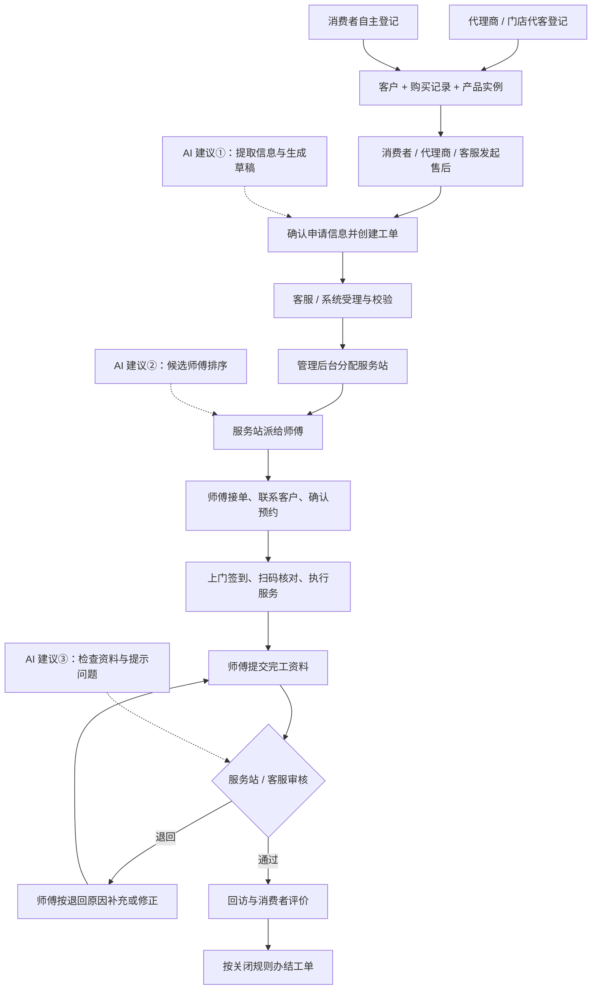

# TOTO 售后服务｜业务流程说明

更新日期：2026-09-08 · 按一张工单讲清角色交接与业务结果

[阅读指南](00-阅读指南.md) · [极简业务总览](01-极简业务总览.md) · [系统功能结构](03-系统功能结构.md)

## 先看完整主线

下面展示典型上门服务的目标流程。服务站分配、师傅派单和完工审核的具体权限仍需业务定版；远程指导走后文的简化路径。

流程中的三个建单入口并不表示每个入口已确认支持全部服务类型。系统在正式建单时校验提交信息，受理阶段再处理需补充、异常或人工核实的内容。

## 第一步：把“买了什么”登记清楚

产品登记先建立客户与具体产品的关系，供之后的预约、扫码、服务记录和渠道核验使用。

| 登记方式 | 谁发起、怎样填写 | 登记结果 |
| --- | --- | --- |
| 代理商 / 门店代客登记 | 店员选择授权门店、录入购买商品；顾客扫码填写资料，或由店员代填，完成手机验证和隐私确认 | 记录购买人、使用者、使用地址、购买商品和来源门店，按校验结果生成或绑定安装码 |
| 消费者自主登记 | 消费者在小程序扫码或输入产品码，补充购买日期、门店、使用者和地址等信息 | 校验产品码并关联已有或新登记的产品实例，纳入同一套客户和购买信息管理 |

**两条入口最终都要能回答：哪个客户，买了哪些具体产品，在哪里使用。** 已有登记需要匹配和校验，避免同一产品重复绑定。

几个容易混淆的概念：

| 概念 | 业务含义 |
| --- | --- |
| 商品 / 型号 | 卖的是什么类型、什么型号的产品 |
| 产品实例 | 客户购买的某一件具体产品，用来追踪这件产品之后的服务 |
| 购买记录 | 一次购买发生在哪家门店、购买了什么、数量多少；可以关联多个产品实例 |
| 安装码 | 关联登记和安装预约的信息入口，帮助找到需要服务的购买产品 |
| RFID / QR 产品码 | 识别和核验具体产品、追踪销售出库及现场回传的信息；不要把它与安装码混为一谈 |

产品登记完成后，不一定立即发起售后；需要服务时再选取本次涉及的产品。购买人与实际使用者可以不同，联系和上门应以本次确认的信息为准。

## 第二步：从服务需求变成一张工单

**消费者自助、代理商代客、客服代客，最终进入同一个工单中心。** 工单记录来源，后续共用产品校验、调度和服务闭环。

| 服务类型 | 业务想解决的问题 | 申请时重点说明 |
| --- | --- | --- |
| 安装 | 把购买的产品安装好 | 选哪些产品、安装地址、联系人、期望时间、是否有拆旧等附加服务 |
| 维修 | 产品出现问题，需要诊断和处理 | 哪个产品、什么故障、图片或视频、使用地址、期望时间 |
| 指导 | 需要使用或操作方面的帮助 | 指导问题、关联产品、希望远程还是上门处理 |

客服或系统核对客户与产品、地址、服务范围，以及是否已有重复的活动工单；维修还需核对保修信息。缺少信息时补充，有异常时进入人工核实。**客户填写的期望时间，是希望服务的时间；师傅联系后确认的时间，才是双方约定的预约时间。**

目前代理商安装预约、消费者维修/指导申请已有需求依据；消费者是否直接开放安装预约、各入口完整服务类型范围仍待确认。费用、附加服务收费及支付结算另行确认，不能从“可申请服务”推导出免费或已支持支付。

## 第三步：先找负责的服务站，再找执行的师傅

| 环节 | 核心问题 | 主要处理 | 交接结果 |
| --- | --- | --- | --- |
| 分配服务站 | 哪个服务组织负责？ | 管理后台按地址、服务区域和服务能力匹配，客服按授权处理无法匹配或需要调整的情况 | 工单归属一个负责的服务站 |
| 派给师傅 | 具体由谁去做？ | 服务站结合区域、技能、任务量、时间和可用性选择服务人员 | 形成师傅待接收的任务 |
| 接单和预约 | 师傅能否执行，何时服务？ | 师傅接收任务、联系客户、确认地址和服务时间 | 双方确认预约，准备履约 |

**分配服务站和派师傅是两次不同的责任交接。** 总部或客服能否直接派到师傅、如何转站和改派、是否允许抢单等，仍按后续确认的权限和规则执行。

## 第四步：完成服务，并留下可审核的记录

上门服务一般经过：**到达签到 → 扫码或核验产品 → 执行服务 → 记录结果和配件 → 提交完工。**

| 服务类型 | 执行特点 | 交出的结果 |
| --- | --- | --- |
| 安装 | 核对本次安装产品，完成安装及适用的附加服务 | 安装结果、产品码、规定照片及客户确认等资料 |
| 维修 | 先诊断，再维修；需要配件时关联领料和实际耗用，缺件可能需要二次上门 | 故障与处理说明、配件使用、产品码、规定照片及客户确认等资料 |
| 指导 | 远程指导由客服或服务人员记录沟通和处理结果；上门指导复用预约、上门和服务记录流程 | 指导内容、处理结果及适用的确认资料 |

远程指导可以从受理进入远程处理，再提交结果、审核和回访；不强行套用上门签到、现场扫码等步骤。三类服务各自的必填资料和完工标准仍需细化确认。

**提交完工，表示师傅认为服务已完成；审核通过，表示履约资料和结果已被认可；工单关闭，表示流程按办结规则结束。** 这是三个不同节点。

## 第五步：审核、回访评价，再关闭

| 环节 | 谁处理 | 看什么 / 做什么 |
| --- | --- | --- |
| 完工审核 | 按授权由服务站或客服处理 | 核对服务结果、产品码、照片、客户确认或签名、配件记录；通过或写明原因退回 |
| 退回补充 | 师傅 | 根据原因补充或修正后再次提交，保留原提交记录和退回原因 |
| 回访 | 客服，配合短信或微信通知 | 了解是否解决问题、服务是否满意、是否需要继续跟进 |
| 评价 | 消费者或有效授权人 | 评分、填写意见，形成关联这张工单的反馈 |
| 关闭 | 授权人员或按已确认规则由系统处理 | 满足办结条件后关闭，保留客户、产品和服务全过程记录 |

服务站与客服是否需要分级审核，哪些单据需要“待交单”，未评价、回访未接通时能否关闭，都需要进一步明确。回访是主动了解服务结果，评价是客户表达反馈，两者不能简单互相替代。

## 出现异常时，流程怎样继续

| 情况 | 用人话解释 | 处理方向 |
| --- | --- | --- |
| 改期 | 原来约好的时间不合适了 | 记录原因，重新联系并确认预约 |
| 断联 | 暂时联系不上客户 | 记录联系情况并继续跟进；何时升级或关闭需按确认规则处理 |
| 缺件 | 维修需要的配件尚未到位 | 记录配件需求、领料或到件情况，到件后重新预约或继续维修 |
| 拒单 / 改派 / 转站 | 原师傅或服务站无法承接 | 记录原因，由有权限人员重新分配并通知相关方 |
| 审核退回 | 完工资料或结果不符合要求 | 写明问题，师傅补充或修正后再次提交 |
| 取消 | 本次服务不再继续 | 按权限和规则终止，保留原因与历史；已取消与正常完成后关闭分别记录 |
| 投诉 | 客户对结果或过程不满意 | 关联原工单跟进处理；是否复开原工单按权限和确认规则决定 |
| 退货 | 购买关系发生变化 | 保留产品和历史服务记录，按退货规则限制新的预约，不直接删除已有记录 |

## AI 建议放在这 3 个节点

以下是建议方案；“首批 AI”与当前工程开发的“第一阶段”不是同一概念，是否纳入交付需单独明确。

| 建议节点 | AI 接收什么 | AI 输出什么 | 谁确认、怎样进入下一步 |
| --- | --- | --- | --- |
| ① 智能建单 | 消费者的自然语言描述，以及已提供的产品、故障和媒体信息 | 安装/维修/指导类型建议、提取到的信息、缺失项和工单草稿 | 消费者、代理商或客服确认；系统按入口权限和业务规则校验后正式建单 |
| ② 智能师傅推荐 | 系统筛选出的合格候选师傅，以及可取得的距离、技能、任务量、时间和可用性 | 候选排名、推荐师傅和推荐原因 | 服务站人员确认，系统校验权限和可用性后派单 |
| ③ 智能完工审核 | 服务结果、照片、产品码、客户确认、配件使用等完工资料 | 缺漏或疑点清单，以及“建议通过 / 建议退回 / 建议人工复核” | 授权审核人员或已确认的系统规则作出决定，由系统执行状态流转 |

AI 判断和建议保留给确认人查看；未提供或无法判断的信息应提示补充。师傅的资格、区域和权限由系统先校验；AI 排名不能替代这些条件。完工照片、产品码等资料的核验结果也需要结合系统记录，AI 建议本身不直接触发通过或关闭。

## 用一次维修串起来

例如，客户已经登记了一台 TOTO 产品，在小程序描述“冲洗功能异常”并上传照片。确认申请后生成维修工单，客服核对产品与地址，后台分配负责区域的服务站。服务站派给合适的师傅，师傅接单并与客户确认时间。

师傅上门诊断发现需要更换配件，但当前缺件，于是记录配件需求。到件后重新约时间，完成维修并提交配件耗用、服务结果和规定资料。审核人员核对通过后进入回访评价，满足关闭规则后办结。以后再查这台产品，仍能看到本次维修和配件记录。

如果接入 AI，它可以帮助整理最初的故障描述、推荐候选师傅、提示完工资料问题；各环节的责任人和确认动作仍然清楚可查。

## 还需业务确认的关键点

| 事项 | 会影响什么 |
| --- | --- |
| 各建单入口允许哪些服务类型，特别是消费者安装预约 | 消费者和代客建单入口的实际范围 |
| 总部、客服、服务站的分配、派单、改派和审核权限 | 每一步由谁操作和负责 |
| 待发布、待接单、待审核、待交单等状态的准入及适用范围 | 页面队列和真正的工单流转 |
| 各服务类型的完工资料、回访评价和关闭条件 | 什么时候算做完，什么时候可以办结 |
| 服务区域冲突、无法匹配、人员不可用时的处理规则 | 自动分配失败后如何继续 |
| 附加服务、配件费用、支付、退款与结算范围 | 是否收费以及费用如何处理 |
| 三个 AI 节点的交付范围、所需数据和确认责任 | 建议能否落地，以及何时实施 |

既有待确认问题统一维护在[风险与待确认事项](../03-开发管理/02-风险与待确认事项.md)；本节只提示影响阅读的关键点。更细的流程和状态见[核心业务流程与状态机](../01-功能需求/03-核心业务流程与状态机.md)，登记和执行规则见[代理商工作台需求](../01-功能需求/05-代理商工作台需求.md)、[消费者小程序需求](../01-功能需求/06-消费者小程序需求.md)、[服务人员小程序需求](../01-功能需求/07-服务人员小程序需求.md)。
