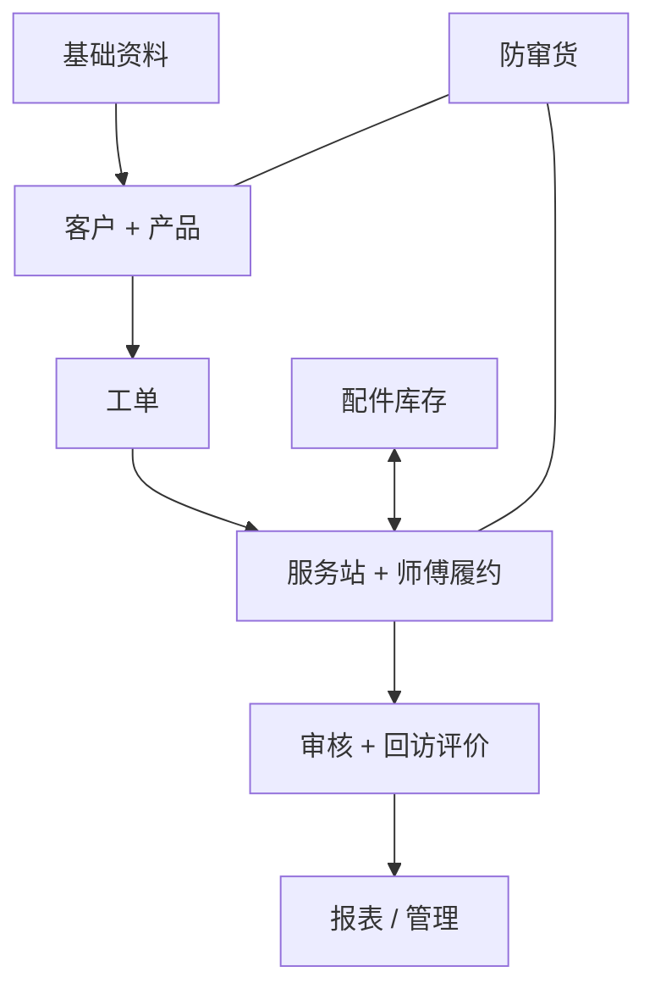

# TOTO 售后服务｜系统功能结构

更新日期：2026-09-10 · 面向业务理解的功能地图

[阅读指南](00-阅读指南.md) · [极简业务总览](01-极简业务总览.md) · [业务流程说明](02-业务流程说明.md)

## 整体结构：3 个应用载体 + Web 后台 4 个角色视角

| 应用载体 | 主要使用者 | 一句话职责 |
| --- | --- | --- |
| Web 管理后台 | TOTO 管理人员、客服、服务站人员、代理商管理员、门店店员 | 按角色管理资料、登记、工单、调度、履约协同和运营 |
| 消费者小程序 | 最终消费者 | 登记产品、申请售后、查进度、评价 |
| 服务人员小程序 | 安装、维修、指导服务人员 | 从接到任务一直操作到提交完工 |

外部支撑包括 DWH、追溯系统、微信、短信、地图和对象存储。它们提供数据或能力，不计为应用端。

Web 管理后台只有一个“TOTO 售后服务”入口，根据总部运营、客服作业、服务站作业、门店业务 4 个角色视角展示功能；“代理商工作台”“客服工作台”“服务站工作台”均不是独立应用。服务人员小程序已有需求，其与“TOTO客服助手”的应用和仓库关系仍待确认，不能据名称直接视作同一个应用。

## Web 管理后台：按业务理解分成 8 组

以下分组沿用备忘录的讲解思路，用来理解功能职责。当前后台采用 4 个工作视角；具体分组与功能数量以角色权限手册为准（2026-09-12 核对）。总部、客服的业务查询组已恢复安装码管理。完整菜单树与使用角色见[后台菜单与角色权限手册](05-后台菜单与角色权限手册.md)，入口编号见[页面清单](../01-功能需求/08-页面清单.md)，不要求与这 8 组一一对应。

### 1. 主数据管理

管理“谁、在哪里、卖什么、服务什么”。

- 渠道和网点：代理商、门店、服务站、服务区域。
- 商品资料：商品分类、商品、系列及配套关系。
- 服务与配件资料：商品资料和配件主档；服务类型由业务流程使用，不再提供独立“服务项目”维护功能。

这些是登记、建单和派单共同使用的基础资料。

### 2. 客户 / 产品管理

管理“哪个客户拥有哪些产品”。

- 客户查询、客户详情、购买人和使用者、地址。
- 购买记录、购买商品和具体产品实例。
- 安装码、RFID / QR 关联、隐私同意记录。
- 历史预约、工单和服务记录。

代理商登记和消费者自主登记都进入这套管理关系；一次购买、某一件产品、一次服务分别保留记录并相互关联。

### 3. 客服 / 工单中心【核心】

管理“一张工单从创建到关闭”。

- 售后受理：待受理工单、客户识别、客服代客建单、资料校验。
- 调度跟进：工单查询、服务站分配、师傅派单、沟通记录、时效跟进。
- 异常处理：改派、转单、改期、断联、缺件、拒单、取消。
- 完工办结：完工审核、回访、服务评价。
- 扩展支持：投诉处理、客服知识和处理指引。

客服工单中心的详细队列和权限仍需定版；师傅派单、完工审核由哪些角色操作，按最终授权分工。AI 建单、师傅推荐、完工初审分别挂在这条主线的三个节点，详见[AI 功能建议](02-业务流程说明.md#ai-建议放在这-3-个节点)。

### 4. 服务站 / 服务人员管理

管理“哪个服务站、哪个师傅负责完成服务”。

- 服务站工作台：待接收、待派单、执行中、待审核和异常工单。
- 人员与能力：服务人员、服务区域、技能、状态。
- 调度安排：派单看板、任务与人员位置、冲突提示；排班和可用时间按实施范围逐步完善。
- 履约管理：完工审核、服务时效、一次完工情况、评价和投诉。

服务站组织履约，师傅执行具体任务；两者查看和操作的数据受各自授权范围限制。

### 5. 配件 / 库存

管理“维修用了什么配件，库存还剩多少”。

- 配件主档，以及仓库、服务站、师傅个人库存。
- 领料、退料、调拨、工单实际耗用。
- 库存流水、盘点和差异调整。

业务上要分清：**领到师傅手上的配件，不等于已经用在客户产品上。** 实际使用关联工单，未用或需退回的配件走退料流程。配件主档与基础资料共用，库存模块管理数量变化。

### 6. 防窜货

核验“这件产品的销售、出库、登记和安装流向是否一致”。

- RFID / QR 查询、安装码管理，以及顾客购买与工单记录中的安装码检索和全过程追溯；完整追溯属于待交付目标，当前可用边界见[码关系与售后使用说明](06-安装码与商品标识及售后使用说明.md)。
- 销售与出库信息、购买登记、产品注册、预约及安装地址。
- 异常规则、异常记录、人工复核。

例如，检查是否缺少购买或出库记录、是否重复注册、代理商是否一致、安装区域是否符合授权。规则命中形成异常线索，由授权人员结合记录复核。

### 7. 报表 / 运营

看“整个售后服务运行得怎么样”。

- 工单数量、完工情况、受理与服务时效。
- 服务站表现、师傅表现、客户评价、投诉及异常统计。
- 数据查询、报表和导出。
- 会员运营：会员资料、标签、问卷和推送等后续能力。

服务完工评价属于服务闭环；独立产品问卷、营销推送等按二期范围处理。本文保留整体功能地图，不将后续运营能力算作当前已交付功能。

### 8. 系统管理

控制“谁能进入系统、能看什么、能操作什么”。

- 用户、角色、功能权限、数据范围和敏感信息展示。
- 字典、参数、通知等基础配置。
- 登录日志、操作日志、导入 / 导出。

这些能力贯穿所有模块；同一个功能入口，不同角色也可能只能查看自己门店、服务站或授权范围内的数据。

## Web 管理后台的门店业务视角

**把产品销售正式接入售后体系。**

| 业务环节 | 主要功能 |
| --- | --- |
| 进入工作台 | 选择授权门店，查看当前门店信息 |
| 顾客和商品登记 | 客户登记、购买商品编辑与确认、顾客扫码填写或店员代填、手机验证、隐私签名 |
| 产品关联 | 绑定产品，按校验结果生成或绑定安装码并查询 |
| 安装预约 | 选择本次要安装的产品、联系人、地址、期望时间和附加服务，代客发起安装预约 |
| 查询与后续处理 | 查询客户、购买和预约；符合规则时再次预约或办理退货 |

代理商管理员管理本代理商及下属授权门店，店员主要处理当前门店业务。退货保留历史关系，已有服务记录时按规则处理。

## 消费者小程序

**消费者自己登记产品、发起售后、查看进度和评价服务。**

| 业务环节 | 主要功能 |
| --- | --- |
| 产品登记 | 扫码或输入产品码、完善购买信息、产品注册 / 绑定 |
| 我的产品 | 查看产品、安装码、购买记录和服务历史 |
| 售后申请 | 维修预约、指导预约、故障描述、图片 / 视频；直接安装预约入口仍待确认 |
| 服务跟进 | 查看我的工单 / 服务记录和服务进度，完成服务评价 |
| 网点与客服 | 授权门店 / 维修网点查询、电话和微信客服入口 |
| 我的 | 个人资料、地址、通知偏好、隐私条款，以及按阶段实施的问卷功能 |

“我的工单”在这里表示查询本人服务记录的能力，实际页面名称和入口以页面清单为准。

## 服务人员小程序

**师傅从接到任务一直操作到提交完工。**

| 业务环节 | 主要功能 |
| --- | --- |
| 接收与安排 | 我的任务、工单详情、接单、联系客户、预约 |
| 过程调整 | 改期、断联、缺件、取消等申请或动作，按权限和规则办理 |
| 上门履约 | 签到、RFID / QR 扫码或人工补录、安装 / 维修 / 指导、服务过程记录 |
| 提交完工 | 配件使用、图片 / 视频、客户确认或签名、完工提交、退回后补充 |
| 配件管理 | 我的库存、领料 / 退料、领料单；调拨按实施范围支持 |
| 日常支持 | 技术和延保资料、问题反馈、企业切换、个人中心 |

任务中的“待发布、待审核、待交单”等名称已有需求记录，具体适用流程和责任人仍需确认。独立小程序的功能需求已有整理，应用落地安排见[服务人员端开发进度](../03-开发管理/07-服务人员小程序开发进度.md)。

## 外部接口与支撑能力

| 能力 | 为业务提供什么 | 主要用在哪些地方 |
| --- | --- | --- |
| DWH（数据仓库） | 代理商、门店、销售、出库等数据 | 基础资料、购买核验、渠道核验 |
| 追溯系统 | RFID / QR、商品及产品流向、服务回传信息 | 产品识别、防窜货、现场扫码核验 |
| 微信 | 登录、手机号授权、订阅消息、小程序能力 | 消费者入口、身份关联、服务通知 |
| 短信 | 验证码、预约、派单、回访通知 | 登记验证、服务沟通与回访 |
| 地图 | 地址解析、经纬度、距离等地理能力 | 地址确认、服务区域匹配、候选师傅距离参考 |
| 对象存储 | 照片、视频、签名、附件和导出文件的存放能力 | 登记凭证、现场资料、完工审核和查询 |

接口的数据范围、更新频率和使用规则仍需按对应集成确认；列入功能地图不代表已接通。地图提供位置与距离，负责服务的区域规则由业务确定。

## 再归纳成 6 大业务域

| 业务域 | 包含什么 |
| --- | --- |
| ① 基础资料 | 代理商、门店、商品、服务站、师傅 |
| ② 客户与产品 | 客户、购买、产品实例、安装码及产品码关联 |
| ③ 工单【核心】 | 安装、维修、指导，以及申请到关闭的全过程 |
| ④ 履约 | 服务站、师傅、预约、上门或远程服务、完工 |
| ⑤ 支撑能力 | 配件库存、防窜货、地图、消息、文件及外部数据 |
| ⑥ 系统治理 | 权限、日志、报表、运营和配置 |

“应用载体”按运行产品区分，“角色视角”按谁使用区分，“业务域”按管理什么区分；三者不能混算。例如，工单由消费者或代客人员发起，Web 后台中的客服／服务站角色调度，师傅执行，消费者评价。

需要追到详细范围时，查看[功能纵览](../01-功能需求/00-功能纵览.md)、[统一管理后台需求](../01-功能需求/04-统一管理后台需求.md)及各端需求；当前交付情况统一查看[开发进度总览](../03-开发管理/00-开发进度与下一步.md)。
