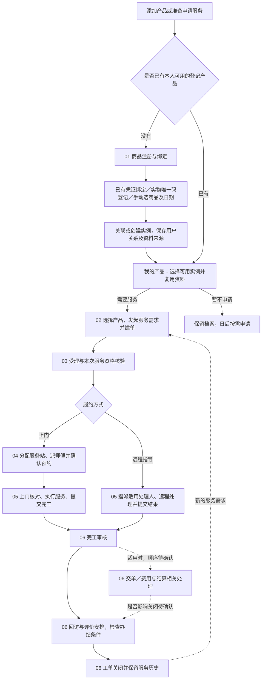

# 售后全流程总览

更新日期：2026-09-12 · v0.2 讨论稿 · 面向业务人员、研发与 AI 的流程入口

从这里看懂商品如何注册绑定，以及一次服务如何从建单走到关闭，再进入各阶段讨论细节。采用“简易总图＋阶段详图＋节点说明”，以业务责任交接拆分，不按前后端或每个页面拆分。

## 1. 本目录如何使用

| 项目 | 说明 |
| --- | --- |
| 维护事项 | DOC-20260912-01 · 文档整理 · 建立可持续调整的售后流程地图 |
| 来源／负责人 | 用户于 2026-09-12 要求建立全流程阅读及讨论入口；负责人待分配 |
| 范围 | 消费者、门店／客服、服务站、服务人员之间的注册绑定、建单、受理、调度、履约、审核与办结；跨视角 |
| 状态／优先级 | 文档初版已建立，流程细节待确认；业务实施优先级由对应需求／Spec 决定 |
| 关联依据 | 各阶段链接原需求、讨论方案及阶段 Spec；本文不是新的实施 Spec |
| 文档检查目标 | 主线及异常有去向；各阶段有输入、责任、输出、依据和待确认项；图文一致 |
| 验证边界 | 仅整理项目内材料与本次讨论，未重新验证业务代码、真实接口或业务闭环，不改变进度和验收结论 |

每张图使用 Mermaid 文本，便于直接修改和查看 Git 差异。图下保留节点说明，方便人和 AI 在图无法渲染时理解同一流程。

- **先读总览，再读有关阶段。** 讨论一个阶段时同时核对它的输入和下一阶段的接收条件。
- **图是业务步骤，不是数据库状态枚举。** “已预约”“资料待补充”“权益待核验”可能属于不同维度，不能把所有图节点自动做成互斥工单状态。
- **明确三种证据口径。** “既有需求依据”仍可能是草案；“本次讨论建议”不等于已实施；“待确认”不得由图中箭头替代业务决策。
- **实现情况看源码与 Spec，验收情况看进度及证据。** 本目录不维护另一套开发数字，也不把历史实现当作新业务必须沿用的规则。

## 2. 一张图看完正常主线

实线表示本稿采用的典型衔接；虚线表示条件分支或先后关系待确认。全部节点均为目标流程表达，不代表已实现或已验收。

“建单”表示本次服务需求已形成可追踪业务记录，不意味着已取得免费权益。**正式工单在核验前还是核验后创建、是否先保存申请再转工单，仍待确认。** 图先表达业务责任顺序，不强制增加第二种单据；阶段 02、03 说明此边界。

正常关闭后的再次服务应新建并关联原产品历史；投诉或异常是否复开原工单需按授权规则判断。取消是本次服务终止分支，与正常履约关闭分开，见阶段 07。

## 3. 按阶段进入

| 文档 | 回答的问题 | 主要交接结果 |
| --- | --- | --- |
| [01 · 商品注册与绑定](01-商品注册与绑定.md) | 三种方式怎样建档或认领？已有产品怎样复用？ | 用户与实例关系、资料来源及核实情况 |
| [02 · 服务申请与建单](02-服务申请与建单.md) | 谁发起，服务什么产品，何时形成单据？ | 可追踪的需求、来源、产品和必要资料 |
| [03 · 受理与服务资格核验](03-受理与服务资格核验.md) | 能否受理、是否免费、谁核验？ | 本阶段核验结果及后续现场待确认项 |
| [04 · 分站派单与预约](04-分站派单与预约.md) | 哪个站负责、谁处理、什么时候服务？ | 负责组织、执行人员和确认预约 |
| [05 · 服务履约与完工提交](05-服务履约与完工提交.md) | 安装、维修和远程指导怎么做，缺件怎么继续？ | 服务结果及可审核的完工材料 |
| [06 · 完工审核与回访关闭](06-完工审核与回访关闭.md) | 谁审核、怎样退回、什么时候算办结？ | 审核历史、适用反馈和关闭结论 |
| [07 · 异常取消与再次服务](07-异常取消与再次服务.md) | 改期、断联、缺件、取消、投诉怎么处理？ | 明确继续、转交或终止去向，保留历史 |

阶段 01 在本目录展开三条注册路径、已有产品复用和后续建单衔接；手动申报、购买记录匹配及服务资格核验细则继续在[商品注册与绑定逻辑及流程](../02-技术设计/08-商品注册绑定与服务资格核验.md)维护。图示摘要与专题规则各有职责，不另维护第二套详细规则。

## 4. 需要始终区分的对象与结果

| 对象／结果 | 含义 |
| --- | --- |
| 商品档案与产品实例 | 型号资料与某件产品的登记记录；申报实例不等于购买已经核实 |
| 购买记录与服务申请 | 购买事实依据与本次服务意图；没有订单匹配不直接判定未购买 |
| 服务申请与工单 | 业务上区分需求提交和执行组织；是否分两种单据及转换时点待确认 |
| 服务资格核验与完工审核 | 前者判断本次能按什么条件服务；后者核对已提交的履约结果与材料 |
| 期望时间与确认预约 | 用户希望的时间与沟通后双方确认的时间 |
| 提交完工、审核通过、工单关闭 | 执行人提交、审核人员认可、满足办结条件后的结束，不能合并成一个动作 |
| 回访、评价、交单与结算 | 四类不同事项，责任、顺序及是否阻止关闭仍有待确认规则 |

## 5. 后续讨论与维护方法

1. 直接指出“商品注册的 REG-03”或“阶段 03 的 F02-03 节点”等位置讨论。文件编号表示阅读顺序；节点编号保持稳定，不一定与阶段数字相同：注册使用 REG，原六阶段继续使用 F01～F06。节点不是新需求编号，不纳入功能计数；改名称保留编号，拆分或删除注明去向。
2. 在对应阶段更新图、节点说明及待确认项；影响相邻阶段时同步交接条件，影响全局顺序才改总图。
3. 登记／权益细则维护在原注册绑定专文，阶段 01 展示登记路径，阶段 03 展示核验交接；其他阶段的流程细节在各自文件维护，避免总览复制所有规则。
4. 区分“用户明确确认”“讨论建议”“待确认”。重要确认简记日期和结论，相关需求／Spec 需要变更时按团队规范同步；不把文档整理视为实施批准。
5. 待确认项优先引用已有 Q 编号或 CR-20260912-01；确有新的需求变更时按团队规则登记，不建立第二套问题台账。
6. 每次修改检查本地链接、图文对应、异常去向和阶段衔接；不把结构检查称为业务验收。

本次未定档的关键节点：各渠道允许服务类型（Q-002）、派单责任（Q-003）、交单与状态准入（Q-004）、服务范围（Q-005）、完工标准（Q-006）、费用及结算（Q-007），以及 CR-20260912-01 的核验规则。见[风险与待确认事项](../03-开发管理/02-风险与待确认事项.md)。

## 6. 与现有文档的关系

- [业务指南](../06-业务指南/00-项目概览.md)与[角色与操作指南](../06-业务指南/01-角色与操作指南.md)：项目和岗位导读另行维护，本目录只维护流程。
- [旧业务流程说明](../99-归档/2026-09-12-业务阅读合并前原文.md#business-process)：保留业务背景和原时点说明；逐阶段沟通优先从本目录进入。
- [核心业务流程与状态机](../01-功能需求/03-核心业务流程与状态机.md)：需求与状态模型依据，原文包含草案和截图证据边界；本目录不反向宣布其已定档。
- [团队文档协作规范](../03-开发管理/08-团队文档协作与提交同步规范.md)：需求、问题、Spec 与提交同步规则。
- [开发进度总览](../03-开发管理/00-开发进度与下一步.md)：真实实现、研发验证与业务验收入口。

| 日期 | 本目录变化 | 结论范围 |
| --- | --- | --- |
| 2026-09-12 | 建立总览和六个阶段，接入注册绑定专文 | v0.1 讨论稿；未改变业务代码、正式状态机或验收结果 |
| 2026-09-12 | 注册绑定补为首阶段，原六份文件顺延为 02～07；新增 REG 节点，原 F01～F06 编号保留 | v0.2 讨论稿，共七个阶段；总图展开登记与已有产品复用，业务实现及验收状态不变 |

[返回项目入口](../README.md)
