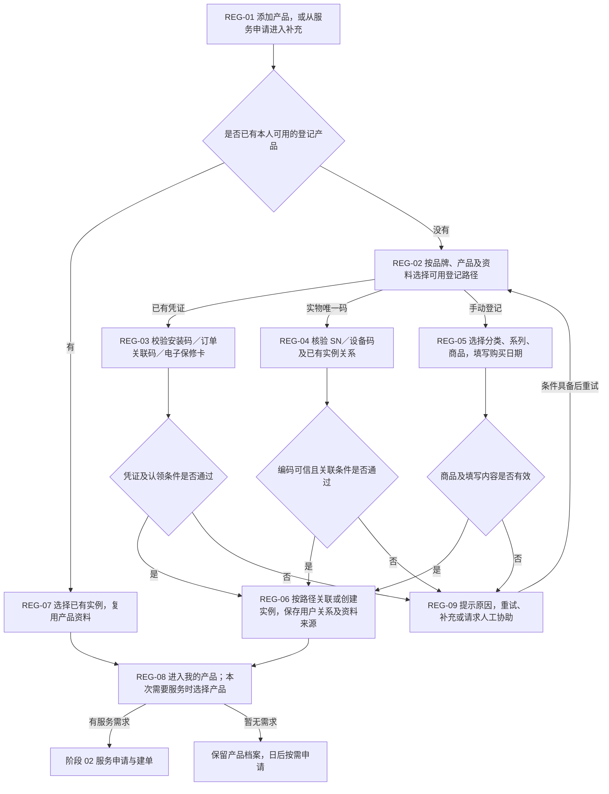

# 01 · 商品注册与绑定

更新日期：2026-09-12 · v0.2 讨论稿 · 节点前缀 REG

[总览](00-售后全流程总览.md) · [下一阶段：服务申请与建单](02-服务申请与建单.md) · [完整注册绑定规则](../02-技术设计/08-商品注册绑定与服务资格核验.md)

## 范围与依据

- **输入：**当前用户、待添加商品，以及可用的安装码／订单等凭证、实物唯一编码或手动填写资料。
- **输出：**用户可使用的产品实例及关系、资料来源与核实情况，供本次或日后申请服务。
- **责任端：**消费者小程序负责选择、填写和核对，后端校验并保存关系；门店／客服代办须按权限及授权规则处理。
- **依据：**[商品注册与绑定逻辑及流程](../02-技术设计/08-商品注册绑定与服务资格核验.md) CR-20260912-01，关联 CAPP-003／004／005／012。本页展示全项目中的阶段流程，字段、认领及核验细则继续在专文维护。

注册绑定是完整业务链的第一阶段，但不是每次申请售后都必须重复的步骤。已登记产品可以直接选择后建单；首次登记可以先保存产品，等日后有需求再发起服务。若用户先发起服务但没有产品资料，则从建单阶段进入这里补充，完成后返回原需求。

## 流程图

## 节点与交接

| 节点 | 由谁执行／执行什么 | 结果与边界 |
| --- | --- | --- |
| REG-01 | 消费者添加产品，或由有权限人员协助；从申请进入时保留原上下文 | 不要求所有用户先办理安装；纯登记不自动创建服务工单 |
| REG-02 | 按适用品牌、产品及可取得资料展示登记路径 | 三条路径是业务能力，不强制所有品牌显示同一个三选一页面 |
| REG-03 | 后端校验凭证来源、关联购买／产品范围及认领条件 | 复用已有实例；只有可信购买明细时按规则创建。凭证可来自本系统或外部系统，不预设一码一件 |
| REG-04 | 后端校验逐件唯一编码，查找实例及归属 | 关联已有实例或按规则建档；普通型号条码仅辅助选型，不能视为唯一实物码 |
| REG-05 | 用户选商品、填写日期等必要资料，后端做基础校验 | 没有系列的商品不强制经过系列；创建的是用户申报档案，不代表购买真实已核实 |
| REG-06 | 后端保存实例、用户关系、申报及核实资料来源 | 已有记录按规则复用；手动登记创建新实例并可生成登记码。编号唯一不证明实物唯一，冲突不能静默合并 |
| REG-07 | 用户选择已有产品，后端校验可使用范围 | 再次服务沿用原实例和历史，不因新申请重复登记产品 |
| REG-08 | 小程序展示已登记产品，用户决定是否申请服务 | 传给建单的是实例和可复用资料，不能把登记成功传成免费服务资格通过 |
| REG-09 | 用户修正或联系有权限人员核对 | 失效凭证、未知编码、归属冲突、资料缺失都有恢复入口；不能通过切换手动登记绕过原凭证权益限制 |

## 手动登记后的购买核实与服务衔接

手动填写日期不默认自动匹配门店购买记录。具备可信数据及足够关联依据时，可以核对购买记录并补充原实例；只有型号与日期时不能自动证明购买真实，匹配不到也不等于没有购买。详细条件见[注册绑定专文第 4 节](../02-技术设计/08-商品注册绑定与服务资格核验.md)。

本阶段把“哪个用户登记了哪个型号的一件产品、有哪些可用资料”交给建单阶段。后续申请免费安装、保修等时，由[阶段 03 受理与资格核验](03-受理与服务资格核验.md)判断当次服务条件，必要时后台人工核验，现场事项交履约阶段。登记事实、购买核实和本次权益结果分别表达。

## TOTO 如何进入这张图

| 用户确认的旧 TOTO 路径 | 本图对应 | 保留的边界 |
| --- | --- | --- |
| 智能坐便系列使用购买短信中的免费安装码 | REG-02 → REG-03 → REG-06 | 保留安装码入口；来源、一码对应范围、找回及认领规则待核实 |
| 其他产品选择分类、系列、产品及购买日期 | REG-02 → REG-05 → REG-06 | 保留简便手动登记；申报不直接获得免费服务权益 |

## 待确认与检查

- 待确认项统一沿用 CR-20260912-01：凭证来源与粒度、用户认领权限、SN 可信来源、必填资料、重复实例处理及权益依据，不在本页另建台账。
- 设计检查覆盖三条登记成功路径、错误／失效凭证、归属冲突、已有产品复用、登记后暂不申请、建单时补登记后返回，以及同型号多件产品。
- 图文是讨论稿，未代表真实绑定接口、订单匹配或服务资格自动核验已完成。
