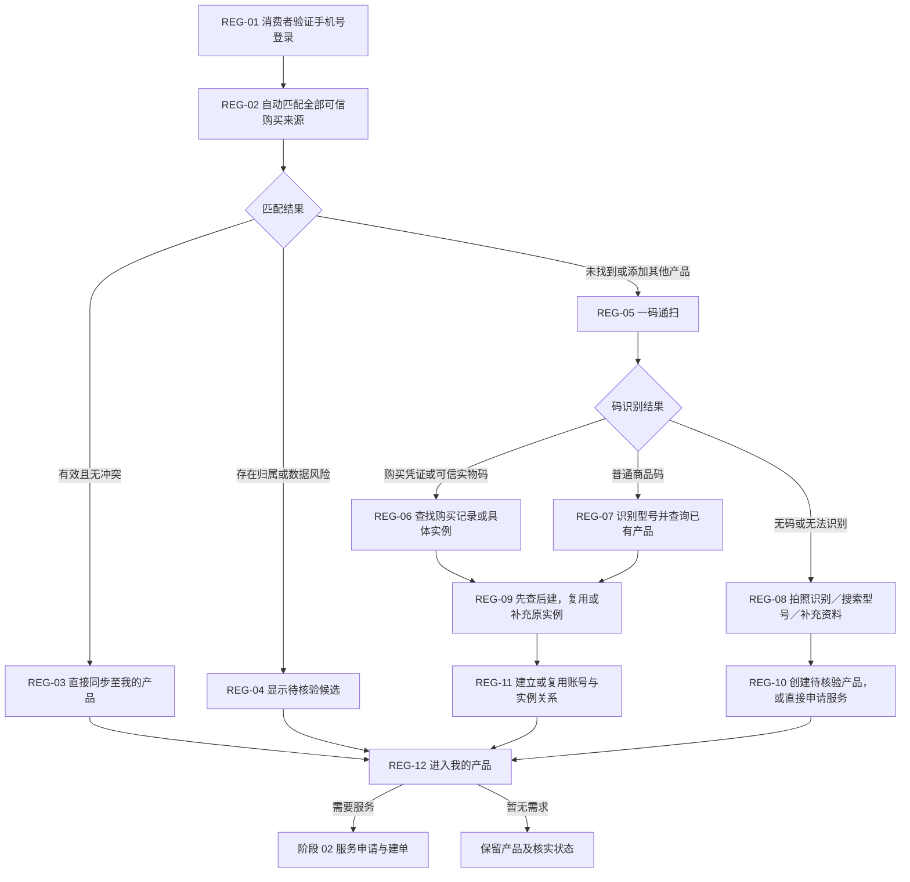

# 01 · 商品注册与绑定

更新日期：2026-09-14 · v0.3 · 节点前缀 REG

[总览](00-售后全流程总览.md) · [下一阶段：服务申请与建单](02-服务申请与建单.md) · [三种绑定方式](../02-技术设计/14-消费者产品自动关联与智能认领方案.md) · [注册与资格完整边界](../02-技术设计/08-商品注册绑定与服务资格核验.md)

## 范围与结论

- **输入：**已验证消费者手机号，以及可取得的购买记录、产品／溯源码、铭牌、凭证或商品资料。
- **输出：**消费者账号与产品实例关系、资料来源和核实状态，供本次或日后申请服务。
- **责任端：**消费者小程序负责登录、扫码和必要补充；后端自动匹配、识别、查重并保存；冲突由有权限人员核对。
- **依据：**CR-20260914-01，关联 CAPP-003／004／005／012；核心采用三种方式：手机号自动同步、一码通扫、无码产品辅助添加。

绑定产品不是申请售后的强制前置。已有产品可以直接复用；无法确认具体产品时，也可按适用规则先提交服务需求，后续在受理或现场补充。

## 流程图



## 节点边界

| 节点 | 主要规则 |
| --- | --- |
| REG-01～03 | 手机号是登录和购买匹配标识；正式关系保存为稳定消费者账号 ID 与产品实例 ID。可信有效订单直接同步，不要求短信认领 |
| REG-04 | 家庭共用手机号、购买人与使用人不同、历史异常或已有归属冲突时只展示脱敏候选，不自动授予排他归属或免费权益 |
| REG-05～07 | 用户只使用统一扫码入口；后端识别安装码、订单码、SN、溯源码或商品码。普通商品码只能识别型号，不能证明具体实物 |
| REG-08～10 | 无码产品优先用铭牌／凭证识别，最后才手动搜索；新增实例标记为用户自报、实物待核验，不自动产生权益 |
| REG-09～11 | 所有方式先查购买、标识和账号已有产品；同一关系、可信标识及外部购买明细防重，能复用时补充原实例 |
| REG-12 | 产品展示、实物核验、购买事实和本次服务权益分别表达；出现在“我的产品”不等于免费服务资格通过 |

## 同型号无码产品

用户可以声明“另一件相同型号产品”，以支持真实购买多件同款，但新实例保持待核验并记录疑似重复关系。活动工单检查应覆盖疑似重复实例；确认同一实物时合并关系和服务历史，确认确为两件时再分别标记。详细规则见[自动关联与智能认领方案第 7 节](../02-技术设计/14-消费者产品自动关联与智能认领方案.md#7-同型号无码产品的重复处理)。

## 当前已实现的手动分支

```text
消费者手选一件商品并填写购买资料
→ 统一购买记录新增 USER_REPORTED / PENDING
→ 建立本人账号与待核验产品实例关系，安装码为空
→ 后台核验岗位人工核验、关联正式购买、标冲突或驳回
→ 人工核验通过：保留原来源，记录转 VERIFIED / ACTIVE
→ 关联正式购买：关系迁移到正式实例，原申报转 MERGED
```

该分支“提交即进入购买记录”，不要求先存到另一张待处理表；但服务受理和预约只接收 `VERIFIED + ACTIVE`，服务资格仍由当次规则单独判断。当前已实现后端与 Web 核验能力；消费者小程序本次不实施，消费者身份与 API 权限、共享数据库迁移尚未完成。

## TOTO 场景

| 场景 | 对应方式 |
| --- | --- |
| 门店、官方商城或电商订单已同步且有有效手机号 | 手机号登录后自动同步 |
| 订单未同步但有安装码、SN、设备码或逐件溯源码 | 一码通扫智能添加 |
| 只有普通商品码 | 扫码识别型号，再匹配已有产品或转辅助添加 |
| 旧产品、无码、标签损坏或历史数据未接入 | 无码产品辅助添加 |

安装码真实来源、一码粒度、购买人与使用人规则、订单接入范围及服务权益依据仍待对应功能 Spec 明确。本文描述目标流程，不代表消费者身份、订单同步、扫码识别或实例合并已经实现。
