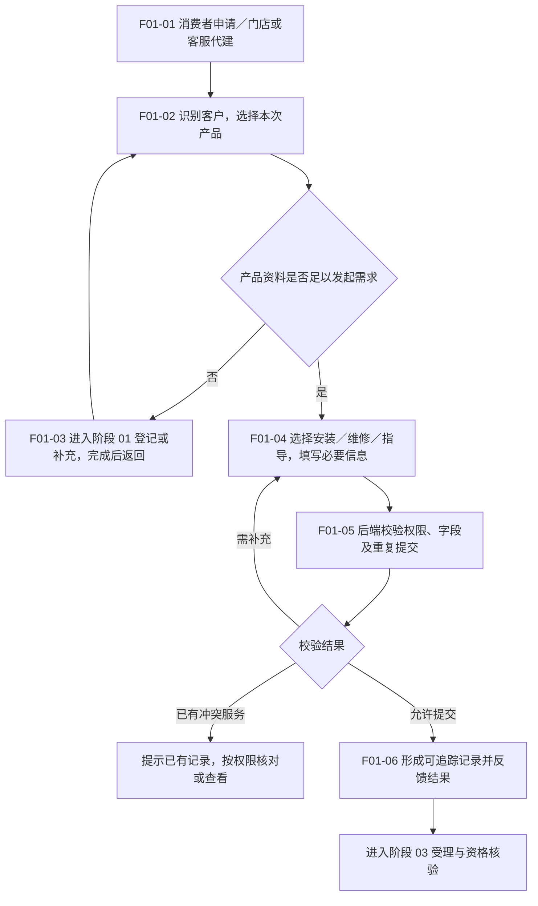

# 02 · 服务申请与建单

更新日期：2026-09-12 · v0.1 讨论稿 · 节点前缀 F01

[总览](00-售后全流程总览.md) · [上一阶段：商品注册与绑定](01-商品注册与绑定.md) · [下一阶段：受理与核验](03-受理与服务资格核验.md)

## 范围与依据

- **输入：**一次服务需求、发起人及可用客户／产品资料；不要求每次重新登记产品。
- **输出：**能够追踪的本次需求及来源、产品关系、服务类型和必要资料，交受理处理。
- **责任端：**消费者小程序、门店／客服 Web 后台；外部渠道自动接入需要接口契约。
- **依据：**[核心流程](../01-功能需求/03-核心业务流程与状态机.md)安装、维修及指导流程；[后台需求](../01-功能需求/04-统一管理后台需求.md) CS-001～003；[受理首版 Spec](../specs/2026-09-10-服务受理与代客建单全栈首版.md)。需求方向与真实接口能力分开看。

## 流程图

## 节点与交接

| 节点 | 由谁执行／执行什么 | 结果与边界 |
| --- | --- | --- |
| F01-01 | 发起人选择入口；系统限制允许的服务类型 | 保留消费者、自助、门店代办、客服代办及外部来源信息；各入口不默认开放全部类型 |
| F01-02 | 发起人选产品，系统校验可见及关联范围 | 本次工单产品明确；商品型号不能代替实例归属核验 |
| F01-03 | 消费者或有权限人员进入[阶段 01](01-商品注册与绑定.md)登记／补充 | 保留本次需求，登记完成后返回选产品；新顾客代建及授权规则待契约，不假定当前后台已支持 |
| F01-04 | 填写服务方式、问题、联系人、期望时间及适用地址／凭证 | 维修和指导说明问题；远程指导不机械要求上门资料；具体字段由服务类型确定 |
| F01-05 | 后端校验权限、数据范围、必填项、幂等和活动服务冲突 | 重试不多建单；重复限制按已确认策略，不复制当前代码中的未核实规则 |
| F01-06 | 系统保存来源与产品关系并展示受理结果 | 已提交不等于免费资格通过、已派单或已确认预约 |

## 讨论边界与待确认

- **建单时点待确认：**业务可以先记录申请再核验，也可创建待受理工单承载核验。现有受理 Spec 描述建单为 `PENDING_ACCEPTANCE`，只用于说明实施时点，不能据此推断新的资格核验已实现。本稿不要求一定新建“申请单”表。
- **入口范围：**Q-002，尤其消费者直接申请安装的范围；本次用户以安装核验举例，不自动替代正式入口确认。
- **重复策略：**需统一同实例、同服务类型和不同服务类型并行的规则；现状差异见[安装码说明](../specs/2026-09-12-安装码管理恢复与标识关系核查.md#implementation-details)。
- **登记前置：**[注册绑定专文](../02-技术设计/08-商品注册绑定与服务资格核验.md) CR-20260912-01；手动申报不能直接认定购买真实。

本阶段检查：正常提交、缺资料、重复提交、已有活动服务、无登记产品及他人产品均有明确去向；这是设计评审项，非已通过测试。
