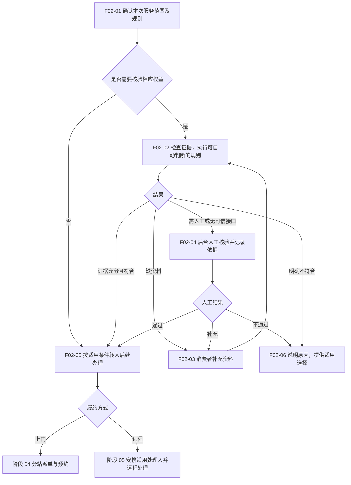

# 03 · 受理与服务资格核验

更新日期：2026-09-12 · v0.1 讨论稿 · 节点前缀 F02

[总览](00-售后全流程总览.md) · [上一阶段：建单](02-服务申请与建单.md) · [下一阶段：调度预约](04-分站派单与预约.md)

## 范围与依据

- **输入：**可追踪的服务需求、所选实例、用户申报及已有凭证。
- **输出：**受理去向、本阶段资格结论和待现场核实事项；不足时进入补资料或人工核验。
- **责任端：**后端执行确定规则，小程序补资料，Web 客服／有权限服务站核对；现场事项交阶段 05。
- **依据：**[注册与绑定逻辑第 4、5 节](../02-技术设计/08-商品注册绑定与服务资格核验.md) CR-20260912-01。本阶段是本次讨论建议，现有服务受理接口不代表该核验链路已实现。

详细证据要求、购买记录匹配和结果留存只在上述专文维护；本页专门说明全流程中的责任和交接。

## 流程图

## 节点与交接

| 节点 | 执行责任 | 输出与限制 |
| --- | --- | --- |
| F02-01 | 后端／受理人员 | 分开判断能否提供服务、是否免费、是否需现场检测；不能用一个审核结果代表所有事实 |
| F02-02 | 后端 | 有可信记录才自动核验；自填日期、上传凭证或订单模糊命中不等于通过；规则细节见专文 |
| F02-03 | 消费者小程序 | 显示具体缺项，补充后继续原申请，不重复登记产品或建单 |
| F02-04 | Web 服务受理／工单详情中的建议操作 | 客服／授权服务站查看原始依据和冲突项，记录通过、补充或不通过及原因；页面与操作权限待实施 |
| F02-05 | 后端／受理人员 | 输出可安排的服务条件，保留“故障保修范围待检测”等未完成事项，传递给执行人 |
| F02-06 | 后端反馈、受理人员解释 | 不符合免费权益不代表删除档案；其他服务或费用方案需适用且由用户选择，不自动转收费 |

## 待确认与检查

- 规则来源、核验岗位、允许动作和留痕沿用 CR-20260912-01；不能把本图直接部署为已批准的审批规则。
- 首期无可信接口时，相关免费服务资格由人工按证据标准核验；不可用的接口不能直接造成通过或认定未购买。
- 核验结果属于本次申请；已核实购买或实物事实补充原档案，下一次申请仍需判断当次期限和权益状态。
- 检查普通指导、有效凭证、证据不足、接口不可用、人工拒绝及待现场检测六种去向；业务规则尚待评审。
