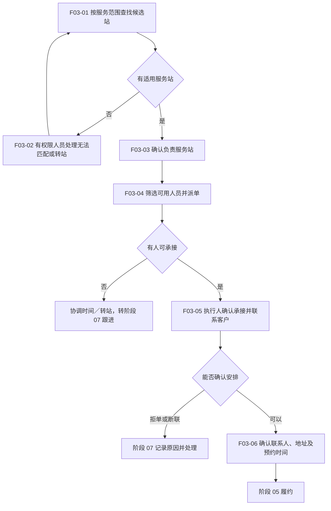

# 04 · 分站派单与预约

更新日期：2026-09-12 · v0.1 讨论稿 · 节点前缀 F03

[总览](00-售后全流程总览.md) · [上一阶段：受理核验](03-受理与服务资格核验.md) · [下一阶段：履约](05-服务履约与完工提交.md)

## 范围与依据

- **输入：**可安排的上门服务需求、地址、产品、服务类型、期望时间和核验待办。
- **输出：**负责服务站、执行人员、沟通记录和确认预约。
- **责任端：**Web 后台分站及派单；服务人员端接单联系；消费者确认安排。精确权限待确认。
- **依据：**[后台需求](../01-功能需求/04-统一管理后台需求.md) CS-004／005／007、STA-003／004；[派单 Spec](../specs/2026-09-10-派单异常与完工审核全栈首版.md)。Spec 中已有基础切片不等于所有调度和师傅端链路已验收。

## 流程图

## 节点与交接

| 节点 | 责任与动作 | 交接结果 |
| --- | --- | --- |
| F03-01 | 系统按已确认服务区域与能力形成候选 | 推荐不是直接完成分配；区域重叠和边界规则待确认 |
| F03-02 | 授权客服／调度人员协调 | 无匹配、转站或人工覆盖有原因；不能强制分给不具备资格的组织；确无承接方案时按阶段 07 处理 |
| F03-03 | 后台确认负责组织 | 明确当前哪个站负责；站点接收动作及是否必经待确认 |
| F03-04 | 有权限的调度人员筛选和派单 | 校验人员归属、技能、可用性及容量，保留派单／改派历史 |
| F03-05 | 服务人员确认并联系客户 | 接单、拒单与确认预约分别留痕；不把派单等同于已经联系成功 |
| F03-06 | 执行人与客户确认 | 区分用户期望时间和双方确认时间，带上资格核验中待现场处理的事项 |

## 待确认与检查

- Q-003：总部、客服和服务站具体派单权限，是否有抢单／发布／接单独立步骤；本图不强制所有模式共用发布步骤。
- Q-005：区域规则与冲突处理；地址变化后是否重新路由及如何重新确认预约。
- 远程指导可以由客服或合适人员处理，不强制走上门分站、签到等动作；其分配方式见下一阶段。
- 检查无站、无人、拒单、改派、断联与正常预约；失败须有负责跟进者，不能消失在队列中。
