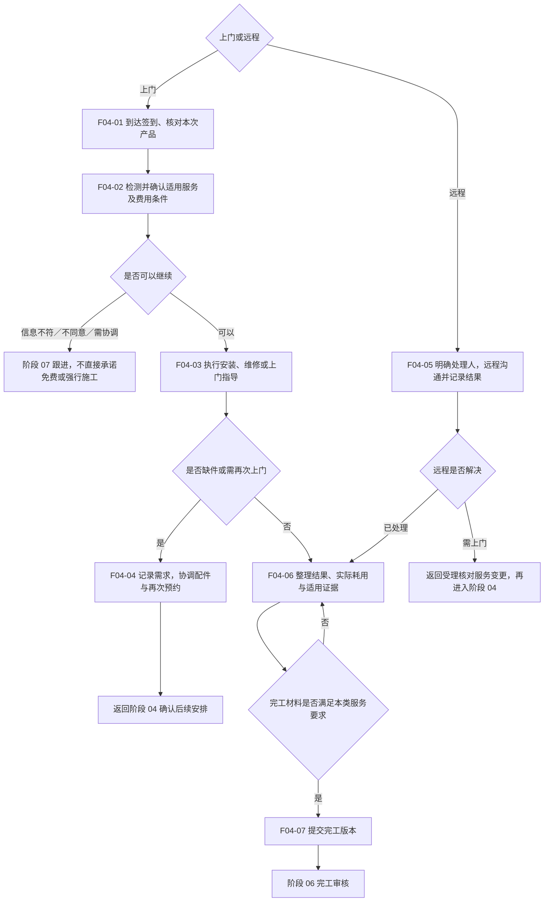

# 05 · 服务履约与完工提交

更新日期：2026-09-12 · v0.1 讨论稿 · 节点前缀 F04

[总览](00-售后全流程总览.md) · [上一阶段：调度预约](04-分站派单与预约.md) · [下一阶段：审核办结](06-完工审核与回访关闭.md)

## 范围与依据

- **输入：**上门任务与确认预约，或受理后可远程处理的指导需求；均带产品及适用核验事项。
- **输出：**实际处理结果、适用产品核验／配件记录、客户确认及可审核提交版本。
- **责任端：**服务人员端执行现场服务，客服／适用处理人员记录远程结果；Web 协调异常和权限内决定。
- **依据：**[核心流程](../01-功能需求/03-核心业务流程与状态机.md)安装／维修／指导；[服务人员需求](../01-功能需求/07-服务人员小程序需求.md) WAPP-008～011、013～018；[完工提交 Spec](../specs/2026-09-10-派单异常与完工审核全栈首版.md)。

## 流程图

## 节点与交接

| 节点 | 处理内容 | 输出与边界 |
| --- | --- | --- |
| F04-01 | 按适用要求签到，核对型号、铭牌／SN 或其他产品依据 | 定位拒绝、无码或无法识别有人工说明；普通商品条码不自动证明唯一实物 |
| F04-02 | 完成现场检测、反馈保修待确认项，按权限确认方案和费用 | 购买资料已核实不代表所有故障免费；涉及费用按确认流程取得用户同意 |
| F04-03 | 执行对应服务并记录过程 | 安装、维修、指导有各自完成标准；不能复制所有字段为统一必填 |
| F04-04 | 记录缺件、领用或到件需求并重新联系 | 领料、库存转移和工单实际耗用分开；多次上门与原工单如何关联需定规则 |
| F04-05 | 为远程需求明确有权限处理人，记录沟通及解决结果 | 无需虚构上门签到或现场码；转上门的改类型／新建策略待确认 |
| F04-06 | 整理结果、照片、客户确认及适用配件信息 | 必填项按服务类型确认；未解决不能直接记录为已解决 |
| F04-07 | 后端校验并保存本次提交版本 | 提交完工不等于审核通过；被退回后形成新的提交版本 |

## 待确认与检查

- Q-006／Q-SS-06：各服务类型照片、签名、扫码例外及完工标准；不将现有 Spec 的统一材料要求当作最终全业务标准。
- Q-007／Q-SS-07：费用确认、配件审批与耗用联动、退料及财务边界。
- 需确认现场资格判断与费用最终授权人；工单产品信息错误时如何纠正，不允许静默换成另一件产品。
- 检查安装成功、维修缺件后二次上门、远程解决、远程转上门、客户不同意方案、材料缺失和审核退回重提。
