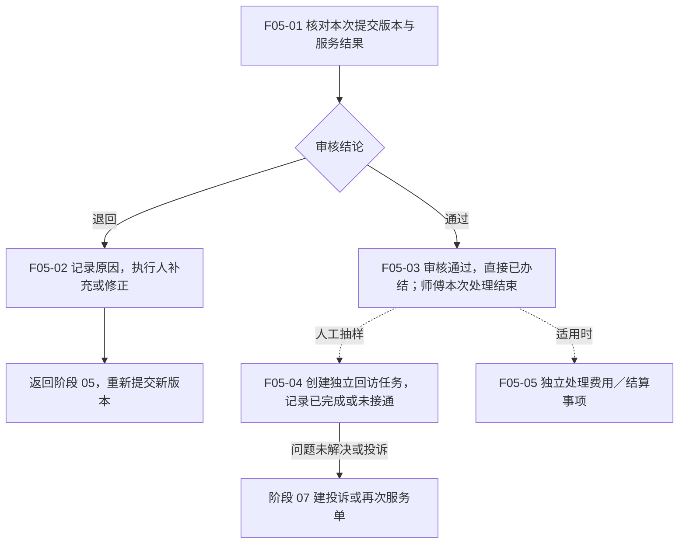

# 06 · 完工审核与抽样回访

更新日期：2026-09-24 · v0.3（审核通过直接办结、回访独立抽样） · 节点前缀 F05

[总览](00-售后全流程总览.md) · [上一阶段：履约提交](05-服务履约与完工提交.md) · [异常与再次服务](07-异常取消与再次服务.md)

## 范围与依据

- **输入：**完工提交版本、服务结果、适用客户确认及配件等证据。
- **输出：**审核结论、办结记录、可选的抽样回访结果和可追溯服务历史。
- **责任端：**Web 授权审核／客服人员、消费者小程序评价、服务人员端仅在审核退回时补充材料；精确岗位权限待确认。
- **依据：**[后台需求](../01-功能需求/04-统一管理后台需求.md) CS-009／010／014、STA-005；[服务人员需求](../01-功能需求/07-服务人员小程序需求.md) WAPP-011／012；[审核首版 Spec](../specs/2026-09-10-派单异常与完工审核全栈首版.md)。

完整状态值、条件和责任见[服务工单状态机](../02-技术设计/13-服务工单状态机与单据状态说明.md)。

## 流程图

## 节点与交接

| 节点 | 执行责任与动作 | 输出与限制 |
| --- | --- | --- |
| F05-01 | 授权服务站／客服审核结果、产品、材料及适用配件记录 | 审核关联具体提交版本；不能改写执行人原始记录 |
| F05-02 | 审核人说明问题，执行人补充修正 | 保留原材料和退回原因，新材料重新提交；不直接覆盖被退回版本 |
| F05-03 | 后端保存通过结论和办结历史 | 直接进入已办结，无需师傅再次交单；抽样回访与结算分别处理 |
| F05-04 | 有权限客服从已办结工单人工抽样并办理 | 单工单至多一条回访任务；已完成需记录满意度与内容，未接通不伪造评价；不改变工单状态 |
| F05-05 | 适用后台责任人处理财务事项 | 复用已审核材料；费用范围仍待确认，不增加师傅二次提交或全部工单的办结前置 |

## 未定档部分须保留在图上

- **Q-004：**默认二次交单已取消，审核通过直接办结；抽样回访不阻塞办结。剩余为审核岗位、旧待交单数据核对及未来确有必要的纸质原件移交，不再作为全部工单的必经节点。
- **Q-006 及回访规则：**多级审核、抽样比例、联系次数、消费者自发评价与回访评价合并策略待确认；未接通可结束本次抽样任务，不阻塞已办结工单。
- **Q-007：**收费、支付、退款及结算是否进入首期、发生在何时仍待确认；现阶段不把结算画成全部工单的必经末站。
- **终态口径：**审核通过形成正常终态 `CLOSED`（已办结），取消形成 `CANCELLED`；后续问题建立投诉或再次服务单，见阶段 07。

设计检查包括一次通过、退回重提、审核通过后无二次提交、回访未接通、未抽中、投诉未解决和正常办结。端到端业务验收仍需真实岗位与实际订单验证。
