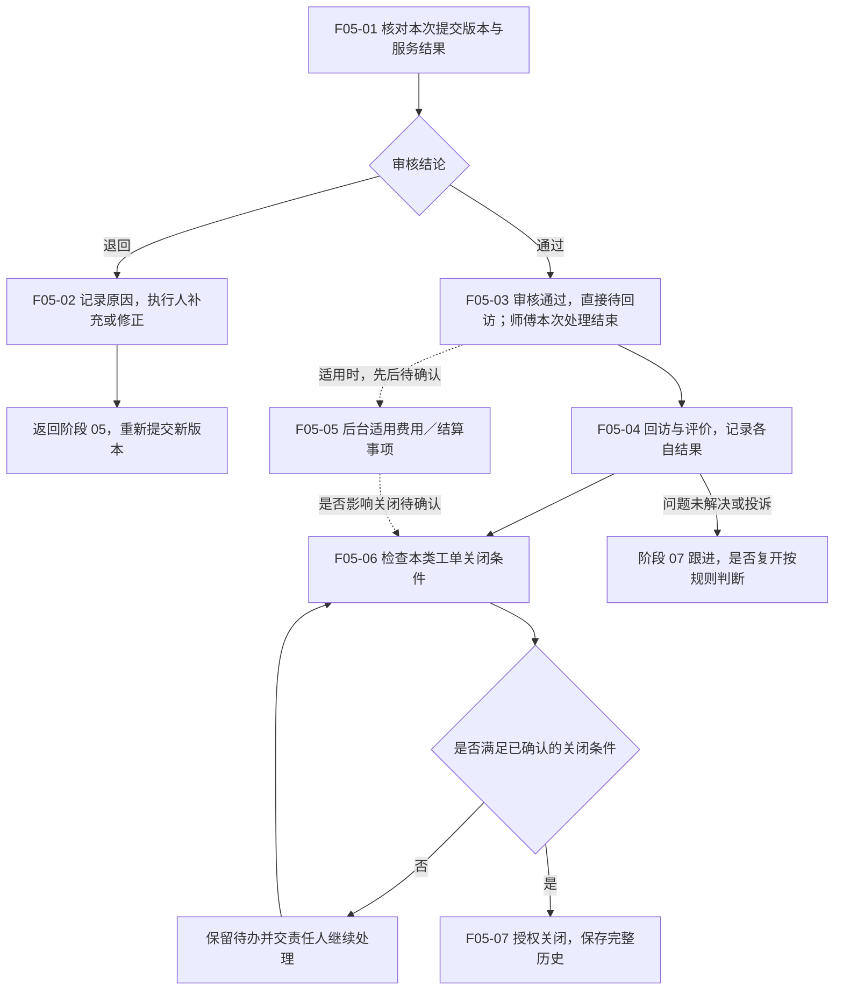

# 06 · 完工审核与回访关闭

更新日期：2026-09-13 · v0.2（取消默认二次交单已确认，其余待定事项仍为讨论稿） · 节点前缀 F05

[总览](00-售后全流程总览.md) · [上一阶段：履约提交](05-服务履约与完工提交.md) · [异常与再次服务](07-异常取消与再次服务.md)

## 范围与依据

- **输入：**完工提交版本、服务结果、适用客户确认及配件等证据。
- **输出：**审核结论、后续反馈结果、关闭依据和可追溯服务历史。
- **责任端：**Web 授权审核／客服人员、消费者小程序评价、服务人员端仅在审核退回时补充材料；精确岗位权限待确认。
- **依据：**[后台需求](../01-功能需求/04-统一管理后台需求.md) CS-009／010／014、STA-005；[服务人员需求](../01-功能需求/07-服务人员小程序需求.md) WAPP-011／012；[审核首版 Spec](../specs/2026-09-10-派单异常与完工审核全栈首版.md)。

完整状态值、条件和责任见[服务工单状态机](../02-技术设计/13-服务工单状态机与单据状态说明.md)。

## 流程图

## 节点与交接

| 节点 | 执行责任与动作 | 输出与限制 |
| --- | --- | --- |
| F05-01 | 授权服务站／客服审核结果、产品、材料及适用配件记录 | 审核关联具体提交版本；不能改写执行人原始记录 |
| F05-02 | 审核人说明问题，执行人补充修正 | 保留原材料和退回原因，新材料重新提交；不直接覆盖被退回版本 |
| F05-03 | 后端保存通过结论和后续待办 | 直接进入待回访，无需师傅再次交单；回访、结算和关闭仍分别处理 |
| F05-04 | 客服回访，消费者或有效授权人评价 | 回访是主动确认结果，评价是用户反馈，两者不互相替代；未接通／未评价如何结束待确认 |
| F05-05 | 适用后台责任人处理财务事项 | 复用已审核材料；费用范围及与回访先后仍待确认，不增加师傅二次提交 |
| F05-06 | 授权人员或已确认系统规则检查 | 明确必须完成的事项、未解决异常及允许例外；图不是自动关闭授权 |
| F05-07 | 后端按权限和规则关闭并留痕 | 历史继续关联原产品；后续新需求按规则新建服务，不能删除原单 |

## 未定档部分须保留在图上

- **Q-004：**默认二次交单已取消，审核通过直接待回访；剩余为审核岗位、旧待交单数据核对及未来确有必要的纸质原件移交，不再作为全部工单的必经节点。
- **Q-006 及回访规则：**是否多级审核、回访未接通、消费者未评价时能否关闭；关闭需要哪种确认。
- **Q-007：**收费、支付、退款及结算是否进入首期，发生在何时，是否为关闭前置。现阶段不把结算画成已确认必经末站。
- **终态口径：**正常关闭、取消、审核通过分别表达；哪些反馈导致复开或新单见阶段 07。

设计检查包括一次通过、退回重提、审核通过后无二次提交、回访未接通、未评价、投诉未解决和正常关闭。完整业务闭环仍待规则与验收确认，不能因图已连通就宣称系统已闭环。
