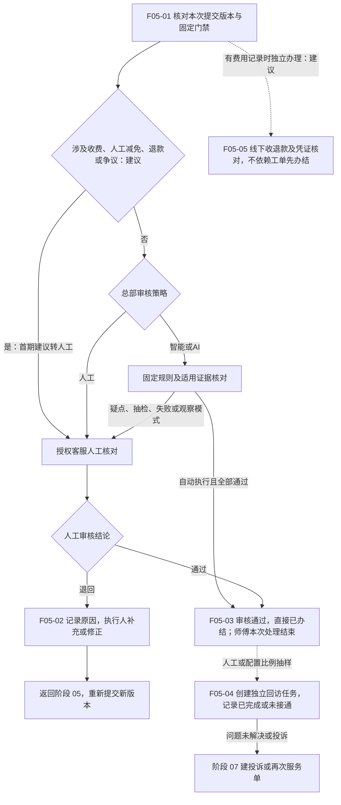

# 06 · 完工审核与抽样回访

更新日期：2026-10-03 · v0.5（增加收费审核建议，回访与收款独立）· 节点前缀 F05

[总览](00-售后全流程总览.md) · [上一阶段：履约提交](05-服务履约与完工提交.md) · [异常与再次服务](07-异常取消与再次服务.md)

## 范围与依据

- **输入：**完工提交版本、服务结果、适用客户确认及配件等证据。
- **输出：**审核结论、办结记录、可选的抽样回访结果和可追溯服务历史。
- **责任端：**Web 授权审核／客服人员、消费者小程序评价、服务人员端仅在审核退回时补充材料；策略由总部维护，人工处理限已获审核授权客服岗；服务站仅配合补资料。
- **依据：**[后台需求](../01-功能需求/04-统一管理后台需求.md) CS-009／010／014、STA-005；[服务人员需求](../01-功能需求/07-服务人员小程序需求.md) WAPP-011／012；[审核首版 Spec](../specs/2026-09-10-派单异常与完工审核全栈首版.md)。

完整状态值、条件和责任见[服务工单状态机](../02-技术设计/13-服务工单状态机与单据状态说明.md)。

## 流程图

人工／智能／AI审核及通过直接办结是现有契约；下图的收费风险判断为待确认扩展，实施时需同时补后端固定门禁，不能只由前端控制。全免费模式继续采用现有审核策略。

```mermaid
flowchart TD
    F05_01[F05-01 核对本次提交版本与固定门禁] --> FEE{涉及收费、人工减免、退款或争议：建议}
    FEE -->|否| MODE{总部审核策略}
    FEE -->|是：首期建议转人工| HUMAN
    MODE -->|人工| HUMAN[授权客服人工核对]
    MODE -->|智能或AI| AUTO[固定规则及适用证据核对]
    AUTO -->|疑点、抽检、失败或观察模式| HUMAN
    AUTO -->|自动执行且全部通过| F05_03
    HUMAN --> A{人工审核结论}
    A -->|退回| F05_02[F05-02 记录原因，执行人补充或修正]
    F05_02 --> RETURN[返回阶段 05，重新提交新版本]
    A -->|通过| F05_03[F05-03 审核通过，直接已办结；师傅本次处理结束]
    F05_03 -. 人工或配置比例抽样 .-> F05_04[F05-04 创建独立回访任务，记录已完成或未接通]
    F05_01 -. 有费用记录时独立办理：建议 .-> F05_05[F05-05 线下收退款及凭证核对，不依赖工单先办结]
    F05_04 -->|问题未解决或投诉| EX[阶段 07 建投诉或再次服务单]
```

## 节点与交接

| 节点 | 执行责任与动作 | 输出与限制 |
| --- | --- | --- |
| F05-01 | 授权客服或系统按策略审核结果、产品、材料及适用配件记录 | 审核关联具体提交版本；不能改写执行人原始记录 |
| F05-02 | 审核人说明问题，执行人补充修正 | 保留原材料和退回原因，新材料重新提交；不直接覆盖被退回版本 |
| F05-03 | 后端保存通过结论和办结历史 | 直接进入已办结，无需师傅再次交单；抽样回访与结算分别处理 |
| F05-04 | 自动通过按配置比例抽样，或有权限客服人工抽样并办理 | 单工单至多一条回访任务；已完成需记录满意度与内容，未接通不伪造评价；不改变工单状态 |
| F05-05 | 适用后台责任人处理线下费用记录，具体权限待确认 | 收退款可在实际发生时登记，不必等工单办结；有后付授权时保留未收待办，不增加师傅二次交单或全部工单付清前置；见费用专题 |

## 与费用专题的交接（讨论建议）

详见[费用确认与线下收款](08-费用确认与线下收款.md)。收费单关联报价及最终费用版本，由授权人工核对收费依据、客户同意、耗用及异常；当前智能／AI审核没有财务核验能力，首期不自动通过涉及收费、人工减免、退款或费用争议的单据。全免费模式不增加财务审批步骤，免费但使用配件的单据仍遵守现有配件转人工门禁。

服务办结与收款完成独立：保留审核通过直接 `CLOSED`，收款未齐不能被写成已收齐；允许后付及其办结条件须业务确认。收费确认缺失或有争议进入人工处理，不得自动办结。消费者现有三阶段进度保留，费用情况在详情独立展示。

## 未定档部分须保留在图上

- **Q-004：**默认二次交单已取消，审核通过直接办结；抽样回访不阻塞办结。剩余为审核岗位、旧待交单数据核对及未来确有必要的纸质原件移交，不再作为全部工单的必经节点。
- **Q-006 及回访规则：**自动审核抽检和办结后回访抽样已支持总部配置（见[审核契约](../specs/2026-10-01-完工智能与AI审核.md)）；多级审核、联系次数、消费者自发评价与回访评价合并策略待确认；未接通可结束本次抽样任务，不阻塞已办结工单。
- **Q-007：**2026-10-03 已明确本次首期收费方案仅考虑线下收费；默认免费、开关、报价、收退款权限及后付等仍是讨论建议，服务商结算另待确认。不把费用处理画成全部工单必经末站。
- **终态口径：**审核通过形成正常终态 `CLOSED`（已办结），取消形成 `CANCELLED`；后续问题建立投诉或再次服务单，见阶段 07。

设计检查包括一次通过、退回重提、审核通过后无二次提交、回访未接通、未抽中、投诉未解决和正常办结。端到端业务验收仍需真实岗位与实际订单验证。
