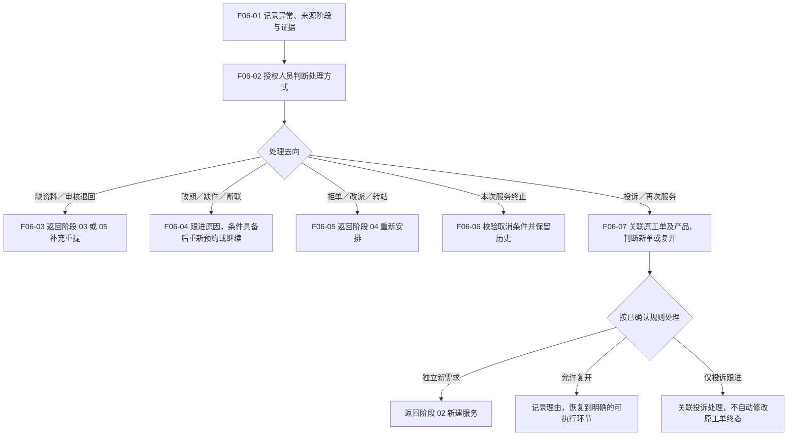

# 07 · 异常取消与再次服务

更新日期：2026-09-12 · v0.1 讨论稿 · 节点前缀 F06

[总览](00-售后全流程总览.md) · [建单](02-服务申请与建单.md) · [调度预约](04-分站派单与预约.md) · [审核关闭](06-完工审核与回访关闭.md)

## 范围与依据

- **输入：**任一阶段出现的异常及其关联申请／工单；关闭后的新需求或投诉。
- **输出：**明确的继续、重新分配、补资料、取消或再次服务去向，保留处理原因和历史。
- **责任端：**发现方记录，有权限人员决定后续动作，后端执行状态与关系校验；不提供任意改状态。
- **依据：**[核心流程与状态机](../01-功能需求/03-核心业务流程与状态机.md)、[后台需求](../01-功能需求/04-统一管理后台需求.md) CS-007／008／011／013、[异常 Spec](../specs/2026-09-10-派单异常与完工审核全栈首版.md)。

## 流程图

## 节点与回流条件

| 节点 | 处理要点 | 回流／结束条件 |
| --- | --- | --- |
| F06-01 | 记录原因、发生阶段、产品／工单、联系人及适用证据 | 明确谁跟进，不能只挂一个“异常”标签 |
| F06-02 | 检查权限、当前阶段、已有安排及允许动作 | 不能因异常名称相同就一律退回建单或回到任意状态 |
| F06-03 | 补资料与完工退回分别回对应阶段 | 补资料保留原申请；完工重提保留原版本 |
| F06-04 | 断联记录联系情况；缺件记录需求；改期重新沟通 | 条件具备才继续；超过何种时限升级或终止待确认 |
| F06-05 | 调整负责站点或执行人员，说明原因 | 重查权限与可用性，保留原分配历史，重新确认必要预约 |
| F06-06 | 按权限检查取消影响，记录原因 | 核对排班、产品预约占用、配件及适用费用等是否需后续处理；释放／回退规则待确认，不假定现实现已齐备 |
| F06-07 | 分开处理新需求、原问题延续及投诉 | 新需求通常新建并关联历史；复开须有明确目标阶段和资格，不默认关闭／取消都可直接恢复 |

## 与正常关闭的区别

- **取消：**本次服务不再继续，不代表履约完成。取消后能否重新申请、是否恢复安装占用或权益要分别核对。
- **正常关闭：**按本次办结条件结束，服务历史保留；不能因为存在历史关闭单就永久禁止同产品再次售后。
- **复开：**恢复既有工单执行，需要授权、原因、目标环节及资源复核；不能与“再建一张单”混为一谈。
- **投诉：**关联原服务但有独立处理过程；不自动等同退回、复开或退款。
- **退货：**购买及权益可能变化，保留原实例与服务历史，新的服务资格按确认规则判断。

## 待确认与检查

引用 Q-SS-04（取消恢复、状态组合）、Q-003（改派转站）、Q-007（费用与退款）及[风险清单](../03-开发管理/02-风险与待确认事项.md)中的断联、改期和评价规则。既有取消后重约及关闭终态的实现问题见[安装码使用说明第 3.5 节](../specs/2026-09-12-安装码管理恢复与标识关系核查.md#implementation-details)，不把缺陷当作业务限制。

检查每种异常是否有责任人、原因、下一步和结束条件；是否重复占用资源或重复授予权益；再次服务是否保留历史。具体阈值、权限和恢复状态尚待定档。
