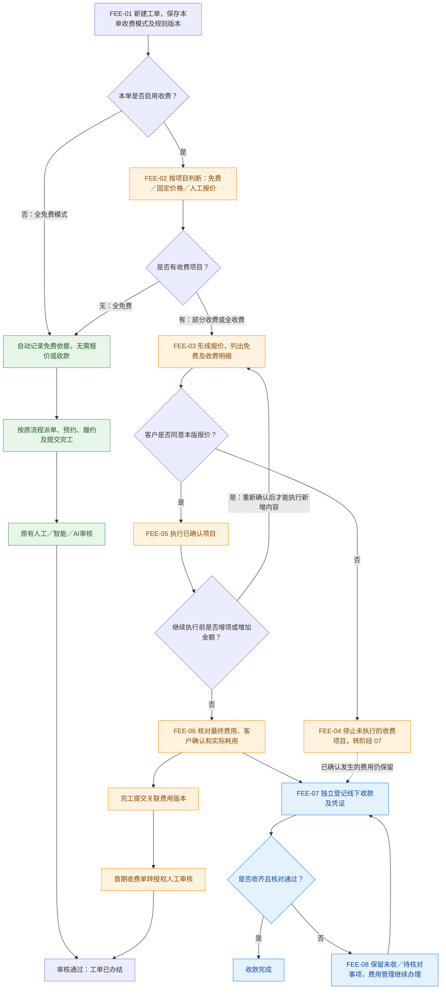

# 08 · 费用确认与线下收款（跨阶段专题）

更新日期：2026-10-03 · v0.2（核心操作已确认，收费细则待确认）· 节点前缀 FEE

[总览](00-售后全流程总览.md) · [建单](02-服务申请与建单.md) · [资格核验](03-受理与服务资格核验.md) · [预约](04-分站派单与预约.md) · [履约提交](05-服务履约与完工提交.md) · [审核办结](06-完工审核与回访关闭.md) · [异常取消](07-异常取消与再次服务.md)

## 1. 定位、来源与状态

**收费是在现有工单流程上的条件扩展。** 本页集中维护跨阶段的费用逻辑，不建立第二套收费工单，也不是七个阶段之后所有工单都必经的第八阶段。全免费、部分收费、全收费共用现有建单、派单、预约、履约、完工和审核办结主线。

| 项目 | 说明 |
| --- | --- |
| 关联事项 | Q-007（收费及结算范围）、Q-SS-06（完工费用确认）、Q-SS-07（配件价格与耗用）；开发计划承接既有 FS-025 的线下收费切片，不新增平行任务编号 |
| 来源 | 用户于 2026-10-03 提出增加收费场景，明确首期只考虑线下收费，并要求讨论全免费兼容模式、绘制流程图后保存到业务流程目录 |
| 已明确范围 | 首期仅线下收费；用户后续确认按本次逻辑编制开发计划：默认全免费兼容，师傅填明细、维修前记录客户口头同意、登记线下收款，消费者只读，客服／服务站正常作业无新增审批，收费单在原完工审核中人工核对 |
| 待确认细则 | 实际收费标准、条件及价格口径；配置／减免／退款／争议岗位与范围；收款主体及凭证；后付与取消费用规则。技术细化见唯一开发计划，尚未实施 |
| 应用与视角 | Web 管理后台（跨视角）、消费者小程序、服务人员小程序；关联 A18 工单、A21 完工审核、A25 服务结算占位、C07／C10／C11、W04；具体配置入口及操作权限待确认 |
| 优先级／负责人 | 实施优先级待确认；业务／财务及研发负责人待分配 |
| 当前状态 | 核心操作已确认，[线下收费开发计划](../specs/2026-10-03-服务工单线下收费开发计划.md)已形成，细则待确认；未开发、未执行业务验收，不改变入口及进度计数 |
| 文档验证标准 | 免费路径没有新增必办操作；报价发生在收费项目执行前；拒绝与增项有去向；服务办结与收款独立；配置变化不改写历史 |

## 2. 接入现有流程的位置

| 原阶段／节点 | 增加的费用能力（建议） | 全免费模式下的表现 |
| --- | --- | --- |
| 02 建单 · F01-06 | 保存本单收费模式与规则版本，记录已知费用或待检测事项 | 系统自动记录按全免费政策办理，不增加价格输入或客户费用确认 |
| 03 资格核验 · F02-01／05／06 | 分开判断服务资格、免费权益和收费依据；不符合免费权益时给出适用方案 | 不新增费用核验关卡；已有产品归属、服务范围及必要核验照常执行 |
| 04 预约 · F03-06 | 上门／检测本身收费时，发生费用前告知并取得确认；维修金额可留待检测 | 联系人与预约操作不变，无需确认报价 |
| 05 履约 · F04-02／03 | 检测后形成逐项报价，取得客户同意后执行；新增项目或涨价重新确认 | 继续按既有方案服务，不展示必填报价步骤 |
| 05 完工 · F04-06／07 | 核对最终明细、实际耗用及费用确认；完工版本关联费用版本，登记线下收款 | 仍按“服务处理 → 证据与确认 → 核对提交”办理，无收款必填项 |
| 06 审核 · F05-01／03／05 | 首期涉及收费、人工减免、退款或争议的单据转人工；费用待办独立办理 | 现有人工／智能／AI审核及通过后办结逻辑保持不变 |
| 07 异常 · F06-02／06／07 | 拒绝报价、取消、费用争议和退款关联原工单及已有收费记录 | 仍走现有异常流程，不凭空产生费用或退款 |

不恢复已退役的“服务受理”审批关卡，也不默认恢复已退役 A13“服务项目”菜单。建议在现有总部“服务配置”中维护收费标准，按确认范围将 A25 占位细化为费用管理；菜单、岗位和按钮正式变更另按项目规范实施。

## 3. 收费模式逻辑图

以下图的核心操作已纳入用户确认的开发计划，具体收费政策与权限仍待确认；节点表示业务步骤，不能直接作为新增工单状态。费用判断可随建单、预约和现场检测逐步完成；已知上门／检测费需先确认，不能以“检测后报价”为由先发生未经同意的费用。普通派单不要求先取得全部维修报价。

图保留既有审核通过路径；审核退回仍按阶段 06 返回阶段 05，重新形成提交版本。收费单资料不足、确认缺失或费用有争议时进入人工处理，不自动通过。收款可以在实际发生时登记，图中从最终核对分出收款链，不要求等工单办结才登记，也不表示必须收齐才能提交完工。允许后付及其办结授权仍须业务确认。

## 4. 模式与配置变化

| 模式／结果 | 判断与操作 |
| --- | --- |
| 全免费模式（建议默认） | 所有允许提供的本次服务项目按免费政策办理；后台自动记录政策依据，不增加报价、费用确认或收款操作；不绕过既有权限、产品归属、服务范围和库存规则 |
| 开启收费，但本单全免费 | 按规则确认所有项目免费，仍走原链路；不能把待检测、待核验或价格缺失当作自动免费 |
| 部分收费 | 免费项目和收费项目共存；例如基础安装免费、拆旧收费；应收由收费明细计算 |
| 全收费 | 本次实际服务项目均按确认报价收费；仍复用同一工单，不另设一套派单或完工状态 |

总开关只控制后续新业务。新工单保存收费模式与规则版本；需要检测的具体金额可稍后确定，不能因后续配置变化静默换政策。打开开关不把已有免费单变成收费单，关闭开关不删除已确认报价或收款，也不能让已有收费单失去办理入口。进行中费用确需调整时，由有权限人员明确变更并重新取得必要确认。历史无费用记录的单据保持“历史费用未记录”，不批量推定免费或已付款。

首期建议只支持免费、固定价格和人工报价，不提前建设复杂规则引擎。保修内外等条件在数据或政策不足时由授权人员核对；具体免费范围、收费金额和适用条件待确认。

## 5. 费用、配件和收退款的独立边界

- **报价与实际费用：**保存逐项名称、关联产品／配件、数量、单位、单价、减免和应收；确认报价保存不可变快照，新报价保留原版本。客户确认服务结果不能替代客户同意费用；师傅登记现场／电话确认应明确记录来源，不冒充顾客本人在线确认。
- **配件与库存：**现有配件主档含成本价和零售价，零售价仅作为报价参考，实际收费需按政策确认；缺失或默认零价不能推定免费。领料不等于对客收费，实际耗用关联收费明细；免费配件也扣库存，收款及审核不再次扣库。现有完工提交扣库、审核不再扣库的约束继续保留。
- **线下收款：**记录金额、现金／线下转账等方式、收款主体、收款人、时间和凭证；区分经办人登记与后台已核对，未上传凭证或未核对不能虚构收款事实。不调用支付网关、不提供消费者线上支付按钮。
- **服务与收款状态：**保留现有审核通过直接 `CLOSED`；费用进度、未收／部分收款／已收及核对状态独立展示。允许后付时须经适用人工授权，保留未收待办；不将全部工单改成“付清才能办结”。消费者三阶段进度不变，费用在详情单独展示。
- **退款与纠正：**关联原收费／收款记录登记原因、金额、经办人、审核及退款凭证；保留原收款事实，不删除凭证或直接改小金额来替代退款。收款登记、核对、减免和退款按确认权限分开。
- **争议与取消：**客户拒绝报价时停止未执行的收费项目；此前已同意并实际发生的上门／检测费用，按已确认政策保留。取消或投诉不等于自动退款，退款不等于复开已办结工单。
- **服务商结算：**师傅佣金、品牌与服务站分账、对公结算和开票规则不由本图推定，另按 Q-007 确认；首期线下收费不代表已批准完整财务结算系统。

## 6. 仍需确认与后续验证

Q-007 已明确首期不支持线上收费，并按用户确认形成[开发计划](../specs/2026-10-03-服务工单线下收费开发计划.md)。默认免费兼容、师傅记录客户口头同意、消费者无必办在线动作及正常作业无新增审批不再作为待确认项；下列细则统一在原问题台账跟进：

1. 免费安装、保修、超保、附加项目和上门／检测的实际收费依据及价格口径；客户拒绝后已发生费用的处理。
2. 收款主体与代收范围；报价调整、减免、收款登记、核对及退款的岗位和数据权限。
3. 是否允许后付、部分付款、预收款，以及确认缺失／费用争议时的人工办理与办结条件。
4. 收费配置及费用管理的正式入口、启用服务范围和开发排期；本页不自动恢复菜单或增加功能计数。

实施时至少验证：全免费模式三端操作与原流程一致；开启收费但本单免费；部分／全收费；报价拒绝、增项重新确认；配件不重复扣减；部分收款与后付；退款留痕；开关切换不改旧单；收费单不能被智能／AI自动办结；重复请求、越权与跨租户均被正确处理。本次仅检查文档结构、链接和图文衔接，不宣称这些业务场景已经通过。

## 7. 依据

- [服务人员需求：旧系统费用步骤及当前三步流程](../01-功能需求/07-服务人员小程序需求.md#screenshot-details)：旧截图“确认费用”只是线索，未确认其价格、收款或结算规则。
- [商品注册绑定与服务资格核验](../02-技术设计/08-商品注册绑定与服务资格核验.md)：可信关联、购买核实、免费权益与故障保修分别判断。
- [服务工单办结与抽样回访](../specs/2026-09-23-服务工单办结与抽样回访独立状态.md)：审核通过直接办结，回访及费用独立。
- [完工智能与 AI 审核](../specs/2026-10-01-完工智能与AI审核.md)：当前自动审核没有财务核验能力，收费门禁需要随实施补齐。
- [后台菜单与岗位权限矩阵](../02-技术设计/09-后台菜单与岗位权限矩阵.md)：A13 已退役，A25 默认未开放。
- [风险与待确认事项](../03-开发管理/02-风险与待确认事项.md)：Q-007、Q-SS-06／07 的确认责任与剩余问题。
