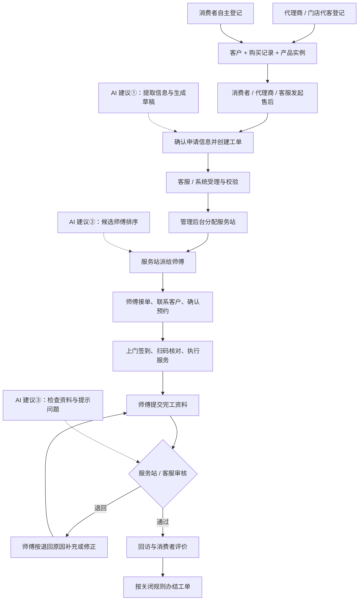
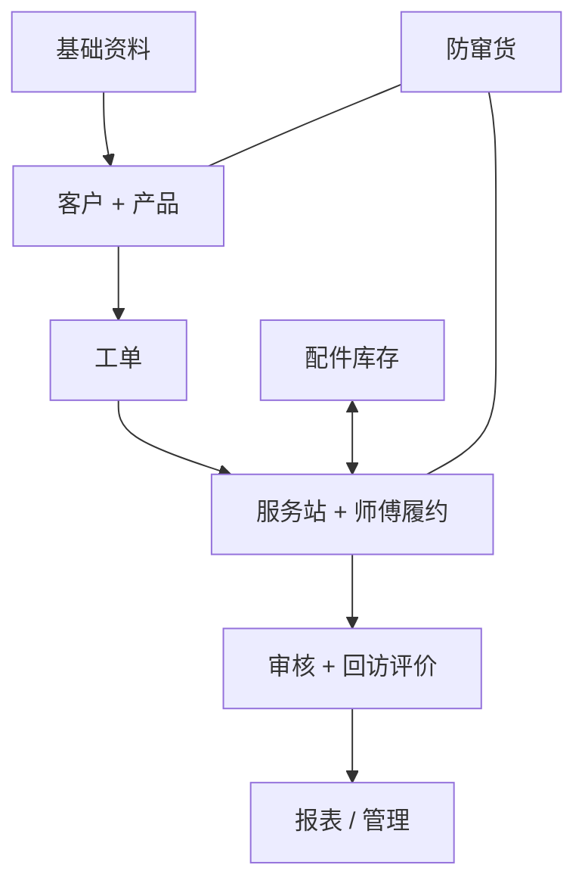

# 业务阅读合并前原文

整理日期：2026-09-12。以下原文合并保存，仅调整链接及增加定位锚点，保留原时点、建议、规则和证据边界。当前阅读入口见[项目概览](../06-业务指南/00-项目概览.md)，全流程见[流程总览](../05-业务流程/00-售后全流程总览.md)。历史指令及已执行提示词不构成本次任务授权。


<a id="reading-guide"></a>

> 以下保留原文与原时点结论，未完成项仍待处理；本次仅合并承载位置，不构成重新执行或新增授权。

<!-- preserved-source:reading-guide:start -->
<a id="reading-guide-toto-售后服务业务阅读指南"></a>
# TOTO 售后服务｜业务阅读指南

更新日期：2026-09-12

这里面向项目经理、业务负责人、客服、代理商和服务站人员，先讲清楚系统做什么、谁负责什么、一张工单怎样走完，再看 3 个应用载体和 Web 后台角色视角有哪些功能，以及按什么顺序开发。

<a id="reading-guide-建议阅读顺序"></a>
## 建议阅读顺序

需要从商品注册绑定一直看到服务关闭，或逐阶段沟通修改时，先进入[售后全流程总览](../05-业务流程/00-售后全流程总览.md)。新目录包含简易总图和七个阶段详图；本目录继续提供业务背景与注册绑定等专题说明。

| 文档 | 回答的问题 | 适合什么时候看 |
| --- | --- | --- |
| [01 · 极简业务总览](2026-09-12-业务阅读合并前原文.md#business-overview) | 整个项目在做什么？核心角色、对象和 AI 节点是什么？ | 第一次了解项目、开会前快速回顾 |
| [02 · 业务流程说明](2026-09-12-业务阅读合并前原文.md#business-process) | 从产品登记到工单关闭，每一步谁做、交给谁、异常怎么处理？ | 业务讲解、流程讨论、核对职责 |
| [03 · 系统功能结构](2026-09-12-业务阅读合并前原文.md#functional-map) | 各端和各模块分别管什么？配件、防窜货和外部接口放在哪里？ | 介绍系统范围、梳理模块分工 |
| [04 · 开发执行顺序与进度](2026-09-12-进度文档合并前原文.md#development-order) | 先开发什么？每一步包含哪些具体模块，现在做到哪里？ | 安排开发顺序、核对前置条件和阶段进度 |
| [05 · 后台菜单与角色权限手册](../02-技术设计/09-后台菜单与岗位权限矩阵.md) | 当前后台有哪些菜单？每个菜单给谁用？某个角色可以使用哪些功能？ | 查看四视角完整目录、当前功能矩阵、默认首页、操作分工和多角色权限规则 |
| [06 · 安装码与商品标识及售后使用说明](../specs/2026-09-12-安装码管理恢复与标识关系核查.md#implementation-details) | 安装码、商品条码和实物产品码如何关联？当前能据码办理哪些售后？ | 解释码关系、查询入口和实现边界 |
| [07 · 商品注册与绑定逻辑及流程](../02-技术设计/08-商品注册绑定与服务资格核验.md) | 三条通用登记路径如何关联产品实例？何时需要审核？如何兼容 TOTO？ | 注册绑定方案评审；含三张流程图，细节待确认 |

只记一条主线：**客户 + 产品 → 工单 → 服务站 + 师傅履约 → 审核 + 回访评价 → 关闭。**

<a id="reading-guide-阅读口径"></a>
## 阅读口径

- **注册绑定目标方案看第 07 篇。** 本次讨论以通用售后及兼容 TOTO 为目标，现有安装码规则尚未经用户业务验证；第 06 篇保留实现核查时点，不作为新方案的强制约束。第 07 篇区分用户明确目标、方案建议和待确认细节，不代表已实施或验收。
- **目标业务与交付进度分开看。** 前三篇描述目标业务，第 04 篇按执行顺序摘录进度；哪些功能已完成、已开放，仍以[开发进度总览](../03-开发管理/00-开发进度与下一步.md)和验收证据为准。
- **菜单与角色权限统一看第 05 篇。** 四个工作视角、当前功能矩阵与上下文入口、默认首页、岗位分工和多角色数据范围均在同一手册维护（数量核对日期 2026-09-12）；系统管理员在全局页头切换四个业务视角，A38 安装码管理已恢复至总部／客服的业务查询组。
- **导航实现与实际授权分开看。** 前端四视角导航已实现，正式租户分发与角色联调待完成。菜单查看和业务操作分别授权，操作建议不等于审批规则已定版，也不能用本地预览替代真实账号验收。
- **应用与角色分开理解。** 项目只有 Web 管理后台、消费者小程序、服务人员小程序 3 个应用载体；总部、客服、服务站、代理商／门店是角色及工作视角，外部接口是支撑能力。
- **流程图用于解释业务。** 图中的先后顺序展示典型路径；各角色可建的服务类型、派单和审核权限、正式状态及关闭条件，仍需按详细需求和已确认的功能 Spec 落定。
- **AI 是业务功能建议。** 智能建单、师傅推荐、完工初审是本次整理保留的首批 AI 建议，不代表已实现，也不改变现有开发阶段和交付范围。

<a id="reading-guide-需要进一步核对时"></a>
## 需要进一步核对时

| 想核对的内容 | 去哪里看 |
| --- | --- |
| 完整需求范围 | [功能纵览](../01-功能需求/00-功能纵览.md)及各应用／角色视角需求 |
| 角色、数据范围和职责 | [角色权限与总体架构](../01-功能需求/02-角色权限与总体架构.md) |
| 详细流程、状态和业务规则 | [核心业务流程与状态机](../01-功能需求/03-核心业务流程与状态机.md)、[业务规则](../02-技术设计/01-数据模型接口与业务规则.md) |
| 尚未定版的业务问题 | [风险与待确认事项](../03-开发管理/02-风险与待确认事项.md) |
| 后台菜单与使用角色 | [后台菜单与角色权限手册](../02-技术设计/09-后台菜单与岗位权限矩阵.md)；入口编号追踪见[页面清单](../01-功能需求/08-页面清单.md) |
| 当前完成情况与下一步 | [开发进度总览](../03-开发管理/00-开发进度与下一步.md) |

前三篇依据 2026-09-08 提供的两份备忘录内容《TOTO 售后服务｜极简业务总览》《TOTO 售后服务｜系统功能结构》，结合工作区现有需求整理；第 04 篇依据需求、开发任务依赖和进度记录整理；第 05 篇统一整理已确认的四视角菜单、查看角色及岗位权限规则；第 06 篇依据当前源码和已确认 Spec 解释码关系、现有能力与待补边界。业务阅读文档负责解释、导航和进度摘要；详细规则、验收和权威进度继续在原有目录维护，变化后同步相关说明。

[返回工作区入口](../README.md)

当前 V2 导航代码、清单生成方式及验证边界见[多角色菜单 V2 实施记录](../specs/2026-09-08-多角色菜单V2实施.md)。代码目录和唯一功能注册关系由技术菜单设计维护。
<!-- preserved-source:reading-guide:end -->


<a id="business-overview"></a>

> 以下保留原文与原时点结论，未完成项仍待处理；本次仅合并承载位置，不构成重新执行或新增授权。

<!-- preserved-source:business-overview:start -->
<a id="business-overview-toto-售后服务极简业务总览"></a>
# TOTO 售后服务｜极简业务总览

更新日期：2026-09-10 · 面向目标业务的快速说明

[阅读指南](2026-09-12-业务阅读合并前原文.md#reading-guide) · [业务流程说明](2026-09-12-业务阅读合并前原文.md#business-process) · [系统功能结构](2026-09-12-业务阅读合并前原文.md#functional-map)

<a id="business-overview-一句话理解"></a>
## 一句话理解

客户买了 TOTO 产品后，系统负责：

**登记产品 → 发起售后 → 生成工单 → 分配服务站 → 派师傅 → 上门服务 → 完工审核 → 回访评价 → 关闭工单。**

这是典型上门服务主线；指导服务也可以远程完成。

<a id="business-overview-先认识-3-个核心对象"></a>
## 先认识 3 个核心对象

| 对象 | 用人话解释 | 例子 |
| --- | --- | --- |
| 客户 | 谁购买、谁使用、联系谁 | 购买人、实际使用者和上门联系人可能不同 |
| 产品 | 客户购买并需要服务的具体产品 | 某个型号是商品资料，客户家里的那一台是“产品实例” |
| 工单 | 为客户的产品办理一次服务的完整记录 | 一次安装、维修或指导，记录从申请到关闭的全过程 |

**客户和产品是基础，工单是整套系统的主线。** 一次购买可以有多个产品，本次服务也可以只选择其中一部分。

<a id="business-overview-核心业务流程"></a>
## 核心业务流程

| 阶段 | 谁来做 | 做什么 |
| --- | --- | --- |
| 1. 产品销售 / 登记 | 代理商、门店或消费者 | 门店代客登记，或消费者扫码/输入产品码自主登记，建立客户、购买记录和产品实例的关联 |
| 2. 发起售后 | 消费者、代理商或客服 | 提交安装、维修或指导需求，确认信息后生成工单；**AI 可辅助理解描述、生成草稿** |
| 3. 受理 / 校验 | 客服、系统 | 核对客户、产品、地址、服务范围和重复申请 |
| 4. 分配服务站 | 管理后台、客服 | 确定哪个区域服务站负责这张工单 |
| 5. 派给师傅 | 服务站 | 选择具体服务人员；**AI 可推荐候选师傅和原因** |
| 6. 接单 / 预约 | 师傅 | 接单、联系客户，确认上门时间 |
| 7. 上门 / 服务 | 师傅 | 签到、核对或扫描产品码，执行安装、维修或指导，记录过程和配件 |
| 8. 提交 / 审核 | 师傅提交，服务站或客服审核 | 提交服务结果和规定资料，审核通过或退回补充；**AI 可辅助初审** |
| 9. 回访 / 评价 / 关闭 | 客服、消费者、系统 | 记录服务反馈，按确认的关闭规则办结工单 |

两种登记入口归入同一套客户、购买记录和产品实例管理；需要匹配已有记录，避免重复登记。三个建单入口各自开放哪些服务类型仍需确认，其中消费者直接预约安装尚未定版。派单和审核的最终职责分工见[流程中的待确认事项](2026-09-12-业务阅读合并前原文.md#business-process-还需业务确认的关键点)。

<a id="business-overview-主要角色"></a>
## 主要角色

| 角色 | 主要职责 |
| --- | --- |
| TOTO 管理员 | 全局配置、主数据、权限、运营和整体管理 |
| 代理商管理员 | 管理授权范围内的本代理商及下属门店，办理和查看渠道业务 |
| 门店店员 | 在当前授权门店登记客户和购买商品、绑定产品、代客预约 |
| 客服 | 售后受理、代客建单、校验、分配、跟进、异常处理、回访，按授权参与审核 |
| 服务站 | 接收区域工单、安排师傅、协调异常，按授权审核履约结果 |
| 服务人员（师傅） | 接单、联系、预约、上门、安装/维修/指导及提交完工 |
| 消费者 | 注册产品、发起售后、查看进度、确认和评价服务 |

<a id="business-overview-从使用者看-5-类操作视角"></a>
## 从使用者看 5 类操作视角

| 操作视角 | 所属应用 | 最主要的用途 |
| --- | --- | --- |
| 消费者 | 消费者小程序 | 注册产品、发起售后、查进度、评价 |
| 代理商／门店 | Web 管理后台的门店业务视角 | 产品登记、代客预约、查询客户与预约 |
| 总部／客服 | Web 管理后台的总部运营／客服作业视角 | 受理、分配、跟进、审核、回访、管理 |
| 服务站 | Web 管理后台的服务站作业视角 | 接收工单、派师傅、处理异常、审核履约 |
| 服务人员 | 服务人员小程序 | 接单、预约、上门、服务、完工 |

上述 5 类操作视角用于解释业务分工，实际只运行在 3 个应用载体中；系统划分见[系统功能结构](2026-09-12-业务阅读合并前原文.md#functional-map)。

<a id="business-overview-工单进度怎么理解"></a>
## 工单进度怎么理解

业务沟通时，可以简化为：

**待受理 → 待分配 → 待派单 → 接单预约 → 上门服务 / 待完工 → 待审核 → 待回访 → 已关闭。**

这是一条进度示意，不是完整状态定义。“已预约”表示师傅已经与客户确认服务时间；待发布、待接单、待交单等细分状态及其适用条件，见[详细状态说明](../01-功能需求/03-核心业务流程与状态机.md#9-工单状态模型)。

过程中可能遇到：**改期、断联、缺件、拒单、改派、取消、审核退回**。它们分别对应不同处理分支，不能都当成“工单已结束”。

<a id="business-overview-首批建议考虑的-3-个-ai-功能"></a>
## 首批建议考虑的 3 个 AI 功能

| AI 功能建议 | 一条线理解 |
| --- | --- |
| 智能建单 | 消费者描述 → AI 提取信息 → 工单草稿 → 发起人确认 → 正式建单 |
| 智能师傅推荐 | 系统筛选合格候选人 → AI 排序并说明原因 → 服务站确认派单 |
| 智能完工审核 | 师傅提交资料 → AI 检查并给出建议 → 授权人员或已确认系统规则作出审核决定 |

AI 的具体输入、输出和确认责任见[业务流程说明](2026-09-12-业务阅读合并前原文.md#business-process-ai-建议放在这-3-个节点)。这里的“首批”指 AI 功能建议顺序，尚不构成交付排期。

<a id="business-overview-项目经理只记一句"></a>
## 项目经理只记一句

**前端入口产生需求，后台负责调度，服务站组织履约，师傅现场执行；AI 重点放在建单、派师傅、完工审核三个节点。**
<!-- preserved-source:business-overview:end -->


<a id="business-process"></a>

> 以下保留原文与原时点结论，未完成项仍待处理；本次仅合并承载位置，不构成重新执行或新增授权。

<!-- preserved-source:business-process:start -->
<a id="business-process-toto-售后服务业务流程说明"></a>
# TOTO 售后服务｜业务流程说明

> 2026-09-12 新增[售后流程地图](../05-业务流程/00-售后全流程总览.md)：从商品注册绑定到服务关闭分七个阶段讨论，明确核验、交单和关闭的待确认边界。本文保留原业务说明时点；注册绑定的新讨论见[专题文档](../02-技术设计/08-商品注册绑定与服务资格核验.md)，不从下文旧码关系推断已确认新规则。

更新日期：2026-09-08 · 按一张工单讲清角色交接与业务结果

[阅读指南](2026-09-12-业务阅读合并前原文.md#reading-guide) · [极简业务总览](2026-09-12-业务阅读合并前原文.md#business-overview) · [系统功能结构](2026-09-12-业务阅读合并前原文.md#functional-map)

<a id="business-process-先看完整主线"></a>
## 先看完整主线

下面展示典型上门服务的目标流程。服务站分配、师傅派单和完工审核的具体权限仍需业务定版；远程指导走后文的简化路径。



流程中的三个建单入口并不表示每个入口已确认支持全部服务类型。系统在正式建单时校验提交信息，受理阶段再处理需补充、异常或人工核实的内容。

<a id="business-process-第一步把买了什么登记清楚"></a>
## 第一步：把“买了什么”登记清楚

产品登记先建立客户与具体产品的关系，供之后的预约、扫码、服务记录和渠道核验使用。

| 登记方式 | 谁发起、怎样填写 | 登记结果 |
| --- | --- | --- |
| 代理商 / 门店代客登记 | 店员选择授权门店、录入购买商品；顾客扫码填写资料，或由店员代填，完成手机验证和隐私确认 | 记录购买人、使用者、使用地址、购买商品和来源门店，按校验结果生成或绑定安装码 |
| 消费者自主登记 | 消费者在小程序扫码或输入产品码，补充购买日期、门店、使用者和地址等信息 | 校验产品码并关联已有或新登记的产品实例，纳入同一套客户和购买信息管理 |

**两条入口最终都要能回答：哪个客户，买了哪些具体产品，在哪里使用。** 已有登记需要匹配和校验，避免同一产品重复绑定。

几个容易混淆的概念：

| 概念 | 业务含义 |
| --- | --- |
| 商品 / 型号 | 卖的是什么类型、什么型号的产品 |
| 产品实例 | 客户购买的某一件具体产品，用来追踪这件产品之后的服务 |
| 购买记录 | 一次购买发生在哪家门店、购买了什么、数量多少；可以关联多个产品实例 |
| 安装码 | 关联登记和安装预约的信息入口，帮助找到需要服务的购买产品 |
| RFID / QR 产品码 | 识别和核验具体产品、追踪销售出库及现场回传的信息；不要把它与安装码混为一谈 |

产品登记完成后，不一定立即发起售后；需要服务时再选取本次涉及的产品。购买人与实际使用者可以不同，联系和上门应以本次确认的信息为准。

<a id="business-process-第二步从服务需求变成一张工单"></a>
## 第二步：从服务需求变成一张工单

**消费者自助、代理商代客、客服代客，最终进入同一个工单中心。** 工单记录来源，后续共用产品校验、调度和服务闭环。

| 服务类型 | 业务想解决的问题 | 申请时重点说明 |
| --- | --- | --- |
| 安装 | 把购买的产品安装好 | 选哪些产品、安装地址、联系人、期望时间、是否有拆旧等附加服务 |
| 维修 | 产品出现问题，需要诊断和处理 | 哪个产品、什么故障、图片或视频、使用地址、期望时间 |
| 指导 | 需要使用或操作方面的帮助 | 指导问题、关联产品、希望远程还是上门处理 |

客服或系统核对客户与产品、地址、服务范围，以及是否已有重复的活动工单；维修还需核对保修信息。缺少信息时补充，有异常时进入人工核实。**客户填写的期望时间，是希望服务的时间；师傅联系后确认的时间，才是双方约定的预约时间。**

目前代理商安装预约、消费者维修/指导申请已有需求依据；消费者是否直接开放安装预约、各入口完整服务类型范围仍待确认。费用、附加服务收费及支付结算另行确认，不能从“可申请服务”推导出免费或已支持支付。

<a id="business-process-第三步先找负责的服务站再找执行的师傅"></a>
## 第三步：先找负责的服务站，再找执行的师傅

| 环节 | 核心问题 | 主要处理 | 交接结果 |
| --- | --- | --- | --- |
| 分配服务站 | 哪个服务组织负责？ | 管理后台按地址、服务区域和服务能力匹配，客服按授权处理无法匹配或需要调整的情况 | 工单归属一个负责的服务站 |
| 派给师傅 | 具体由谁去做？ | 服务站结合区域、技能、任务量、时间和可用性选择服务人员 | 形成师傅待接收的任务 |
| 接单和预约 | 师傅能否执行，何时服务？ | 师傅接收任务、联系客户、确认地址和服务时间 | 双方确认预约，准备履约 |

**分配服务站和派师傅是两次不同的责任交接。** 总部或客服能否直接派到师傅、如何转站和改派、是否允许抢单等，仍按后续确认的权限和规则执行。

<a id="business-process-第四步完成服务并留下可审核的记录"></a>
## 第四步：完成服务，并留下可审核的记录

上门服务一般经过：**到达签到 → 扫码或核验产品 → 执行服务 → 记录结果和配件 → 提交完工。**

| 服务类型 | 执行特点 | 交出的结果 |
| --- | --- | --- |
| 安装 | 核对本次安装产品，完成安装及适用的附加服务 | 安装结果、产品码、规定照片及客户确认等资料 |
| 维修 | 先诊断，再维修；需要配件时关联领料和实际耗用，缺件可能需要二次上门 | 故障与处理说明、配件使用、产品码、规定照片及客户确认等资料 |
| 指导 | 远程指导由客服或服务人员记录沟通和处理结果；上门指导复用预约、上门和服务记录流程 | 指导内容、处理结果及适用的确认资料 |

远程指导可以从受理进入远程处理，再提交结果、审核和回访；不强行套用上门签到、现场扫码等步骤。三类服务各自的必填资料和完工标准仍需细化确认。

**提交完工，表示师傅认为服务已完成；审核通过，表示履约资料和结果已被认可；工单关闭，表示流程按办结规则结束。** 这是三个不同节点。

<a id="business-process-第五步审核回访评价再关闭"></a>
## 第五步：审核、回访评价，再关闭

| 环节 | 谁处理 | 看什么 / 做什么 |
| --- | --- | --- |
| 完工审核 | 按授权由服务站或客服处理 | 核对服务结果、产品码、照片、客户确认或签名、配件记录；通过或写明原因退回 |
| 退回补充 | 师傅 | 根据原因补充或修正后再次提交，保留原提交记录和退回原因 |
| 回访 | 客服，配合短信或微信通知 | 了解是否解决问题、服务是否满意、是否需要继续跟进 |
| 评价 | 消费者或有效授权人 | 评分、填写意见，形成关联这张工单的反馈 |
| 关闭 | 授权人员或按已确认规则由系统处理 | 满足办结条件后关闭，保留客户、产品和服务全过程记录 |

服务站与客服是否需要分级审核，哪些单据需要“待交单”，未评价、回访未接通时能否关闭，都需要进一步明确。回访是主动了解服务结果，评价是客户表达反馈，两者不能简单互相替代。

<a id="business-process-出现异常时流程怎样继续"></a>
## 出现异常时，流程怎样继续

| 情况 | 用人话解释 | 处理方向 |
| --- | --- | --- |
| 改期 | 原来约好的时间不合适了 | 记录原因，重新联系并确认预约 |
| 断联 | 暂时联系不上客户 | 记录联系情况并继续跟进；何时升级或关闭需按确认规则处理 |
| 缺件 | 维修需要的配件尚未到位 | 记录配件需求、领料或到件情况，到件后重新预约或继续维修 |
| 拒单 / 改派 / 转站 | 原师傅或服务站无法承接 | 记录原因，由有权限人员重新分配并通知相关方 |
| 审核退回 | 完工资料或结果不符合要求 | 写明问题，师傅补充或修正后再次提交 |
| 取消 | 本次服务不再继续 | 按权限和规则终止，保留原因与历史；已取消与正常完成后关闭分别记录 |
| 投诉 | 客户对结果或过程不满意 | 关联原工单跟进处理；是否复开原工单按权限和确认规则决定 |
| 退货 | 购买关系发生变化 | 保留产品和历史服务记录，按退货规则限制新的预约，不直接删除已有记录 |

<a id="business-process-ai-建议放在这-3-个节点"></a>
## AI 建议放在这 3 个节点

以下是建议方案；“首批 AI”与当前工程开发的“第一阶段”不是同一概念，是否纳入交付需单独明确。

| 建议节点 | AI 接收什么 | AI 输出什么 | 谁确认、怎样进入下一步 |
| --- | --- | --- | --- |
| ① 智能建单 | 消费者的自然语言描述，以及已提供的产品、故障和媒体信息 | 安装/维修/指导类型建议、提取到的信息、缺失项和工单草稿 | 消费者、代理商或客服确认；系统按入口权限和业务规则校验后正式建单 |
| ② 智能师傅推荐 | 系统筛选出的合格候选师傅，以及可取得的距离、技能、任务量、时间和可用性 | 候选排名、推荐师傅和推荐原因 | 服务站人员确认，系统校验权限和可用性后派单 |
| ③ 智能完工审核 | 服务结果、照片、产品码、客户确认、配件使用等完工资料 | 缺漏或疑点清单，以及“建议通过 / 建议退回 / 建议人工复核” | 授权审核人员或已确认的系统规则作出决定，由系统执行状态流转 |

AI 判断和建议保留给确认人查看；未提供或无法判断的信息应提示补充。师傅的资格、区域和权限由系统先校验；AI 排名不能替代这些条件。完工照片、产品码等资料的核验结果也需要结合系统记录，AI 建议本身不直接触发通过或关闭。

<a id="business-process-用一次维修串起来"></a>
## 用一次维修串起来

例如，客户已经登记了一台 TOTO 产品，在小程序描述“冲洗功能异常”并上传照片。确认申请后生成维修工单，客服核对产品与地址，后台分配负责区域的服务站。服务站派给合适的师傅，师傅接单并与客户确认时间。

师傅上门诊断发现需要更换配件，但当前缺件，于是记录配件需求。到件后重新约时间，完成维修并提交配件耗用、服务结果和规定资料。审核人员核对通过后进入回访评价，满足关闭规则后办结。以后再查这台产品，仍能看到本次维修和配件记录。

如果接入 AI，它可以帮助整理最初的故障描述、推荐候选师傅、提示完工资料问题；各环节的责任人和确认动作仍然清楚可查。

<a id="business-process-还需业务确认的关键点"></a>
## 还需业务确认的关键点

| 事项 | 会影响什么 |
| --- | --- |
| 各建单入口允许哪些服务类型，特别是消费者安装预约 | 消费者和代客建单入口的实际范围 |
| 总部、客服、服务站的分配、派单、改派和审核权限 | 每一步由谁操作和负责 |
| 待发布、待接单、待审核、待交单等状态的准入及适用范围 | 页面队列和真正的工单流转 |
| 各服务类型的完工资料、回访评价和关闭条件 | 什么时候算做完，什么时候可以办结 |
| 服务区域冲突、无法匹配、人员不可用时的处理规则 | 自动分配失败后如何继续 |
| 附加服务、配件费用、支付、退款与结算范围 | 是否收费以及费用如何处理 |
| 三个 AI 节点的交付范围、所需数据和确认责任 | 建议能否落地，以及何时实施 |

既有待确认问题统一维护在[风险与待确认事项](../03-开发管理/02-风险与待确认事项.md)；本节只提示影响阅读的关键点。更细的流程和状态见[核心业务流程与状态机](../01-功能需求/03-核心业务流程与状态机.md)，登记和执行规则见[代理商工作台需求](../01-功能需求/05-代理商工作台需求.md)、[消费者小程序需求](../01-功能需求/06-消费者小程序需求.md)、[服务人员小程序需求](../01-功能需求/07-服务人员小程序需求.md)。
<!-- preserved-source:business-process:end -->


<a id="functional-map"></a>

> 以下保留原文与原时点结论，未完成项仍待处理；本次仅合并承载位置，不构成重新执行或新增授权。

<!-- preserved-source:functional-map:start -->
<a id="functional-map-toto-售后服务系统功能结构"></a>
# TOTO 售后服务｜系统功能结构

更新日期：2026-09-10 · 面向业务理解的功能地图

[阅读指南](2026-09-12-业务阅读合并前原文.md#reading-guide) · [极简业务总览](2026-09-12-业务阅读合并前原文.md#business-overview) · [业务流程说明](2026-09-12-业务阅读合并前原文.md#business-process)

<a id="functional-map-整体结构3-个应用载体--web-后台-4-个角色视角"></a>
## 整体结构：3 个应用载体 + Web 后台 4 个角色视角

| 应用载体 | 主要使用者 | 一句话职责 |
| --- | --- | --- |
| Web 管理后台 | TOTO 管理人员、客服、服务站人员、代理商管理员、门店店员 | 按角色管理资料、登记、工单、调度、履约协同和运营 |
| 消费者小程序 | 最终消费者 | 登记产品、申请售后、查进度、评价 |
| 服务人员小程序 | 安装、维修、指导服务人员 | 从接到任务一直操作到提交完工 |

外部支撑包括 DWH、追溯系统、微信、短信、地图和对象存储。它们提供数据或能力，不计为应用端。

Web 管理后台只有一个“TOTO 售后服务”入口，根据总部运营、客服作业、服务站作业、门店业务 4 个角色视角展示功能；“代理商工作台”“客服工作台”“服务站工作台”均不是独立应用。服务人员小程序已有需求，其与“TOTO客服助手”的应用和仓库关系仍待确认，不能据名称直接视作同一个应用。

<a id="functional-map-web-管理后台按业务理解分成-8-组"></a>
## Web 管理后台：按业务理解分成 8 组

以下分组沿用备忘录的讲解思路，用来理解功能职责。当前后台采用 4 个工作视角；具体分组与功能数量以角色权限手册为准（2026-09-12 核对）。总部、客服的业务查询组已恢复安装码管理。完整菜单树与使用角色见[后台菜单与角色权限手册](../02-技术设计/09-后台菜单与岗位权限矩阵.md)，入口编号见[页面清单](../01-功能需求/08-页面清单.md)，不要求与这 8 组一一对应。

<a id="functional-map-1-主数据管理"></a>
### 1. 主数据管理

管理“谁、在哪里、卖什么、服务什么”。

- 渠道和网点：代理商、门店、服务站、服务区域。
- 商品资料：商品分类、商品、系列及配套关系。
- 服务与配件资料：商品资料和配件主档；服务类型由业务流程使用，不再提供独立“服务项目”维护功能。

这些是登记、建单和派单共同使用的基础资料。

<a id="functional-map-2-客户--产品管理"></a>
### 2. 客户 / 产品管理

管理“哪个客户拥有哪些产品”。

- 客户查询、客户详情、购买人和使用者、地址。
- 购买记录、购买商品和具体产品实例。
- 安装码、RFID / QR 关联、隐私同意记录。
- 历史预约、工单和服务记录。

代理商登记和消费者自主登记都进入这套管理关系；一次购买、某一件产品、一次服务分别保留记录并相互关联。

<a id="functional-map-3-客服--工单中心核心"></a>
### 3. 客服 / 工单中心【核心】

管理“一张工单从创建到关闭”。

- 售后受理：待受理工单、客户识别、客服代客建单、资料校验。
- 调度跟进：工单查询、服务站分配、师傅派单、沟通记录、时效跟进。
- 异常处理：改派、转单、改期、断联、缺件、拒单、取消。
- 完工办结：完工审核、回访、服务评价。
- 扩展支持：投诉处理、客服知识和处理指引。

客服工单中心的详细队列和权限仍需定版；师傅派单、完工审核由哪些角色操作，按最终授权分工。AI 建单、师傅推荐、完工初审分别挂在这条主线的三个节点，详见[AI 功能建议](2026-09-12-业务阅读合并前原文.md#business-process-ai-建议放在这-3-个节点)。

<a id="functional-map-4-服务站--服务人员管理"></a>
### 4. 服务站 / 服务人员管理

管理“哪个服务站、哪个师傅负责完成服务”。

- 服务站工作台：待接收、待派单、执行中、待审核和异常工单。
- 人员与能力：服务人员、服务区域、技能、状态。
- 调度安排：派单看板、任务与人员位置、冲突提示；排班和可用时间按实施范围逐步完善。
- 履约管理：完工审核、服务时效、一次完工情况、评价和投诉。

服务站组织履约，师傅执行具体任务；两者查看和操作的数据受各自授权范围限制。

<a id="functional-map-5-配件--库存"></a>
### 5. 配件 / 库存

管理“维修用了什么配件，库存还剩多少”。

- 配件主档，以及仓库、服务站、师傅个人库存。
- 领料、退料、调拨、工单实际耗用。
- 库存流水、盘点和差异调整。

业务上要分清：**领到师傅手上的配件，不等于已经用在客户产品上。** 实际使用关联工单，未用或需退回的配件走退料流程。配件主档与基础资料共用，库存模块管理数量变化。

<a id="functional-map-6-防窜货"></a>
### 6. 防窜货

核验“这件产品的销售、出库、登记和安装流向是否一致”。

- RFID / QR 查询、安装码管理，以及顾客购买与工单记录中的安装码检索和全过程追溯；完整追溯属于待交付目标，当前可用边界见[码关系与售后使用说明](../specs/2026-09-12-安装码管理恢复与标识关系核查.md#implementation-details)。
- 销售与出库信息、购买登记、产品注册、预约及安装地址。
- 异常规则、异常记录、人工复核。

例如，检查是否缺少购买或出库记录、是否重复注册、代理商是否一致、安装区域是否符合授权。规则命中形成异常线索，由授权人员结合记录复核。

<a id="functional-map-7-报表--运营"></a>
### 7. 报表 / 运营

看“整个售后服务运行得怎么样”。

- 工单数量、完工情况、受理与服务时效。
- 服务站表现、师傅表现、客户评价、投诉及异常统计。
- 数据查询、报表和导出。
- 会员运营：会员资料、标签、问卷和推送等后续能力。

服务完工评价属于服务闭环；独立产品问卷、营销推送等按二期范围处理。本文保留整体功能地图，不将后续运营能力算作当前已交付功能。

<a id="functional-map-8-系统管理"></a>
### 8. 系统管理

控制“谁能进入系统、能看什么、能操作什么”。

- 用户、角色、功能权限、数据范围和敏感信息展示。
- 字典、参数、通知等基础配置。
- 登录日志、操作日志、导入 / 导出。

这些能力贯穿所有模块；同一个功能入口，不同角色也可能只能查看自己门店、服务站或授权范围内的数据。

<a id="functional-map-web-管理后台的门店业务视角"></a>
## Web 管理后台的门店业务视角

**把产品销售正式接入售后体系。**

| 业务环节 | 主要功能 |
| --- | --- |
| 进入工作台 | 选择授权门店，查看当前门店信息 |
| 顾客和商品登记 | 客户登记、购买商品编辑与确认、顾客扫码填写或店员代填、手机验证、隐私签名 |
| 产品关联 | 绑定产品，按校验结果生成或绑定安装码并查询 |
| 安装预约 | 选择本次要安装的产品、联系人、地址、期望时间和附加服务，代客发起安装预约 |
| 查询与后续处理 | 查询客户、购买和预约；符合规则时再次预约或办理退货 |

代理商管理员管理本代理商及下属授权门店，店员主要处理当前门店业务。退货保留历史关系，已有服务记录时按规则处理。

<a id="functional-map-消费者小程序"></a>
## 消费者小程序

**消费者自己登记产品、发起售后、查看进度和评价服务。**

| 业务环节 | 主要功能 |
| --- | --- |
| 产品登记 | 扫码或输入产品码、完善购买信息、产品注册 / 绑定 |
| 我的产品 | 查看产品、安装码、购买记录和服务历史 |
| 售后申请 | 维修预约、指导预约、故障描述、图片 / 视频；直接安装预约入口仍待确认 |
| 服务跟进 | 查看我的工单 / 服务记录和服务进度，完成服务评价 |
| 网点与客服 | 授权门店 / 维修网点查询、电话和微信客服入口 |
| 我的 | 个人资料、地址、通知偏好、隐私条款，以及按阶段实施的问卷功能 |

“我的工单”在这里表示查询本人服务记录的能力，实际页面名称和入口以页面清单为准。

<a id="functional-map-服务人员小程序"></a>
## 服务人员小程序

**师傅从接到任务一直操作到提交完工。**

| 业务环节 | 主要功能 |
| --- | --- |
| 接收与安排 | 我的任务、工单详情、接单、联系客户、预约 |
| 过程调整 | 改期、断联、缺件、取消等申请或动作，按权限和规则办理 |
| 上门履约 | 签到、RFID / QR 扫码或人工补录、安装 / 维修 / 指导、服务过程记录 |
| 提交完工 | 配件使用、图片 / 视频、客户确认或签名、完工提交、退回后补充 |
| 配件管理 | 我的库存、领料 / 退料、领料单；调拨按实施范围支持 |
| 日常支持 | 技术和延保资料、问题反馈、企业切换、个人中心 |

任务中的“待发布、待审核、待交单”等名称已有需求记录，具体适用流程和责任人仍需确认。独立小程序的功能需求已有整理，应用落地安排见[服务人员端开发进度](../03-开发管理/06-服务人员小程序开发进度.md)。

<a id="functional-map-外部接口与支撑能力"></a>
## 外部接口与支撑能力

| 能力 | 为业务提供什么 | 主要用在哪些地方 |
| --- | --- | --- |
| DWH（数据仓库） | 代理商、门店、销售、出库等数据 | 基础资料、购买核验、渠道核验 |
| 追溯系统 | RFID / QR、商品及产品流向、服务回传信息 | 产品识别、防窜货、现场扫码核验 |
| 微信 | 登录、手机号授权、订阅消息、小程序能力 | 消费者入口、身份关联、服务通知 |
| 短信 | 验证码、预约、派单、回访通知 | 登记验证、服务沟通与回访 |
| 地图 | 地址解析、经纬度、距离等地理能力 | 地址确认、服务区域匹配、候选师傅距离参考 |
| 对象存储 | 照片、视频、签名、附件和导出文件的存放能力 | 登记凭证、现场资料、完工审核和查询 |

接口的数据范围、更新频率和使用规则仍需按对应集成确认；列入功能地图不代表已接通。地图提供位置与距离，负责服务的区域规则由业务确定。

<a id="functional-map-再归纳成-6-大业务域"></a>
## 再归纳成 6 大业务域

| 业务域 | 包含什么 |
| --- | --- |
| ① 基础资料 | 代理商、门店、商品、服务站、师傅 |
| ② 客户与产品 | 客户、购买、产品实例、安装码及产品码关联 |
| ③ 工单【核心】 | 安装、维修、指导，以及申请到关闭的全过程 |
| ④ 履约 | 服务站、师傅、预约、上门或远程服务、完工 |
| ⑤ 支撑能力 | 配件库存、防窜货、地图、消息、文件及外部数据 |
| ⑥ 系统治理 | 权限、日志、报表、运营和配置 |

“应用载体”按运行产品区分，“角色视角”按谁使用区分，“业务域”按管理什么区分；三者不能混算。例如，工单由消费者或代客人员发起，Web 后台中的客服／服务站角色调度，师傅执行，消费者评价。



需要追到详细范围时，查看[功能纵览](../01-功能需求/00-功能纵览.md)、[统一管理后台需求](../01-功能需求/04-统一管理后台需求.md)及各端需求；当前交付情况统一查看[开发进度总览](../03-开发管理/00-开发进度与下一步.md)。
<!-- preserved-source:functional-map:end -->


<a id="workspace-readme"></a>

<!-- preserved-source:workspace-readme:start -->
<a id="workspace-readme-toto-售后服务开发工作区"></a>
# TOTO 售后服务开发工作区

> 2026-09-11 数据边界更正：售后业务主数据独立，禁止默认复用或关联主系统业务主档；统一认证权限／租户平台按原确认方案复用。独立化代码及隔离研发验证已完成，目标环境迁移和业务验收待完成，见[核查与待整改范围](../specs/2026-09-11-业务数据独立边界与已开发功能核查.md)。

本目录是 TOTO 售后服务的独立项目文档 Git 仓库与跨仓开发入口，集中维护业务说明、项目背景、完整需求、技术约束、开发进度、功能 Spec 和验收证据。`Gaia/` 本身不是 Git 仓库，文档与各业务仓库需要分别提交；提交同步规则和自动检查见[团队文档协作与提交同步规范](../03-开发管理/08-团队文档协作与提交同步规范.md)。

<a id="workspace-readme-现在先看什么"></a>
## 现在先看什么

**查看完整售后流程：** 从[售后全流程总览](../05-业务流程/00-售后全流程总览.md)进入，先看简易主线，再按注册绑定、建单、受理核验、调度预约、履约、审核关闭及异常七个阶段阅读。流程地图为可持续微调的 v0.2 讨论稿，每阶段均有详图、责任交接和待确认项，不代表业务已定档或已验收。

**讨论商品注册与绑定：** 读[商品注册与绑定逻辑及流程](../02-技术设计/08-商品注册绑定与服务资格核验.md)，查看已有凭证、实物唯一编码、手动登记三条路径，以及实例关联、权益核验和 TOTO 两种方式的兼容设计。含三张流程图；这是本次讨论整理的方案，细节待确认，现有安装码实现不作为强制业务规则。

**查看和修改页面原型：** 从[原型导航](../04-页面原型/README.md)进入，或直接打开[两端小程序原型](../04-页面原型/小程序/index.html)、[后台系统原型预留入口](../04-页面原型/后台系统/index.html)。小程序的[修改指南](../04-页面原型/小程序/README.md)和[设计说明](../04-页面原型/小程序/01-两端小程序设计说明.md)与原型同目录维护。消费者 v0.7 将“服务”页改为当前服务跟进，集中展示状态、确认安排和下一步，支持同页切换多项服务；保留产品中心、登记边界与网点地图。当前消费者 26 屏、服务人员 v0.1 共 15 屏，两端合计 41 屏，消费者 7 条核心流程。本轮原型浏览器检查通过，原型仍待用户评审；先确认原型，再进入最终视觉设计，不改变业务验收状态，后台原型尚未制作。

**先理解业务：** 从 [04-业务阅读](2026-09-12-业务阅读合并前原文.md#reading-guide)进入，按[极简业务总览](2026-09-12-业务阅读合并前原文.md#business-overview) → [业务流程说明](2026-09-12-业务阅读合并前原文.md#business-process) → [系统功能结构](2026-09-12-业务阅读合并前原文.md#functional-map)阅读，了解角色分工、工单闭环、功能地图和三个 AI 建议节点。

**查看后台菜单和角色分工：** 读[后台菜单与角色权限手册](../02-技术设计/09-后台菜单与岗位权限矩阵.md)，统一查看四个工作视角的当前目录、48 项当前功能、默认首页、岗位操作分工和多角色数据范围规则。四视角均以工作台为首页，系统管理员可在全局页头切换；当前导航使用 16 个展示分组，展示 41 个去重侧栏功能，另保留 1 个服务侧安装申请查询上下文功能和 6 个导航外功能。总部、客服的“业务查询”已恢复安装码管理，具体码关系与可办理范围见[安装码与商品标识及售后使用说明](../specs/2026-09-12-安装码管理恢复与标识关系核查.md#implementation-details)。家装公司、服务项目和门店独立安装申请记录仍不在当前 Web 范围。正式租户分发与账号授权仍待联调。

**查看进度或开始开发：**

本次非工作台剩余功能的实施结果和依赖见[实施清单](2026-09-12-进度文档合并前原文.md#remaining-work)。

横向交互和通用能力的后续事项集中记录在[后续开发与交互优化待办](../03-开发管理/07-后续开发与交互优化待办.md)；开发、测试和 AI 共同更新文档时遵循[团队文档协作与提交同步规范](../03-开发管理/08-团队文档协作与提交同步规范.md)。功能进度和业务验收仍以下方进度体系为准。

按“权限 → 主数据 → 登记 → 工单 → 履约”的业务顺序查看具体模块与进度，先读[开发执行顺序与进度](2026-09-12-进度文档合并前原文.md#development-order)；原有进度总览仍是统一状态来源。

1. 先看[开发进度总览](../03-开发管理/00-开发进度与下一步.md)：这是统一进度入口，集中展示项目阶段、3 个应用载体、Web 角色视角、开发顺序和明细链接。当前第一阶段的实现范围、验证结果和未联调边界见[菜单、路由与页面 UI 架构验收记录](../specs/2026-09-07-第一阶段菜单路由与页面UI架构.md)。
2. 需要理解项目边界时，读[项目概览与范围](../00-项目资料/01-项目概览与范围.md)、[仓库与系统关系](../00-项目资料/02-仓库与系统关系.md)和[技术架构与技术栈](../00-项目资料/03-技术架构与技术栈.md)；售后 Web 从主 SPA 迁为同仓独立前端的目标方案见[`gaia-ui` 售后子系统独立前端改造方案](../02-技术设计/07-gaia-ui售后子系统独立前端改造方案.md)。
3. Web 菜单开发先看 [`gaia-ui` 目录与菜单设计](../02-技术设计/03-gaia-ui目录与菜单设计.md)，页面开发遵循 [Web 售后服务 UI 样式规范](../02-技术设计/05-gaia-ui售后服务UI样式规范.md)；小程序开发先看[小程序目录与页面路由设计](../02-技术设计/04-小程序目录与页面路由设计.md)。再通过[页面清单](../01-功能需求/08-页面清单.md)定位入口，通过[需求索引](../01-功能需求/09-AI开发需求索引.md)定位需求原文、任务依赖、业务规则和验收。原始材料取用见[资料索引与核对](../00-项目资料/04-原始资料索引与需求核对.md)。
4. 售后后端开发遵循[后端开发规范](../02-技术设计/06-售后后端开发规范.md)，首版真实实现与验证见[商品分类/商品档案全栈 Spec](../specs/2026-09-08-商品分类与商品档案全栈首版.md)。先批量建立归属明确的已知菜单入口，再按依赖逐个开发全栈切片；复杂切片的范围、接口、权限和验收写入 [`specs/`](../specs)，状态回写进度文档。

项目统一按 3 个应用载体展示：Web 管理后台、消费者小程序和服务人员小程序。Web 历史台账保留 `Axx` 55 个、`Dxx` 8 个编号，其中 A05、A13、D08 已退出当前产品范围，A38 安装码管理于 2026-09-12 恢复；当前有效 Web 入口为 60 个，使用总部运营、客服作业、服务站作业、门店业务 4 个角色视角。加上消费者 17 个、服务人员 16 个，当前有效范围为 93 个入口。Web 入口、14 个当前进度模块及四视角访问关系统一维护在[Web 管理后台开发进度](../03-开发管理/04-Web管理后台开发进度.md)。

<a id="workspace-readme-文档结构"></a>
## 文档结构

```text
docs/toto/
├── README.md                         # 本入口
├── AGENTS.md                         # AI 跨仓执行约束
├── local-development.md              # 本地运行与联调
├── 00-项目资料/                       # 项目范围、仓库关系、技术栈
├── 01-功能需求/                       # 功能纵览、角色、流程、各端和页面清单
├── 02-技术设计/                       # 数据、接口、业务规则、非功能方案
├── 03-开发管理/                       # 进度总览与应用入口明细、测试验收、风险、协作规范
├── 04-业务阅读/                       # 极简总览、业务流程、功能结构、开发顺序与进度摘要
├── 04-页面原型/                       # 当前原型、设计说明、查看与修改指南
│   ├── 小程序/                       # 消费者端与服务人员端原型及资源
│   └── 后台系统/                     # Web 管理后台原型预留入口
├── 05-业务流程/                       # 售后总图、阶段详图、责任交接与待确认规则
├── specs/                            # 单个全栈切片的可执行 Spec 与验收证据
└── 99-归档/                           # 原始合并版，只用于追溯
```

子目录内的两位数字前缀仅用于稳定排序：总览或索引页使用 `00`，其余正文从 `01` 起连续编号；按日期命名的 `specs/` 和保留原名的 `99-归档/` 不适用此规则。

<a id="workspace-readme-权威来源与使用规则"></a>
## 权威来源与使用规则

| 信息 | 首选来源 | 说明 |
| --- | --- | --- |
| 全流程阅读与逐阶段讨论 | [售后流程地图](../05-业务流程/00-售后全流程总览.md) | 总览＋七阶段详图；按来源区分需求依据、讨论建议和未定规则，不代替需求／Spec 或验收 |
| 面向人的业务理解 | [业务阅读指南](2026-09-12-业务阅读合并前原文.md#reading-guide) | 解释角色、流程和功能结构；AI 标为建议，详细规则和交付状态仍以需求、Spec 与进度为准 |
| 页面原型评审与修改 | [页面原型](../04-页面原型/README.md) | 小程序当前可点击原型、设计说明及后台原型预留入口；不替代正式需求、功能 Spec 或业务验收 |
| 模块进度与开发计划 | [开发进度总览](../03-开发管理/00-开发进度与下一步.md) | 统一进度入口；目标按 Web 后台、消费者和服务人员 3 个应用下钻，Web 角色不重复计数 |
| 菜单和页面范围 | [页面清单](../01-功能需求/08-页面清单.md) | 93 个当前有效入口、3 个历史删除编号及模块对应关系，不维护开发状态 |
| Web 目录与菜单命名 | [`gaia-ui` 目录与菜单设计](../02-技术设计/03-gaia-ui目录与菜单设计.md) | 通用 SaaS“售后服务”顶部菜单、四视角、48 个当前功能、41 个侧栏功能与 1 个上下文功能、角色模板与唯一页面路径；系统配置由蓝鲸数字全局能力承接 |
| Web 页面样式与复用边界 | [售后服务 UI 样式规范](../02-技术设计/05-gaia-ui售后服务UI样式规范.md) | 独立子系统默认开发位置、商品分类范例、`FaPageMain` / `EsSearch` / `EsTable` 及通用 composables 的复用边界 |
| Web 独立子系统改造 | [`gaia-ui` 售后子系统独立前端改造方案](../02-技术设计/07-gaia-ui售后子系统独立前端改造方案.md) | 同仓库独立 SPA、Gaia 权限适配、双前端运行与构建、单部署包和 Tomcat 目录方案；底座、独立登录及用户／角色可写代码已完成，共享环境双端一致性和权限验收待后续 |
| 小程序目录与页面路由 | [小程序目录与页面路由设计](../02-技术设计/04-小程序目录与页面路由设计.md) | 消费者端可实施目录、C01～C17 路由，以及服务人员端待绑定仓库的逻辑目录 |
| 需求到开发的追踪 | [AI 开发需求索引](../01-功能需求/09-AI开发需求索引.md) | 119 个编号关联原文、菜单，保留任务依赖与工程参考 |
| 原始需求材料与差异 | [原始资料索引与需求核对](../00-项目资料/04-原始资料索引与需求核对.md) | 原资料目录 85 份文件编目；64 张截图及新增脑图 Markdown 已审阅并补入需求，3 段视频仍待审阅；保留证据边界与待确认规则 |
| 完整业务需求 | [功能纵览](../01-功能需求/00-功能纵览.md)及其子文档 | ProcessOn 调研结果的结构化基线 |
| 当前切片目标行为 | 对应功能 Spec | 开发前确认，完成后补验证证据 |
| 已实现行为 | 当前源码、配置和运行结果 | 与文档冲突时先区分待实现需求和过时记录 |
| 项目关系与确认决策 | 本仓库中的 TOTO 项目文档 | 项目执行默认只使用仓库内文档；仅在用户明确要求时查询或维护外部知识库 |

<a id="workspace-readme-项目与仓库入口"></a>
## 项目与仓库入口

路径相对于 `Gaia/`；完整职责和改动边界见[仓库与系统关系](../00-项目资料/02-仓库与系统关系.md)。

<a id="workspace-readme-团队首次拉取保持多仓独立只统一目录"></a>
### 团队首次拉取：保持多仓独立，只统一目录

TOTO 使用“一个项目目录、多个独立 Git 仓库”的工作区方式，不把业务仓库合并为 monorepo，也不移动其他蓝鲸项目正在使用的仓库。每位开发者为 TOTO 单独检出一套工作目录，特别是 `gaia-saas-proj` 必须使用 TOTO 独立检出，避免分支、本地配置和构建产物影响其他项目。

```text
Gaia/
├── docs/
│   └── toto/                       # 本文档仓库，也是工作区入口
├── backend/
│   ├── gaia-after-sales/           # 售后领域与 API
│   └── gaia-saas-proj/             # TOTO 独立检出的聚合运行宿主
├── frontend/
│   └── gaia-ui/                    # apps/after-sales Web 子系统
└── mobile/
    ├── gaia-after-sales-uni/       # 消费者小程序与 H5
    └── gaia-customer-service-uni/  # 尚未建仓，当前不自动创建
```

同事首次准备工作区时，先拉取本仓库，再运行安全、可重复执行的初始化脚本：

```bash
mkdir -p Gaia/docs
git clone https://github.com/zhiyuan23/toto-after-sales-docs.git Gaia/docs/toto
cd Gaia/docs/toto
bash scripts/bootstrap-workspace.sh
```

脚本只拉取缺失仓库，不会对已有仓库执行 `pull`、切换分支或覆盖本地修改。默认使用当前 TOTO 业务开发分支；需要更换时通过 `TOTO_WORK_BRANCH` 指定。`gaia-after-sales-uni` 当前没有已确认的远程地址，拿到地址后按以下方式补充：

```bash
TOTO_AFTER_SALES_UNI_REPO_URL='<仓库地址>' bash scripts/bootstrap-workspace.sh
```

仓库齐备后，在本目录执行 `yarn dev:afs` 即可启动 TOTO 售后 Web、聚合后端和本地 Redis；该命令只转发到 `frontend/gaia-ui` 的同名启动器，不复制启动逻辑。也可以继续从 `frontend/gaia-ui` 执行原命令。完整环境要求和调试方式见[本地开发与联调](../local-development.md)。

| 仓库 | 职责 | 入口 |
| --- | --- | --- |
| `gaia-after-sales` | 售后领域、管理端 API、小程序 API | [开发说明](../../../backend/gaia-after-sales/docs/catalog-development.md) |
| `gaia-after-sales-uni` | 原 TOTO 售后小程序与 H5 | [README](../../../mobile/gaia-after-sales-uni/README.md) |
| `gaia-ui` | 同仓的售后独立子系统 `apps/after-sales`，复用 Gaia 认证、菜单、权限与租户体系；主系统旧售后页面仅作 legacy 保留 | [子系统 README](../../../frontend/gaia-ui/apps/after-sales/README.md) |
| `gaia-saas-proj` | 聚合并运行售后 API | [POM](../../../backend/gaia-saas-proj/pom.xml) |
| `gaia-customer-service-uni` | “TOTO客服助手”独立小程序 | 待创建，功能与技术基线待 Spec 确认 |

`gaia-ui/src/views/common` 是受保护的公共子仓库，未经单独明确授权不得修改或提交。`gaia-saas-proj` 可按已确认 Spec 修改，但不得自动提交。菜单、权限和租户平台按需复用 `gaia-sys`、`gaia-tenant`；售后业务主数据自有，出库与追溯只按另行确认的外部接口契约接入，不直接引用主系统业务表或默认同步。

<a id="workspace-readme-ai-开发闭环"></a>
## AI 开发闭环

1. 从开发进度总览及对应应用入口明细确定下一模块和工作范围，在需求索引中检查依赖和局部阻塞；Web 任务同时确认角色视角，先菜单入口，后业务功能。
2. 阅读对应需求、技术设计、相关仓库说明与 `AGENTS.md`，核对 Git 现场。
3. 复杂跨仓切片用 [`specs/_template.md`](../specs/_template.md)固化角色、菜单、数据、接口、权限、验收和禁止假设；普通任务直接按明确需求与项目惯例实施，仅重大业务缺口需要确认。
4. 在一个任务中贯通必要的数据模型、后端逻辑、接口、宿主接入、前端页面和权限，不拆成互相失联的前后端任务。
5. 按风险完成 lint、类型检查、测试、构建和关键路径验收，记录未验证项。
6. 在对应应用入口明细回写入口状态和证据，再同步总览的应用／模块合计和下一步；具体实现、验证及遗留事项写入对应 Spec，不新增这套文档之外的平行进度台账。提交、推送、上传、发布仍需用户明确授权。

环境启动、租户构建和联调步骤见[本地开发与联调](../local-development.md)。
<!-- preserved-source:workspace-readme:end -->
