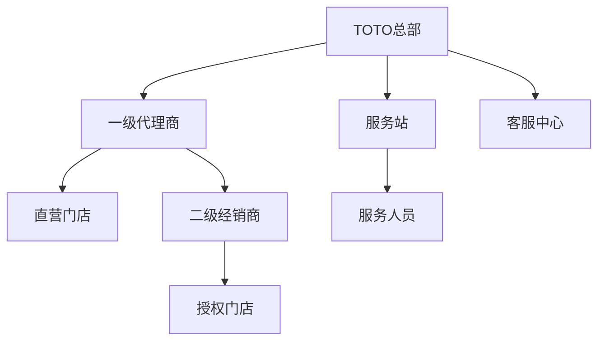
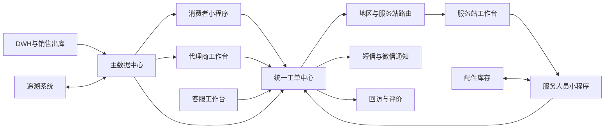
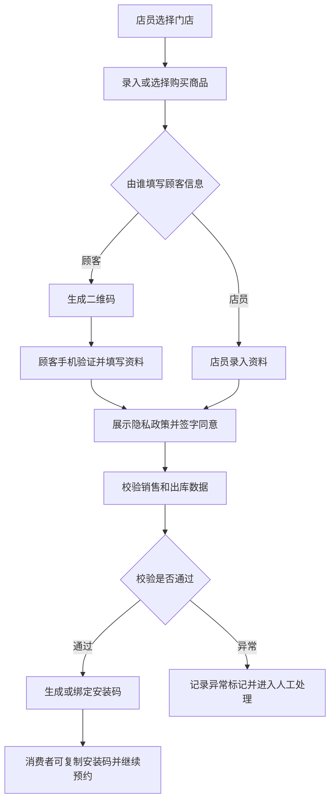
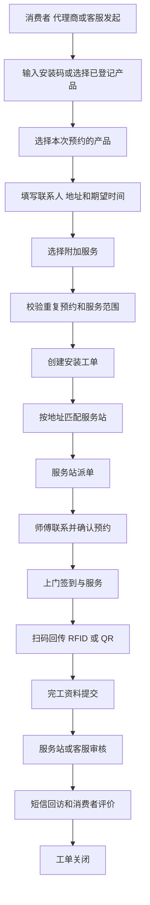
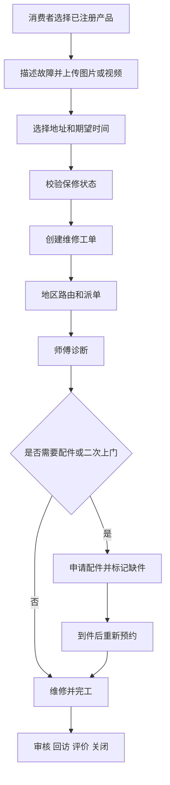
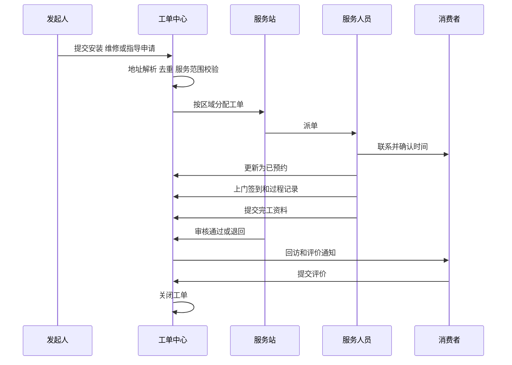
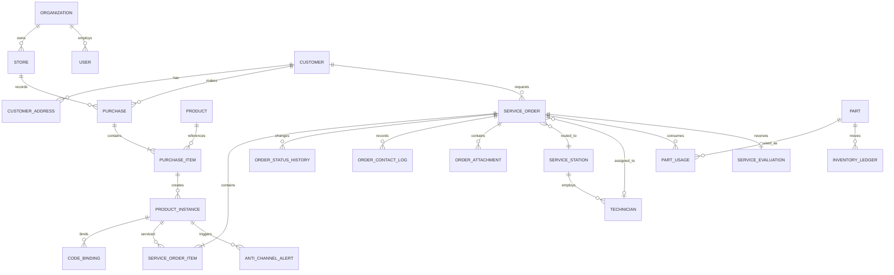

# TOTO售后服务一体化系统 AI开发需求规格与实施计划

版本：V1.0  
编制日期：2026-09-07  
文档状态：需求基线草案  
适用对象：产品负责人、项目经理、架构师、开发、测试及参与开发的 AI Agent

## 1 文档目的

本文档将现有 WL 安装服务系统、客服中心系统、TOTO 服务小程序、安装师傅小程序和追溯相关能力整理为一套可执行的开发基线。文档覆盖业务范围、角色权限、功能清单、流程、状态机、数据模型、接口、非功能要求、验收标准、实施排期和 AI 开发方法。

本文档可直接作为以下工作的上游输入：

- 项目立项与范围确认
- 原型和 UI 设计
- 数据库与接口设计
- 前后端任务拆分
- AI Agent 分阶段编码
- 测试用例编写和验收
- 上线迁移与运维交接

本版本共拆解 119 个功能点、15 条核心业务规则、15 个首期验收场景、14 个实施 Epic 和 10 个上线前阻断问题。

## 2 结论与推荐范围

建议采用“统一业务中台加多端应用”的一体化方案，逐步替换现有 WL 安装服务系统和客服中心系统，并保留与追溯系统、DWH、微信、短信和地图服务的接口。

完整目标范围包括：

1. 统一管理后台，包括主档、代理商、门店、商品、服务区域、防窜货、会员、客服工单、服务站、师傅、配件、系统权限和报表。
2. 代理商工作台，用于门店选择、顾客登记、商品登记、隐私授权、安装预约、退单和查询。
3. 消费者小程序，用于产品注册、安装码绑定、维修或指导预约、网点查询、问卷、服务记录和个人资料。
4. 服务人员小程序，用于任务接收、预约、上门、服务过程记录、完工、交单、配件领退和资料查询。
5. 统一工单中心，承接消费者自助、代理商代客和客服代客三个入口，并完成地区路由、服务站分配、师傅派单、上门服务、审核、回访和评价。
6. 追溯和防窜货能力，兼容 RFID 与 QR 码，关联销售订单、出库、购买登记、安装及维修回传数据。

当前资料没有覆盖客服中心管理后台的完整菜单、权限、派单规则、费用结算和 SLA。相关内容在本文中标记为“建议实现”或“待确认”，在进入对应模块开发前必须完成需求确认。

## 3 信息来源与可信度

### 3.1 来源

- `TOTO售后服务系统调研汇报 v1.2_260803.pptx`
- `菜单功能脑图.docx`
- ProcessOn《TOTO系统调研》179 个主题
- `TOTO售后服务-系统截图/WL安装服务系统-代理商后台`
- `TOTO售后服务-系统截图/WL安装服务系统-管理员后台`
- `TOTO售后服务-系统截图/TOTO服务-小程序`
- `TOTO售后服务-系统截图/安装师傅-小程序`

ProcessOn 地址：<https://www.processon.com/f/6a681a83e50b43092180ded9#TOTO%E7%B3%BB%E7%BB%9F%E8%B0%83%E7%A0%94>

### 3.2 需求标识

| 标识 | 含义 | 使用规则 |
| --- | --- | --- |
| 已确认 | 来源材料或截图明确存在 | 可进入详细设计和开发 |
| 建议实现 | 为形成完整闭环补充的目标能力 | 产品确认后进入开发 |
| 待确认 | 会改变业务、数据或排期的缺失信息 | 未确认前只做技术预留 |
| 暂缓 | 现有系统使用频次低或无数据 | 不进入首期上线范围 |

## 4 项目目标与成功指标

### 4.1 业务目标

- 将安装、维修、指导三类售后服务纳入统一工单体系。
- 统一消费者、代理商、客服、服务站和师傅的协作链路。
- 打通销售订单、RFID 或 QR 码、出库、购买登记、服务记录和评价。
- 降低人工转录和跨系统查询，确保每次状态变化可追踪。
- 支持按区域、代理商、门店、商品、渠道和异常类型进行运营分析。

### 4.2 首期建议验收指标

| 指标 | 目标值 | 统计口径 |
| --- | --- | --- |
| 工单全链路可追踪率 | 100% | 创建至关闭的状态和操作日志完整 |
| 地区自动路由成功率 | 不低于 98% | 地址解析成功且匹配服务区域的工单 |
| 码与订单关联成功率 | 不低于 99.5% | 合法 RFID 或 QR 码的查询请求 |
| 重复工单拦截率 | 100% | 同产品同服务类型的活动工单 |
| 核心接口可用性 | 不低于 99.9% | 生产环境月度统计 |
| 操作审计覆盖率 | 100% | 关键数据新增、修改、删除、导入、导出和状态变化 |
| 核心页面响应时间 | P95 小于 2 秒 | 常规查询，排除批量导入导出 |

指标数值属于建议基线，最终应结合实际业务量和基础设施确认。

## 5 术语

| 术语 | 说明 |
| --- | --- |
| WL | 现有安装服务系统 |
| 服务工单 | 安装、维修或指导服务的统一业务单据 |
| 安装码 | 购买登记后产生并用于安装预约和查询的业务码 |
| 产品实例 | 某一件可追踪的实物产品，可关联 RFID、QR 码或商品条码 |
| 品番 | TOTO 产品型号组合，可包含机能部、底座、水箱等型号 |
| 服务站 | 按服务区域承接工单并派给服务人员的组织 |
| 服务人员 | 使用安装师傅小程序执行服务的人员 |
| 送安一体 | 销售或配送与安装联动的业务标识 |
| 串货或窜货 | 商品实际销售或安装区域、渠道与授权流向不一致 |
| DWH | 向系统提供代理商、订单、出库等主数据或事实数据的数据仓库 |

## 6 用户、组织和权限

### 6.1 组织层级



### 6.2 角色

| 角色 | 主要职责 | 数据范围 |
| --- | --- | --- |
| TOTO 超级管理员 | 全局配置、权限、审计和数据治理 | 全部 |
| TOTO 业务管理员 | 主档、防窜货、会员、问卷和运营查询 | 授权区域或全部 |
| 客服主管 | 队列、派单规则、改派、升级、审核和 SLA | 授权队列和区域 |
| 客服专员 | 受理咨询、代客建单、联系记录和跟进 | 本人或队列工单 |
| 服务站管理员 | 接收区域工单、派师傅、审核和异常处理 | 本服务站 |
| 代理商管理员 | 管理本代理商用户、门店及代客业务 | 本代理商及下属门店 |
| 门店店员 | 顾客登记、商品登记、预约安装和退货 | 当前门店 |
| 服务人员 | 接单、联系客户、上门、服务记录、完工、配件 | 本人任务及库存 |
| 消费者 | 注册产品、发起预约、查询记录、评价 | 本人数据 |
| 审计或只读用户 | 查询和导出授权数据 | 按授权范围 |

### 6.3 权限模型

采用 RBAC 加数据范围控制：

- 功能权限：菜单、页面、按钮和接口四级权限。
- 数据权限：全部、区域、组织、服务站、门店、本人和自定义范围。
- 字段权限：手机号、地址、姓名等敏感字段按角色脱敏。
- 导出权限：单独授权，导出文件加入操作者和时间水印。
- 关键操作：改派、取消、退款、退货、修改码关系、删除主档等需要原因并记录审计日志。

## 7 总体业务架构



### 7.1 端和模块

| 端 | 模块 | 首期 |
| --- | --- | --- |
| 统一管理后台 | 主档、防窜货、顾客、会员、客服、服务站、配件、权限、报表 | 是 |
| 代理商工作台 | 门店选择、顾客登记、产品登记、预约、查询、退货 | 是 |
| 消费者小程序 | 产品注册、维修或指导预约、网点、服务记录、评价、我的 | 是 |
| 服务人员小程序 | 任务、状态、完工、配件、资料、个人中心 | 是 |
| 开放接口 | DWH、追溯、短信、微信、地图及第三方客服 | 是 |
| 会员营销推送 | 标签和推送结果 | 二期 |
| 问卷运营 | 问卷配置、投放和分析 | 二期，首期保留评价问卷 |

## 8 核心业务流程

### 8.1 产品购买登记和安装码



业务规则：

- 门店必须属于当前用户的数据范围。
- 一条购买登记可包含多个产品和数量，每个可追踪产品应形成产品实例。
- 产品类型支持组合品和单品，组合品可记录机能型号、底座型号、水箱型号及扩展型号。
- 使用方式包括本人使用和为朋友购买。
- 必填信息至少包含购买人手机号、使用者姓名、使用地址省市区和详细地址。
- 顾客填写时使用短信验证码确认手机号，提交前展示隐私政策并保留同意版本、签名、时间和来源。
- 系统应防止同一销售明细、商品条码、RFID 或 QR 码重复绑定。
- 退货后保留历史关系，产品实例标记为已退货，不做物理删除。

### 8.2 安装预约



安装预约支持针对部分产品发起。现有资料明确出现的附加服务包括电源改造和拆旧。附加服务是否收费、价格、支付和结算规则待确认。

### 8.3 维修预约



### 8.4 指导服务

指导支持远程指导和上门指导。创建时选择服务方式。远程指导可由客服或服务人员处理并记录沟通结果。上门指导复用地区路由、派单、预约、服务记录和评价流程。

### 8.5 工单派发和执行



### 8.6 防窜货判定

现状判断依据包括销售订单、RFID、仓库发货数据、门店购买信息、商品注册申请信息、预约安装信息和上门安装回传。目标系统应同时支持 RFID 与 QR 码。

建议规则：

| 规则编号 | 异常条件 | 默认等级 |
| --- | --- | --- |
| AC-01 | 没有购买登记 | 中 |
| AC-02 | 没有出库记录 | 高 |
| AC-03 | 商品条码、RFID 或 QR 码重复注册 | 高 |
| AC-04 | 出库代理商与门店代理商不一致 | 中 |
| AC-05 | 安装地址不在门店代理商授权区域 | 中 |
| AC-06 | 安装地址不在出库代理商授权区域 | 高 |
| AC-07 | 零售型与项目型渠道交叉 | 中 |
| AC-08 | 码中的订单、行号、品番与 DWH 不一致 | 高 |

每条命中规则必须保存规则版本、输入快照、判定结果和人工复核结果。规则可配置启停和等级，但规则逻辑的变更必须审计。

## 9 工单状态模型

### 9.1 统一状态

| 状态 | 说明 | 允许的主要动作 |
| --- | --- | --- |
| 草稿 | 信息未提交 | 编辑、删除草稿、提交 |
| 待受理 | 已提交，等待客服或系统处理 | 受理、驳回、补充资料 |
| 待分配服务站 | 地址或规则待匹配 | 自动分配、人工分配 |
| 待派单 | 服务站已接收 | 派师傅、转服务站、取消 |
| 待发布 | 已形成可发布任务 | 发布、撤回 |
| 待接单 | 等待服务人员接收 | 接单、拒单、改派 |
| 待完工 | 服务人员已接单 | 已预约、改期、断联、缺件、取消、修改、完工 |
| 已预约 | 已与客户确认时间 | 上门、改期、取消、断联 |
| 缺件 | 等待配件 | 领料、到件、重新预约、取消 |
| 改期 | 需要重新约定时间 | 重新预约、取消 |
| 断联 | 无法联系客户 | 重试联系、恢复、关闭 |
| 待审核 | 已提交完工资料 | 审核通过、退回修改 |
| 待交单 | 审核通过，等待纸质或财务交单 | 交单、退回 |
| 待回访 | 服务完成，等待回访或评价 | 回访、发送评价、关闭 |
| 已关闭 | 业务完成 | 查看、投诉、复开 |
| 已取消 | 业务终止 | 查看、按权限重开 |

### 9.2 状态要求

- 状态迁移由后端校验，前端不能直接指定任意目标状态。
- 每次迁移记录操作者、来源端、前后状态、时间、原因、备注和附件。
- 取消、拒单、改派、改期、断联、缺件、审核退回和复开必须选择原因。
- “待发布、待审核、待交单”来源于现有师傅小程序，具体责任人和准入条件需与客服中心确认。
- 状态名称可在 UI 中按角色显示别名，但数据库使用统一枚举。

## 10 详细功能需求

功能优先级定义：P0 为首期闭环必需，P1 为首期建议，P2 为二期能力。

### 10.1 统一管理后台

#### 10.1.1 主档管理

| 编号 | 功能 | 优先级 | 需求说明 | 核心验收点 |
| --- | --- | --- | --- | --- |
| ADM-MD-001 | 代理商管理 | P0 | 维护一级代理商、SAP 编号、状态、授权区域和联系方式，支持 DWH 同步 | 同步幂等；停用后不可新建业务但历史可查 |
| ADM-MD-002 | 门店管理 | P0 | 维护二级经销商、授权门店、直营门店、线上门店、线下门店和内购虚拟门店 | 支持实体店性质、非实体店性质、所属代理商、送安一体、营业状态 |
| ADM-MD-003 | 家装公司主档 | P1 | 维护家装公司及外部订单标识 | 可用于购买登记和防窜货查询 |
| ADM-MD-004 | 服务站管理 | P0 | 维护服务站、负责人、服务区域、技能和状态 | 区域重叠时可配置优先级 |
| ADM-MD-005 | 服务区域管理 | P0 | 按省市区、街道或地图围栏维护服务区域 | 地址可定位到唯一或候选服务站 |
| ADM-MD-006 | 商品分类管理 | P0 | 维护大类、中类、小类和营业分类 | 支持树形结构、启停和排序 |
| ADM-MD-007 | 商品管理 | P0 | 维护商品条码、机能型号、规格、颜色、分类和品番组合 | 型号唯一性可配置；停用不影响历史 |
| ADM-MD-008 | 商品系列管理 | P1 | 维护商品系列与商品关系 | 可筛选和批量关联 |
| ADM-MD-009 | 商品图上传 | P1 | 上传主图、详情图和安装参考图 | 文件类型、大小、病毒和权限校验 |
| ADM-MD-010 | 配套品管理 | P1 | 维护组合商品和配套品关系 | 支持有效期和数量 |
| ADM-MD-011 | 服务商品管理 | P0 | 维护安装、维修、指导和附加服务项目 | 支持适用品类、区域、价格类型和启停 |
| ADM-MD-012 | 标签管理 | P2 | 维护会员、渠道和运营标签 | 支持手工及规则来源 |

管理员门店查询字段至少包括：流水号、门店编号、门店名称、门店类型、实体店性质、非实体店性质、所属代理商、状态和送安一体。查询条件包括店面名称、店面编号、所属代理商、店面类型、性质、是否分销商门店、状态和是否送安一体。

#### 10.1.2 防窜货管理

| 编号 | 功能 | 优先级 | 需求说明 | 核心验收点 |
| --- | --- | --- | --- | --- |
| ADM-AC-001 | 窜货查询 | P0 | 组合查看码、商品、出库、购买、注册、预约和上门信息 | 所有来源显示数据时间和来源系统 |
| ADM-AC-002 | 异常条件筛选 | P0 | 按 AC-01 至 AC-08 等规则筛选 | 可多选、保存查询和导出 |
| ADM-AC-003 | 商品条码异常查询 | P0 | 查询重复注册、无出库记录等异常 | 可查看关联记录和人工处置状态 |
| ADM-AC-004 | 安装码一览 | P0 | 展示购买信息、使用次数、登记状态、退单状态和预约状态 | 支持按月导出 |
| ADM-AC-005 | 安装码详情 | P0 | 在一览基础上展示售后回传、出库、服务结果和评价 | 一码关联全过程，不丢失历史版本 |
| ADM-AC-006 | 人工复核 | P1 | 对异常进行确认、误报、备注和关闭 | 保存复核人、时间和证据附件 |
| ADM-AC-007 | 规则配置 | P1 | 配置规则启停、等级和适用范围 | 发布需审批或双人复核 |

窜货查询建议字段：产品分类、型号、商品条码、RFID、QR 原文、销售区域、代理商、渠道、门店代理商、门店、服务预约号、工单回传时间、异常状态、出库日期、仓库名称、销售订单号和订单类型。

#### 10.1.3 顾客和预约查询

| 编号 | 功能 | 优先级 | 需求说明 | 核心验收点 |
| --- | --- | --- | --- | --- |
| ADM-CU-001 | 顾客信息查询 | P0 | 按代理商、门店、日期、手机号、姓名、安装码、登记和预约状态查询 | 未授权角色看到脱敏信息 |
| ADM-CU-002 | 顾客信息详情 | P0 | 查看商品、购买、顾客、地址、预约、退货和服务记录 | 关联记录可追溯至原始单据 |
| ADM-CU-003 | 预约安装信息查询 | P0 | 查看代理商、消费者和客服创建的安装预约 | 支持按状态、区域、日期和服务站筛选 |
| ADM-CU-004 | 数据导入 | P1 | 按模板批量导入购买和顾客数据 | 预检、错误明细、部分失败策略和幂等键 |
| ADM-CU-005 | 数据导出 | P1 | 按权限导出查询结果 | 大数据量异步导出，文件限时下载 |

截图中已确认的顾客列表字段包括 SAP 代理商编号、代理商名称、SAP 门店号、门店名称、购买日期、商品数量、店员姓名、顾客手机、顾客姓名、使用者地址、预约状态和 VIP。

#### 10.1.4 客服工单中心

本节为形成业务闭环的建议实现，需完成客服中心补充调研后定版。

| 编号 | 功能 | 优先级 | 需求说明 | 核心验收点 |
| --- | --- | --- | --- | --- |
| CS-001 | 统一受理台 | P0 | 电话、微信、消费者、代理商和接口工单进入统一队列 | 显示来源并保留原始会话或来源号 |
| CS-002 | 顾客识别 | P0 | 按手机号、会员、安装码、商品码匹配顾客和产品 | 支持合并重复顾客但保留合并记录 |
| CS-003 | 代客建单 | P0 | 创建安装、维修或指导工单 | 与自助入口使用相同校验和状态机 |
| CS-004 | 服务站分配 | P0 | 自动或人工选择服务站 | 记录规则结果和人工覆盖原因 |
| CS-005 | 师傅派单 | P0 | 按区域、技能、负载、时间和可用性派单 | 支持派单、抢单或混合模式配置 |
| CS-006 | 工单跟进 | P0 | 记录电话、微信、短信和人工备注 | 时间线按时间排序且不可删除，只可纠错 |
| CS-007 | 改派与转单 | P0 | 跨师傅、服务站或队列改派 | 校验数据权限并通知相关方 |
| CS-008 | 异常处理 | P0 | 处理取消、拒单、断联、改期、缺件和投诉 | 原因必填，支持升级和复开 |
| CS-009 | 完工审核 | P0 | 核对服务结果、码、照片、签名和配件 | 审核退回保留原提交版本 |
| CS-010 | 回访评价 | P0 | 发送短信或微信评价，支持人工回访 | 一单只计一次有效评价，修改需审计 |
| CS-011 | SLA 管理 | P1 | 配置受理、派单、预约、完工和回访时限 | 超时预警、升级和统计 |
| CS-012 | 知识库 | P1 | 客服可检索产品、故障和处理指引 | 版本、生效时间和适用品番可追踪 |
| CS-013 | 投诉管理 | P1 | 建立投诉、责任认定、处理和回访子流程 | 投诉可关联原工单并独立计时 |
| CS-014 | 费用和结算 | 待确认 | 服务费、附加服务、配件、支付、退款和结算 | 业务确认前不进入开发 |

#### 10.1.5 服务站和服务人员

| 编号 | 功能 | 优先级 | 需求说明 | 核心验收点 |
| --- | --- | --- | --- | --- |
| STA-001 | 服务站工作台 | P0 | 查看待接收、待派单、执行中、待审核和异常工单 | 仅查看本服务站或授权范围 |
| STA-002 | 服务人员管理 | P0 | 维护人员、手机号、技能、区域、状态和企业 | 停用人员不能接新单 |
| STA-003 | 排班和可用性 | P1 | 维护工作日、休假、每日容量和临时停单 | 派单时过滤不可用人员 |
| STA-004 | 派单看板 | P0 | 按列表和地图查看任务与人员 | 支持批量派单和冲突提示 |
| STA-005 | 完工审核 | P0 | 审核完工材料并退回 | 审核人不能改写原始服务记录 |
| STA-006 | 服务质量 | P1 | 查看时效、一次完工率、评价和投诉 | 指标可按人员、站点、区域统计 |

#### 10.1.6 配件和库存

| 编号 | 功能 | 优先级 | 需求说明 | 核心验收点 |
| --- | --- | --- | --- | --- |
| PRT-001 | 配件主档 | P0 | 配件编号、名称、图片、工厂、价格和适用品番 | 配件编号唯一 |
| PRT-002 | 多级库存 | P0 | 仓库、服务站和服务人员库存 | 每笔变动形成库存流水 |
| PRT-003 | 领料单 | P0 | 服务人员选择仓库、配件和数量提交领料 | 状态支持领料中、已领料、已拒绝、已撤销 |
| PRT-004 | 退料单 | P0 | 服务人员退回未用或故障配件 | 支持原因、数量和实物状态 |
| PRT-005 | 调拨单 | P1 | 仓库、站点或人员之间调拨 | 出入库双方确认 |
| PRT-006 | 工单耗用 | P0 | 完工时登记实际耗用配件 | 自动扣减库存并关联工单 |
| PRT-007 | 盘点和调整 | P1 | 盘点、差异确认和库存调整 | 调整需要授权和审计 |

#### 10.1.7 会员、问卷和推送

| 编号 | 功能 | 优先级 | 需求说明 | 核心验收点 |
| --- | --- | --- | --- | --- |
| MEM-001 | 会员查询 | P1 | 查询全部注册会员和产品关系 | 支持脱敏和数据范围 |
| MEM-002 | 会员标签 | P2 | 按行为、产品、区域和人工标记打标签 | 保存标签来源和更新时间 |
| MEM-003 | 推送任务 | P2 | 选择人群和内容发送政策或服务信息 | 支持审核、去重和退订 |
| MEM-004 | 推送结果 | P2 | 查看成功、失败和失败原因 | 可按渠道和批次统计 |
| SUR-001 | 评价问卷 | P0 | 完工后评价满意度、意见和问题标签 | 与工单一一关联 |
| SUR-002 | 产品问卷 | P2 | 针对购买产品的满意度调查 | 支持配置、投放和结果查询 |

现有系统中的问卷调查“未使用、无数据”，首期只实现服务完工评价。独立产品问卷和营销推送放入二期。

#### 10.1.8 系统管理

| 编号 | 功能 | 优先级 | 需求说明 | 核心验收点 |
| --- | --- | --- | --- | --- |
| SYS-001 | 角色管理 | P0 | 维护 TOTO 角色和代理商角色 | 角色可配置默认首页和状态 |
| SYS-002 | 权限管理 | P0 | 配置菜单、按钮、接口和数据范围 | 后端接口强制校验 |
| SYS-003 | 系统用户 | P0 | 管理 TOTO、客服、服务站用户 | 支持启停、重置和登录策略 |
| SYS-004 | 代理商用户 | P0 | 管理代理商和门店用户 | 用户必须绑定组织或门店 |
| SYS-005 | 服务人员账号 | P0 | 账号与服务人员档案绑定 | 支持切换企业但权限隔离 |
| SYS-006 | 操作日志 | P0 | 查询关键操作日志 | 内容含对象、前后值摘要和请求标识 |
| SYS-007 | 登录日志 | P0 | 查询成功和失败登录 | 记录 IP、设备、时间和失败原因 |
| SYS-008 | 字典与参数 | P0 | 状态原因、业务字典、通知模板和系统参数 | 参数变更可回滚并审计 |
| SYS-009 | 导入导出中心 | P1 | 统一管理异步任务和文件 | 文件加密、限时下载和自动清理 |

### 10.2 代理商工作台

| 编号 | 功能 | 优先级 | 需求说明 | 核心验收点 |
| --- | --- | --- | --- | --- |
| DLR-001 | 登录和门店选择 | P0 | 用户登录后选择所属直营或授权门店 | 不得选择未授权门店，记住最近门店可配置 |
| DLR-002 | 门店信息 | P0 | 查看当前门店类型、状态和送安一体标识 | 只读数据来自主档 |
| DLR-003 | 线下门店顾客登记 | P0 | 创建购买和顾客记录 | 支持顾客填写或店员填写 |
| DLR-004 | 虚拟门店顾客登记 | P0 | 创建线上或内购虚拟门店记录 | 区分来源和虚拟门店性质 |
| DLR-005 | 商品编辑与确认 | P0 | 增减商品、编辑品番组合和数量 | 确认后锁定，修改需保留版本 |
| DLR-006 | 顾客扫码填写 | P0 | 生成二维码供顾客填写 | 二维码短时有效、一次性或绑定会话 |
| DLR-007 | 店员填写 | P0 | 手机验证后录入使用者资料 | 验证码限流并校验授权 |
| DLR-008 | 隐私政策与签名 | P0 | 展示隐私政策并采集同意签名 | 保存政策版本、签名图片哈希和时间 |
| DLR-009 | 顾客信息查询 | P0 | 查看本门店购买记录 | 支持查看、编辑、编辑商品、预约和退单 |
| DLR-010 | 安装预约 | P0 | 对未预约或部分预约产品发起安装 | 支持期望时间和附加服务 |
| DLR-011 | 再次预约 | P0 | 对未完成预约或符合规则的产品重新发起 | 不产生非法重复活动工单 |
| DLR-012 | 退货操作 | P0 | 整单退货或删除退货商品 | 已有服务记录时按规则限制并提示 |
| DLR-013 | VIP 标识 | P1 | 标记是否 VIP | 现状依赖销售政策人工判断，规则待确认 |
| DLR-014 | 查询与导出 | P1 | 按代理商、门店、顾客、日期、状态查询 | 数据范围强制过滤 |

代理商顾客登记已确认字段：产品分类、机能部型号、底座型号、水箱型号及扩展商品型号、数量、VIP、备注、购买人手机号、短信验证码、使用方式、使用者姓名、使用地址省市区和详细地址。

### 10.3 消费者小程序

| 编号 | 功能 | 优先级 | 需求说明 | 核心验收点 |
| --- | --- | --- | --- | --- |
| CAPP-001 | 微信授权登录 | P0 | 获取 openid 并绑定手机号或会员 | 未授权不读取非必要信息 |
| CAPP-002 | 首页轮播 | P1 | 后台配置广告轮播和跳转 | 按有效期和状态展示 |
| CAPP-003 | 注册 TOTO 产品 | P0 | 扫码或输入码，登记购买产品 | 码校验成功后生成产品实例关系 |
| CAPP-004 | 登记购买信息 | P0 | 完善购买日期、门店、商品、使用者和地址 | 与代理商扫码回填流程共用表单能力 |
| CAPP-005 | 安装码展示 | P0 | 展示并复制安装码 | 仅本人可见，复制行为不暴露其他信息 |
| CAPP-006 | 售后预约 | P0 | 发起维修或指导申请 | 安装入口是否开放给消费者待确认 |
| CAPP-007 | 故障描述和媒体 | P0 | 描述故障并上传图片或视频 | 支持压缩、断点重试和内容安全检查 |
| CAPP-008 | 网点查询 | P1 | 查找授权门店和维修网点 | 支持列表、地图、电话和导航 |
| CAPP-009 | 客户服务 | P0 | 展示客服电话和微信客服 | 号码和渠道后台可配置 |
| CAPP-010 | 个人信息及偏好 | P1 | 维护姓名、手机号、常用地址和通知偏好 | 变更手机号需二次验证 |
| CAPP-011 | 我的产品 | P0 | 查看产品注册、产品和服务记录 | 支持按产品进入售后预约 |
| CAPP-012 | 我的购买记录 | P0 | 查看购买日期、门店、产品、数量和安装码 | 仅展示本人或已授权记录 |
| CAPP-013 | 我的问卷 | P1 | 查看待填写和已填写问卷 | 防止重复提交 |
| CAPP-014 | 隐私权条款 | P0 | 查看当前及历史同意条款 | 支持撤回授权和账户注销流程 |
| CAPP-015 | 服务评价 | P0 | 对已完工工单评分和填写意见 | 评价窗口和匿名策略待确认 |

### 10.4 服务人员小程序

#### 10.4.1 任务

| 编号 | 功能 | 优先级 | 需求说明 | 核心验收点 |
| --- | --- | --- | --- | --- |
| WAPP-001 | 任务搜索 | P0 | 按任务号、联系人或地址搜索 | 只查本人或授权任务 |
| WAPP-002 | 状态页签 | P0 | 待完工、待发布、待审核、待交单、断联任务 | 计数与列表一致 |
| WAPP-003 | 任务卡片 | P0 | 显示任务号、地址、客户、电话、产品、服务项目、期望时间和沟通记录 | 敏感信息按权限展示 |
| WAPP-004 | 任务地图 | P1 | 在地图中查看任务分布和任务详情 | 只展示当前可见任务 |
| WAPP-005 | 联系客户 | P0 | 拨打电话或复制号码并记录联系结果 | 不自动录音，录音需单独授权 |
| WAPP-006 | 状态变更 | P0 | 已预约、取消、断联、改期和缺件 | 原因和备注按状态要求必填 |
| WAPP-007 | 修改任务 | P0 | 修改备用电话、地址补充和任务备注等允许字段 | 禁止修改来源关键字段 |
| WAPP-008 | 上门签到 | P0 | 到达后基于时间和位置签到 | 定位权限拒绝时走人工说明流程 |
| WAPP-009 | 服务过程 | P0 | 记录检测、处理方案、服务项目、照片和配件 | 草稿可离线保存并续传 |
| WAPP-010 | RFID 或 QR 扫码 | P0 | 扫描并回传产品码 | 支持扫码失败手工输入和复核 |
| WAPP-011 | 完工 | P0 | 提交服务结果、照片、客户确认或签名 | 缺少必填证据时禁止提交 |
| WAPP-012 | 交单 | P0 | 查看和提交待交单任务 | 交单定义和凭证待客服调研确认 |

现有任务卡片已确认展示：预约上门地址、期望上门时间、客户联系方式、历史沟通记录、产品或组合品番、服务类型、附加服务和备注。现有完工页面可见产品、序列编号、RFID、购买渠道、经销店名、购买日期、工厂代码、用水、服务类型和服务方式等字段。

#### 10.4.2 配件和应用

| 编号 | 功能 | 优先级 | 需求说明 | 核心验收点 |
| --- | --- | --- | --- | --- |
| WAPP-013 | 我的配件 | P0 | 查看配件编号、名称、单价和可用库存 | 区分仓库与个人库存 |
| WAPP-014 | 领件 | P0 | 选择配件和数量提交领料单 | 数量不可超过可领规则，状态可追踪 |
| WAPP-015 | 退料 | P0 | 提交退料及原因 | 库存回补需审核或扫码确认 |
| WAPP-016 | 领料单 | P0 | 查看领料中、已领料、已拒绝和已撤销 | 状态和库存流水一致 |
| WAPP-017 | 退料单 | P0 | 查看退料记录 | 可关联工单 |
| WAPP-018 | 调拨单 | P1 | 查看或处理调拨 | 权限和接收确认可配置 |
| WAPP-019 | 延保资料 | P1 | 按项目、区域或品番查询延保资料 | 显示有效期和适用范围 |
| WAPP-020 | 技术资料 | P1 | 搜索安装手册、说明书和视频 | 支持关键词、品番和版本筛选 |

#### 10.4.3 我的

| 编号 | 功能 | 优先级 | 需求说明 | 核心验收点 |
| --- | --- | --- | --- | --- |
| WAPP-021 | 问题反馈 | P1 | 提交问题、图片和联系方式 | 可查询处理进度 |
| WAPP-022 | 修改密码 | P0 | 修改非微信登录密码 | 需旧密码或二次验证 |
| WAPP-023 | 切换企业 | P0 | 切换服务人员所属企业 | 切换后立即重算权限和数据范围 |
| WAPP-024 | 退出登录 | P0 | 清除本地登录态 | 服务端令牌失效 |

## 11 页面清单

### 11.1 管理后台页面

1. 登录、首页、个人中心。
2. 代理商列表和详情。
3. 门店列表、详情、批量导入。
4. 家装公司、服务站、服务区域。
5. 商品分类、商品、系列、图片、配套品、服务商品。
6. 窜货查询、条码异常、安装码列表和详情、异常复核。
7. 顾客列表、顾客详情、预约安装列表和详情。
8. 客服受理台、工单列表、工单详情、派单看板、异常队列、回访和投诉。
9. 服务人员、排班、技能和服务质量。
10. 配件、仓库、库存流水、领料、退料、调拨和盘点。
11. 会员、标签、问卷、推送和结果。
12. 角色、用户、权限、字典、参数、通知模板和日志。
13. 报表中心和导入导出中心。

### 11.2 代理商工作台页面

1. 登录和选择门店。
2. 门店信息。
3. 线下门店顾客登记。
4. 虚拟门店顾客登记。
5. 商品编辑和确认。
6. 顾客扫码填写二维码页。
7. 隐私政策和签名。
8. 顾客查询和详情。
9. 安装预约和预约详情。
10. 退货确认。

### 11.3 消费者小程序页面

1. 首页。
2. 服务聚合页。
3. 产品注册和购买信息。
4. 产品注册成功和安装码。
5. 维修或指导预约。
6. 网点列表、地图和详情。
7. 客服入口。
8. 我的产品、购买记录、服务记录和问卷。
9. 个人信息、偏好、隐私条款和注销。
10. 评价页。

### 11.4 服务人员小程序页面

1. 任务列表、搜索、地图和详情。
2. 状态变更、修改任务和沟通记录。
3. 上门签到、服务过程、扫码和完工。
4. 我的配件、配件详情和领退料。
5. 领料单、退料单和调拨单。
6. 延保资料、技术资料和资料详情。
7. 问题反馈、修改密码、切换企业和退出。

## 12 数据模型

### 12.1 核心实体关系



### 12.2 核心表建议

| 表或聚合 | 关键字段 | 说明 |
| --- | --- | --- |
| organization | id、type、parent_id、sap_code、name、status | TOTO、代理商、经销商、服务站等组织 |
| store | id、organization_id、sap_store_code、name、store_type、physical_type、virtual_type、status、delivery_install_flag | 门店主档 |
| service_area | id、station_id、region_codes、geofence、priority、effective_from、effective_to | 服务区域和优先级 |
| user | id、account、mobile、name、status、last_login_at | 后台和工作台账号 |
| role、permission、user_role | role_type、data_scope、permission_code | RBAC 与数据范围 |
| customer | id、mobile_hash、mobile_ciphertext、name_ciphertext、member_no、status | 顾客敏感字段加密存储 |
| customer_address | id、customer_id、province、city、district、street、detail_ciphertext、lng、lat | 常用或使用地址 |
| product | id、barcode、functional_model、base_model、tank_model、spec、color、category_id、series_id、status | 商品主档 |
| purchase | id、store_id、customer_id、purchase_date、source、operator_id、vip_flag、use_for、status | 购买登记头 |
| purchase_item | id、purchase_id、product_id、quantity、return_quantity、sales_order_no、sales_order_line | 购买明细 |
| product_instance | id、purchase_item_id、serial_no、installation_code、warranty_start、warranty_end、status | 可追踪实物 |
| code_binding | id、instance_id、code_type、code_value_hash、code_ciphertext、source、bound_at、status | RFID、QR、商品条码和序列号 |
| consent_record | id、customer_id、policy_version、scene、signature_url、agreed_at、revoked_at、source | 隐私同意证据 |
| service_order | id、order_no、type、source、customer_id、address_id、station_id、technician_id、expected_at、status、priority、sla_deadline | 统一工单 |
| service_order_item | id、order_id、instance_id、service_product_id、problem_desc、warranty_result | 工单产品 |
| order_status_history | id、order_id、from_status、to_status、reason_code、remark、operator、created_at | 状态历史 |
| order_contact_log | id、order_id、channel、result、content、contact_at、operator | 沟通记录 |
| order_attachment | id、order_id、stage、file_type、url、sha256、created_by | 图片、视频、签名和凭证 |
| service_result | id、order_id、diagnosis、solution、result_code、completed_at、customer_signature | 完工结果 |
| service_evaluation | id、order_id、score、tags、comment、submitted_at | 服务评价 |
| anti_channel_alert | id、instance_id、rule_code、severity、input_snapshot、status、reviewer | 防窜货异常 |
| part | id、part_no、name、factory、unit_price、status | 配件主档 |
| inventory_account | id、owner_type、owner_id、part_id、available_qty、locked_qty | 库存余额 |
| inventory_ledger | id、account_id、business_type、business_no、in_qty、out_qty、balance_after、occurred_at | 不可变库存流水 |
| material_order | id、type、source_owner、target_owner、status、related_order_id | 领料、退料或调拨单 |
| integration_event | id、event_type、aggregate_id、payload、status、retry_count、next_retry_at | 集成事件和重试 |

### 12.3 数据约束

- 所有业务表使用不可变主键，外部编号单独建唯一索引。
- 工单号、安装码和导入批次号由服务端生成，不依赖前端时间。
- 手机号、姓名、详细地址、签名等敏感数据加密存储，搜索使用哈希或受控索引。
- 状态历史、库存流水、审计日志和隐私同意记录不允许物理删除。
- 主档停用优先于删除，已经被业务引用的记录禁止删除。
- 所有表包含创建人、创建时间、更新人、更新时间和乐观锁版本。
- 外部同步数据保存 source_system、source_id、source_updated_at 和 raw_version。
- 文件存对象存储，数据库保存元数据、哈希、业务关系和访问权限。

## 13 接口和集成

### 13.1 集成清单

| 集成方 | 方向 | 数据 | 方式 | 关键要求 |
| --- | --- | --- | --- | --- |
| DWH | DWH 到本系统为主 | 代理商、门店、销售订单、出库、仓库 | 定时增量加按需查询 | 幂等、断点续传、对账 |
| 追溯系统 | 双向 | RFID、QR、商品、订单、流向、服务回传 | API 加事件 | 同时兼容 RFID 和 QR 参数 |
| 微信小程序 | 双向 | 登录、手机号、订阅消息、二维码场景值 | 微信开放能力 | openid 与业务账号解耦 |
| 短信平台 | 本系统到平台 | 验证码、预约、派单、回访通知 | API | 模板、限流、回执和重试 |
| 地图服务 | 双向 | 地址解析、坐标、距离、导航 | API | 坐标系统一、缓存和降级 |
| 对象存储 | 双向 | 图片、视频、签名、导出文件 | SDK 或 API | 私有桶、临时签名、防病毒 |
| 现有客服渠道 | 双向 | 电话或微信会话、来源号 | API 或人工过渡 | 未完成调研前采用适配层 |

### 13.2 QR 码建议格式

现有材料示例：`销售订单号;行号;品番;序号`。系统应将原文作为证据保存，同时解析为结构化字段。

建议解析结果：

```json
{
  "raw": "2001327528;50;TCF33320GCN#W;8-1",
  "salesOrderNo": "2001327528",
  "salesOrderLine": "50",
  "productModel": "TCF33320GCN#W",
  "serialSegment": "8-1",
  "codeType": "QR",
  "schemaVersion": "1"
}
```

二维码结构、签名和防伪校验方式待追溯系统确认。不要只依赖分号切割作为安全校验。

### 13.3 API 设计原则

- 使用版本化 REST API，事件推送使用 Webhook 或消息队列。
- 写接口支持 `Idempotency-Key`，避免小程序重试造成重复购买或工单。
- 列表统一使用分页、排序、过滤和字段级权限。
- 状态变更使用专用动作接口，例如 `POST /orders/{id}/actions/complete`，不使用通用更新接口改状态。
- 返回统一错误码、用户提示和链路追踪标识。
- 外部回调验证签名、时间戳和重放窗口。
- 批量导入采用上传、预检、确认、执行、结果下载五步流程。
- 大文件和导出使用异步任务，不占用同步请求。

### 13.4 建议 API 分组

| 分组 | 示例 |
| --- | --- |
| auth | 登录、刷新令牌、退出、验证码、微信登录 |
| organizations | 代理商、门店、服务站、服务区域 |
| catalog | 分类、商品、系列、配套品、服务商品、配件 |
| customers | 顾客、地址、购买、产品实例、安装码、同意记录 |
| service-orders | 建单、查询、派单、状态动作、沟通、附件、完工、评价 |
| anti-channel | 码查询、异常查询、规则、复核 |
| inventory | 库存、流水、领料、退料、调拨、盘点 |
| membership | 会员、标签、问卷、推送 |
| system | 用户、角色、权限、字典、参数、日志、导入导出 |
| integrations | DWH、追溯、短信、微信、地图、Webhook |

## 14 业务校验规则

| 编号 | 规则 |
| --- | --- |
| BR-001 | 创建购买登记前必须确认当前门店有效且用户有权限。 |
| BR-002 | 同一商品实例只能存在一个有效安装码。 |
| BR-003 | 同一产品实例和服务类型只能存在一个活动工单，复开除外。 |
| BR-004 | 可对一次购买中的部分产品预约，未选产品保持未预约状态。 |
| BR-005 | 已退货产品不可新建安装工单，维修是否允许需按售后政策配置。 |
| BR-006 | 地址必须完成省市区结构化；地图解析失败允许人工确认，但必须留痕。 |
| BR-007 | 分配服务站时按有效区域、优先级、服务能力和容量匹配。 |
| BR-008 | 服务人员接单后才可预约和上门，特殊强派需主管权限。 |
| BR-009 | 完工必须包含服务结果；安装或维修还需产品码回传和规定照片。 |
| BR-010 | 缺件必须关联配件需求；恢复任务前记录到件或替代方案。 |
| BR-011 | 审核退回后保留原完工版本和退回原因。 |
| BR-012 | 评价只能由工单顾客或有效授权人提交。 |
| BR-013 | 退货、取消、改派、改期、断联、拒单和人工覆盖规则必须记录原因。 |
| BR-014 | 导入数据先预检，错误行不进入正式业务表。 |
| BR-015 | 接口同步使用外部业务键和版本号实现幂等。 |

## 15 非功能需求

### 15.1 安全和隐私

- 后台使用短期访问令牌加刷新令牌，支持单点登录作为扩展。
- 管理员和高权限用户启用多因素认证。
- 服务端执行权限和数据范围校验，前端隐藏按钮不能替代授权。
- TLS 保护传输，数据库和对象存储对敏感内容加密。
- 日志禁止输出验证码、令牌、完整手机号、详细地址和二维码原文。
- 隐私政策采用版本化管理，记录同意、撤回、注销和数据删除或匿名化流程。
- 小程序按最小必要原则申请手机号、定位、相机和相册权限，拒绝授权时提供可行替代。
- 导入文件进行格式、大小、恶意内容和权限检查。
- 关键接口启用限流、设备或 IP 风险控制和重放保护。

### 15.2 性能和容量

- 常规列表查询 P95 小于 2 秒，详情 P95 小于 1.5 秒。
- 工单状态提交 P95 小于 1 秒，外部通知采用异步处理。
- 支持至少 100 万顾客、500 万产品实例和 1000 万工单状态记录的水平扩展。
- 批量导入单批建议不超过 5 万行，超出时拆分。
- 图片客户端压缩，原图与缩略图分开存储；视频限制时长和大小。
- 热点字典、服务区域和商品主档可缓存，缓存失效不影响正确性。

容量数字为技术设计建议，正式容量需依据历史数据和增长预测校准。

### 15.3 可用性和容灾

- 核心服务月可用性不低于 99.9%。
- 数据库每日全量备份和持续增量备份，建议 RPO 不超过 15 分钟、RTO 不超过 2 小时。
- 外部系统不可用时，工单主流程可保存，集成事件进入重试和人工补偿队列。
- 消息、Webhook 和导入任务支持失败重试、死信、告警和人工重放。
- 小程序服务过程表单支持草稿和弱网重试，防止重复提交。

### 15.4 可观测性

- 每个请求、工单和外部调用带 trace_id。
- 监控接口错误率、延迟、队列堆积、任务失败、短信失败、地址解析失败和同步差异。
- 审计日志与应用日志分开存储，审计日志保留周期按合规要求设置。
- 建立业务监控：建单量、待派单、超时工单、缺件、审核退回、一次完工率和评价率。

### 15.5 兼容和体验

- 管理后台支持当前主流 Chrome 和 Edge 最近两个大版本。
- 微信小程序兼容业务确认的最低基础库版本。
- 表单有明确必填、格式、错误定位和提交状态。
- 后台列表支持列配置、固定列、保存查询、分页和导出。
- 图片上传提供压缩进度、失败重试和删除确认。
- 所有日期时间在服务端使用 UTC 或带时区时间戳，界面按中国标准时间展示。

## 16 报表与运营分析

首期建议报表：

1. 工单量：按服务类型、来源、区域、服务站、门店、商品和日期。
2. 时效：受理、派单、首次联系、预约、完工、审核和关闭时长。
3. 质量：一次完工率、改期率、断联率、取消率、审核退回率、评价率和满意度。
4. 防窜货：规则命中量、等级、区域、代理商、商品和复核结果。
5. 配件：领料、退料、调拨、工单耗用、库存周转和差异。
6. 产品和会员：注册量、购买量、安装码使用、服务次数和复购或活跃情况。
7. 接口质量：DWH 差异、追溯查询失败、短信失败和重试量。

报表默认读取业务明细或只读副本。数据量增大后建设分析模型，不在交易库执行大范围自由聚合。

## 17 技术实现建议

本节是缺少现有代码和技术约束时的默认方案，可在技术评审中替换。

### 17.1 推荐技术栈

| 层 | 默认建议 | 说明 |
| --- | --- | --- |
| 代码仓库 | pnpm monorepo | 共享类型、规范和 SDK |
| 管理后台 | Vue 3、TypeScript、Vite、Element Plus | 与现有后台形态接近，适合复杂表单和列表 |
| 小程序 | uni-app 或原生微信小程序加 TypeScript | 两个小程序可共享基础能力，复杂原生能力单独封装 |
| 后端 | NestJS、TypeScript | 模块边界清晰，适合 AI 分模块开发 |
| 数据库 | PostgreSQL | 交易、一致性、JSON 和空间扩展能力较好 |
| 缓存和队列 | Redis 加可靠消息队列 | 验证码、缓存、任务、通知和集成事件 |
| 对象存储 | S3 兼容对象存储 | 图片、视频、签名和导出文件 |
| 搜索 | PostgreSQL 起步，必要时 Elasticsearch | 首期避免额外复杂度 |
| API 文档 | OpenAPI 3.1 | 自动生成 SDK 和契约测试 |
| 部署 | Docker 加 CI/CD | 环境一致、可回滚 |

### 17.2 模块边界

建议先采用模块化单体，按以下领域拆分，保留未来独立部署的边界：

- IAM：认证、账号、角色、权限和数据范围。
- Organization：代理商、门店、服务站、人员和区域。
- Catalog：商品、分类、系列、服务商品和配件。
- Customer：顾客、地址、购买、产品实例、码绑定和同意记录。
- ServiceOrder：工单、派单、状态、沟通、完工、评价和投诉。
- AntiChannel：追溯数据和异常判定。
- Inventory：库存、领料、退料、调拨和耗用。
- Engagement：会员、标签、问卷和推送。
- Integration：DWH、追溯、短信、微信、地图和文件。
- Reporting：报表、导入导出和统计。

首期不建议拆成大量微服务。工单、库存和码关系需要较强一致性，模块化单体更容易完成正确实现和整体测试。

### 17.3 代码仓库建议

```text
apps/
  admin-web/
  dealer-web/
  consumer-miniapp/
  technician-miniapp/
  api/
packages/
  contracts/
  domain-types/
  api-client/
  ui-shared/
  miniapp-shared/
  config/
  test-fixtures/
docs/
  requirements/
  architecture/
  api/
  decisions/
  runbooks/
```

### 17.4 一致性策略

- 购买、产品实例和码绑定在同一事务内提交。
- 工单状态使用状态机和乐观锁，避免重复动作和并发覆盖。
- 库存余额和流水在同一事务中更新，余额以流水可重算。
- 外部通知使用事务外盒模式，业务提交成功后可靠发布。
- DWH 和追溯同步以外部业务键、版本和更新时间进行幂等处理。

## 18 测试与验收

### 18.1 测试层级

- 单元测试：状态机、地区路由、防窜货规则、码解析、权限和库存计算。
- 集成测试：数据库事务、消息、文件、DWH、追溯、短信、微信和地图适配器。
- API 契约测试：OpenAPI 请求响应、错误码、幂等和权限。
- 端到端测试：三种入口、三类服务、异常状态、完工审核和评价。
- 安全测试：越权、数据范围、敏感信息泄露、上传、限流和重放。
- 性能测试：工单查询、状态提交、批量导入、防窜货查询和报表。
- 迁移测试：抽样核对主档、购买、安装码、工单、码关系和库存。

### 18.2 首期关键验收场景

| 编号 | 场景 | 验收结果 |
| --- | --- | --- |
| UAT-001 | 代理商登记购买，顾客扫码填写并签名 | 生成购买记录、产品实例和安装码，证据完整 |
| UAT-002 | 代理商对部分产品预约安装 | 只选产品进入工单，其余仍可预约 |
| UAT-003 | 消费者对已注册产品报修并上传图片 | 工单进入正确区域和队列，附件可查 |
| UAT-004 | 客服代客创建指导工单 | 来源标记正确，复用统一状态机 |
| UAT-005 | 地址自动分配服务站并派师傅 | 匹配规则、结果和通知均可追踪 |
| UAT-006 | 师傅改期、断联和缺件 | 状态合法，原因必填，时间线完整 |
| UAT-007 | 师傅扫码、使用配件并完工 | 码回传、库存扣减和完工资料一致 |
| UAT-008 | 完工审核退回后重新提交 | 两次提交版本均保留 |
| UAT-009 | 消费者评价后关闭工单 | 评价唯一，工单关闭，报表更新 |
| UAT-010 | 重复 QR、无出库和跨区域数据 | 命中对应异常规则并可人工复核 |
| UAT-011 | 未授权门店用户访问其他门店数据 | 接口拒绝，前端无数据，日志记录 |
| UAT-012 | 外部接口短时失败 | 主业务成功，事件重试后最终一致 |
| UAT-013 | 同一提交被小程序重复发送 | 幂等返回同一业务结果，不生成重复单据 |
| UAT-014 | 批量导入包含错误行 | 预检列出错误，正式执行不写入错误行 |
| UAT-015 | 顾客撤回隐私授权或申请注销 | 按规则停止营销并执行删除或匿名化流程 |

### 18.3 完成定义

每个功能只有满足以下条件才算完成：

- 需求编号、原型和接口契约已确认。
- 数据库迁移可执行并可回滚。
- 前后端实现通过 lint、类型检查和目标测试。
- 权限、错误处理、审计和敏感信息处理已覆盖。
- OpenAPI 和必要操作文档已更新。
- 核心路径在测试环境完成验收。
- 没有阻断级或高优先级缺陷。

## 19 开发排期

### 19.1 排期假设

基线排期按 16 周、5 至 6 人核心团队估算：

- 1 名产品或项目负责人，兼业务确认。
- 1 名后端负责人和 1 名后端开发。
- 1 名管理后台前端。
- 1 名小程序前端，消费者和服务人员端串行或部分并行。
- 1 名测试，可在中期进入。
- 架构、UI、运维和数据人员按阶段投入。
- 使用 AI Agent 辅助需求拆分、样板代码、契约、测试和文档，但人工负责业务决策、评审和验收。

完整范围包含尚未调研清楚的客服管理后台，因此 16 周为紧凑基线。若在第 2 周结束前仍无法确认客服规则，整体应顺延或将客服高级功能拆入二期。

### 19.2 16 周基线计划

| 周期 | 里程碑 | 主要工作 | 交付物和退出条件 |
| --- | --- | --- | --- |
| 第 1 周 | 需求冻结准备 | 补充客服调研、确认角色、状态、派单、附加服务和接口责任 | 待确认事项有负责人和截止日期；P0 范围初定 |
| 第 2 周 | 需求基线 | 原型、字段字典、状态机、权限矩阵、接口清单、迁移盘点 | P0 需求评审通过；冻结首期验收场景 |
| 第 3 周 | 技术骨架 | 仓库、CI、环境、认证、权限框架、数据库基础、OpenAPI | 可部署空系统；登录和权限冒烟通过 |
| 第 4 周 | 主档一 | 组织、代理商、门店、用户、角色、数据范围、DWH 适配骨架 | 主档可同步和查询；权限隔离通过 |
| 第 5 周 | 主档二 | 商品、分类、系列、服务商品、服务站、服务区域 | 购买和路由需要的主档齐备 |
| 第 6 周 | 顾客购买 | 顾客、地址、购买、商品实例、安装码、隐私同意 | 代理商登记闭环通过 UAT-001 |
| 第 7 周 | 代理商工作台 | 门店选择、两类登记、扫码回填、查询、退货 | DLR P0 功能可测试 |
| 第 8 周 | 工单内核 | 三类工单、来源、去重、状态机、时间线、附件和通知事件 | API 测试覆盖状态合法性和幂等 |
| 第 9 周 | 客服与路由 | 受理台、顾客识别、地区路由、服务站队列和派单 | UAT-003 至 UAT-005 通过 |
| 第 10 周 | 师傅端任务 | 任务列表、详情、联系、状态变更、地图和签到 | WAPP-001 至 WAPP-008 可用 |
| 第 11 周 | 服务完工 | 服务过程、扫码、完工、审核、回访和评价 | UAT-006 至 UAT-009 通过 |
| 第 12 周 | 配件库存 | 配件、库存、领料、退料、工单耗用和流水 | UAT-007 的库存部分通过 |
| 第 13 周 | 消费者端 | 产品注册、购买记录、维修或指导预约、我的和客服 | 消费者核心旅程端到端通过 |
| 第 14 周 | 防窜货和报表 | RFID 或 QR、规则、异常复核、安装码详情、核心报表 | UAT-010 通过；外部数据可对账 |
| 第 15 周 | 联调和迁移演练 | 全链路回归、性能、安全、数据迁移、培训和上线预案 | 无阻断缺陷；迁移演练和回滚演练通过 |
| 第 16 周 | 试点上线 | 小范围代理商、服务站和客服试点，监控和修复 | 试点指标达标后决定扩大范围 |

### 19.3 并行工作流

| 工作流 | 第 1 至 4 周 | 第 5 至 8 周 | 第 9 至 12 周 | 第 13 至 16 周 |
| --- | --- | --- | --- | --- |
| 产品和设计 | 调研、原型、规则 | 工单和小程序细化 | 验收和变更控制 | 培训、试点反馈 |
| 后端 | 骨架、IAM、主档 | 顾客、购买、工单 | 路由、完工、库存 | 追溯、报表、优化 |
| 管理后台 | 登录、主档、权限 | 顾客和代理商 | 客服、服务站、库存 | 防窜货、报表、修复 |
| 小程序 | 基础框架、登录 | 消费者登记基础 | 师傅任务和完工 | 消费者售后、联调 |
| 测试 | 测试计划和数据 | API 自动化 | 端到端和安全 | 性能、迁移、UAT |
| 数据和集成 | 接口摸底和映射 | DWH 主档 | 追溯、短信、地图 | 对账、迁移、监控 |

### 19.4 单人使用 AI 开发的现实排期

若由一名全栈开发者主导并使用 AI Agent，建议按 24 至 28 周安排：

| 阶段 | 周期 | 范围 |
| --- | --- | --- |
| A 基础和主档 | 4 周 | 仓库、环境、认证、权限、组织、门店、商品、服务区域 |
| B 购买和代理商 | 4 周 | 顾客、购买、码、隐私同意、代理商工作台 |
| C 工单和客服 | 5 周 | 三类工单、状态机、队列、路由、派单、时间线 |
| D 服务人员端 | 4 周 | 任务、状态、签到、扫码、完工和资料 |
| E 消费者端 | 3 周 | 注册、预约、记录、客服和评价 |
| F 配件和防窜货 | 3 周 | 库存、领退料、规则、异常查询和复核 |
| G 集成和上线 | 3 至 5 周 | DWH、追溯、短信、地图、迁移、性能、安全和试点 |

单人模式不应同时开发多个复杂端。应按“后端契约完成一个纵向业务切片，再完成对应界面和测试”的方式推进。

### 19.5 二期建议

- 会员行为标签和营销推送。
- 产品满意度问卷和高级分析。
- 智能派单、路线优化和容量预测。
- 客服知识推荐和工单摘要。
- 费用、支付、退款和服务商结算。
- 更完整的投诉、质检和服务绩效。
- 独立数据仓库和自助分析。

## 20 首期任务拆分和依赖

### 20.1 建议 Epic 顺序

| Epic | 内容 | 依赖 | 建议完成周 |
| --- | --- | --- | --- |
| E01 | 工程基础、环境和 CI | 无 | 3 |
| E02 | 认证、用户、角色和数据权限 | E01 | 4 |
| E03 | 组织、代理商、门店、服务站和区域 | E02 | 5 |
| E04 | 商品、服务商品和配件主档 | E02 | 5 |
| E05 | 顾客、购买、产品实例、码和隐私同意 | E03、E04 | 6 |
| E06 | 代理商登记和预约 | E05 | 7 |
| E07 | 工单内核和状态机 | E03、E04、E05 | 8 |
| E08 | 客服受理、路由、派单和异常 | E07 | 9 |
| E09 | 师傅任务、服务过程和完工 | E07、E08 | 11 |
| E10 | 配件库存和工单耗用 | E04、E09 | 12 |
| E11 | 消费者注册、预约、记录和评价 | E05、E07 | 13 |
| E12 | 防窜货、追溯和异常复核 | E05、集成接口 | 14 |
| E13 | 报表、导入导出和审计 | 各业务 Epic | 14 |
| E14 | 迁移、非功能测试和试点 | 全部 P0 | 16 |

### 20.2 最小可上线切片

如果需要缩小首期，可先上线以下闭环：

1. 代理商和门店主档。
2. 商品和服务区域主档。
3. 代理商顾客登记和安装码。
4. 安装工单、地区分配、服务站派单。
5. 师傅接单、预约、扫码和完工。
6. 审核、短信回访和评价。
7. 基础权限、日志、查询和导出。

维修、指导、配件、防窜货高级规则和消费者自助可在同一架构上连续补齐。若项目目标是一次性替换全部系统，则不能采用该缩减范围。

## 21 上线和数据迁移

### 21.1 迁移范围

- 组织、代理商、门店、服务站、服务区域和用户。
- 商品、分类、系列、服务商品和配件。
- 顾客、购买、安装码、产品实例和码关系。
- 未关闭工单和必要历史工单。
- 配件库存余额及可追溯期内的流水。
- 角色、权限、字典和参数。

### 21.2 迁移步骤

1. 数据盘点并确定来源系统主责。
2. 建立字段映射、清洗规则和唯一键策略。
3. 完成全量试迁移并生成差异报告。
4. 业务抽样核对顾客、安装码、工单和库存。
5. 上线前冻结窗口执行增量同步。
6. 切流后对账，保留旧系统只读访问。
7. 达到稳定期后按合规要求归档旧系统。

### 21.3 切换策略

- 优先选择一个区域、代理商和服务站进行试点。
- 试点期间旧系统只接收明确的回退业务，避免双写。
- 每日核对新建工单、状态、码回传、库存和通知结果。
- 预先定义回退条件、负责人、数据补偿和用户通知。

## 22 风险和应对

| 风险 | 影响 | 应对 |
| --- | --- | --- |
| 客服后台未调研 | 工单状态、权限和排期可能重做 | 第 2 周前完成现场调研和样例单据收集 |
| 多系统数据主责不清 | 同一字段冲突和覆盖 | 建立字段级主数据责任矩阵 |
| RFID 与 QR 规则未定 | 防窜货和扫码返工 | 固定码契约版本，兼容解析器和原文留存 |
| 地区规则复杂或重叠 | 错派和人工量增加 | 规则优先级、模拟工具和人工覆盖留痕 |
| 现有数据质量差 | 迁移失败和重复顾客 | 预清洗、重复识别、差异报告和业务抽样 |
| 附加服务和费用不清 | 预约与结算范围失控 | 首期只记录项目，支付结算单独立项 |
| 小程序弱网和重复提交 | 重复单据或资料丢失 | 草稿、幂等键、断点重试和状态回查 |
| 权限只在前端控制 | 数据越权 | 服务端统一策略和越权自动化测试 |
| 配件库存并发 | 负库存和账实不符 | 锁定量、事务、不可变流水和盘点 |
| 一次替换范围过大 | 上线风险高 | 试点、分批切流、旧系统只读和回退预案 |

## 23 待确认问题

### 23.1 上线前阻断项

| 编号 | 问题 | 需要谁确认 | 最晚时间 |
| --- | --- | --- | --- |
| Q-001 | 客服中心后台完整菜单、角色、队列和工单状态是什么 | 客服中心负责人 | 第 2 周 |
| Q-002 | 三个入口分别允许创建哪些服务类型，消费者是否可预约安装 | 业务负责人 | 第 2 周 |
| Q-003 | 工单由总部、客服还是服务站派给师傅，是否存在抢单 | 售后运营 | 第 2 周 |
| Q-004 | 待发布、待审核、待交单的准入条件和责任人 | 客服和服务站 | 第 2 周 |
| Q-005 | 服务区域按行政区、街道、围栏还是组合规则维护 | 售后运营 | 第 2 周 |
| Q-006 | 安装、维修、指导的必填字段、照片、签名和完工标准 | 售后运营 | 第 2 周 |
| Q-007 | 附加服务、配件和收费服务的价格、支付、退款和结算是否进首期 | 财务和业务 | 第 2 周 |
| Q-008 | QR 码正式格式、签名方式和追溯接口契约 | 追溯系统负责人 | 第 3 周 |
| Q-009 | DWH 提供哪些主档和事实数据，增量方式、频率和 SLA 是什么 | DWH 负责人 | 第 3 周 |
| Q-010 | 历史数据迁移年限、数据量和旧系统保留方式 | 业务、合规、IT | 第 3 周 |

### 23.2 可配置但需确认项

- VIP 的判断来源和变更权限。
- 送安一体的业务含义和系统动作。
- 保修起止日、保修判定和有偿维修规则。
- 断联重试次数、间隔和自动关闭条件。
- 改期次数、提前量和服务容量限制。
- 评价有效期、匿名方式和差评升级规则。
- 顾客合并、手机号换绑和亲友代办规则。
- 隐私授权撤回、账户注销和数据保留期限。
- 服务人员定位采集范围和保存期限。
- 操作日志、业务附件和导出文件保留期限。

## 24 AI 开发执行规范

### 24.1 AI 每次任务必须提供的上下文

向 AI Agent 下发任务时至少提供：

1. 本文档版本和相关功能编号。
2. 当前仓库结构和适用的 `AGENTS.md`。
3. 相关领域模型、状态机和业务规则编号。
4. 已确认的页面或原型。
5. OpenAPI 契约、错误码和权限要求。
6. 本任务允许修改的目录和禁止修改的内容。
7. 验收场景和必须运行的测试。

### 24.2 单任务模板

```text
目标：实现 [功能编号和名称]

业务依据：
- 需求：[本文件章节或功能编号]
- 规则：[BR 编号]
- 状态：[相关状态及允许迁移]

范围：
- 必须实现：
- 不在本任务：
- 允许修改目录：

接口和数据：
- OpenAPI 路径：
- 主要实体：
- 权限和数据范围：
- 幂等或并发要求：

验收：
- 场景：
- 自动化测试：
- 需要运行的 lint、typecheck、test 命令：

交付：
- 代码
- 数据库迁移
- 接口文档
- 测试
- 必要的变更说明
```

### 24.3 推荐开发顺序

AI 不应直接从页面开始生成全部系统。每个业务切片按以下顺序完成：

1. 明确需求编号和验收场景。
2. 定义领域对象、枚举、状态和数据库约束。
3. 更新 OpenAPI 契约和共享类型。
4. 实现后端用例、权限、事务和审计。
5. 编写单元和集成测试。
6. 实现前端页面或小程序交互。
7. 补充端到端测试和错误场景。
8. 执行代码评审、测试和文档检查。

### 24.4 AI 代码约束

- 不自行发明未确认的业务规则。缺失规则使用配置、占位接口或明确的待办，不用隐含默认值。
- 不把状态修改实现为通用 CRUD。所有状态动作进入状态机。
- 不在前端复制关键业务判断，后端返回可执行动作和原因。
- 不绕过数据权限获取跨门店、跨服务站或跨用户数据。
- 不在日志、测试快照和错误信息中暴露真实敏感数据。
- 不为未来假设过度拆分微服务或增加无实际用途的抽象。
- 每个数据库迁移支持回滚或提供明确的数据恢复方案。
- 外部依赖通过适配器和契约测试隔离，测试环境使用可控模拟。
- 每次实现只覆盖一个可验收纵向切片，避免一次生成大量不可验证代码。

### 24.5 AI 评审清单

每次合并前让独立 AI Agent 或人工检查：

- 是否完整覆盖指定功能编号和验收场景。
- 是否违反工单状态机或产生非法状态跳转。
- 是否存在越权、IDOR、敏感数据泄露和批量导出风险。
- 是否正确处理幂等、并发、事务、重试和外部失败。
- 是否记录审计、状态历史和库存流水。
- 是否遗漏错误提示、空状态、弱网和重复提交。
- 自动化测试是否验证业务结果，而不只是代码行。
- 文档、OpenAPI 和数据库迁移是否同步。

## 25 项目文档清单

本需求基线确认后，项目中应持续维护：

| 文档 | 内容 | 责任人 |
| --- | --- | --- |
| 产品需求规格 | 本文档及变更记录 | 产品负责人 |
| 字段字典 | 页面、接口、数据库字段定义和敏感等级 | 产品和后端 |
| 权限矩阵 | 角色、功能、数据范围和字段权限 | 产品和安全 |
| 状态机 | 状态、动作、条件、原因和通知 | 产品和后端 |
| API 契约 | OpenAPI、错误码、幂等和回调 | 后端负责人 |
| 数据映射 | DWH、追溯、旧系统和新系统字段 | 数据负责人 |
| 架构决策记录 | 重要技术选择和替代方案 | 架构负责人 |
| 测试计划 | 测试范围、环境、数据和退出标准 | 测试负责人 |
| 迁移方案 | 迁移、对账、切换和回退 | 数据和项目负责人 |
| 运维手册 | 部署、监控、告警、备份和故障处理 | 运维负责人 |

## 26 需求变更规则

- 需求变更必须关联本文件功能编号或新增编号。
- 变更记录包含原因、影响端、数据影响、接口影响、排期影响和验收变化。
- 已进入开发的 P0 变更由产品、技术和测试共同评估。
- 影响状态机、码关系、库存、权限或隐私的变更必须单独评审。
- 未确认项转为已确认时，更新本文档版本并同步 OpenAPI、原型和测试。

## 27 首次启动建议

项目启动后的前十个工作日只做会显著降低返工的工作：

1. 现场补调研客服中心管理后台，收集真实工单和异常案例。
2. 召开状态机工作坊，确定每个动作、责任人、原因和通知。
3. 完成角色权限与数据范围矩阵。
4. 确认 DWH 和追溯接口，拿到样例数据和错误码。
5. 盘点旧系统数据量、重复率和迁移年限。
6. 产出购买登记、安装预约、维修、指导、派单、完工和评价原型。
7. 用本文 UAT-001 至 UAT-015 逐条走查原型。
8. 冻结 P0 范围后建立仓库、CI、环境和基础架构。

完成以上事项后，再按 E01 至 E14 顺序进入持续交付。
