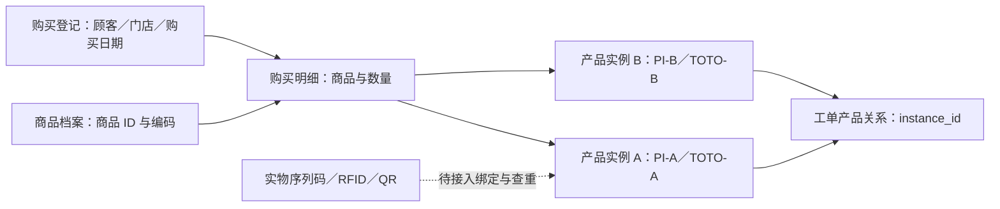
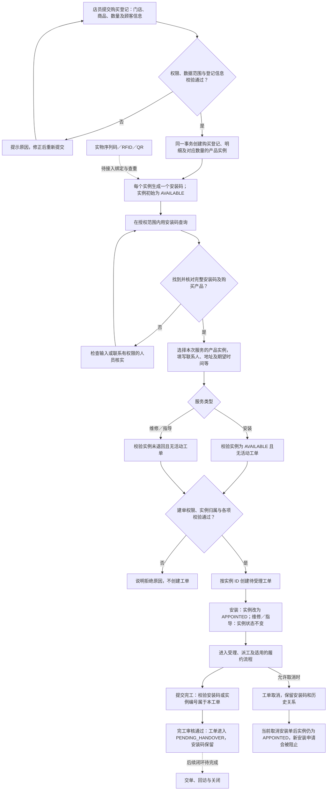

# 安装码管理恢复与标识关系核查

- 状态：待验收（查询入口恢复及研发验证完成，完整追溯业务与正式角色验收待完成）。
- 日期：2026-09-12。
- 应用／角色：Web 管理后台／总部运营、客服作业。
- 入口／需求：A38；ADM-AC-004、ADM-AC-005；沿用 FS-039。
- 用户确认：2026-09-12 明确要求恢复安装码管理，并整理安装码与商品码关系及可用于售后的边界。授权覆盖本次入口恢复和项目文档整理；没有确认一码粒度、有效期、实物绑定或售后状态机的新规则。
- 关联：[原查询切片](2026-09-10-顾客预约与工单查询全栈首版.md)、[此前菜单删除记录](2026-09-11-后台菜单与工作视角收敛.md)、[完整业务说明](2026-09-12-安装码管理恢复与标识关系核查.md#implementation-details)。

## 1. 恢复范围

恢复 `gaia-ui/apps/after-sales` 的 `afsInstallationCode` 功能、`/antiDiversion/installationCode` 路由、图标、总部／客服业务查询菜单及安装码分页页面，继续调用已有后端只读 API。保留当前工作区其他导航和工作台改动，不恢复已删除的家装公司、服务项目、门店独立安装申请记录。

每行对应产品实例，展示安装码、实例编号、商品编码／名称、购买登记、门店、购买日期和状态。按关键词和状态筛选，复用 `FaPageMain`、`EsSearch`、`EsTable`、`useListPage`，支持分页、加载／空态、查询失败重试及权限失败重试。

购买登记链接仅在对应记录可读且目标菜单可达时启用；落到既有购买记录定位页并由该页承接完整详情。商品编码链接同样校验商品读取权限和目标菜单，进入现有商品定位页。当前安装码后端只有分页接口，本轮不通过安装码权限读取其他资源详情，也不新增独立详情接口。

本轮没有后端或数据库模型变更，没有新增生成、修改、删除、核销、导出、实物绑定或消费者认领能力。安装码字段及原权限配置在前次删除菜单时仍保留，是否在当前登录态可达需浏览器验证。

## 2. 接口与权限

| 接口 | 用途 | 权限与范围 |
| --- | --- | --- |
| `GET /api/afterSales/customer/permissions` | 读取 `installationCodes.read` 与关联资源权限 | 统一登录态和 Gaia API 权限；初始化失败显示重试，拒绝时不查询业务列表 |
| `GET /api/afterSales/customer/installation-codes` | 关键词、实例状态及分页查询 | 独立安装码读权限；后端限定当前租户及授权门店／代理商数据范围 |
| 既有购买记录页面与详情 API | 从登记单号进入相关记录 | 另外校验 `customerArchive.read` 和目标菜单可达，不能借安装码权限代读 |
| 既有商品权限与页面 | 从商品编码定位商品档案 | 另外校验商品 `products.read` 与目标菜单；可选商品权限加载失败只降级该链接 |

前端 API 适配继续处理 Gaia 响应码与 `rows/records` 分页，ID 保持字符串。当前本地宿主 servlet context 为 `/api`，由前端统一代理处理，不在本页单独拼接第二套网关路径。

## 3. 标识核查结论

- 当前安装码是 `afs_product_instance.installation_code`，后台登记按数量逐实例生成；工单通过实例 ID 建关系。
- 商品编码与条码是商品档案字段，不能区分同商品的每一件实物；当前无实物序列码／RFID／QR 与实例的绑定、去重或外部追溯校验。
- 安装码可在已授权范围内查找产品记录并进入安装／维修／指导建单，不能替代本人身份、数据权限、服务资格或实物验真。
- 实例预约状态、活动工单检查和完工码校验决定当前可执行动作；没有安装码次数扣减、有效期或核销机制。
- 取消安装后实例占用未释放、`CLOSED` 未从活动工单统计排除，分别登记为 BUG-20260912-03（取消后重约或仅复开策略待确认）、BUG-20260912-04（终态统计冲突已由源码确认）。本轮只记录证据，不借恢复菜单修改未确认状态机。
- “一单一码／一件一码”、码生命周期和消费者认领仍保留待确认边界，详见业务说明。

## 4. 验证标准

| 场景 | 标准 |
| --- | --- |
| 角色与菜单 | 总部、客服的业务查询包含安装码；服务站、门店不扩大入口；既有功能保持 |
| 直接访问与拒绝 | 有菜单及 API 权限可进入；无权时拒绝或显示无权态，不请求列表 |
| 列表查询 | 初次、筛选、重置、翻页每次仅一次列表请求；分页使用已提交筛选条件 |
| 异常 | 权限或列表加载失败有明确错误和重试；旧请求不覆盖新状态 |
| 关联 | 有目标菜单与读取权限时可定位购买登记；无权或无有效 ID 时降级文本 |
| 桌面页面 | 表格撑满剩余区域，空态／加载态分页稳定，字段可读 |
| 构建与回归 | 相关测试、类型检查、生产构建通过；文档相对链接和当前计数一致 |

## 5. 实施与验证记录

- 代码基线：`gaia-ui` 位于 `feature/20260907_蓝鲸售后服务_志远_喆宇`，开始时与缓存 upstream 差异 0／0；存在工作台、导航、通用 UI 等未提交并发改动，原样保留。
- 文档基线：`docs/toto` 位于 `main`，开始时相对缓存 upstream 落后 1，存在原型／导航／工作台等未提交改动；未自动拉取、提交或覆盖。
- 后端核查：只读源码和迁移脚本；未连接业务库制造状态场景，未修改后端或执行数据库迁移。
- 当前范围：基于开始时已存在的 47 功能／16 分组／40 去重侧栏并发导航，增加 A38 后为 48 功能／16 分组／41 去重侧栏、61 处视角菜单引用；Web 有效入口 60、已有真实实现 38，全项目有效入口 93，最终验收仍为 0。
- 前端自动化：Node 22 下本次定向 46／46 项通过，覆盖导航角色、查询参数白名单、安装码独立权限、缺失授权拒绝、权限与列表失败重试、筛选／重置／分页单次查询及已应用条件保持。真实页面 setup 与现有 `useListPage` 参与测试，API 使用隔离替身。
- 类型检查及生产构建：通过，恢复页面生成独立懒加载产物；保留构建工具既有提示。
- 全量测试：211 项中 208 通过、3 项既有失败，分别为 `form-components` 的既有表单占位符检查、`network-master` 的 Node 无扩展名模块解析、`service-resource` 旧夹具缺新增人员字段。相关源码／测试不是本次修改，未将全量结果写成通过。
- 真实登录态浏览器：本机 9010、原有管理员会话，分别核对总部／客服业务查询组的安装码入口，并打开真实后端返回的空列表；未新增权限或购买样例，正式独立角色和有数据写链路不以此替代。
- 隔离浏览器：`apps/after-sales/tests/browser/installation-code.html` 使用真实页面和 35 条独立数据，验证分页、筛选、重置后列表请求累计为 1 → 2 → 3 → 4，筛选／重置回到第 1 页；无安装码权限时列表请求为 0，无关联权限时登记链接为 0；权限失败重试后权限／列表请求为 2／1，列表失败重试后为 1／2。长 ID 登记单链接进入原购买记录定位页，完整详情仅发一次读取并显示相同安装码。桌面截图核对表格内部滚动及底部分页；不写真实业务数据。
- 文档与独立复核：文档影响检查及 `git diff --check` 通过，当前入口／菜单计数与源码一致；独立源码复核纠正商品编码与型号混用、缺陷编号冲突及取消后业务策略状态，新增局部文件引用均可读取。
- 完整业务验收：待正式角色、真实购买／实例及状态机闭环验证；恢复查询入口不计最终验收完成。
- Git：本次改动保留工作区，未提交、未推送。
- 知识维护：用户已授权整理项目内文档，本轮不访问或同步外部知识库。

> 以下保留原文与原时点结论，未完成项仍待处理；本次仅合并承载位置，不构成重新执行或新增授权。

<!-- preserved-source:implementation-details:start -->

# TOTO 售后服务｜安装码与商品标识及售后使用说明

> 后续设计阅读提示（2026-09-12）：用户已明确，当前程序及文档中的安装码逻辑尚未经其业务验证，通用注册绑定设计不必沿用这些实现。本文保留此前核查时点；新的三路径方案、TOTO 兼容方式及审核边界见[商品注册与绑定逻辑及流程](../02-技术设计/08-商品注册绑定与服务资格核验.md)，其中建议细节仍待确认。

- 核对日期：2026-09-12。
- 来源：当前售后源码、既有需求与 Spec；本次用户要求恢复安装码管理并梳理完整逻辑。
- 口径：下文明确区分当前实现、目标需求和待确认事项；恢复查询入口不代表实物追溯或完整售后闭环已经验收。
- 关联实施：[安装码管理恢复与标识关系核查](2026-09-12-安装码管理恢复与标识关系核查.md)。

## 1. 安装码现在能不能作为唯一标识

**可以作为当前租户内一条已登记产品实例的业务查找标识，用来找到购买关系并进入售后；尚不能作为真实实物已经唯一识别、本人拥有或享有服务资格的证明。**

后台真正关联工单的是产品实例 ID。操作人员可以先用安装码检索，再核对购买记录及产品，选择实例申请服务；不能仅持有码就绕过登录、菜单／接口权限、门店数据范围和状态校验。

现有后台已具备安装、维修、指导建单和部分履约能力，但消费者认领、实物码绑定、取消后安装重约和关闭后再次服务仍有缺口。因此“能凭码找到记录办理一次服务”与“已经支持同一实物完整生命周期售后”须分别判断。

## 2. 商品码、产品实例码与安装码的关系

“商品码”在页面和业务沟通中可能指不同东西，讨论或设计接口时必须说清具体字段。

| 名称 | 标识对象 | 当前存储与作用 | 能否区分同型号的两件实物 |
| --- | --- | --- | --- |
| 商品编码 | 售后商品档案的一种商品 | `afs_product.code`；购买明细保留 `product_id` 及编码／名称快照 | 不能；同商品的多件购买共用同一商品档案 |
| 商品型号 | 商品档案上的型号属性 | `afs_product.model`，与商品编码分存；是否判重由型号配置控制 | 不能；不是每件实物的序列编号 |
| 商品档案条码 | 商品主档上的条码属性 | `afs_product.barcode`；是否判重由 `unique_barcode` 配置控制（初始化默认关闭，未核查当前环境配置），不是逐件实物登记表 | 不能据该字段认定；即使在商品主档中唯一，也只区分商品档案，不区分该商品的每件实物 |
| 产品实例 ID／实例编号 | 登记时按数量展开的一件产品记录 | `afs_product_instance.id`、`instance_no`；编号生成格式为 `PI-<实例ID>` | 能区分系统记录，尚不能证明对应哪一台实物 |
| 安装码 | 上述产品实例的业务识别码 | 同表 `installation_code`，当前生成格式为 `TOTO-<实例ID>`，有唯一索引 | 同样只能保证登记记录可区分；实物去重需额外绑定事实 |
| 实物序列码／RFID／QR 标签码 | 目标上用于识别或核验某件实物的外部标识 | 现有购买登记没有接入与产品实例的绑定、查重、出库校验链路 | 取决于外部码标准及唯一性；普通二维码也可能只表示型号或网页，不能仅凭载体认定逐件唯一 |

依据：[商品模型][catalog-model]、[条码判重规则][catalog-policy]、[购买与实例结构][customer-ddl]、[登记实现][customer-service]。

例如一笔购买登记中，同一商品档案的购买数量为 2：当前后台创建 2 条实例记录和 2 个安装码。它们关联同一购买明细和商品档案。此时系统知道“购买了两件该商品”，还没有凭实物码证明哪一台对应哪个安装码。

## 3. 当前安装码从生成到使用的过程

### 安装码流程总览

下图按当前后台实现绘制：实线表示已有流程，虚线表示待接入的能力；安装码用于查找，实际建单仍以产品实例 ID 关联。

图中的校验按当前代码执行，不代表实物验真或售后资格已完整接通。取消后重约／复开策略、`CLOSED` 被误计为活动工单的问题见第 3.5 节；安装码有效期、使用次数及核销尚未实现，不能从流程图推断无限次可用。

### 3.1 生成

1. 已授权店员选择当前数据范围内的有效售后门店、商品，录入购买日期、顾客／使用地址、数量并确认政策版本。
2. 后端校验门店归属、商品和提交字段，创建购买登记与明细。
3. 按每项数量逐件创建产品实例，同时生成实例编号和安装码，初始实例状态为 `AVAILABLE`。
4. 顾客、购买、明细、实例和同意记录在同一事务保存；任一失败整体回滚。同一请求 ID 重试可复用已有登记，避免请求重发多建一单。

**请求幂等不等于实物去重。** 换一个请求 ID 再登记相同商品和数量，当前没有实物码或销售明细键可证明是同一实物，不能保证拦截重复登记。现有生成格式是代码事实，不是已确认的消费者可输入码标准。

需求中的“销售／出库校验后生成或绑定”、消费者短信验证和签名等属于后续完整链路，不能从现有店员登记成功推断已经实现。见[首版范围](2026-09-10-顾客预约与工单查询全栈首版.md)。

### 3.2 查询与定位

- 独立“安装码管理”恢复在总部运营、客服作业的业务查询组，读取现有安装码分页接口。
- 每行是一条实例，展示安装码、实例编号、商品编码／名称、购买登记、门店、购买日期和实例状态；支持关键词与状态筛选。
- 购买记录、服务受理、工单也支持用安装码查找。当前关键词是模糊查询，必须核对完整安装码及产品，不能把模糊查询的第一条直接当成唯一命中。
- 跳转购买记录还需要该目标菜单及读取权限；安装码查询权限不会自动授予顾客完整详情或建单权限。
- 租户由统一身份和数据源机制隔离，门店／代理商范围在后端 SQL 过滤。安装码唯一索引约束的是所在数据库表，不能据此宣称跨所有租户全局唯一。

依据：[查询与数据范围 SQL][customer-mapper]、[安装码恢复 Spec](2026-09-12-安装码管理恢复与标识关系核查.md)。

### 3.3 申请安装、维修或指导

| 操作 | 当前检查与结果 | 不能据此推断的能力 |
| --- | --- | --- |
| 门店申请安装 | 从同一已确认购买登记选择 1～100 个不同实例；要求 `AVAILABLE` 且无活动工单；创建待受理安装工单，实例改为 `APPOINTED` | 不代表已分配师傅、确认上门时间、免费安装或实物验真 |
| 客服代客建安装单 | 同样校验登记、实例归属、`AVAILABLE` 和活动工单 | 安装码不是直接写接口的唯一参数，仍需联系人、地址和期望时间等 |
| 客服建维修／指导单 | 已退回实例拒绝建单；检查活动工单；维修／指导创建不把实例改成 `APPOINTED` | 不代表保修资格、支付、退货政策或完整回访关闭流程已经接通 |
| 查看历次工单 | 工单通过 `afs_service_order_item.instance_id` 关联原实例，详情显示该实例安装码 | “码未核销”不等于当前可以无限次重复建单 |

所有建单路径均校验权限及数据范围，实例校验使用事务和行锁。当前活动工单检查针对实例全部服务类型，严于需求 BR-003 的“同实例、同服务类型”口径；跨类型并行策略应在后续状态机契约中统一，不能从界面可选择推断允许并发。

### 3.4 完工时的“产品码”

当前完工表单的“产品码”实际接受**本工单某个实例的安装码或实例编号**。后端匹配成功后保存完工材料并推进审核状态，没有核销或变更安装码。

这是系统记录归属检查，尚不是读取实物标签并向追溯系统验真的实现。当前单次完工提交只校验一个码属于工单的任一实例，也不能把多件商品工单的一次提交解读为每件实物均已独立核验。依据：[完工流程][workflow-service]、[完工码校验 SQL][workflow-mapper]。

### 3.5 状态、取消与再次售后

`AVAILABLE / APPOINTED / RETURNED` 是产品实例状态；安装码当前没有独立的有效期、使用次数、失效／换码／核销状态机。

| 情形 | 当前实现结论 | 后续处理 |
| --- | --- | --- |
| 首次安装建单 | `AVAILABLE → APPOINTED` | 继续按工单状态受理、分站、派工和审核 |
| 取消安装工单 | 工单改为 `CANCELLED`，当前没有同步恢复实例为 `AVAILABLE` | 再申请安装会被阻止；见 [BUG-20260912-03](../03-开发管理/07-后续开发与交互优化待办.md#bug-20260912-03)；复开原异常工单是另一条能力，不等于自动释放后新建 |
| 工单已有 `CLOSED` 状态 | 活动工单 SQL 未排除 `CLOSED`，会把它计入活动工单 | 可能阻止后续维修／指导；见 [BUG-20260912-04](../03-开发管理/07-后续开发与交互优化待办.md#bug-20260912-04) |
| 完工审核通过 | 当前专用工作流推进到 `PENDING_HANDOVER` | 尚不能称已实现回访、交单、关闭完整闭环；上述 `CLOSED` 问题不代表当前已有关闭写接口 |
| 退货 | 表结构与建单检查已有 `RETURNED` 状态；完整退货写流程仍待业务规则 | 保留历史，不能把手动改状态作为退货功能 |
| 安装码过期或使用次数 | 没有对应字段和执行逻辑 | 有效期、次数和是否需要换码仍待确认；不能将“未实现限制”写成已确认永久有效政策 |

以上状态缺口来自本轮源码核查，未在共享业务库制造数据复现；本次恢复入口不改变这些状态机。

## 4. 消费者端的边界

消费者 v0.4 原型已按当前码关系调整：以手动选择商品、填写购买日期及个人信息为登记主流程；产品标签码只辅助识别商品，不证明实物唯一性或本人归属，也不以相同商品码阻止再次登记同款产品。新登记不生成、借用或自动关联安装码。

安装码页面改为使用说明，找码页面改为联系门店／客服的指引，均不提供输入码认领或手机号找回流程。只有原本已关联安装码的示例产品保留只读展示，帮助向门店／客服查记录。v0.3 的安装码认领成功链和双码自动关联同一实物的假定已被本次原型修订取代，旧入口也不能继续该成功链。

真实消费者小程序目前仍是页面框架。身份、短信、购买人与使用者关系、认领权限、重复实物合并和码校验 API 尚未接通；本次收敛原型不等于永久禁止消费者认领，后续是否开放及核验规则仍须确认。见[原型 v0.4 调整说明](../04-页面原型/小程序/01-两端小程序设计说明.md#12-消费者-v04--按当前码关系调整登记原型)。

## 5. 要形成完整售后标识链路，仍需确认或实现什么

| 事项 | 当前事实／待确认内容 | 影响 |
| --- | --- | --- |
| 一码粒度 | 当前后台每实例一码；旧截图有多项商品与一个安装码，Q-SS-10 仍待确认 | 消费者码是否映射整笔购买、部分产品或单实例，不能仅据现代码定版 |
| 实物码标准与来源 | 商品档案条码与实物序列码分别定义；明确外部追溯接口、码类型、唯一范围及无码情形 | 防同一实物重复登记、现场验真、渠道追溯 |
| 实例与实物码绑定 | 尚无绑定／解绑／纠错／换货留痕链路；组合品及多部件码关系待契约 | 让安装码能可靠地指向真实的这一件产品 |
| 认领和身份 | 持有码不作为授权依据；需确认购买人、使用者、代理办理与转赠规则 | 消费者自助查看和申请服务的数据安全 |
| 再次服务与关闭 | 统一活动工单终态、取消占用释放和跨服务类型并发口径 | 同一实例多次售后可执行且历史连续 |
| 安装码生命周期 | 有效期、使用次数、注销／重发／换码、退货影响均未形成完整契约 | 避免把当前没有限制误认为业务允许无限使用 |
| 服务资格 | 保修、购买凭证、区域、退货、收费等按业务政策独立校验 | 查到产品不等于自动获得免费或任意售后服务 |

业务待确认沿用 [Q-SS-10 与现有风险清单](../03-开发管理/02-风险与待确认事项.md)，不将上表建议直接升级成正式新增需求。内部业务关系继续使用实例 ID；安装码用于查找，外部实物码用于证明与核验，后续映射必须保留来源和历史。

[catalog-model]: ../../../backend/gaia-after-sales/gaia-after-sales-core/src/main/java/com/ehsure/gaia/afterSales/catalog/model/ProductRow.java
[catalog-policy]: ../../../backend/gaia-after-sales/gaia-after-sales-core/src/main/java/com/ehsure/gaia/afterSales/catalog/service/GaiaCatalogPolicy.java
[customer-ddl]: ../../../backend/gaia-after-sales/database/20260910_customer_appointment.sql
[customer-service]: ../../../backend/gaia-after-sales/gaia-after-sales-core/src/main/java/com/ehsure/gaia/afterSales/customer/appservice/CustomerAppService.java
[customer-mapper]: ../../../backend/gaia-after-sales/gaia-after-sales-core/src/main/resources/mappers/afterSales/CustomerMapper.xml
[workflow-service]: ../../../backend/gaia-after-sales/gaia-after-sales-core/src/main/java/com/ehsure/gaia/afterSales/workOrder/appservice/WorkOrderWorkflowAppService.java
[workflow-mapper]: ../../../backend/gaia-after-sales/gaia-after-sales-core/src/main/resources/mappers/afterSales/WorkOrderWorkflowMapper.xml
<!-- preserved-source:implementation-details:end -->
