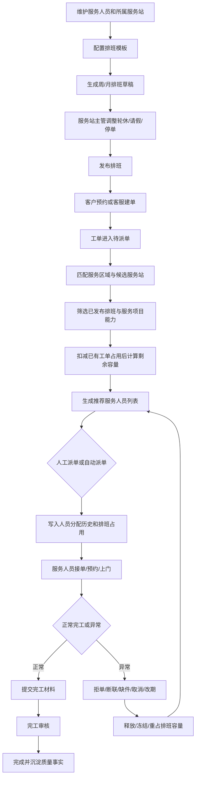
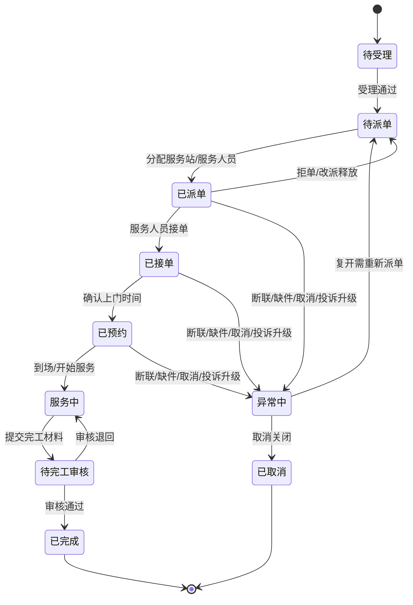

# 排班管理与派单闭环规划

- 状态：方案规划 / 待业务确认 / 待分期开发
- 日期：2026-09-12
- 应用载体：Web 管理后台；后续可扩展到服务人员小程序
- 角色视角：总部运营、客服作业、服务站作业
- 业务模块：服务资源、客户服务、工单流转
- 入口与需求：A19 派单调度、A20 异常工单、A21 完工审核、A26 服务人员、A27 排班管理、A28 服务质量；后续关联 W01～W16 服务人员端任务处理
- 关联材料：[服务资源独立系统首版](2026-09-09-服务资源独立系统首版.md)、[派单、异常与完工审核全栈首版](2026-09-10-派单异常与完工审核全栈首版.md)、[渠道与网点二版开发与测试记录](2026-09-11-渠道与网点二版开发与测试记录.md)
- 关联工程：`E:\workspace\gaia-after-sales`、`E:\workspace\gaia-ui`、`E:\workspace\gaia-saas-proj`

## 0. 已确认业务口径

2026-09-12 用户确认以下规则，可作为第一期开发和后续迭代的设计基线：

- 排班粒度：按日排班，并支持上午、下午、晚间三个时段；暂不需要精确到小时。
- 轮休规则：支持固定周休、单双周、做几休几、法定节假日等规则，具体算法按本方案设计。核心目标是每个服务人员可配置固定或周期性休息日，同时保证服务站每天都有在岗服务人员。
- 轮休示例：人员 A 可固定休周三、周五；人员 B 可固定休周六、周日；系统在生成或发布排班时提示服务站每日在岗人员不足的日期。
- 请假流程：本期不做审批，服务站管理员可直接登记请假。
- 派单边界：本期不允许强派、跨站派、超容量派。服务端必须强校验，前端不可选只是辅助提示。
- 工单状态：采用本文建议状态机，并与现有 A19/A20/A21 工单流转切片对齐；如现有知识库规则不完整，以本文补齐的容量释放和重占规则为准。
- 异常与容量释放：优先沿用现有异常工单设计；缺失场景由本文规则补齐。取消、拒单、改派、改期释放旧占用；缺件、断联等按异常动作决定释放或冻结。
- 服务人员端：服务人员小程序后续单独实现，不纳入本期。第一期和第二期可由 Web 后台代操作接单状态；后续小程序上线后，Web 后台代操作入口应下线或收敛为主管例外处理，最终以工人实际到现场开始工作作为状态变更事实依据。

## 1. 结论

排班管理和派单调度应设计为一个闭环，而不是两个彼此独立的维护页面：

- 排班管理负责定义服务产能：谁、哪天、哪个时段、在哪个服务站、能服务什么项目、剩余多少容量。
- 派单调度负责消费服务产能：根据工单地址、服务区域、服务站优先级、服务项目、排班可用性、已占用容量和异常规则，推荐并绑定服务人员。
- 工单流转负责回写产能占用：派单、改派、取消、拒单、改期、缺件、完工和审核都必须同步更新或释放排班占用。

因此，正常排班、轮休制度、临时请假、临时停单、改派机制、工单状态流转、容量冲突、异常复开和后续自动派单均可被同一套方案覆盖。分期开发时，先把排班产能模型做稳，再接入派单占用，最后做智能推荐、地图和服务人员端履约。

## 2. 现状与设计原则

### 2.1 当前已有基础

- A26 服务人员已具备售后自有主档、服务项目、状态、所属服务站和附件信息。
- A27 排班管理首版已有“人员 + 日期”的日可用性记录，覆盖可用、休假、临时停单和日容量。
- A19 派单首版已经读取人员所属站点、启用状态、服务项目、期望日期可用状态和当日容量，并统计活动工单占用。
- A06/A07 服务站和服务区域已经具备服务站、服务区域、优先级和区域查询基础。
- A20/A21 已有异常工单、完工提交和审核切片。

### 2.2 当前缺口

- 没有周期排班模板，无法表达正常班、轮休、单双周、固定休息日。
- 没有时段容量，只能按日粗略控制，无法区分上午、下午、晚间。
- 没有排班发布和锁定机制，排班修改与已派工单的关系不够明确。
- 没有独立的工单排班占用表，派单占用和释放缺少可追溯的产能流水。
- 改派、改期、请假、拒单、取消等动作还没有与排班容量形成统一释放和重占逻辑。
- 后续地图距离、路程时间、自动派单、服务人员端接单和通知机制尚未纳入完整模型。

### 2.3 设计原则

1. 排班是产能底座，派单是产能消费；任何派单必须能解释占用了哪一天、哪个时段、哪个人员的容量。
2. 服务端强校验为准，前端隐藏按钮不能替代权限、状态机和容量校验。
3. 支持人工可控优先，后续逐步智能化；第一阶段不强上黑盒算法。
4. 所有偏离规则的动作必须留痕，包括人工覆盖服务站、改派、强派、请假导致的批量改派。
5. 新模型兼容现有 `afs_personnel_availability` 和 A19 派单切片，不破坏已有本地开发功能。
6. 数据结构保留后续地图、路程、服务人员端、通知、质量评分和配件联动扩展点。

## 3. 支持能力范围

| 能力 | 是否纳入闭环 | 推荐分期 | 说明 |
| --- | --- | --- | --- |
| 正常排班 | 是 | 第一期 | 按服务人员生成工作日、服务项目和容量 |
| 轮休制度 | 是 | 第一期 | 通过排班模板表达固定休息日、单双周、做几休几 |
| 临时请假 | 是 | 第一期 | 修改指定日期或时段为请假；已有占用时触发冲突提示和改派待办 |
| 临时停单 | 是 | 第一期 | 用于人员临时不可接单，但保留在职和启用状态 |
| 批量排班 | 是 | 第一期 | 按服务站、人员、日期范围批量生成或复制上周 |
| 排班发布 | 是 | 第一期 | 未发布排班不参与派单推荐；发布后可锁定关键字段 |
| 时段容量 | 是 | 第一期或第二期 | 建议第一期设计表结构，页面可先支持上午/下午/晚间 |
| 派单候选推荐 | 是 | 第二期 | 基于区域、服务站、技能、排班和容量生成候选人员 |
| 工单容量占用 | 是 | 第二期 | 派单后生成占用记录，取消/改派/改期释放旧占用 |
| 改派机制 | 是 | 第二期 | 先释放旧人员占用，再占用新人员；全过程写分配历史 |
| 改期机制 | 是 | 第二期 | 修改预约日期/时段时重新计算候选和容量 |
| 拒单/断联/缺件 | 是 | 第二期/第三期 | 根据异常类型决定释放、保留或冻结容量 |
| 工单状态流转 | 是 | 第二期/第三期 | 状态机驱动占用状态，不允许任意编辑 |
| 服务人员接单 | 是 | 第三期 | 服务人员端或 Web 代操作接单，状态从已派到已接 |
| 地图距离/路程 | 是 | 第四期 | 接地图服务后参与推荐分和路线优化 |
| 自动派单 | 是 | 第四期 | 以人工派单规则为基础，增加自动策略和回退 |
| 服务质量评分参与推荐 | 是 | 第四期 | 一次完工率、满意度、投诉率作为排序因子 |
| 配件库存参与推荐 | 是 | 第四期 | 维修类工单可结合服务站或人员配件库存 |

## 4. 总体业务流程



## 5. 角色与职责

| 角色 | 主要操作 | 数据范围 | 备注 |
| --- | --- | --- | --- |
| 总部运营/管理员 | 查看全局排班，配置系统级规则，查看质量和异常统计 | 全租户或授权范围 | 可做兜底维护和规则审计 |
| 服务站管理员 | 维护本站人员排班、发布班表、处理请假停单、发起改派 | 本服务站及授权跨站人员 | 排班管理的主要使用者 |
| 客服主管 | 查看服务站产能，人工派单、强派、改派、改期 | 授权服务区域和工单范围 | 需要看到推荐原因和冲突原因 |
| 客服专员 | 创建工单、查看可预约窗口，必要时转主管处理 | 授权客服范围 | 默认不一定拥有强派权限 |
| 服务人员 | 后续接单、确认预约、上门、提交结果、发起异常 | 本人任务 | 服务人员端落地后接入 |

## 6. 业务对象模型

### 6.1 核心对象

| 对象 | 说明 | 与现有模型关系 |
| --- | --- | --- |
| 服务站 | 服务产能组织单元 | 使用 A06 服务站主档 |
| 服务区域 | 地址到服务站的候选与优先级 | 使用 A07 服务区域 |
| 服务人员 | 维修/安装/清洗人员 | 使用 A26 服务人员二版主档 |
| 排班模板 | 周期规则，如周一到周五工作、周末轮休、做六休一 | 新增 |
| 排班日 | 某人员某天的工作、休息、请假、停单和总容量 | 升级现有 `afs_personnel_availability` 或新增 V2 表 |
| 排班时段 | 某人员某天某时段的容量，如上午、下午、晚间 | 新增 |
| 排班异常 | 临时请假、停单、调班、手工覆盖及原因 | 新增 |
| 排班发布批次 | 记录一次发布的范围、操作者和版本 | 新增 |
| 工单排班占用 | 派单或预占对排班容量的占用记录 | 新增 |
| 分配历史 | 服务站分配、人员派单、改派历史 | 复用并扩展 `afs_order_assignment_history` |

### 6.2 容量口径

```text
可派容量 = 已发布排班容量 - 已派/已接/服务中/待审核占用 - 预占容量 - 冻结容量
```

- 休息、请假、临时停单的容量固定为 0。
- 已取消、已释放、已改派走的旧占用不再扣减容量，但保留历史。
- 缺件是否释放容量需按异常规则确认；建议默认释放当日后续容量，若服务人员仍需二次上门，则生成新预约占用。
- 强派允许超过容量时必须有独立权限、原因和审计记录，默认不开放。

## 7. 状态设计

### 7.1 排班状态

| 状态 | 说明 | 允许操作 |
| --- | --- | --- |
| `DRAFT` 草稿 | 生成后未发布，不参与派单 | 编辑、删除、批量调整、发布 |
| `PUBLISHED` 已发布 | 参与派单推荐和容量校验 | 编辑非关键备注；请假/停单/调班需走异常 |
| `LOCKED` 已锁定 | 已有工单占用或超过可自由修改窗口 | 只允许通过请假、改派、容量调整专用动作变更 |
| `EXPIRED` 已过期 | 历史排班 | 只读 |
| `CANCELLED` 已作废 | 发布错误或人员离职等场景 | 只读；必须记录原因 |

### 7.2 排班日类型

| 类型 | 说明 | 容量 |
| --- | --- | --- |
| `WORK` 工作 | 正常可接单 | 大于 0 |
| `REST` 轮休/休息 | 正常轮休 | 0 |
| `LEAVE` 请假 | 临时请假 | 0 |
| `SUSPENDED` 临时停单 | 当日不可接新单 | 0 |
| `TRAINING` 培训 | 不接单或低容量接单，按业务配置 | 0 或指定容量 |

### 7.3 占用状态

| 状态 | 触发动作 | 容量影响 |
| --- | --- | --- |
| `RESERVED` 预占 | 预约窗口保留、待最终派人 | 扣减预占容量 |
| `ASSIGNED` 已派 | 人员派单成功 | 扣减实际容量 |
| `ACCEPTED` 已接 | 服务人员接单 | 继续扣减 |
| `IN_SERVICE` 服务中 | 到场或开始处理 | 继续扣减 |
| `COMPLETED` 已完成 | 完工审核通过 | 历史保留，不再参与未来冲突 |
| `RELEASED` 已释放 | 取消、改派、改期、拒单复开 | 不扣减 |
| `FROZEN` 冻结 | 异常未决，需要保留产能 | 暂时扣减 |

### 7.4 工单主流程建议



最终状态名称需与现有 A19/A20/A21 工单状态枚举对齐，本图表达业务关系，不替代源码枚举。

## 8. 页面设计思路

### 8.1 排班管理主页面

位置：`售后服务 / 服务资源 / 排班管理`

```text
┌────────────────────────────────────────────────────────────────────────────┐
│ 服务站 [请选择服务站 v]  人员 [姓名/手机号]  服务项目 [安装 v]  日期 [本周] │
│ 状态 [全部 v]                                  [重置] [筛选]              │
├────────────────────────────────────────────────────────────────────────────┤
│ i 排班发布后参与派单推荐；已有工单占用的班次不可直接删除。                 │
├────────────────────────────────────────────────────────────────────────────┤
│ [日历视图] [列表视图]                         [生成排班] [批量调整] [发布] │
├────────────────────────────────────────────────────────────────────────────┤
│        09/14 周一   09/15 周二   09/16 周三   09/17 周四   09/18 周五      │
│ 张三   工作 2/5     工作 4/5     休息          工作 1/5     工作 3/5       │
│ 李四   请假          工作 1/4     工作 2/4     停单          工作 0/4       │
│ 王五   工作 0/6     工作 6/6满   工作 2/6     工作 1/6     休息           │
└────────────────────────────────────────────────────────────────────────────┘
```

页面重点：

- 默认以服务站 + 周维度展示，便于服务站主管排班。
- 日历格子显示状态、已占/总容量、服务项目、冲突标识。
- 点击格子进入排班详情抽屉，可查看占用工单并进行请假、停单或调整容量。
- 列表视图用于批量查询、导出和审计。

### 8.2 生成排班弹窗

```text
┌──────────────────────── 生成排班 ────────────────────────┐
│ 服务站        [TOTO北京服务站 v]                           │
│ 人员范围      [全部启用人员 v]                              │
│ 日期范围      [2026-09-14] - [2026-09-30]                  │
│ 排班模板      [标准工作日模板 v]                            │
│ 生成策略      ( ) 覆盖草稿  ( ) 跳过已有排班  ( ) 仅补缺失   │
│ 默认容量      日容量 [5]  上午 [2] 下午 [2] 晚间 [1]         │
│ 服务项目      [安装] [维修] [清洗]                           │
│                                                            │
│                                      [取消] [生成草稿]       │
└────────────────────────────────────────────────────────────┘
```

### 8.3 排班详情抽屉

```text
┌──────────────────────── 排班详情 ────────────────────────┐
│ 服务人员：张三             日期：2026-09-14                │
│ 状态：已发布               当前容量：2/5                   │
│                                                            │
│ 排班类型   [工作 v]                                        │
│ 服务项目   [安装] [维修] [清洗]                            │
│ 时段容量   上午 [2]   下午 [2]   晚间 [1]                  │
│ 变更原因   [                                      ]         │
│                                                            │
│ 当前占用工单                                               │
│ 工单编号      顾客       时段     状态       操作           │
│ WO001         王先生     上午     已派单     查看           │
│ WO002         李女士     下午     已接单     查看           │
│                                                            │
│                         [请假] [停单] [保存调整]            │
└────────────────────────────────────────────────────────────┘
```

### 8.4 派单页面候选区域

```text
┌──────────────────────────────┬────────────────────────────────────┐
│ 工单信息                     │ 推荐服务人员                       │
│ 工单类型：维修               │ 日期 [09-14]  时段 [上午 v]         │
│ 地址：山西省太原市...        │                                    │
│ 服务区域：山西省/太原市      │ 1. 张三  北京服务站  剩余 3/5       │
│ 商品：智能马桶               │    区域匹配 / 技能匹配 / 有排班     │
│                              │                         [选择派单] │
│                              │ 2. 李四  北京服务站  剩余 1/4       │
│                              │    技能匹配 / 容量较少              │
│                              │                         [选择派单] │
└──────────────────────────────┴────────────────────────────────────┘
```

推荐人员必须展示推荐原因和不可选原因。不可选人员也可展示在“冲突候选”中，用于解释为什么不能派。

## 9. 分期开发计划

### 9.1 准备期：确认规则和技术基线

目标：把不确定项收敛，不写业务代码或只做最小探查。

重点：

- 确认排班粒度：只按日，还是按上午/下午/晚间，是否需要具体小时段。
- 确认轮休规则：固定周休、单双周、做几休几、节假日是否跟随国家法定节假日。
- 确认请假流程：是否需要审批，还是服务站管理员可直接登记。
- 确认客服能否强派、跨站派、超容量派。
- 确认工单状态枚举、异常类型和容量释放规则。
- 确认服务人员端是否在本期接单，还是先由 Web 代操作。

输出：

- 本文档补充确认记录。
- 数据表和接口最终命名。
- 验收用测试场景清单。

### 9.2 第一期：排班管理基础闭环

目标：服务站管理员可以生成、调整、发布服务人员排班；客服和派单接口可以读取已发布排班。

功能范围：

- 排班模板维护：固定工作日、固定休息日、轮休规则。
- 周/月排班生成：按服务站、人员和日期范围生成草稿。
- 排班日维护：工作、休息、请假、临时停单、培训。
- 容量维护：日容量，预留时段容量字段。
- 批量操作：复制上周、批量休息、批量发布。
- 发布机制：发布后参与派单，未发布不参与派单。
- 占用只读：如果已有工单占用，页面展示占用但不在本期重构派单写入。

后端规划：

- 迁移脚本：
  - `database/202609xx_schedule_v2.sql`
  - `database/202609xx_schedule_v2.rollback.sql`
  - `database/202609xx_schedule_permissions.sql`
  - `database/202609xx_schedule_permissions.rollback.sql`
- 新增或升级表：
  - `afs_schedule_template`
  - `afs_schedule_template_rule`
  - `afs_personnel_schedule_day`
  - `afs_personnel_schedule_slot`
  - `afs_schedule_exception`
  - `afs_schedule_publish_batch`
- Java 模块：
  - `gaia-after-sales-core/.../serviceResource/appservice/ScheduleAppService.java`
  - `gaia-after-sales-core/.../serviceResource/appservice/ScheduleService.java`
  - `gaia-after-sales-core/.../serviceResource/mapper/ScheduleMapper.java`
  - `gaia-after-sales-core/.../serviceResource/model/*Schedule*.java`
  - `gaia-after-sales-api/.../serviceResource/ScheduleApi.java`
  - `gaia-after-sales-core/src/main/resources/mappers/afterSales/ScheduleMapper.xml`
- 接口草案：
  - `GET /api/afterSales/service-resource/schedules/calendar`
  - `GET /api/afterSales/service-resource/schedules`
  - `GET /api/afterSales/service-resource/schedules/{id}`
  - `POST /api/afterSales/service-resource/schedules/generate`
  - `PUT /api/afterSales/service-resource/schedules/{id}`
  - `PUT /api/afterSales/service-resource/schedules/batch`
  - `POST /api/afterSales/service-resource/schedules/publish`
  - `GET /api/afterSales/service-resource/schedule-templates`
  - `POST /api/afterSales/service-resource/schedule-templates`
  - `PUT /api/afterSales/service-resource/schedule-templates/{id}`

前端规划：

- 页面路径：
  - `apps/after-sales/src/views/serviceResource/schedule/index.vue`
- 组件：
  - `components/ScheduleCalendar.vue`
  - `components/ScheduleList.vue`
  - `components/ScheduleGenerateDialog.vue`
  - `components/ScheduleTemplateDialog.vue`
  - `components/ScheduleBatchDialog.vue`
  - `components/ScheduleDetailDrawer.vue`
- 数据层：
  - `apps/after-sales/src/api/serviceResource/schedule.ts` 或并入现有 `serviceResource/index.ts`
  - `model/types.ts`
  - `model/defaults.ts`
  - `model/mapper.ts`
  - `schemas/search.ts`
  - `schemas/table.ts`
- 权限：
  - `read`：查询排班。
  - `create`：生成或新增排班。
  - `edit`：编辑草稿或允许范围内的已发布排班。
  - `publish`：发布排班。
  - `batch`：批量调整。

验证：

- 后端覆盖模板生成、唯一性、轮休规则、请假停单容量为 0、发布状态、租户隔离、权限拒绝、乐观锁。
- 前端覆盖日历视图、列表视图、生成弹窗、批量操作、发布按钮权限和类型检查。
- 浏览器使用真实登录态验证服务站筛选、生成、调整、发布和空态。

### 9.3 第二期：派单占用和改派闭环

目标：派单实际占用排班容量，改派、取消、改期可以释放或重占容量。

功能范围：

- 工单候选人员推荐读取 `afs_personnel_schedule_day/slot`。
- 派单成功写入排班占用。
- 改派先释放旧占用，再写入新占用。
- 改期重新计算可用时段和人员。
- 取消、拒单、断联、缺件按异常规则释放、冻结或保留容量。
- 派单页面展示推荐原因、冲突原因和强派原因。

后端规划：

- 新增表：
  - `afs_order_schedule_occupancy`
- 扩展表：
  - `afs_order_assignment_history` 增加排班日、时段、推荐原因、覆盖原因等字段，或通过扩展 JSON 保存。
- Java 模块：
  - `workOrder/appservice/DispatchScheduleService.java`
  - 扩展现有 `WorkOrderWorkflowAppService` 和 `WorkOrderWorkflowMapper`
- 接口调整：
  - `GET /api/afterSales/work-order/options/{id}` 返回排班容量、推荐原因和冲突原因。
  - `PUT /api/afterSales/work-order/dispatch/{id}/personnel` 写入占用。
  - `PUT /api/afterSales/work-order/dispatch/{id}/reschedule` 改期重占。
  - `PUT /api/afterSales/work-order/dispatch/{id}/reassign` 改派重占。

前端规划：

- 扩展派单页面候选人员列表：
  - 显示排班日期、时段、剩余容量。
  - 显示推荐标签：区域匹配、技能匹配、容量充足、负载较低。
  - 显示冲突标签：无排班、请假、容量已满、服务项目不匹配、服务站不匹配。
- 改派弹窗：
  - 选择改派原因。
  - 重新选择日期、时段和人员。
  - 展示旧人员占用释放、新人员占用写入的确认信息。

验证：

- 重复派单幂等。
- 容量已满拒绝。
- 改派后旧人员容量恢复，新人员容量扣减。
- 取消工单释放容量。
- 请假导致已有占用时，系统提示需要改派，不静默丢失占用。

### 9.4 第三期：履约状态和服务人员端衔接

目标：服务人员接单、预约、上门、异常、完工与排班占用联动。

功能范围：

- 服务人员接单/拒单。
- 预约上门时间确认。
- 到场、开始服务、完工提交。
- 缺件、断联、客户改期等异常从服务人员端或 Web 发起。
- 完工审核退回后保持占用或生成新的补充占用，按业务规则确认。
- 服务质量事实从工单闭环中沉淀，回写 A28 服务质量。

后端规划：

- 服务人员端 API 独立授权，不复用后台管理员权限。
- 工单状态动作端点保持专用动作，不使用通用 CRUD 改状态。
- 增加本人数据范围、服务站数据范围和跨站支援校验。
- 完工提交与配件耗用、附件上传、客户签名保持事务或补偿边界。

前端规划：

- Web 后台继续提供代操作和监控。
- 服务人员端后续提供任务列表、任务详情、接单/拒单、预约、异常、完工。
- 排班管理页面增加“本人任务占用”跳转。

验证：

- 本人只能看本人任务。
- 拒单释放容量并回到待派单。
- 改期重新占用新日期容量。
- 完工审核通过后生成质量事实，审核退回不覆盖原提交。

### 9.5 第四期：智能派单和运营优化

目标：在人工规则闭环稳定后，引入智能推荐、自动派单和运营看板。

功能范围：

- 地图地址解析、经纬度和路程时间。
- 地图看板和路线优化。
- 自动派单策略：按区域、技能、容量、路程、负载、质量综合评分。
- 抢单或混合派单模式，如服务站管理员发布可抢任务。
- 通知：派单通知、改派通知、预约提醒、超时提醒。
- 质量评分参与推荐：满意度、投诉率、一次完工率、准时率。
- 配件库存参与推荐：维修类工单优先推荐有配件的服务站或人员。

输出：

- 自动派单策略配置页面。
- 推荐评分明细和审计日志。
- 派单效率、超时率、改派率、人员负载、服务质量看板。

## 10. 数据表规划草案

具体字段类型以后端开发时数据库规范为准，本节用于明确边界和关系。

### 10.1 排班模板

`afs_schedule_template`

| 字段 | 说明 |
| --- | --- |
| id | 主键 |
| tenant_id | 租户 |
| station_id | 服务站，可为空表示通用模板 |
| template_code | 模板编码 |
| template_name | 模板名称 |
| cycle_type | 周循环、单双周、做几休几 |
| status | 启用/禁用 |
| remark | 备注 |
| version | 乐观锁 |
| create/update/audit 字段 | 审计 |

`afs_schedule_template_rule`

| 字段 | 说明 |
| --- | --- |
| template_id | 模板 |
| day_index | 周几或周期第几天 |
| day_type | 工作、休息、培训等 |
| service_items | 安装、维修、清洗 |
| daily_capacity | 日容量 |
| slot_capacity_json | 时段容量 |

### 10.2 排班日与时段

`afs_personnel_schedule_day`

| 字段 | 说明 |
| --- | --- |
| id | 主键 |
| tenant_id | 租户 |
| station_id | 服务站 |
| personnel_id | 服务人员 |
| schedule_date | 日期 |
| day_type | 工作/休息/请假/停单/培训 |
| status | 草稿/已发布/已锁定/已过期/已作废 |
| service_items | 可服务项目 |
| daily_capacity | 总容量 |
| occupied_capacity | 已占容量，可实时计算或冗余维护 |
| publish_batch_id | 发布批次 |
| source_type | 模板生成、手工新增、复制上周、导入 |
| change_reason | 最近变更原因 |
| version | 乐观锁 |

唯一约束建议：`tenant_id + personnel_id + schedule_date`。

`afs_personnel_schedule_slot`

| 字段 | 说明 |
| --- | --- |
| schedule_day_id | 排班日 |
| slot_code | 上午、下午、晚间或具体时段 |
| start_time/end_time | 时段 |
| capacity | 容量 |
| occupied_capacity | 已占容量 |
| status | 可用/停用 |

### 10.3 排班异常与发布

`afs_schedule_exception`

| 字段 | 说明 |
| --- | --- |
| schedule_day_id | 排班日 |
| exception_type | 请假、停单、调班、强制调整 |
| reason | 原因 |
| old_value/new_value | 变更前后摘要 |
| affect_occupancy | 是否影响已有占用 |
| operator_id/time | 操作人和时间 |

`afs_schedule_publish_batch`

| 字段 | 说明 |
| --- | --- |
| id | 主键 |
| tenant_id | 租户 |
| station_id | 服务站 |
| date_from/date_to | 发布范围 |
| personnel_count | 人员数 |
| day_count | 排班日数 |
| status | 已发布/已撤销 |
| operator_id/time | 发布人和时间 |

### 10.4 工单排班占用

`afs_order_schedule_occupancy`

| 字段 | 说明 |
| --- | --- |
| id | 主键 |
| tenant_id | 租户 |
| order_id | 工单 |
| station_id | 服务站 |
| personnel_id | 服务人员 |
| schedule_day_id | 排班日 |
| schedule_slot_id | 排班时段，可为空表示日容量 |
| occupancy_status | 预占、已派、已接、服务中、完成、释放、冻结 |
| capacity_units | 占用容量，默认 1 |
| source_action | 派单、改派、改期、取消、拒单、异常 |
| client_request_id | 幂等键 |
| release_reason | 释放原因 |
| create/update 字段 | 审计 |

唯一约束建议：

- 同一工单同一时间只允许一个有效占用。
- `client_request_id + source_action` 保证重试幂等。

## 11. 后端代码规划

### 11.1 `gaia-after-sales`

服务资源域新增或扩展：

- `gaia-after-sales-api/src/main/java/com/ehsure/gaia/afterSales/serviceResource/ScheduleApi.java`
- `gaia-after-sales-core/src/main/java/com/ehsure/gaia/afterSales/serviceResource/appservice/ScheduleAppService.java`
- `gaia-after-sales-core/src/main/java/com/ehsure/gaia/afterSales/serviceResource/appservice/ScheduleService.java`
- `gaia-after-sales-core/src/main/java/com/ehsure/gaia/afterSales/serviceResource/mapper/ScheduleMapper.java`
- `gaia-after-sales-core/src/main/resources/mappers/afterSales/ScheduleMapper.xml`
- `gaia-after-sales-core/src/main/java/com/ehsure/gaia/afterSales/serviceResource/model/*Schedule*.java`

工单域扩展：

- 扩展 `WorkOrderWorkflowAppService`：候选推荐、派单、改派、改期、释放占用。
- 扩展 `WorkOrderWorkflowMapper.xml`：查询有效占用、写入占用、释放占用、候选剩余容量。
- 保持工单状态动作为专用端点，不能通过通用更新接口修改状态。

公共约束：

- 所有写接口校验租户、角色、资源范围、操作权限、乐观锁和状态机。
- 排班生成必须幂等：同一范围重复生成可以选择跳过、覆盖草稿或仅补缺失，不能覆盖已发布且有占用的排班。
- 发布后参与派单；草稿排班不参与派单。
- 已有占用的排班不能物理删除，只能作废或通过异常动作处理。

### 11.2 `gaia-saas-proj`

- 无业务代码优先改动，主要通过依赖售后后端新制品接入。
- 若新增菜单/API 权限脚本需要在本地联调库执行，仍按既有 `sys_module`、`sys_module_operation`、`sys_role_module`、`sys_role_operation` 配置。
- 本地 `application.properties` 不纳入提交。

## 12. 前端代码规划

### 12.1 排班管理页面

目录建议：

```text
apps/after-sales/src/views/serviceResource/schedule/
├── index.vue
├── components/
│   ├── ScheduleCalendar.vue
│   ├── ScheduleList.vue
│   ├── ScheduleGenerateDialog.vue
│   ├── ScheduleTemplateDialog.vue
│   ├── ScheduleBatchDialog.vue
│   └── ScheduleDetailDrawer.vue
├── model/
│   ├── defaults.ts
│   ├── mapper.ts
│   └── types.ts
└── schemas/
    ├── search.ts
    └── table.ts
```

样式原则：

- 继续使用售后 `commonV2` 页面风格：白色主卡片、横向筛选、虚线分隔、表格/弹窗/抽屉。
- 日历视图不是装饰型大日历，而是业务密度优先的排班矩阵。
- 所有状态使用清晰标签：工作、休息、请假、停单、已满、冲突。
- 不在页面写过多说明文字，复杂规则通过提示和冲突原因展示。

### 12.2 API 层

可新增：

- `apps/after-sales/src/api/serviceResource/schedule.ts`
- 或在现有 `apps/after-sales/src/api/serviceResource/index.ts` 增加 `schedule` 分组。

类型：

- `ScheduleDayRow`
- `ScheduleCalendarQuery`
- `ScheduleGenerateCommand`
- `ScheduleBatchCommand`
- `ScheduleTemplateRow`
- `ScheduleOccupancyRow`
- `SchedulePermission`

### 12.3 派单页面衔接

修改现有 A19 派单页面：

- 候选人员列表增加排班日期、时段、剩余容量、推荐原因。
- 改派弹窗增加原因和占用变化提示。
- 冲突人员展示不可选原因。
- 如果排班未发布，默认不进入候选；有权限人员可查看“未发布排班”提示，但不能派单。

## 13. 权限规划

| 模块 | 读取 API | 操作权限 |
| --- | --- | --- |
| `afsSchedule` 排班管理 | `GET$/api/afterSales/service-resource/schedules/**`、`GET$/api/afterSales/service-resource/schedule-templates/**` | `create` 生成/新增，`edit` 编辑，`batch` 批量调整，`publish` 发布，`template` 模板维护，`export` 导出 |
| `afsDispatch` 派单调度 | 复用现有读取 API，扩展候选返回字段 | `dispatch` 派单，`reassign` 改派，`reschedule` 改期，`override` 强派 |
| `afsWorkOrderException` 异常工单 | 复用现有读取 API | 异常动作决定释放或冻结容量 |

权限原则：

- 服务站管理员默认可维护本站排班。
- 客服主管默认可派单、改派、改期。
- 客服专员是否可派单由角色确认，不默认授予强派。
- 强派、超容量、跨站派单必须单独权限和原因。

## 14. 从需求到落地的实施步骤

| 步骤 | 内容 | 产出 | 是否必须留痕 |
| --- | --- | --- | --- |
| 1 | 业务规则确认 | 确认问题清单、最终口径 | 是 |
| 2 | 详细设计确认 | 数据表、接口、页面、状态机、验收计划 | 是 |
| 3 | 数据库脚本 | 正向脚本、回退脚本、权限脚本 | 是 |
| 4 | 后端实现 | API、AppService、Mapper、模型、测试 | 是 |
| 5 | 前端实现 | 页面、弹窗、接口、权限、空态、错误态 | 是 |
| 6 | 本地迁移 | 执行 SQL、记录执行库和结果 | 是 |
| 7 | 单元/集成测试 | Maven 测试、前端类型检查、必要前端测试 | 是 |
| 8 | 宿主装配 | 售后后端 install，宿主 package，重启服务 | 是 |
| 9 | 浏览器验收 | 登录态页面、主流程、冲突流程截图 | 是 |
| 10 | 知识库回写 | 更新本 Spec、进度文档和测试证据 | 是 |
| 11 | 提交推送 | 按仓库提交，排除本地配置和产物 | 是 |

## 15. 验收场景

### 15.1 第一期验收

| 编号 | 前置状态 | 操作 | 预期结果 |
| --- | --- | --- | --- |
| S1 | 服务站有 3 名启用人员 | 按标准模板生成下周排班 | 生成草稿排班，休息日和容量符合模板 |
| S2 | 草稿排班存在 | 批量发布 | 状态变为已发布，派单候选可读取 |
| S3 | 已发布排班无占用 | 修改容量 | 保存成功并写审计 |
| S4 | 已发布排班有占用 | 尝试删除 | 拒绝删除，提示已有工单占用 |
| S5 | 人员临时请假 | 设置当天请假 | 容量变 0，如已有占用则提示需处理改派 |
| S6 | 无排班人员 | 派单候选查询 | 不进入可派候选，显示无排班原因 |
| S7 | 拒绝角色 | 直接调用写接口 | 返回 403 或业务无权响应 |

### 15.2 第二期验收

| 编号 | 前置状态 | 操作 | 预期结果 |
| --- | --- | --- | --- |
| D1 | 人员当天容量 5，已占 4 | 派 1 单 | 成功，占用变 5/5 |
| D2 | 人员当天容量已满 | 再派 1 单 | 服务端拒绝，前端显示容量已满 |
| D3 | 工单已派给张三 | 改派给李四 | 张三占用释放，李四占用新增，分配历史保留 |
| D4 | 工单取消 | 执行取消动作 | 有效占用释放 |
| D5 | 工单改期 | 选择新日期和人员 | 旧日期占用释放，新日期占用新增 |
| D6 | 人员请假且有 2 个已派单 | 设置请假 | 系统列出受影响工单，不静默释放 |

### 15.3 第三期验收

| 编号 | 前置状态 | 操作 | 预期结果 |
| --- | --- | --- | --- |
| W1 | 工单已派 | 服务人员接单 | 状态变为已接单，占用继续有效 |
| W2 | 工单已派 | 服务人员拒单 | 状态回到待派或异常待处理，占用释放 |
| W3 | 已预约上门 | 客户改期 | 旧占用释放，新时段重新占用 |
| W4 | 完工提交 | 审核退回 | 完工材料版本不可覆盖，状态回到服务中或待补充 |
| W5 | 审核通过 | 质量事实生成 | 服务质量页可读取对应统计 |

## 16. 待确认问题

| 问题 | 影响范围 | 已确认结论 |
| --- | --- | --- |
| 排班粒度是按日还是按时段 | 表结构、页面、派单候选 | 按日 + 上午/下午/晚间三个时段，不精确到小时 |
| 轮休规则有哪些 | 模板规则 | 支持固定周休、单双周、做几休几、法定节假日；发布前提示服务站每日在岗人员不足 |
| 请假是否需要审批 | 状态和权限 | 本期不审批，服务站管理员直接登记 |
| 强派是否允许 | 派单权限 | 不允许强派 |
| 是否允许跨站派 | 数据范围和候选 | 不允许跨站派，默认只能派所属服务站人员 |
| 是否允许超容量派 | 派单容量 | 不允许超容量派 |
| 缺件是否释放容量 | 异常规则 | 现有知识库有规则则沿用；缺失时按本文补齐，异常动作明确释放或冻结 |
| 服务人员端是否本期接单 | 第三期范围 | 本期不做小程序；Web 可暂时代操作，后续以工人到现场开始工作为事实状态 |
| 地图和路程时间何时接入 | 推荐算法 | 第四期接入，不阻塞基础闭环 |
| 满意度和投诉是否参与派单 | 推荐排序 | 先预留字段，质量事实稳定后启用 |
| 配件库存是否参与维修派单 | 维修效率 | 第四期，与配件库存和工单耗用联调 |

## 17. 风险与控制

| 风险 | 表现 | 控制方式 |
| --- | --- | --- |
| 排班和工单状态互相覆盖 | 改派后容量不准 | 使用占用表和状态机动作统一释放/重占 |
| 复杂排班一次做太大 | 页面难用、规则难测 | 第一期只做模板、生成、发布、请假停单 |
| 强派导致超负荷 | 人员一天被派太多单 | 默认禁止超容量，强派单独权限和审计 |
| 已发布排班随意修改 | 影响客服派单和预约承诺 | 发布后关键字段锁定，有占用时必须走异常动作 |
| 前端显示与后端校验不一致 | 页面可选但提交失败 | 候选接口返回可选和不可选原因，后端最终强校验 |
| 跨站支援规则不清 | 数据范围越权 | 默认不跨站，待确认后单独实现 |

## 18. 输出物清单

每一期完成后至少输出：

- 需求确认记录。
- 数据库正向/回退/权限 SQL。
- 后端 API、Service、Mapper、模型和测试。
- 前端页面、组件、API 类型、权限控制。
- 宿主装配和启动验证记录。
- 浏览器登录态截图或测试结果 JSON。
- 知识库实施与验收记录。
- 提交 hash 和未验证项说明。

## 19. 后续维护规则

- 开发前先在本文补充本期确认范围，不直接按草案编码。
- 每期完成后在本文新增“实施与验收记录”，并回写服务资源、派单工单相关进度文档。
- 如果新增状态、表或接口改变既有 A19/A27 行为，必须在变更记录中说明兼容策略。
- 不将页面壳、空列表或构建通过视为业务验收完成。
- 不提交本地环境配置、日志、target、浏览器 profile 或临时测试缓存。
