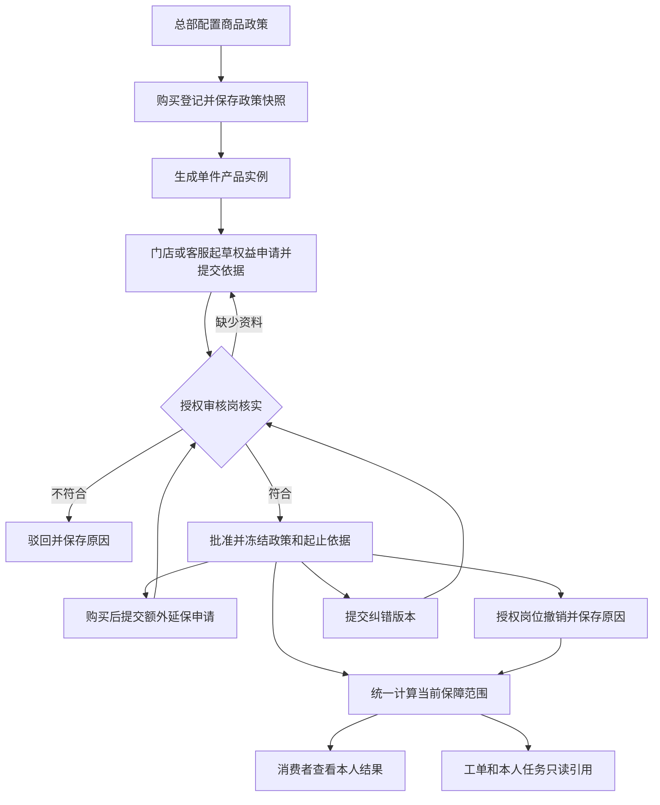

# 终身保修与延保方案

- 编号／类型：CR-20261004-01／功能方案与技术调研。
- 状态：待确认；本轮方案编写与源码核对完成，尚未授权实施本方案。
- 来源／日期：用户要求先设计完整流程并保存 Spec，晚上另行启动执行；2026-10-04，V1.0。
- 应用／角色视角：Web 管理后台（总部、客服、门店及受限服务站）、消费者小程序、服务人员小程序。
- 模块／入口：A09 商品档案、A15／D03／D04／D07 顾客购买记录、A18 服务工单、C10 产品资料、W04 本人任务；W12／WAPP-019 原项目延保资料查询保留后续边界。
- 关联需求：ADM-MD-007、ADM-CU-001／002、CAPP-011、WAPP-019；终身类型及权益办理为本次新增设计建议，尚未并入正式需求基线。
- 优先级／负责人：计划夜间实施，具体启动时间由用户决定；业务政策与验收负责人待分配，实施启动后由 Codex 承接。
- 成功标准：明确政策、受益对象、登记、核验、生效、计算、对客展示、售后引用及撤销纠错的完整链路；实施后应有真实权限、数据库及接口证据，不把在保显示等同免费维修判定。
- 本轮证据：定向核对当前源码、已有保修 Spec、原始延保资料需求及品牌官方公开政策；没有编写功能代码、运行 PoC、修改数据库或发布应用。

> 本文是本次方案及后续实施记录的唯一入口。第 3～12 节为建议采用的首期默认方案，用户随后明确要求“按本 Spec 执行”即可据此实施，不需要逐项重复确认。品牌真实政策、终身承诺及历史追授仍必须有来源；缺失时可以完成通用能力和测试验证，真实权益保持待核实。

## 1. 调研结论与当前事实

| 项目 | 2026-10-04 核对结果 | 对设计的影响 |
| --- | --- | --- |
| 商品标准保修 | `warrantyEnabled` 与 `warrantyMonths`，保修月数为 1～600；Web 默认 12 个月 | 没有终身类型，不能用 0、空值、600 或超长月数模拟终身 |
| 登记快照 | `afs_purchase_item` 保存启用、月数快照；同一明细可有多件 `afs_product_instance` | 政策快照在购买明细，具体权益在单件实例，不能给同型号全部消费者一起延保 |
| 消费者展示 | 按登记购买日期估算，日期缺失不计算；已退回不显示剩余时间 | 继续区分预计值和已核实权益，不从自填日期自动授予资格 |
| 扫码绑定 | 独立扫码关联，扫码投影购买日期为 null；已有本人登记关系时列表优先显示登记产品 | 保持用户已确认“不增加绑定时购买记录查询”；首期扫码产品只展示政策，权益办理要求明确的登记实例 |
| 延保资料 | 原始截图包含项目、地址、企业、型号、数量及起止日期；来源、发布责任未确认，正式 W12 隐藏 | 单件权益首期不冒充项目延保系统，不自动恢复 W12 |
| 旧消费者契约 | `validWarranty` 严格限定现有状态和 1～600 月 | 不能向旧字段直接塞入 `LIFETIME_ACTIVE` 等新值，需要兼容既有客户端 |
| 登记编辑 | 商品改变时 `updateRegistration` 可删除并重建明细／实例，现有锁定判断不含新权益 | 必须增加权益引用保护；更改购买日期、购买人、门店等也不能悄悄改变已核实权益 |
| 审计 | 通用 `AfterSalesAuditSupport` 默认关闭 | 权益操作历史必须随事务强制保存，不能仅依赖可关闭的通用审计 |

源码核对入口：

- [商品校验](../../../backend/gaia-after-sales/gaia-after-sales-core/src/main/java/com/ehsure/gaia/afterSales/catalog/appservice/ProductAppService.java)、[商品表单](../../../frontend/gaia-ui/apps/after-sales/src/views/catalog/product/components/ProductFormDialog.vue)、[商品导入导出](../../../backend/gaia-after-sales/gaia-after-sales-core/src/main/java/com/ehsure/gaia/afterSales/masterData/appservice/MasterDataTransferAppService.java)。
- [购买与本人产品 SQL](../../../backend/gaia-after-sales/gaia-after-sales-core/src/main/resources/mappers/afterSales/CustomerMapper.xml)、[登记编辑](../../../backend/gaia-after-sales/gaia-after-sales-core/src/main/java/com/ehsure/gaia/afterSales/customer/appservice/CustomerAppService.java)。
- [当前估算](../../../backend/gaia-after-sales/gaia-after-sales-core/src/main/java/com/ehsure/gaia/afterSales/mobile/consumer/ConsumerWarranty.java)、[端侧校验](../../../mobile/gaia-after-sales-uni/src/consumer/warranty.ts)、[审计开关](../../../backend/gaia-after-sales/gaia-after-sales-core/src/main/java/com/ehsure/gaia/afterSales/common/AfterSalesAuditSupport.java)。
- [消费者保修展示契约](2026-10-04-消费者产品保修时间展示.md)、[原始延保资料需求](../01-功能需求/07-服务人员小程序需求.md#1047-截图补充延保技术资料与个人中心)、[注册与权益边界](../02-技术设计/08-商品注册绑定与服务资格核验.md)。

调研选型：终身使用显式类型，而非超大月数；权益按实例保存，而非给商品增加统一延保月数；办理使用独立业务历史，而非可关闭的通用审计；首期人工审核，而非建立活动规则引擎；新消费者摘要与旧估算分开，而非直接修改旧枚举。这些选择分别由上表的字段、关联、审计、来源和客户端约束支撑。私有凭证可复用范围、实际租户落库形式和费用引用字段仍需阶段0核对，当前不声称已经验证可运行。

## 2. 市场依据及适用边界

核对日期为 2026-10-04。公开政策用于理解真实场景，不直接成为本租户的已批准政策：

- [TOTO 中国官方保修政策](https://www.toto.com.cn/cn/service_repaired.html)：部分智能便器为固定质保加赠送延保，适用条件涉及活动日期、指定授权渠道及官方免费安装；公开页面没有列出统一终身保修。具体产品、购买时点和保证书仍需核实。
- [科勒官方终身有限保修](https://www.kohler.com/content/dam/kohler-com-NA/Lifestyle/PDP-PDF/PDP-PDF-Kohler%20Faucet%20Lifetime%20Limited%20Warranty.pdf)：部分美洲住宅水龙头针对原始购买者提供有条件的终身保障，使用场合、地域、部件和费用存在限制；不套用于 TOTO 中国。
- [西门子香港延长保养说明](https://www.siemens-home.bsh-group.com.hk/zh/customer-service/warranty/faqs-extended-warranty)：允许原保用期结束前申请延长保养，说明购买后申请是实际场景；不是 TOTO 的申请规则。

“终身”指政策约定的持续保障，没有固定截止日期；并不自动代表任何故障、人工、运输或安装全部免费。“延保”指具体合同或活动增加的保障区间，可能购买时赠送，也可能购买后办理。需要分别保存办理日期与保障起止日期。

## 3. 首期范围与默认选择

### 3.1 本期包含

1. 商品档案支持固定期限／终身有限保修，继续保留既有保修启用设置。
2. 新登记保存完整政策快照；历史记录明确来源，不追授终身或活动延保。
3. 以登记产品实例为对象的标准保修核实、延保申请、人工审核、撤销及纠错。
4. 已核实固定期限、终身、延保的日期／范围展示；消费者、后台及本人任务只读复用同一计算结果。
5. 后端权限、私有依据、幂等并发、不可变操作历史、显式迁移和必要回归。

### 3.2 首期不做

自动识别官网活动、自动授予 TOTO 延保、规则引擎、消费者自助购买延保、线上支付、保险理赔、项目批量延保及 W12 全局查询、转赠自动继承、部件自动责任判定。付费延保可登记已有合同和线下付款依据，不新增收款系统。扫码绑定不新增购买记录查找，也不据同码存在记录就授予本人权益。

### 3.3 可直接执行的默认规则

| 决策 | 默认方案 |
| --- | --- |
| 终身配置 | 显式 `LIFETIME`；对客默认名称“终身有限保修”，不得以有限月数替代 |
| 发放对象 | 一件登记实例；所属租户及门店从后端上下文解析 |
| 操作方式 | 门店／客服有独立权限才能起草提交；授权总部审核岗位确认或撤销 |
| 自动生效 | 不启用；购买登记核验通过也不等同保修权益核实 |
| 多次延保 | 每次记录明确起止区间；相同覆盖范围重叠区间取并集，不把月数反复相加 |
| 终身再延保 | 首期拒绝给已确认终身的同一覆盖范围追加期限；不同范围的复杂组合暂不办理 |
| 审核分工 | 首期提交人与审核人分开；管理员身份不绕过业务动作权限或数据范围 |
| 已到期后办理 | 系统允许提交有明确合同依据的申请；无补办依据不允许审核通过，不默认从审核日重新起算 |
| 变更与纠错 | 已批准内容冻结；通过有理由、有依据的新版本替换，不覆盖或删除旧事实 |
| 开放方式 | 先完成精确权限和测试角色验证；没有真实政策依据时仅使用可追踪测试实例演示 |

## 4. 角色与办理责任

| 角色 | 可做什么 | 边界 |
| --- | --- | --- |
| 总部商品维护岗 | 配置商品保修类型、期限、范围与政策说明 | 必须同时有商品维护权限；修改主档不改变历史快照 |
| 门店／代理商 | 在有权限的本店登记实例上起草、补充依据、提交申请 | 不自行确认生效，不跨店查看，不获得全局权益目录 |
| 客服 | 对本人授权区域／队列内实例代办及查询结果 | 核实购买记录的原权限不自动变成权益审核权限 |
| 总部权益审核岗 | 审核标准保修／延保、退回补充、驳回、撤销及纠错 | 独立操作授权、明确业务范围；提交人不能审核自己的申请 |
| 服务站／服务人员 | 从已授权工单／本人当前任务读取必要摘要及范围 | 不改期限、不赠送延保、不因曾承接工单获得永久访问 |
| 消费者 | 查看本人产品的政策、已核实结果及必要说明 | 首期无延保写入口；产品关联关系不是权益受益人证明 |

受益对象在实例权益记录中明确。首期可核实“该登记购买人”或合同指定受益人，不把当前登录账号默认认作原始购买人；代办、使用者与购买人仍沿用既有身份边界。受益人变化需重新核实。消费者摘要同时校验本人可见关系与受益条件：只拥有产品查看关系、没有可验证受益人关联的账号，显示政策及资格待核实，不显示他人的终身在保结论。原始资料没有确认上述办理岗位，本表是本次建议分工。

## 5. 完整流程

### 5.1 商品配置与购买登记

固定期限保留 1～600 月；终身类型不填写月数，必须填写可追溯政策依据、覆盖范围及主要限制。配置关闭／不完整仍显示待完善，不据此宣称消费者没有法定或合同保修。

购买登记只自动保存商品政策快照，不增加延保必填项，也不自动生成已批准权益。业务人员可在保存登记后进入该单件产品的“保修与延保”页签提交申请。购买时已赠送的延保可以同时登记，但只有核实购买、渠道、安装及适用时点后才能批准。

### 5.2 标准保修核实，包括终身保修

1. 选择明确实例，显示登记来源、购买核验状态和政策快照。
2. 提交政策／保证书依据、受益对象、覆盖范围、已核实起保日期及其来源。
3. 审核岗核对凭证、适用条件与起算依据；缺失则退回，冲突则驳回。
4. 批准保存固定期的核定起止日期，或终身类型的核定生效日期及无截止日期事实。
5. 终身符合条件后显示“在保”；如果只是商品配了终身且尚未核实，显示“终身有限保修／资格待核实”。

起保依据支持官方安装完成、发票、生产日期替代或明确合同日期；不得使用工单提交／审核时间冒充安装完成日期。首期由审核岗录入并引用证据；后续只有确认可信履约数据源后才自动带入。

### 5.3 购买后申请延保

1. 打开已登记实例；核对既有标准保修及申请历史。
2. 选择来源：活动赠送、付费合同、项目合同；录入活动／合同编号、适用范围、区间和依据。
3. 标准权益尚未核实时，可以先保存草稿；审核通过延保前必须已有未撤销且事实一致的标准权益核实结果。标准区间已结束不影响引用该核实结果，否则无法办理正常的过标准期延保。
4. 审核确认办理窗口、产品／渠道／区域、受益人、安装条件及已有付款／合同事实。资料录入时间不决定延保开始时间。
5. 批准后按保障区间计算。如果标准已过期但延保已生效，显示“延保中”；延保尚未开始则显示对应未来区间。

购买后补登记原已享有的权益，须保存原生效区间和“补录”来源；购买后新办理，须保存新合同依据。两种情况均不把旧过保日期改成审核日期。

### 5.4 服务申请与检测

建单继续使用现有可信商品与权限流程，不新增消费者必点的保修确认。工单按需读取当前权益摘要，在实际判定费用／报价时保存被引用的权益 ID、版本、判定日期和范围。后续撤销不改写已办结费用历史。

“期限内”是参考事实。故障原因、部件、人工等是否覆盖仍由现有检测及费用流程判断；不因终身或延保而自动把全部费用归零，不绕过人工完工审核，不恢复已退役服务受理入口。

### 5.5 退货、转赠、绑定变化与纠错

- 退货／登记退回：即时停止对该实例显示有效保障，保留原核实和撤销历史，不把唯一码释放后的新销售实例当作同一受益对象。
- 解绑／手机号变化：只影响账号可见性，不自动销毁或转移合同；未验证的新账号不获得原始购买人的终身权益。
- 换货／实例合并：首期不自动迁移权益，显示待重新核实；保留旧实例关联。明确批准继承时另走有证据的纠错流程。
- 登记改商品／数量或作废：只要存在权益申请／历史引用，就禁止物理重建或删除实例，返回明确冲突；无引用的既有行为继续保留。
- 登记改购买日期、购买人、门店等政策关键事实：有已批准权益时先拒绝普通编辑，要求进入专门纠错；有待审核申请时退回草稿并冻结原提交证据。审核同时检查提交时事实版本，避免批准已经改变的依据。
- 撤销：单独权限、必填原因，立即重新计算当前保障；撤销延保后回到仍有效的标准保障，不能把原始标准保修一并删除。撤销 BASE 时页面显示受影响的依赖延保，后端同一事务撤销这些依赖并分别保存历史，不允许留下悬空权益。付费权益撤销不自动产生退款，财务办理依据原合同另行处理。
- 纠错：起草替换记录并独立审核；批准时在一个事务内替换旧版本，保留新旧关联和影响说明。存在依赖延保时同步校验，不能留下脱离有效标准权益的延保。

## 6. 状态、区间与计算规则

### 6.1 办理状态与展示状态分开

办理状态：`DRAFT → PENDING → APPROVED / REJECTED`；补资料由 `PENDING → DRAFT`，批准后仅可 `APPROVED → REVOKED` 或由新版本原子替换。驳回后重新申请保存新提交版本。审核通过并不代表今天已经生效。

展示由后端按 Asia/Shanghai 当日计算，建议状态如下：

| 状态 | 含义／对客文案 |
| --- | --- |
| `UNCONFIRMED` | 资格待核实；固定期有购买日期时继续展示原预计值 |
| `DATE_REQUIRED` | 无购买日期，暂无法计算剩余保修时间 |
| `NOT_STARTED` | 已核实，但保障区间尚未开始 |
| `STANDARD_ACTIVE` | 标准保修中 |
| `EXTENSION_ACTIVE` | 延保中 |
| `LIFETIME_ACTIVE` | 在保，期限为终身有限保修 |
| `LIMITED_ACTIVE` | 部分范围在保，须展示对应范围 |
| `EXPIRED` | 已核实区间均已结束 |
| `GAP` | 今天没有连续保障，存在以后才生效的区间；显示“当前不在保，后续保障待生效” |
| `RECHECK_REQUIRED` | 关键事实／受益条件冲突，待重新核实 |
| `RETURNED` | 产品已退回，不展示剩余／到期时间 |

`REVOKED` 是某条记录的状态，不必成为产品统一状态：撤销后仍可能有其他有效保障。退回优先，随后处理事实冲突，再计算已批准区间，最后回落原标准估算。

### 6.2 日期算法

- 固定标准期限：`end = verifiedStart.plusMonths(months).minusDays(1)`；剩余时间含截止当日。
- 增加 N 月延保的建议连续区间：`extensionStart = verifiedBaseEnd.plusDays(1)`，`extensionEnd = extensionStart.plusMonths(N).minusDays(1)`。审核须确认合同确实采用该方式，不从审核日计算。
- 固定日期合同：直接保存经核实的 start／end，要求 start ≤ end；不强行转成月数。N 月录入与固定日期录入二选一，不接受互相矛盾值。
- 同范围多条有效保障按区间并集合并，相邻日期可连续；今天在某区间内时，剩余天数只计算到该连续区间结束，不跨过保障空档。
- 范围不同不合并成“整机到最晚日期”；有限范围必须单独标注。本期不解析文本中的部件，人工核对范围。
- 终身必须为显式类型：`endDate=null` 且 `remainingDays=null`，有核实生效日。空截止日期在其他类型下是资料错误，不推断终身。
- 终身标准类型只有未撤销且条件仍成立才显示在保。主档配置、账号绑定和时间估算都不能替代条件核实。

示例：起保 2026-10-04，12 月标准期至 2027-10-03；赠送连续 24 月延保则为 2027-10-04～2029-10-03。批准时间可以在 2026 年，延保状态仍到 2027-10-04 才进入“延保中”。

## 7. 数据与保存边界

以下为建议逻辑字段，不是已执行 DDL。阶段 0 核对实际类型、主键高水位、租户解析、索引、附件机制后生成显式迁移。

| 保存位置 | 最小新增／调整 |
| --- | --- |
| `afs_product` | `warranty_type`（FIXED／LIFETIME），范围类别（WHOLE_PRODUCT／LIMITED_SCOPE）、范围说明、政策依据引用、主要限制；保留 enabled、months。FIXED 启用时 1～600 月，LIFETIME 启用时 months 必须为空 |
| `afs_purchase_item` | 类型、范围、政策依据及主要限制快照，记录捕获来源／时间；与已有 enabled／months 快照共同冻结 |
| 新权益表，建议 `afs_warranty_entitlement` | 单件 instance_id、BASE／EXTENSION、租户上下文、受益对象、保障类型、范围及说明快照、起止日期／起算依据、来源类型、活动／合同编号、私有证据引用、办理状态、提交／审核事实版本、撤销／替换关系、revision 与操作者时间 |
| 新历史表，建议 `afs_warranty_entitlement_history` | 每次提交、退回、批准、驳回、撤销、纠错的完整业务快照、原因、请求号、操作者和时间；强制写入，不受全局审计开关控制 |
| 工单判定引用 | 在现有费用判定／版本事实中保存实际使用的权益 ID／版本及范围；复用现有费用版本能力，避免独立复制一套判定流程 |

附加约束：

1. BASE 表示标准权益已核实，包括固定及终身；EXTENSION 首期仅为固定区间，必须引用未撤销且事实一致的 BASE，BASE 的标准区间可以已经结束。一个实例只允许一个当前批准的 BASE，历史通过替换保留。
2. 受益对象引用既有购买人／可验证合同事实，不能只填任意 accountId。若需绑定消费者账号，保存已核实账号关联及依据；后端验证该账号、购买人、实例一致性，不能直接采用当前扫码账号或仅靠手机号相等。阶段0优先复用可信既有关联，没有可信关联则消费者结果保持待核实。敏感身份信息采用已有加密及脱敏机制。
3. 租户、实例、门店、操作人由后端解析和复核，客户端不可指定归属。既有表无 tenant_id 时不得假造关联列，按实际单租户上下文补齐隔离设计。
4. 已批准记录不可原地改变类型、日期、受益人或范围；历史及已被引用申请不可物理删除。
5. instance_id 使用独立售后实例，不引用 Gaia 主系统商品或客户档案。政策文本只是说明，不充当自动规则表达式。
6. 证据使用受控私有附件／凭证引用。每次读取验证租户与权益／单据范围，不向消费者返回完整发票、内部审核意见、私人联系方式或原始存储地址。
7. 用实例锁、revision、事务及唯一约束处理并发批准／替换／撤销，建立租户内请求号幂等。合同编号可能覆盖多件，不能全库唯一；去重键须包含实例、来源和该次权益标识。
8. 首期单实例申请原子提交；项目数量批处理、整项目审批与全局证书目录后续单独设计。

## 8. 页面和消费者文案

### 8.1 Web

商品档案现有表单增加保修类型；固定时显示月数，终身时隐藏月数。范围、政策依据与限制按类型校验；详情、列表、导入导出同时表达类型，旧模板没有类型且有合法月数按 FIXED 处理，不把空月数导入成终身。

顾客购买记录详情按单件实例增加“保修与延保”页签：上方政策与当前结果，中间申请／已核实区间，下方操作历史。保存草稿、提交、退回、批准、驳回、撤销／纠错分别依据后端 actions 显示。失败保留输入，重复点击不重复提交，切换实例隔离旧响应。

首期在既有购买记录页面提供本数据范围内的“待审核权益”筛选及直达实例办理，不新增全局侧栏菜单。精准动作归既有稳定菜单节点；如果实施时确需新独立目录，须另记录业务理由并执行菜单联动，不能为审批列表默认扩大导航。

### 8.2 消费者 C10

| 场景 | 推荐显示 |
| --- | --- |
| 固定期、未核实、有购买日期 | 保留“预计在保／预计已到期”、预计剩余及到期日期；说明“按购买日期估算，实际保修以售后确认为准。” |
| 扫码、固定期、无购买日期 | 显示标准时长；说明“暂无购买日期，暂无法计算剩余保修时间。”；无倒计时／到期日／联系客服按钮 |
| 商品政策为终身、资格未核实 | “保修期限：终身有限保修”“保修状态：资格待核实”；说明“保修范围以产品保修政策为准。” |
| 已核实终身 | “保修期限：终身有限保修”“保修状态：在保”；无剩余天数／到期日；必要时显示覆盖范围 |
| 标准保修中、延保已批准未开始 | 标准保修当前结果，另列“已获延保：24个月”等合同实际值和延保区间，避免让消费者误认为今天已进入延保 |
| 延保中 | “保修状态：延保中”，显示当前范围、剩余时间和该连续区间到期日 |
| 部分范围在保 | “部分范围在保”，明确例如“仅本体／阀芯”；不只显示整机在保 |
| 待审核／驳回 | 有已批准权益时继续显示有效结果；申请状态作为附加信息，不把申请中时长算进剩余时间 |
| 已退回／需重新核实 | 明确对应状态，不显示虚假剩余或永久在保 |

保修区沿用已确认的短提示，不恢复联系客服按钮。对客展示不写内部状态码、审核流程说明或付款凭证。终身产品缺购买日期时不重复显示“无法计算剩余时间”，因为该类型本来不使用倒计时。

### 8.3 服务人员与服务站

只在当前有权限的工单／本人任务产品区显示同一权益摘要、起止日期与适用范围，必要时显示“需核实”。不开放全局消费者查询或权益写操作。被退回／改派后的人员访问沿用现有当前承接与历史快照隔离。W12 项目资料页继续隐藏，当前首期不满足它的来源和发布契约。

## 9. 接口与权限建议

### 9.1 业务接口

管理端建议在既有登记／实例资源下增加权益集合：查询、创建草稿、更新草稿、提交、退回、批准、驳回、撤销及替换；精确方法／路径和独立动作在阶段 0 对照实际 Controller 和 Gaia 操作清单确定。禁止通用 PUT 修改办理状态。每条写请求包含 requestId，变更包含 revision；提交范围白名单不得接受审核字段或归属字段。

建议基准路径为 `/api/afterSales/customer/registrations/{registrationId}/instances/{instanceId}/warranty-entitlements`：GET 查询、POST 草稿、PUT `/{entitlementId}` 仅改草稿、POST `/{entitlementId}/submit|return|approve|reject|revoke` 为状态动作，POST `/{entitlementId}/replacement` 起草纠错。待审筛选作为购买记录查询的范围内条件，响应须带可见实例与可执行 actions。核对实际路由后可调整路径组织，但不能省略登记／实例／权益三者一致性校验。

消费者保留现有 `/products/{id}/warranty?kind=REGISTERED|SCANNED` 的旧估算形状，新增建议接口 `/products/{id}/warranty-summary?kind=...`，本人产品列表可追加 `warrantySummary`。新客户端使用新摘要，旧字段不写入未知枚举；终身在旧接口下仅返回合法的未知形状，不伪装有限日期。兼容是为了现有微信／H5客户端滚动更新，不增加无调用方的多版本框架。

新摘要至少包括：schemaVersion、policy（类型／标准月数／对客范围）、verification（已核实／待核实／需重新核实）、status、asOf、当前连续区间／剩余天数、可见保障区间、旧标准预计值（仅适用固定期）。终身无 endDate 和 remainingDays；客户端校验类型、真实日历日期、区间次序及状态一致性。不得把部门、审核者、私有附件或付款数据混入消费者响应。

消费者新路径在 WAR／Jar Shiro 配置中只增加精确消费者会话路由，由领域会话再校验本人归属；不能放开 `products/**`。服务人员摘要随既有本人任务／工单返回，不新增可任填他人账号的移动接口。

### 9.2 权限及数据范围

建议拆分 `readWarrantyEntitlement`、`writeWarrantyApplication`、`submitWarrantyApplication`、`reviewWarrantyEntitlement`、`revokeWarrantyEntitlement`、`correctWarrantyEntitlement`；退回／批准／驳回为 review 的精确子路径。商品政策维护仍要求原商品写权限。最终 code 与稳定 ID 以现有菜单矩阵核对结果为准。

列表、待审核筛选、详情、附件及全部写动作使用同一租户／组织范围。没有审核权限只能提交，具有审核权限但不在数据范围也不能批准；普通购买核验权限、管理员导航和服务任务写权限均不能代替权益权限。前端 actions 只辅助呈现，后端必须逐请求校验。

## 10. 迁移、历史与回退

1. 先核对当前数据库确为测试库、实际字段类型与前一保修迁移执行情况，准备受影响表及权限配置备份。应用启动不得自动建表。
2. 商品类型回填只把现有合法有限期限标为 FIXED；其余保留待完善。购买明细从已有合法期限快照推导 FIXED，不再次用现商品值覆盖历史快照；新字段中缺失的历史范围／政策引用明确为未知。
3. 不把历史月数 0／null 改为终身，不把官网现活动应用于全部老登记；不自动生成 APPROVED 权益。
4. 原 2026-10-04 一次性快照迁移不得盲目重跑；新迁移可分步核对恢复并记录行数／前后读回结果。
5. 必要测试数据限定少量新建、可追踪实例及测试政策，例如固定12月、终身、赠送24月延保；不批量改现有商品为终身，不给真实客户写无依据权益。
6. 新增精确操作及少量测试角色关系按既有授权执行并回读；不批量给全部管理员／门店授权，不因新增页签改动主系统 common 子仓库。
7. 回退保留新增表、快照和历史，不能 DROP 或恢复整库覆盖并发数据。已有终身数据后，优先关闭新办理入口并保留新字段读写保护的修复版本；若回到不认识终身的旧程序，先冻结相关商品／权益写入，核对旧导入及编辑不会覆盖字段后再操作。
8. 本次夜间启动不自动提交、推送或共享发布；测试库迁移按既有持续授权核对／备份后执行。部署仍须用户单独要求，默认完整测试环境范围按项目正式入口处理。

## 11. 夜间实施顺序与可交付切片

| 阶段 | 实施内容 | 交付／验证条件 |
| --- | --- | --- |
| 0：核对并落定契约 | 重读本文、各仓 AGENTS／功能规范；查看未提交改动／远端差异，确认旧保修改动及并发任务；核对表、实例路径、身份、私有附件、费用引用和精确权限 | 把实际字段、接口及业务默认选择写回本文；无冲突即可继续，不因例行检查重复询问 |
| 1：类型与历史保护 | 商品 FIXED／LIFETIME、完整快照、导入导出、消费者安全未知回退、登记引用保护；准备新表迁移 | 新旧固定期一致；终身不造日期；已有快照不覆盖；有权益历史实例不能被重建 |
| 2：权益办理后端 | 草稿／提交／审核／撤销／纠错、强制历史、范围、事务、幂等、BASE依赖、统一区间计算 | 状态机、越权／跨租户、并发及真实SQL验证通过 |
| 3：Web办理 | 商品表单与详情、购买记录实例页签、待审筛选、精确 actions与测试岗位授权 | 正式接口允许／拒绝验证，桌面填写→提交→另一人审核→撤销／纠错闭环通过 |
| 4：消费与履约展示 | 新摘要及兼容路由、C10文案／分支、当前任务只读摘要、实际费用判定引用 | 各端同一实例结果一致；旧客户端不收到非法状态；任务改派访问受控；费用流程不自动改为免费 |
| 5：收尾与交付 | 少量测试库迁移／数据回读、复用本地服务、关键路径验证、文档影响更新 | 本文记录实施和证据，应用进度按实际更新，未验证／未发布明确；工作区改动保留 |

常规实现细节按项目惯例自主选择；政策资料缺失不妨碍通用模型、页面和合成数据验证。需要真实政策的批准行为保持待核实，不等待业务政策即可完成其余授权工作。若发现数据引用会丢失、并发改动不能安全区分或实际设计需扩大业务范围，继续不受影响的阶段并说明具体阻塞。

代码位置按当前结构扩展：后台 `apps/after-sales`，售后域 `gaia-after-sales`，宿主精确认证路由 `gaia-saas-proj`，消费者及人员端各自本地仓库。不新增 legacy 功能，不运行时导入主系统源码；共享底座变更才按双端规范同步，权益业务不复制到无调用方模块。

## 12. 验证矩阵与验收标准

| 编号 | 必测场景 | 通过标准 |
| --- | --- | --- |
| WAR-01 | 固定12月登记、月底／闰年／到期当天／未来日期 | 新旧预计值一致，日历月算法正确，已核实与预计状态明确 |
| WAR-02 | 终身政策未核实与已核实 | 未核实不显示正式在保；核实后显示终身／在保且无倒计时或到期日 |
| WAR-03 | 0／null／600月、非法类型组合 | 0／null不推断终身；600仍为有限期限；LIFETIME有月数等非法组合拒绝 |
| WAR-04 | 购买时赠送、购买后补录、新购延保 | 各自来源与合同区间可追溯，未审核不计入保障，批准日不替代起算日 |
| WAR-05 | 多条重叠／相邻／间隔延保，不同覆盖范围 | 区间并集不重复累计，不跨空档倒计时，有限范围不冒充整机保障 |
| WAR-06 | 已到期补办、终身追加延保、无标准权益 | 无依据不能批准；首期终身同范围追加拒绝；BASE依赖始终成立 |
| WAR-07 | 草稿修改、补资料、驳回、重复批准、撤销及原子纠错 | 状态合法，历史不覆盖，同请求幂等，不同版本冲突明确，标准和延保依赖不悬空 |
| WAR-08 | 门店／客服／总部／消费者／师傅与跨租户、跨店 | 有权且在范围才能办；不可自审；本人接口和私有凭证不泄漏 |
| WAR-09 | 退货、登记作废、商品／数量／购买人／日期更改、实例合并 | 引用不被删除，关键事实不默改权益；退货停止有效展示，变化需重新核实 |
| WAR-10 | 扫码固定与终身、同码他人登记、解绑再绑 | 无额外绑定购买查询；无本人登记实例不授予权益，原始购买人资格不由账号绑定代替 |
| WAR-11 | 主档变更与历史迁移 | 原登记类型／月数／范围快照保持，缺历史政策明确未知，不自动追授 |
| WAR-12 | 旧接口／旧客户端、新摘要、列表与详情 | 旧合法契约保持；新状态校验完整，列表／刷新一致，失效响应不回写，错误可重试 |
| WAR-13 | 工单检测、报价、完工审核及改派人员 | 在保不自动等于全部免费；引用版本留存；原办结历史与人员数据隔离不变 |
| WAR-14 | 审计关闭、事务失败、并发提交／撤销 | 强制业务历史仍存在；操作与历史同成败，数据无重复批准、悬空引用或半提交 |

检查要求：后端定向模型／状态／日期测试、真实 SQL 和事务／权限集成；宿主 WAR／Jar 新精确路由及邻近路径拒绝；Web 子系统现有 check 和受影响测试；两端各自完整检查及微信／H5构建，关键页面 H5 和实际微信按可用环境核对。复用匹配本任务的既有本地服务，确认新代码已加载，不把 HTTP 200 或匿名拦截当业务验证。

已知基线：旧保修切片曾核对购买登记集有17项与当时HEAD相同的既有失败；夜间必须重新识别当前失败集合，不预先豁免新增失败。Mock／H2、合成H5与真实MySQL／岗位／微信／真机分开记录。通常仅留1～2张必要最终关键状态图，原日志和重复截图进 `.local/verification-artifacts/`，不能把构建通过写成业务验收。

完成标准：首期类型、办理、展示、引用及必要测试全部达到后可报告“研发完成”；缺真实政策、微信／真机或业务岗位验收仍须列出，不宣称 TOTO 已承诺终身、不宣称共享环境已更新。

## 13. 待业务落实及执行时的安全默认值

| 项目 | 实施不等待时采用的默认值 | 后续业务落实 |
| --- | --- | --- |
| TOTO 是否存在适用的终身政策 | 只做能力和测试示例，现有真实商品保持固定期 | 有批准的产品保证书／政策才能正式配置 |
| 延保活动日期、渠道、型号和安装条件 | 人工核验凭证，不自动计算资格 | 总部提供正式政策及历史适用范围 |
| 终身受益人、转赠及使用场合 | 核实登记购买人／合同受益人，变化重新核实 | 明确实际政策是否可转让及范围 |
| 已过期补办、续保、额外补偿 | 无明确合同不批准；复杂补偿首期不办理 | 明确各服务提供方条件和责任 |
| 真实审核岗位和证据来源 | 测试账号分离提交／审核，权限最小化 | 指定正式负责人并完成岗位验收 |
| 项目延保资料 W12 | 保持隐藏，不建伪数据源 | 来源、维护发布责任及项目查询契约解阻后独立排期 |

以上为政策落地项，不将其写成“必须先全部回答才能开发”。启用真实权益时必须由授权岗位依据有效资料办理。

## 14. 晚上如何启动

### 14.1 晚上回来立即执行

向当前任务发送以下完整指令即可；这会授权执行本方案默认规则及必要验证，不包含 Git 提交、推送或发布：

> 按 `specs/2026-10-04-终身保修与延保方案.md` 启动行动化执行，采用文档的首期默认方案，从阶段0持续推进到研发实现和必要验证完成。保留已有及并发改动，按已有授权处理必要测试库迁移和少量测试数据，缺真实政策时完成通用能力并保持真实权益待核实。更新对应项目文档，完成后报告结果和未验证项；不提交、不推送、不部署。

### 14.2 希望到指定时间自动启动

发送“请创建一次自动化，在北京时间 YYYY-MM-DD HH:mm 开始执行上述 Spec 的首期方案，完成后通知我，不提交、不推送、不部署”。具体时间和时区需完整，不能只说“晚上”。之后使用 Codex 正式自动化工具创建，并把同一方案路径、实施范围、默认规则、停止条件和通知要求写入自动化；不以终端 sleep／cron 替代。

目前只保存启动话术，没有创建自动化或安排后台执行。如需提交或部署，另行在启动指令中明确对应动作；“按方案执行”本身不包含这些动作。

## 15. 本轮交付与后续记录

- Spec V1.0：流程、默认规则、角色、状态、区间、数据、界面、接口兼容、权限、历史保护、实施顺序、测试和启动方式已整理。
- 尚未实施：所有建议字段、接口、权限、权益表和页面均为计划；当前程序仍只有原标准保修估算。
- 文档验证：17处任务相关本地引用（含章节锚点）通过；14组验证场景、6个实施阶段及代码围栏完整性通过；Git差异空白检查通过。流程图已人工检查节点与方向，未进行浏览器渲染；本轮纯文档设计，不运行功能测试或把设计计为实现。
- 业务／代码／数据执行及验收：夜间启动后按阶段写回本文件；三端进度只记录实际状态和链接，不复制本方案规则。
