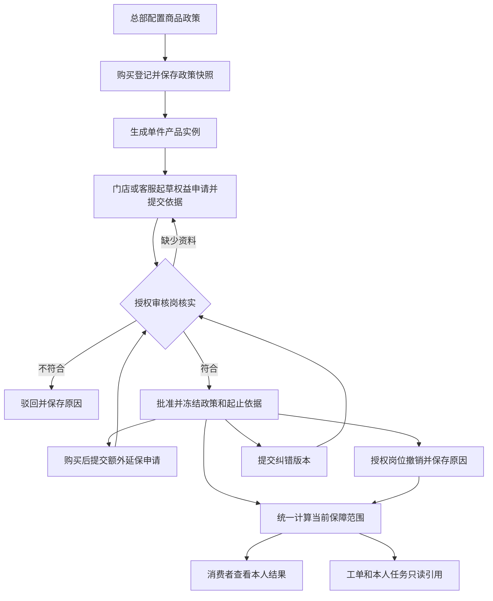

# 终身保修与延保方案

- 编号／类型：CR-20261004-01／功能方案与技术调研。
- 状态：用户已授权按本 Spec 实施；阶段 0～5 研发实现与本机验证完成，真实政策、微信／真机和共享环境业务验收待落实。
- 来源／日期：用户先要求保存方案，随后明确授权按本 Spec 连续完成阶段 0～5；2026-10-04，V1.1。
- 应用／角色视角：Web 管理后台（总部、客服、门店及受限服务站）、消费者小程序、服务人员小程序。
- 模块／入口：A09 商品档案、A15／D03／D04／D07 顾客购买记录、A18 服务工单、C10 产品资料、W04 本人任务；W12／WAPP-019 原项目延保资料查询保留后续边界。
- 关联需求：ADM-MD-007、ADM-CU-001／002、CAPP-011、WAPP-019；终身类型及权益办理按 CR-20261004-01 单独追踪已授权范围；不据此确认品牌真实政策或恢复 W12。
- 优先级／负责人：本期实施 Codex；业务政策及验收负责人待分配。
- 成功标准：明确政策、受益对象、登记、核验、生效、计算、对客展示、售后引用及撤销纠错的完整链路；实施后应有真实权限、数据库及接口证据，不把在保显示等同免费维修判定。
- 本轮证据：五个代码仓库研发实现、专项测试、实际 MySQL 迁移／回读、真实身份 API、Web 办理与消费者 H5 分支核对；详见第 15 节。工作区保留，未提交、推送、上传或发布应用。

> 本文是本次方案及后续实施记录的唯一入口。第 3～12 节为本次授权采用的首期契约；实施细节及证据统一维护在第 15 节。品牌真实政策、终身承诺及历史追授仍必须有来源；缺失时可以完成通用能力和测试验证，真实权益保持待核实。

## 1. 实施前调研基线（V1.0）

| 项目 | 2026-10-04 核对结果 | 对设计的影响 |
| --- | --- | --- |
| 商品标准保修 | `warrantyEnabled` 与 `warrantyMonths`，保修月数为 1～600；Web 默认 12 个月 | 没有终身类型，不能用 0、空值、600 或超长月数模拟终身 |
| 登记快照 | `afs_purchase_item` 保存启用、月数快照；同一明细可有多件 `afs_product_instance` | 政策快照在购买明细，具体权益在单件实例，不能给同型号全部消费者一起延保 |
| 消费者展示 | 按登记购买日期估算，日期缺失不计算；已退回不显示剩余时间 | 继续区分预计值和已核实权益，不从自填日期自动授予资格 |
| 扫码绑定 | 独立扫码关联，扫码投影购买日期为 null；已有本人登记关系时列表优先显示登记产品 | 保持用户已确认“不增加绑定时购买记录查询”；首期扫码产品只展示政策，权益办理要求明确的登记实例 |
| 延保资料 | 原始截图包含项目、地址、企业、型号、数量及起止日期；来源、发布责任未确认，正式 W12 隐藏 | 单件权益首期不冒充项目延保系统，不自动恢复 W12 |
| 旧消费者契约 | `validWarranty` 严格限定现有状态和 1～600 月 | 不能向旧字段直接塞入 `LIFETIME_ACTIVE` 等新值，需要兼容既有客户端 |
| 登记编辑 | 商品改变时 `updateRegistration` 可删除并重建明细／实例，现有锁定判断不含新权益 | 必须增加权益引用保护；更改购买日期、购买人、门店等也不能悄悄改变已核实权益 |
| 审计 | 通用 `AfterSalesAuditSupport` 默认关闭 | 权益操作历史必须随事务强制保存，不能仅依赖可关闭的通用审计 |

源码核对入口：

- [商品校验](../../../backend/gaia-after-sales/gaia-after-sales-core/src/main/java/com/ehsure/gaia/afterSales/catalog/appservice/ProductAppService.java)、[商品表单](../../../frontend/gaia-ui/apps/after-sales/src/views/catalog/product/components/ProductFormDialog.vue)、[商品导入导出](../../../backend/gaia-after-sales/gaia-after-sales-core/src/main/java/com/ehsure/gaia/afterSales/masterData/appservice/MasterDataTransferAppService.java)。
- [购买与本人产品 SQL](../../../backend/gaia-after-sales/gaia-after-sales-core/src/main/resources/mappers/afterSales/CustomerMapper.xml)、[登记编辑](../../../backend/gaia-after-sales/gaia-after-sales-core/src/main/java/com/ehsure/gaia/afterSales/customer/appservice/CustomerAppService.java)。
- [当前估算](../../../backend/gaia-after-sales/gaia-after-sales-core/src/main/java/com/ehsure/gaia/afterSales/mobile/consumer/ConsumerWarranty.java)、[端侧校验](../../../mobile/gaia-after-sales-uni/src/consumer/warranty.ts)、[审计开关](../../../backend/gaia-after-sales/gaia-after-sales-core/src/main/java/com/ehsure/gaia/afterSales/common/AfterSalesAuditSupport.java)。
- [消费者保修展示契约](2026-10-04-消费者产品保修时间展示.md)、[原始延保资料需求](../01-功能需求/07-服务人员小程序需求.md#1047-截图补充延保技术资料与个人中心)、[注册与权益边界](../02-技术设计/08-商品注册绑定与服务资格核验.md)。

调研选型：终身使用显式类型，而非超大月数；权益按实例保存，而非给商品增加统一延保月数；办理使用独立业务历史，而非可关闭的通用审计；首期人工审核，而非建立活动规则引擎；新消费者摘要与旧估算分开，而非直接修改旧枚举。这些选择分别由上表的字段、关联、审计、来源和客户端约束支撑。私有凭证可复用范围、实际租户落库形式和费用引用字段仍需阶段0核对，当前不声称已经验证可运行。

## 2. 市场依据及适用边界

核对日期为 2026-10-04。公开政策用于理解真实场景，不直接成为本租户的已批准政策：

- [TOTO 中国官方保修政策](https://www.toto.com.cn/cn/service_repaired.html)：部分智能便器为固定质保加赠送延保，适用条件涉及活动日期、指定授权渠道及官方免费安装；公开页面没有列出统一终身保修。具体产品、购买时点和保证书仍需核实。
- [科勒官方终身有限保修](https://www.kohler.com/content/dam/kohler-com-NA/Lifestyle/PDP-PDF/PDP-PDF-Kohler%20Faucet%20Lifetime%20Limited%20Warranty.pdf)：部分美洲住宅水龙头针对原始购买者提供有条件的终身保障，使用场合、地域、部件和费用存在限制；不套用于 TOTO 中国。
- [西门子香港延长保养说明](https://www.siemens-home.bsh-group.com.hk/zh/customer-service/warranty/faqs-extended-warranty)：允许原保用期结束前申请延长保养，说明购买后申请是实际场景；不是 TOTO 的申请规则。

“终身”指政策约定的持续保障，没有固定截止日期；并不自动代表任何故障、人工、运输或安装全部免费。“延保”指具体合同或活动增加的保障区间，可能购买时赠送，也可能购买后办理。需要分别保存办理日期与保障起止日期。

## 3. 首期范围与默认选择

### 3.1 本期包含

1. 商品档案支持固定期限／终身有限保修，继续保留既有保修启用设置。
2. 新登记保存完整政策快照；历史记录明确来源，不追授终身或活动延保。
3. 以登记产品实例为对象的标准保修核实、延保申请、人工审核、撤销及纠错。
4. 已核实固定期限、终身、延保的日期／范围展示；消费者、后台及本人任务只读复用同一计算结果。
5. 后端权限、私有依据、幂等并发、不可变操作历史、显式迁移和必要回归。

### 3.2 首期不做

自动识别官网活动、自动授予 TOTO 延保、规则引擎、消费者自助购买延保、线上支付、保险理赔、项目批量延保及 W12 全局查询、转赠自动继承、部件自动责任判定。付费延保可登记已有合同和线下付款依据，不新增收款系统。扫码绑定不新增购买记录查找，也不据同码存在记录就授予本人权益。

### 3.3 可直接执行的默认规则

| 决策 | 默认方案 |
| --- | --- |
| 终身配置 | 显式 `LIFETIME`；对客默认名称“终身有限保修”，不得以有限月数替代 |
| 发放对象 | 一件登记实例；所属租户及门店从后端上下文解析 |
| 操作方式 | 门店／客服有独立权限才能起草提交；授权总部审核岗位确认或撤销 |
| 自动生效 | 不启用；购买登记核验通过也不等同保修权益核实 |
| 多次延保 | 每次记录明确起止区间；相同覆盖范围重叠区间取并集，不把月数反复相加 |
| 终身再延保 | 首期拒绝给已确认终身的同一覆盖范围追加期限；不同范围的复杂组合暂不办理 |
| 审核分工 | 首期提交人与审核人分开；管理员身份不绕过业务动作权限或数据范围 |
| 已到期后办理 | 系统允许提交有明确合同依据的申请；无补办依据不允许审核通过，不默认从审核日重新起算 |
| 变更与纠错 | 已批准内容冻结；通过有理由、有依据的新版本替换，不覆盖或删除旧事实 |
| 开放方式 | 先完成精确权限和测试角色验证；没有真实政策依据时仅使用可追踪测试实例演示 |

## 4. 角色与办理责任

| 角色 | 可做什么 | 边界 |
| --- | --- | --- |
| 总部商品维护岗 | 配置商品保修类型、期限、范围与政策说明 | 必须同时有商品维护权限；修改主档不改变历史快照 |
| 门店／代理商 | 在有权限的本店登记实例上起草、补充依据、提交申请 | 不自行确认生效，不跨店查看，不获得全局权益目录 |
| 客服 | 对本人授权区域／队列内实例代办及查询结果 | 核实购买记录的原权限不自动变成权益审核权限 |
| 总部权益审核岗 | 审核标准保修／延保、退回补充、驳回、撤销及纠错 | 独立操作授权、明确业务范围；提交人不能审核自己的申请 |
| 服务站／服务人员 | 从已授权工单／本人当前任务读取必要摘要及范围 | 不改期限、不赠送延保、不因曾承接工单获得永久访问 |
| 消费者 | 查看本人产品的政策、已核实结果及必要说明 | 首期无延保写入口；产品关联关系不是权益受益人证明 |

受益对象在实例权益记录中明确。首期可核实“该登记购买人”或合同指定受益人，不把当前登录账号默认认作原始购买人；代办、使用者与购买人仍沿用既有身份边界。受益人变化需重新核实。消费者摘要同时校验本人可见关系与受益条件：只拥有产品查看关系、没有可验证受益人关联的账号，显示政策及资格待核实，不显示他人的终身在保结论。原始资料没有确认上述办理岗位，本表是本次建议分工。

## 5. 完整流程

### 5.1 商品配置与购买登记

固定期限保留 1～600 月；终身类型不填写月数，必须填写可追溯政策依据、覆盖范围及主要限制。配置关闭／不完整仍显示待完善，不据此宣称消费者没有法定或合同保修。

购买登记自动保存商品政策快照，并按用户2026-10-04确认增加可选「同时登记延保」。具备购买登记及独立权益起草权限时，可在新增登记填写延保来源、1～600月期限、范围、活动／合同编号和可选凭证／起保依据；约定起保日期尚未明确可留空，不默认从购买或审核日期起算。购买登记、单件实例、延保草稿及强制历史在同一事务中保存，任一失败全部回滚；未勾选保持普通登记流程，不自动生成已批准权益。保存后进入该实例「保修与延保」只读页签查看草稿；继续核实标准保修、补齐标准权益引用、日期与依据并提交审核，由列表独立「办理延保」操作进入，不通过编辑购买登记覆盖权益。

用户随后确认详情只读及独立办理操作：顾客购买记录「更多操作」顺序为查看 → 发起服务 → 办理延保 → 作废登记，编辑保持首个直接操作；已有购买核验操作仍按记录状态与权限显示。详情只展示权益和历史，起草、草稿编辑、提交、审核、撤销及纠错统一在独立办理弹窗，仍复用既有精确权限与状态机，不新增菜单或扩大授权。

### 5.2 标准保修核实，包括终身保修

1. 选择明确实例，显示登记来源、购买核验状态和政策快照。
2. 提交政策／保证书依据、受益对象、覆盖范围、已核实起保日期及其来源。
3. 审核岗核对凭证、适用条件与起算依据；缺失则退回，冲突则驳回。
4. 批准保存固定期的核定起止日期，或终身类型的核定生效日期及无截止日期事实。
5. 终身符合条件后显示“在保”；如果只是商品配了终身且尚未核实，显示“终身有限保修／资格待核实”。

起保依据支持官方安装完成、发票、生产日期替代或明确合同日期；不得使用工单提交／审核时间冒充安装完成日期。首期由审核岗录入并引用证据；后续只有确认可信履约数据源后才自动带入。

### 5.3 购买后申请延保

1. 在顾客购买记录「更多操作 → 办理延保」选择已登记实例；核对既有标准保修及申请历史。详情「保修与延保」仅作查看。
2. 选择来源：活动赠送、付费合同、项目合同；录入活动／合同编号、适用范围、区间和依据。
3. 标准权益尚未核实时，可以先保存草稿；审核通过延保前必须已有未撤销且事实一致的标准权益核实结果。标准区间已结束不影响引用该核实结果，否则无法办理正常的过标准期延保。
4. 审核确认办理窗口、产品／渠道／区域、受益人、安装条件及已有付款／合同事实。资料录入时间不决定延保开始时间。
5. 批准后按保障区间计算。如果标准已过期但延保已生效，显示“延保中”；延保尚未开始则显示对应未来区间。

购买后补登记原已享有的权益，须保存原生效区间和“补录”来源；购买后新办理，须保存新合同依据。两种情况均不把旧过保日期改成审核日期。

### 5.4 服务申请与检测

建单继续使用现有可信商品与权限流程，不新增消费者必点的保修确认。工单按需读取当前权益摘要，在实际判定费用／报价时保存被引用的权益 ID、版本、判定日期和范围。后续撤销不改写已办结费用历史。

“期限内”是参考事实。故障原因、部件、人工等是否覆盖仍由现有检测及费用流程判断；不因终身或延保而自动把全部费用归零，不绕过人工完工审核，不恢复已退役服务受理入口。

### 5.5 退货、转赠、绑定变化与纠错

- 退货／登记退回：即时停止对该实例显示有效保障，保留原核实和撤销历史，不把唯一码释放后的新销售实例当作同一受益对象。
- 解绑／手机号变化：只影响账号可见性，不自动销毁或转移合同；未验证的新账号不获得原始购买人的终身权益。
- 换货／实例合并：首期不自动迁移权益，显示待重新核实；保留旧实例关联。明确批准继承时另走有证据的纠错流程。
- 登记改商品／数量或作废：只要存在权益申请／历史引用，就禁止物理重建或删除实例，返回明确冲突；无引用的既有行为继续保留。
- 登记改购买日期、购买人、门店等政策关键事实：有已批准权益时先拒绝普通编辑，要求进入专门纠错；有待审核申请时退回草稿并冻结原提交证据。审核同时检查提交时事实版本，避免批准已经改变的依据。
- 撤销：单独权限、必填原因，立即重新计算当前保障；撤销延保后回到仍有效的标准保障，不能把原始标准保修一并删除。撤销 BASE 时页面显示受影响的依赖延保，后端同一事务撤销这些依赖并分别保存历史，不允许留下悬空权益。付费权益撤销不自动产生退款，财务办理依据原合同另行处理。
- 纠错：起草替换记录并独立审核；批准时在一个事务内替换旧版本，保留新旧关联和影响说明。存在依赖延保时同步校验，不能留下脱离有效标准权益的延保。

## 6. 状态、区间与计算规则

### 6.1 办理状态与展示状态分开

办理状态：`DRAFT → PENDING → APPROVED / REJECTED`；补资料由 `PENDING → DRAFT`，批准后仅可 `APPROVED → REVOKED` 或由新版本原子替换。驳回后重新申请保存新提交版本。审核通过并不代表今天已经生效。

展示由后端按 Asia/Shanghai 当日计算，建议状态如下：

| 状态 | 含义／对客文案 |
| --- | --- |
| `UNCONFIRMED` | 资格待核实；固定期有购买日期时继续展示原预计值 |
| `DATE_REQUIRED` | 无购买日期，暂无法计算剩余保修时间 |
| `NOT_STARTED` | 已核实，但保障区间尚未开始 |
| `STANDARD_ACTIVE` | 标准保修中 |
| `EXTENSION_ACTIVE` | 延保中 |
| `LIFETIME_ACTIVE` | 在保，期限为终身有限保修 |
| `LIMITED_ACTIVE` | 部分范围在保，须展示对应范围 |
| `EXPIRED` | 已核实区间均已结束 |
| `GAP` | 今天没有连续保障，存在以后才生效的区间；显示“当前不在保，后续保障待生效” |
| `RECHECK_REQUIRED` | 关键事实／受益条件冲突，待重新核实 |
| `RETURNED` | 产品已退回，不展示剩余／到期时间 |

`REVOKED` 是某条记录的状态，不必成为产品统一状态：撤销后仍可能有其他有效保障。退回优先，随后处理事实冲突，再计算已批准区间，最后回落原标准估算。

### 6.2 日期算法

- 固定标准期限：`end = verifiedStart.plusMonths(months).minusDays(1)`；剩余时间含截止当日。
- 增加 N 月延保的建议连续区间：`extensionStart = verifiedBaseEnd.plusDays(1)`，`extensionEnd = extensionStart.plusMonths(N).minusDays(1)`。审核须确认合同确实采用该方式，不从审核日计算。
- 固定日期合同：直接保存经核实的 start／end，要求 start ≤ end；不强行转成月数。N 月录入与固定日期录入二选一，不接受互相矛盾值。
- 同范围多条有效保障按区间并集合并，相邻日期可连续；今天在某区间内时，剩余天数只计算到该连续区间结束，不跨过保障空档。
- 范围不同不合并成“整机到最晚日期”；有限范围必须单独标注。本期不解析文本中的部件，人工核对范围。
- 终身必须为显式类型：`endDate=null` 且 `remainingDays=null`，有核实生效日。空截止日期在其他类型下是资料错误，不推断终身。
- 终身标准类型只有未撤销且条件仍成立才显示在保。主档配置、账号绑定和时间估算都不能替代条件核实。

示例：起保 2026-10-04，12 月标准期至 2027-10-03；赠送连续 24 月延保则为 2027-10-04～2029-10-03。批准时间可以在 2026 年，延保状态仍到 2027-10-04 才进入“延保中”。

## 7. 数据与保存边界

以下逻辑字段已按实际 BIGINT 主键、租户上下文、私有凭证及费用版本机制实现；显式迁移已在测试库执行并回读，执行范围和恢复边界见第 15 节。

| 保存位置 | 最小新增／调整 |
| --- | --- |
| `afs_product` | `warranty_type`（FIXED／LIFETIME），范围类别（WHOLE_PRODUCT／LIMITED_SCOPE）、范围说明、政策依据引用、主要限制；保留 enabled、months。FIXED 启用时 1～600 月，LIFETIME 启用时 months 必须为空 |
| `afs_purchase_item` | 类型、范围、政策依据及主要限制快照，记录捕获来源／时间；与已有 enabled／months 快照共同冻结 |
| 新权益表，建议 `afs_warranty_entitlement` | 单件 instance_id、BASE／EXTENSION、租户上下文、受益对象、保障类型、范围及说明快照、起止日期／起算依据、来源类型、活动／合同编号、私有证据引用、办理状态、提交／审核事实版本、撤销／替换关系、revision 与操作者时间 |
| 新历史表，建议 `afs_warranty_entitlement_history` | 每次提交、退回、批准、驳回、撤销、纠错的完整业务快照、原因、请求号、操作者和时间；强制写入，不受全局审计开关控制 |
| 工单判定引用 | 在现有费用判定／版本事实中保存实际使用的权益 ID／版本及范围；复用现有费用版本能力，避免独立复制一套判定流程 |

附加约束：

1. BASE 表示标准权益已核实，包括固定及终身；EXTENSION 首期仅为固定区间，必须引用未撤销且事实一致的 BASE，BASE 的标准区间可以已经结束。一个实例只允许一个当前批准的 BASE，历史通过替换保留。
2. 受益对象引用既有购买人／可验证合同事实，不能只填任意 accountId。若需绑定消费者账号，保存已核实账号关联及依据；后端验证该账号、购买人、实例一致性，不能直接采用当前扫码账号或仅靠手机号相等。阶段0优先复用可信既有关联，没有可信关联则消费者结果保持待核实。敏感身份信息采用已有加密及脱敏机制。
3. 租户、实例、门店、操作人由后端解析和复核，客户端不可指定归属。既有表无 tenant_id 时不得假造关联列，按实际单租户上下文补齐隔离设计。
4. 已批准记录不可原地改变类型、日期、受益人或范围；历史及已被引用申请不可物理删除。
5. instance_id 使用独立售后实例，不引用 Gaia 主系统商品或客户档案。政策文本只是说明，不充当自动规则表达式。
6. 证据使用受控私有附件／凭证引用。每次读取验证租户与权益／单据范围，不向消费者返回完整发票、内部审核意见、私人联系方式或原始存储地址。
7. 用实例锁、revision、事务及唯一约束处理并发批准／替换／撤销，建立租户内请求号幂等。合同编号可能覆盖多件，不能全库唯一；去重键须包含实例、来源和该次权益标识。
8. 首期单实例申请原子提交；项目数量批处理、整项目审批与全局证书目录后续单独设计。

## 8. 页面和消费者文案

### 8.1 Web

商品档案现有表单增加保修类型；固定时显示月数，终身时隐藏月数。范围、政策依据与限制按类型校验；详情、列表、导入导出同时表达类型，旧模板没有类型且有合法月数按 FIXED 处理，不把空月数导入成终身。

顾客购买记录详情按单件实例增加“保修与延保”页签：上方政策与当前结果，中间申请／已核实区间，下方操作历史。保存草稿、提交、退回、批准、驳回、撤销／纠错分别依据后端 actions 显示。失败保留输入，重复点击不重复提交，切换实例隔离旧响应。

首期在既有购买记录页面提供本数据范围内的“待审核权益”筛选及直达实例办理，不新增全局侧栏菜单。精准动作归既有稳定菜单节点；如果实施时确需新独立目录，须另记录业务理由并执行菜单联动，不能为审批列表默认扩大导航。

### 8.2 消费者 C10

| 场景 | 推荐显示 |
| --- | --- |
| 固定期、未核实、有购买日期 | 保留“预计在保／预计已到期”、预计剩余及到期日期；说明“按购买日期估算，实际保修以售后确认为准。” |
| 扫码、固定期、无购买日期 | 显示标准时长；说明“暂无购买日期，暂无法计算剩余保修时间。”；无倒计时／到期日／联系客服按钮 |
| 商品政策为终身、资格未核实 | “保修期限：终身有限保修”“保修状态：资格待核实”；说明“保修范围以产品保修政策为准。” |
| 已核实终身 | “保修期限：终身有限保修”“保修状态：在保”；无剩余天数／到期日；必要时显示覆盖范围 |
| 标准保修中、延保已批准未开始 | 标准保修当前结果，另列“已获延保：24个月”等合同实际值和延保区间，避免让消费者误认为今天已进入延保 |
| 延保中 | “保修状态：延保中”，显示当前范围、剩余时间和该连续区间到期日 |
| 部分范围在保 | “部分范围在保”，明确例如“仅本体／阀芯”；不只显示整机在保 |
| 待审核／驳回 | 有已批准权益时继续显示有效结果；申请状态作为附加信息，不把申请中时长算进剩余时间 |
| 已退回／需重新核实 | 明确对应状态，不显示虚假剩余或永久在保 |

保修区沿用已确认的短提示，不恢复联系客服按钮。对客展示不写内部状态码、审核流程说明或付款凭证。终身产品缺购买日期时不重复显示“无法计算剩余时间”，因为该类型本来不使用倒计时。

### 8.3 服务人员与服务站

只在当前有权限的工单／本人任务产品区显示同一权益摘要、起止日期与适用范围，必要时显示“需核实”。不开放全局消费者查询或权益写操作。被退回／改派后的人员访问沿用现有当前承接与历史快照隔离。W12 项目资料页继续隐藏，当前首期不满足它的来源和发布契约。

## 9. 接口与权限契约

### 9.1 业务接口

管理端建议在既有登记／实例资源下增加权益集合：查询、创建草稿、更新草稿、提交、退回、批准、驳回、撤销及替换；精确方法／路径和独立动作在阶段 0 对照实际 Controller 和 Gaia 操作清单确定。禁止通用 PUT 修改办理状态。每条写请求包含 requestId，变更包含 revision；提交范围白名单不得接受审核字段或归属字段。

建议基准路径为 `/api/afterSales/customer/registrations/{registrationId}/instances/{instanceId}/warranty-entitlements`：GET 查询、POST 草稿、PUT `/{entitlementId}` 仅改草稿、POST `/{entitlementId}/submit|return|approve|reject|revoke` 为状态动作，POST `/{entitlementId}/replacement` 起草纠错。待审筛选作为购买记录查询的范围内条件，响应须带可见实例与可执行 actions。核对实际路由后可调整路径组织，但不能省略登记／实例／权益三者一致性校验。

消费者保留现有 `/products/{id}/warranty?kind=REGISTERED|SCANNED` 的旧估算形状，新增建议接口 `/products/{id}/warranty-summary?kind=...`，本人产品列表可追加 `warrantySummary`。新客户端使用新摘要，旧字段不写入未知枚举；终身在旧接口下仅返回合法的未知形状，不伪装有限日期。兼容是为了现有微信／H5客户端滚动更新，不增加无调用方的多版本框架。

新摘要至少包括：schemaVersion、policy（类型／标准月数／对客范围）、verification（已核实／待核实／需重新核实）、status、asOf、当前连续区间／剩余天数、可见保障区间、旧标准预计值（仅适用固定期）。终身无 endDate 和 remainingDays；客户端校验类型、真实日历日期、区间次序及状态一致性。不得把部门、审核者、私有附件或付款数据混入消费者响应。

消费者新路径在 WAR／Jar Shiro 配置中只增加精确消费者会话路由，由领域会话再校验本人归属；不能放开 `products/**`。服务人员摘要随既有本人任务／工单返回，不新增可任填他人账号的移动接口。

### 9.2 权限及数据范围

建议拆分 `readWarrantyEntitlement`、`writeWarrantyApplication`、`submitWarrantyApplication`、`reviewWarrantyEntitlement`、`revokeWarrantyEntitlement`、`correctWarrantyEntitlement`；退回／批准／驳回为 review 的精确子路径。商品政策维护仍要求原商品写权限。最终 code 与稳定 ID 以现有菜单矩阵核对结果为准。

列表、待审核筛选、详情、附件及全部写动作使用同一租户／组织范围。没有审核权限只能提交，具有审核权限但不在数据范围也不能批准；普通购买核验权限、管理员导航和服务任务写权限均不能代替权益权限。前端 actions 只辅助呈现，后端必须逐请求校验。

## 10. 迁移、历史与回退

1. 先核对当前数据库确为测试库、实际字段类型与前一保修迁移执行情况，准备受影响表及权限配置备份。应用启动不得自动建表。
2. 商品类型回填只把现有合法有限期限标为 FIXED；其余保留待完善。购买明细从已有合法期限快照推导 FIXED，不再次用现商品值覆盖历史快照；新字段中缺失的历史范围／政策引用明确为未知。
3. 不把历史月数 0／null 改为终身，不把官网现活动应用于全部老登记；不自动生成 APPROVED 权益。
4. 原 2026-10-04 一次性快照迁移不得盲目重跑；新迁移可分步核对恢复并记录行数／前后读回结果。
5. 必要测试数据限定少量新建、可追踪实例及测试政策，例如固定12月、终身、赠送24月延保；不批量改现有商品为终身，不给真实客户写无依据权益。
6. 新增精确操作及少量测试角色关系按既有授权执行并回读；不批量给全部管理员／门店授权，不因新增页签改动主系统 common 子仓库。
7. 回退保留新增表、快照和历史，不能 DROP 或恢复整库覆盖并发数据。已有终身数据后，优先关闭新办理入口并保留新字段读写保护的修复版本；若回到不认识终身的旧程序，先冻结相关商品／权益写入，核对旧导入及编辑不会覆盖字段后再操作。
8. 本次夜间启动不自动提交、推送或共享发布；测试库迁移按既有持续授权核对／备份后执行。部署仍须用户单独要求，默认完整测试环境范围按项目正式入口处理。

## 11. 实施顺序与可交付切片

| 阶段 | 实施内容 | 交付／验证条件 |
| --- | --- | --- |
| 0：核对并落定契约 | 重读本文、各仓 AGENTS／功能规范；查看未提交改动／远端差异，确认旧保修改动及并发任务；核对表、实例路径、身份、私有附件、费用引用和精确权限 | 把实际字段、接口及业务默认选择写回本文；无冲突即可继续，不因例行检查重复询问 |
| 1：类型与历史保护 | 商品 FIXED／LIFETIME、完整快照、导入导出、消费者安全未知回退、登记引用保护；准备新表迁移 | 新旧固定期一致；终身不造日期；已有快照不覆盖；有权益历史实例不能被重建 |
| 2：权益办理后端 | 草稿／提交／审核／撤销／纠错、强制历史、范围、事务、幂等、BASE依赖、统一区间计算 | 状态机、越权／跨租户、并发及真实SQL验证通过 |
| 3：Web办理 | 商品表单与详情、购买记录实例页签、待审筛选、精确 actions与测试岗位授权 | 正式接口允许／拒绝验证，桌面填写→提交→另一人审核→撤销／纠错闭环通过 |
| 4：消费与履约展示 | 新摘要及兼容路由、C10文案／分支、当前任务只读摘要、实际费用判定引用 | 各端同一实例结果一致；旧客户端不收到非法状态；任务改派访问受控；费用流程不自动改为免费 |
| 5：收尾与交付 | 少量测试库迁移／数据回读、复用本地服务、关键路径验证、文档影响更新 | 本文记录实施和证据，应用进度按实际更新，未验证／未发布明确；工作区改动保留 |

常规实现细节按项目惯例自主选择；政策资料缺失不妨碍通用模型、页面和合成数据验证。需要真实政策的批准行为保持待核实，不等待业务政策即可完成其余授权工作。若发现数据引用会丢失、并发改动不能安全区分或实际设计需扩大业务范围，继续不受影响的阶段并说明具体阻塞。

代码位置按当前结构扩展：后台 `apps/after-sales`，售后域 `gaia-after-sales`，宿主精确认证路由 `gaia-saas-proj`，消费者及人员端各自本地仓库。不新增 legacy 功能，不运行时导入主系统源码；共享底座变更才按双端规范同步，权益业务不复制到无调用方模块。

## 12. 验证矩阵与验收标准

| 编号 | 必测场景 | 通过标准 |
| --- | --- | --- |
| WAR-01 | 固定12月登记、月底／闰年／到期当天／未来日期 | 新旧预计值一致，日历月算法正确，已核实与预计状态明确 |
| WAR-02 | 终身政策未核实与已核实 | 未核实不显示正式在保；核实后显示终身／在保且无倒计时或到期日 |
| WAR-03 | 0／null／600月、非法类型组合 | 0／null不推断终身；600仍为有限期限；LIFETIME有月数等非法组合拒绝 |
| WAR-04 | 购买时赠送、购买后补录、新购延保 | 各自来源与合同区间可追溯，未审核不计入保障，批准日不替代起算日 |
| WAR-05 | 多条重叠／相邻／间隔延保，不同覆盖范围 | 区间并集不重复累计，不跨空档倒计时，有限范围不冒充整机保障 |
| WAR-06 | 已到期补办、终身追加延保、无标准权益 | 无依据不能批准；首期终身同范围追加拒绝；BASE依赖始终成立 |
| WAR-07 | 草稿修改、补资料、驳回、重复批准、撤销及原子纠错 | 状态合法，历史不覆盖，同请求幂等，不同版本冲突明确，标准和延保依赖不悬空 |
| WAR-08 | 门店／客服／总部／消费者／师傅与跨租户、跨店 | 有权且在范围才能办；不可自审；本人接口和私有凭证不泄漏 |
| WAR-09 | 退货、登记作废、商品／数量／购买人／日期更改、实例合并 | 引用不被删除，关键事实不默改权益；退货停止有效展示，变化需重新核实 |
| WAR-10 | 扫码固定与终身、同码他人登记、解绑再绑 | 无额外绑定购买查询；无本人登记实例不授予权益，原始购买人资格不由账号绑定代替 |
| WAR-11 | 主档变更与历史迁移 | 原登记类型／月数／范围快照保持，缺历史政策明确未知，不自动追授 |
| WAR-12 | 旧接口／旧客户端、新摘要、列表与详情 | 旧合法契约保持；新状态校验完整，列表／刷新一致，失效响应不回写，错误可重试 |
| WAR-13 | 工单检测、报价、完工审核及改派人员 | 在保不自动等于全部免费；引用版本留存；原办结历史与人员数据隔离不变 |
| WAR-14 | 审计关闭、事务失败、并发提交／撤销 | 强制业务历史仍存在；操作与历史同成败，数据无重复批准、悬空引用或半提交 |

检查要求：后端定向模型／状态／日期测试、真实 SQL 和事务／权限集成；宿主 WAR／Jar 新精确路由及邻近路径拒绝；Web 子系统现有 check 和受影响测试；两端各自完整检查及微信／H5构建，关键页面 H5 和实际微信按可用环境核对。复用匹配本任务的既有本地服务，确认新代码已加载，不把 HTTP 200 或匿名拦截当业务验证。

已知基线：旧保修切片曾核对购买登记集有17项与当时HEAD相同的既有失败；夜间必须重新识别当前失败集合，不预先豁免新增失败。Mock／H2、合成H5与真实MySQL／岗位／微信／真机分开记录。通常仅留1～2张必要最终关键状态图，原日志和重复截图进 `.local/verification-artifacts/`，不能把构建通过写成业务验收。

完成标准：首期类型、办理、展示、引用及必要测试全部达到后可报告“研发完成”；缺真实政策、微信／真机或业务岗位验收仍须列出，不宣称 TOTO 已承诺终身、不宣称共享环境已更新。

## 13. 待业务落实及执行时的安全默认值

| 项目 | 实施不等待时采用的默认值 | 后续业务落实 |
| --- | --- | --- |
| TOTO 是否存在适用的终身政策 | 只做能力和测试示例，现有真实商品保持固定期 | 有批准的产品保证书／政策才能正式配置 |
| 延保活动日期、渠道、型号和安装条件 | 人工核验凭证，不自动计算资格 | 总部提供正式政策及历史适用范围 |
| 终身受益人、转赠及使用场合 | 核实登记购买人／合同受益人，变化重新核实 | 明确实际政策是否可转让及范围 |
| 已过期补办、续保、额外补偿 | 无明确合同不批准；复杂补偿首期不办理 | 明确各服务提供方条件和责任 |
| 真实审核岗位和证据来源 | 测试账号分离提交／审核，权限最小化 | 指定正式负责人并完成岗位验收 |
| 项目延保资料 W12 | 保持隐藏，不建伪数据源 | 来源、维护发布责任及项目查询契约解阻后独立排期 |

以上为政策落地项，不将其写成“必须先全部回答才能开发”。启用真实权益时必须由授权岗位依据有效资料办理。

## 14. V1.0 启动约定（保留设计时点）

### 14.1 晚上回来立即执行

向当前任务发送以下完整指令即可；这会授权执行本方案默认规则及必要验证，不包含 Git 提交、推送或发布：

> 按 `specs/2026-10-04-终身保修与延保方案.md` 启动行动化执行，采用文档的首期默认方案，从阶段0持续推进到研发实现和必要验证完成。保留已有及并发改动，按已有授权处理必要测试库迁移和少量测试数据，缺真实政策时完成通用能力并保持真实权益待核实。更新对应项目文档，完成后报告结果和未验证项；不提交、不推送、不部署。

### 14.2 希望到指定时间自动启动

发送“请创建一次自动化，在北京时间 YYYY-MM-DD HH:mm 开始执行上述 Spec 的首期方案，完成后通知我，不提交、不推送、不部署”。具体时间和时区需完整，不能只说“晚上”。之后使用 Codex 正式自动化工具创建，并把同一方案路径、实施范围、默认规则、停止条件和通知要求写入自动化；不以终端 sleep／cron 替代。

目前只保存启动话术，没有创建自动化或安排后台执行。如需提交或部署，另行在启动指令中明确对应动作；“按方案执行”本身不包含这些动作。

## 15. 2026-10-04 实施与验证记录

### 15.1 授权、范围与实际契约

用户明确授权按本 Spec 连续实施阶段 0～5；核对五个源码仓库及文档仓库初始改动、分支与远端差异后执行。源码仅涉及 `gaia-after-sales`、`gaia-saas-proj`、`gaia-ui/apps/after-sales`、消费者及服务人员仓库，未修改 legacy 或公共页面子仓库；本轮保留工作区改动，不提交／推送／上传／共享发布。没有创建自动化，也未把本轮研发验证记为业务验收或增加菜单开放计数。

- 商品显式 `FIXED/LIFETIME`、范围类别／说明、政策依据及限制；终身不得填月数，启用须明确范围和依据。购买明细冻结完整政策及来源／时间；历史只依原合法月数保留固定期，不追授终身。商品列表、详情、表单和 Excel 导入导出均支持新字段；旧模板仅缺新增五列仍可导入固定期，旧客户端不能隐式把既有终身商品降为固定期。
- 单件权益支持 BASE／EXTENSION 的草稿、提交、退回、批准、驳回、撤销及原子纠错。实例／登记锁、revision、租户内请求号及当前 BASE 唯一约束共同保护并发；不同提交人和审核人，批准内容不可原地编辑，标准撤销或替换须明确处理依赖延保。强制加密完整历史、请求号和操作者，不依赖全局审计开关；按实际发生时间和数值 ID 展示历史。
- 受益对象由登记事实解析。仅已核验 SELF、登记购买人账号及有效本人实例关系齐全，且私有依据确认受益人后，消费者可见正式保障；绑定／手机号不能独立授予资格，解绑不会改写合同受益人。无可信关联继续待核实。私有凭证使用受控编号或合同核验引用，拒绝公开 URL；本期不新增凭证上传系统。
- 已批准权益涉及的购买关键事实禁止普通编辑；待审申请遇事实变化退回草稿并留史。任何申请历史保护实例不被作废删除、商品重建或合并；退货优先显示退回，旧费用与办结事实保持冻结。
- Web 沿用顾客购买记录入口和单件“保修与延保”页签，按后端 actions 办理，支持待审核筛选、实例切换过期响应隔离、失败保留输入和重复提交保护。没有新增全局审批菜单。
- 公共摘要 `schemaVersion=1`：policy、verification、status、asOf、起止／剩余天数、逐条 intervals、旧 estimate 和 applicationStates。ID 为字符串；同范围且说明一致的重叠／相邻区间取并集，空档不跨越，有限范围不冒充整机；终身无截止日及剩余天数。原固定估算保留“预计／待核实”，新合同区间须先批准。
- 消费者列表和 `GET /api/afterSales/mobile/consumer/products/{id}/warranty-summary?kind=REGISTERED|SCANNED` 使用同一摘要；领域会话和本人产品均校验，policy.reference 为 null，不返回私有凭证、合同编号、审核者或内部意见。旧 `warranty` 字段／路由保持原枚举和结构：历史政策为终身、或经批准纠错成为终身，均返回合法 UNKNOWN；退回仍优先返回 RETURNED。不增加绑定时购买查询、不恢复联系客服按钮。
- 服务人员只在当前有权任务的产品明细中读取摘要，历史承接／完工快照不刷新。正式费用报价保存当时权益 ID、版本、范围、区间及安全摘要到 `warranty_references` 和不可变报价快照；费用调整沿用原引用，完工审核沿用报价快照，不自动变成免费维修。不恢复 W12 项目延保查询。

后台办理基准路径：`/api/afterSales/customer/registrations/{r}/instances/{i}/warranty-entitlements`；GET 读详情、POST 起草，PUT `/{id}` 编辑草稿，POST `/{id}/submit|return|approve|reject|revoke` 办理，POST `/{id}/replacement` 起草纠错。动作体为 requestId、revision、reason、revokeDependents；申请字段白名单见[后端契约](../../../backend/gaia-after-sales/docs/warranty-entitlements.md)。请求不接收客户端指定租户、门店或受益账号。

### 15.2 测试库迁移、授权与恢复

确认目标为 `mysql84 / gaia_wh_init_wzy`，原主键为有符号 BIGINT，核对模块、操作列长度、实际角色、结构与 ID 无冲突后，按顺序执行[商品政策](../../../backend/gaia-after-sales/database/20261004_warranty_product_policy.sql)、[权益与快照](../../../backend/gaia-after-sales/database/20261004_warranty_entitlements.sql)、[精确权限](../../../backend/gaia-after-sales/database/20261004_warranty_permissions.sql)。应用启动不改表。

原 15 商品、12 购买明细、12 实例、2 报价的既有列和值逐行回读一致；原 7495 条角色操作关系完整保留。迁移不生成批准权益，不推导任何终身商品。购买历史政策标记 `LEGACY_DURATION_ONLY`，新登记标记 `PRODUCT_AT_REGISTRATION`。新增 3 张权益／历史／请求表，报价新增 nullable 引用列。

六项操作挂原 `afsCustomerArchive`（ID 2026090800000024）：readWarranty、writeWarrantyApp、submitWarrantyApp、reviewWarranty、revokeWarranty、correctWarranty；操作 ID 2026100400006101～6106。仅测试管理员 71、测试总部 72 各六项，测试店员 77 读／起草／提交三项，共 15 条精确授权；角色勾选缓存按实际关系重建，未扩大普通客服／服务站授权或新增菜单。

随后按用户明确授权，为测试库「超级管理员」角色1补充 `readWarranty` 查看权限（操作2026100400006101，新增关系2026100200005296）。当前本地浏览器账号 `00001` 使用该角色；此前因缺少此项权限，购买详情不返回 `warranty` 动作，页签隐藏。事务内备份、精确新增1条关系并按实际关系重建角色勾选缓存，原1056项操作授权及全部菜单关系回读保持，现为1057项；未新增起草、提交、审核、撤销或纠错权限。真实 Chrome 本地9010页面重新打开登记950104010010详情后，页签显示，已批准合成保障及操作历史正常加载，起草／审核等写按钮未出现；保留当前查看页供用户继续使用，无需重新登录或重启服务。备份及执行结果位于已忽略 `.local/verification-artifacts/20261004-warranty-admin-read/`。如需回退，仅删除经核对的新增关系2026100200005296并按当时实际关系重建角色缓存，不覆盖其后授权变更。

私有备份、DDL 回读和过程日志置于已忽略 `.local/verification-artifacts/20261004-warranty-entitlements/`，备份目录 0700、文件 0600，不提交。恢复按[回退说明](../../../backend/gaia-after-sales/database/20261004_warranty_entitlements.rollback.md)精确停用新增授权并回读，保留已产生的权益、历史和费用引用；不得 DROP 或用旧全库快照覆盖后来事实。

用户随后明确要求在登记时增加延保选项并补齐本人权限，已为角色1精确新增其余五项：writeWarrantyApp、submitWarrantyApp、reviewWarranty、revokeWarranty、correctWarranty，关系2026100200005297～5301。保留前次查看权限及原有全部操作／菜单关系，操作授权1057→1062；六项均已回读，未扩大其他岗位。私有备份及结果位于忽略目录 `.local/verification-artifacts/20261004-warranty-admin-full/`。回退仅删除本次五条新增关系并按当时实际关系重建缓存，不覆盖后续授权变化；不可自审、数据范围和状态机限制继续有效。

真实写验证仅使用两条明显标记的合成商品／登记：`WAR-20261004-LIFETIME-TEST`（商品34／登记950104010010／实例950104010012）、`WAR-20261004-FIXED-TEST`（商品35／登记950104010011／实例950104010013）。受益人合成关联仅用于研发证明，不代表真实 TOTO 政策或授予。没有修改旧购买业务资料、真实商品政策或旧费用。

### 15.3 验证结果及实际边界

| 范围 | 本轮证据与结果 | 未覆盖边界 |
| --- | --- | --- |
| WAR-01～03、05～06 | 类型与日历月／闰年／到期当天、同范围并集／不同范围、空档／未来、终身无日期／倒计时等模型测试；非法类型组合、到期 BASE 可延保、终身 BASE／无 BASE 拒绝 | 品牌真实政策逐型号录入与业务验收 |
| WAR-04、07～09、14 | 事务集成验证草稿／自审拒绝／独立允许、事实变化、版本／请求冲突、原子依赖撤销／纠错、强制历史失败回滚、同时批准只留一个 BASE；真实接口验证审核、撤销、替换、越店／无操作权限、引用禁止销毁 | 生产规模压力、真实跨租户账号及品牌合同逐项验收；补资料／驳回页面未逐一走真实浏览器 |
| WAR-10～12 | 会话和本人实例 API 正／反向验证；对客白名单无私有信息；旧终身 UNKNOWN 与新摘要；原估算保留；旧 Excel 模板和终身导入／导出专项通过；购买快照及主档变更回读 | 微信扫码／解绑再绑的实际设备操作、微信网络与生命周期；历史来源未知保持未知 |
| WAR-13 | 当前任务 mapper 及原隔离回归，报价、费用调整、完工审核专项；真实只读人员当前任务摘要、其他任务拒绝、改派后拒绝及隐私白名单5项通过；新报价引用不因后续摘要改变而覆盖，未修改收费门禁 | 服务人员实际任务 H5／微信页面、真实报价到办结全流程岗位验收 |
| 后端／宿主 | 核心专项100项、消费者购买服务7项、API9项、Excel4项、宿主精确路由2项，共122项通过；最终兼容与历史排序修正分别重验 | 非本任务全量后端测试未机械全部执行 |
| Web | lint／类型／knip／国际化检查及生产构建通过；全量448项：411通过、37失败，与 HEAD 逐项同名，新增失败为0；本机店员填写→保存→提交、总部另人审核、受限操作展示及商品终身表单无月数／固定期保留月数通过 | 原37项失败待既有事项处理；未验主系统 iframe／角色勾选树（本次不在范围） |
| 两端小程序 | 两仓完整 `pnpm check`、微信与 H5 构建通过；消费者运行检查38+198+4+12项、人员193+5+12项全部通过。新增公共摘要各5项验证含字符串大ID、日期、隐私、区间及降级 | 构建不是微信视觉或业务验收 |
| 消费者 H5 | 8种内存合成分支核对：终身在保／有限范围／待核实、当前延保、空档未来延保、退回、固定期原估算、未来终身；终身无截止日／倒计时、空档无假在保，保修区无联系客服 | H5分支数据不替代本人 API／真实微信身份验证；原测试手机号配置与真实政策待落实 |

原后端 Catalog 43项中12失败、Customer 38项中17失败，与未修改 HEAD 的同组失败集合完全一致；按实际 fixture 补充新列与领域依赖，未修改失败基线或用失败作为新代码通过证明。Gaia 原 API 权限拦截对无操作授权仍返回业务 code=500／“无接口访问权限”，本次确认其拒绝且无数据泄漏；权益领域独立权限返回403，范围404，版本冲突409，输入422。没有扩大修改全局异常或权限框架。

真实 API 24项消费者／管理端及5项只读人员检查通过；主档实际由12改24月后，原购买政策12月及已批准纠错终身结果均保持。人员验证仅新增一组明显标记的临时只读账号与单件工单，完成后精确删除本次新建记录；未改旧人员或工单。逐项结论、合成请求号和最终摘要回读保留在忽略证据目录；本机共享后端按标准入口装配本次源码，复用原 Redis／Web。消费者 H5 内存服务器仅用于本次分支核对，验证后清理；共享后端继续供本地三端联调使用。提交留存按最终状态筛选为[消费者H5合成终身保障](assets/20261004-warranty/consumer-lifetime.png)和第15.8节的精简表单，共两张关键状态图，展示合成测试标记，无密码、Token或真实私有凭证。其余构建日志、备份、脚本、请求与截图均不纳入仓库。

### 15.4 后续与验收状态

研发实现及必要本机验证完成；共享服务器应用已于本轮后续完整发布（见15.11），微信实际页面／真机、服务人员任务视觉、真实业务政策／合同及业务验收仍待落实。真实终身承诺必须由业务提供政策及凭证并按流程核实，测试合成批准不得用于真实消费者。CR-20261004-01 保持“待业务验收”，W12仍隐藏，原开放数量／业务验收计数不变。

### 15.5 购买登记可选延保与当前账号授权

按用户本轮确认，新增购买登记支持勾选“同时登记延保”，填写来源、月数、范围、活动／合同编号、私有凭证编号及起保依据；合同起保日期暂不明确时可留空。未勾选沿用普通登记；已存在购买记录仍在详情办理。`createWarranty` 同时要求购买登记和起草权益两项权限，服务端独立检查，表单不接受批准状态、受益账号或客户端政策快照。

购买登记、单件实例、EXTENSION 草稿、历史及幂等请求在同一事务保存，任一失败全部回滚；购买时草稿允许 BASE 引用与日期暂空，不直接计入有效保障，后续仍须先核实标准保修并完成审核。整机延保未另填范围说明时继承冻结政策的范围说明，避免与后续标准权益范围不一致。登记成功自动进入详情“保修与延保”。终身商品不追加固定期延保；登记重试不重复生成草稿。

- 后端24项专项通过，含登记＋草稿／请求重放、普通登记、缺少独立授权、非法月数／终身组合及历史失败整体回滚；最终范围继承调整后同组复验通过。
- Web 静态检查及生产构建通过；全量450项中413通过、37失败，失败名称与既有基线逐项完全一致，新增2项字段白名单／关闭选项测试通过。最后桌面标签宽度调整后 lint／类型检查及真实页面复核通过。
- 原本机9010前端、16379 Redis 持续复用；聚合后端按标准入口重新装配最终源码。真实接口非法月数422且登记／实例均未留下；当前00001账号 Chrome 勾选并保存合成登记 `REG-950104010013` 后自动进入延保页签，实例 `950104010015` 显示一条12个月 EXTENSION 草稿、编辑／提交及一条起草历史，空日期保持为空，未批准或新增消费者资格。无独立延保写权限的经销商账号仍不返回 `createWarranty`，真实登记请求拒绝。
- 用户原页面已重新加载新版并打开空白登记的延保填写区，无需退出重登；验证用独立标签页关闭。登记延保填写区截图在提交前归入忽略目录，仅保留本节验证结论与复现路径。其余过程日志、测试数据标识、授权备份和恢复脚本置于忽略目录 `.local/verification-artifacts/20261004-warranty-admin-full/`。

本轮为本机研发及测试库验证，未提交、推送或部署共享服务器；既有37项 Web 失败及真实业务验收边界保持，不增加菜单开放／验收计数。

### 15.6 独立办理操作与只读详情

用户随后确认采用独立操作按钮。已登记商品从顾客购买记录的“更多操作 → 办理延保”进入独立办理弹窗；展开顺序为“查看 → 发起服务 → 办理延保 → 作废登记”，原“编辑”直接入口保持。待核验的自报购买仍按原状态与权限显示“核验购买”。详情“保修与延保”仅展示政策、权益、申请状态及历史，不提供起草、修改或审核；本节取代15.5中已登记商品在详情办理的入口说明。新增登记可选延保与事务契约保持。

办理弹窗复用原单实例权益表单、状态机及六项精确权限。服务端行操作 `warranty` 要求读取权限，`warrantyManage` 要求读取及任一独立起草／修改／提交／审核／撤销／纠错权限，具体申请可执行动作仍由权益接口决定；仅审核岗也能进入，只读岗无办理按钮。进入前重新读取实际登记并检查新返回的操作，原数据范围及不可自审限制保持。保存或动作成功刷新列表与权益；处理中及草稿编辑时防止父弹窗关闭，未保存取消提供继续编辑／放弃确认。没有新增菜单、操作授权或数据库变更。

- 后端16项专项通过，覆盖登记原子草稿及读写入口分离、只读／独立审核／无读取权限的行操作、原权益事务回归。Web静态检查通过；全量451项中414通过、37失败，与上一轮失败集合逐项一致，新增入口顺序和实时权限重读回归通过；生产构建及249项资源大小检查通过。
- 复用本机9010前端与原Redis；后端按标准入口重新装配本次源码。当前00001／超级管理员Chrome真实展开顺序、独立办理现有12个月延保草稿与编辑表单、取消后继续编辑保留输入及确认放弃、详情权益／历史只读均已验证；未提交或修改测试草稿。受限经销商真实列表3条均无 `warrantyManage`，权益读取被原Gaia拦截拒绝（业务code=500，无数据返回），总部允许。
- 过程日志及接口结论置于忽略目录 `.local/verification-artifacts/20261004-warranty-admin-full/`，本次入口调整不增加截图。未验证主系统iframe／角色勾选树、真实业务验收及微信边界保持；未提交、推送或部署共享服务器。

### 15.7 办理延保信息层级与表单重排

用户确认原办理弹窗信息与操作不清晰，要求按现有后台风格重排。顶部明确登记商品及当前保障，分列政策期限与范围；办理区显示核实标准保修→填写延保→提交审核的步骤及对应当前条件的说明。申请独立成块，直接展示期限、起保日期／区间、来源、范围、合同编号及受益人核实状态。编辑／提交放在申请标题右侧，使用系统主色实体／描边按钮，状态标签不折行；政策与私有凭证补充信息、历史记录通过明确文字入口按需展开。

“草稿／补资料”不再混写：新草稿显示“草稿”；服务端仍为DRAFT的退回申请，按同一权益ID的最新流程历史（RETURN／FACTS_CHANGED，忽略其后的EDIT）显示“待补资料”，其他服务端状态直接展示，跨申请历史不影响当前申请。申请“已批准”与当前保障是否生效分开呈现。起保日期未核实明确显示待核实，月数单独呈现，不把草稿或空日期当成有效保障。

新增申请拆为“核实标准保修”和“新增延保申请”；表单标题明确办理类型，按保障期限与范围／合同与凭证／受益人核实分组，使用系统表单组件和两列布局。未有已核实标准保修时，关联字段明确解释先保存草稿及后续关联条件。后端权限、事务、状态机、菜单顺序及只读详情契约保持；未新增数据库或角色授权变更。

研发验证：静态检查通过；Web全量456项中419通过、37失败，与15.6失败集合逐项一致，新增5项状态区分、编辑后退回标识、跨申请隔离及最新流程历史回归通过。最终小幅首屏按钮／只读提示／字段帮助调整后再次通过lint、类型及国际化检查，生产模板编译和资源检查通过。复用原9010前端及已装配后端，当前00001浏览器真实草稿、首屏按钮、既有草稿回填、分别新建标准核实／延保表单、空标准关联帮助、凭证／历史展开和详情只读验证完成；仅查看及取消，未提交审核或新增批准。

共享环境及业务验收仍待落实，工作区保留，未提交、推送或部署。办理弹窗阶段截图在提交前归入忽略目录；最终表单见第15.8节，最新局部控件调整见第15.9节；其余日志与验证材料置于忽略目录 `.local/verification-artifacts/20261004-warranty-layout/`。

### 15.8 日常办理字段精简与自动带入

按用户确认的操作方案，标题、行操作及说明明确区分新增／修改延保、核实／修改标准保修以及两类纠错。左侧优先填写期限、起保日期、来源、合同编号、凭证及起保依据；右侧只读展示商品、类型、范围、政策及标准保修关联，常规操作无需重复填写。保修类型、范围、政策调整与账号受益人核实保留在“特殊情况补充与调整”，不删除原办理能力。新增与修改的说明明确保存仍为草稿、需要另外提交审核，纠错说明明确批准后替换且保留历史。

新延保优先继承已批准标准保修的范围及政策，缺少时使用购买政策快照；修改只补充空缺上下文，不覆盖既有日期、月数、来源、合同、凭证或原标准关联。未关联且范围一致时自动带入可用标准保修；范围不一致或原关联不可用时保留原事实，明确提示后人工调整，最终仍由服务端校验。

主表单持续列出提交前缺失资料。政策、有限范围说明、终身限制等必需信息缺失时显示补充输入；输入后不会消失，关闭特殊补充区后仍缺失的字段转为直接可见。标记说明区分草稿可暂缺的日期／凭证与保存时仍需完整的类型／范围。点击提交时发现资料未齐，有该草稿编辑权限才进入对应修改表单并就近提示，无编辑权限只提示由有权限人员完善；不伪造审批、不自动保存或提交。实际资格、范围一致性、日期、版本、租户与审核权限仍由原后端决定。

静态检查通过；全量466项中429通过、37失败，失败集合与15.7逐项一致，新增10项自动带入、原合同保留、不可用关联保留、标准／延保／纠错标题、条件审核资料及响应式表单回归通过。最终布局对齐及说明调整后再次通过lint、类型和国际化检查，生产模板编译及资源检查通过。复用原9010前端及已装配后端，当前00001合成草稿的提交缺项→修改引导、主要字段与只读参考区、缺失政策直接补充与连续填写、未保存取消保护、标准核实与新增延保入口均已验证。

未改后端、权限配置或数据库结构；浏览器验证只在未保存表单输入并取消，原权益版本、草稿状态与历史数量回读保持。本轮未提交、推送或部署，共享环境／真实业务验收边界保持。最终填写界面见[精简延保表单（已替换为15.9最终控件状态）](assets/20261004-warranty/warranty-simple-form.jpg)；过程材料置于忽略目录 `.local/verification-artifacts/20261004-warranty-simple-form/`。

### 15.9 新增操作收拢与字段点击帮助

按用户反馈，办理弹窗的两个新增操作收进中性描边“新增申请”菜单，展开后分别为“核实标准保修”和“新增延保申请”；申请卡仍直接保留“修改”和主色“提交审核”，增加与新增区的间距，减少四个主色按钮聚集。标准保修已批准时不显示重复核实入口，终身商品的延保选项仍禁用，创建／修改／提交仍由原 `actions` 和权限决定。

标准核实、延保新增／修改及纠错复用的业务表单宽度调整为1160px，并继续限制在浏览器可用宽度内；字段标签148px。期限单位“月”直接显示，清空月数改填截止日期的说明、私有凭证编号不填写公开链接的说明改到各字段旁的问号，点击展开。问号可通过键盘聚焦，并有明确的辅助名称。主表单的必需标记、缺失资料、原标准关联要求及保存后提交提醒保持直接可见，未将办理前置条件藏入帮助。只调整业务组件，未修改共享弹窗、后端、权限或数据库。

研发验证：lint、knip、类型与国际化检查通过；全量466项中429通过、37失败，与15.8失败集合逐项一致，无新增失败；生产模板编译及249项资源大小检查通过。复用本机9010页面、原后端与当前00001登录，两个新增菜单项均可进入对应表单，已有草稿修改保留原值；标准核实与延保表单的两个问号可点击查看说明，标签及输入区无原说明造成的折行。清空月数显示截止日期，取消仍提供未保存保护并可放弃验证输入；未保存申请或提交审核。研发合成草稿回读保持原版本1、DRAFT及一条历史。

本轮仅为本机研发验证，未提交、推送或部署共享服务器，业务验收与开放计数保持。属于局部控件与宽度调整，不增加正式截图；浏览器过程截图、检查日志及回读摘要置于忽略目录 `.local/verification-artifacts/20261004-warranty-controls/`。本节取代15.7中的两个独立新增按钮样式，保留15.8表单业务契约。

### 15.10 本地提交范围与验证收尾

用户明确授权提交本次延保与终身保修改动，覆盖售后后端、聚合宿主、Web及消费者／服务人员两个小程序，关联项目文档另行提交。消费者摘要新增回归接入常规 `test:unit`，与人员端既有接入保持对应；仅为端侧业务测试入口，未调整共同底座契约。权限SQL纳入本机已执行的超级管理员角色1六项精确授权，便于复现最终配置；本次提交准备不重跑迁移、不改测试库。

提交前确认阶段0～5及15.5～15.9既有验证记录；Web最新全量466项中429通过、37项同名既有失败不变，生产编译与249项资源体积检查通过。消费者新增常规测试入口后完整检查通过，包含新增5项摘要校验；仅使用项目锁定的pnpm版本，无修改全局工具安装。工单流程核查确认建单、站点与人员分配、执行、完工审核及评价的原状态迁移未调整；当前工单／任务仅增加权益摘要，报价冻结引用，不自动免除费用或跳过完工审核。真机端到端全流程及正式业务验收仍未重新完成。

提交保留当前功能必需源码、迁移／回退、接口说明、测试及项目进度；正式图片仅保留消费者终身摘要与精简办理表单两张，其他新增阶段截图转入忽略目录，无删除已跟踪历史材料。日志、私有备份、合成数据脚本及提交核对记录保留在 `.local/verification-artifacts/20261004-warranty-commit/` 及前述忽略目录。未推送、上传或共享发布；业务验收与菜单开放计数保持。

本轮五个代码仓库均已本地提交，Git Hook通过且未改变已验证的源码；关联文档随后独立提交。对应版本：

| 仓库 | 本地提交 |
| --- | --- |
| `backend/gaia-after-sales` | `d803cb36` |
| `backend/gaia-saas-proj` | `c602f48e` |
| `frontend/gaia-ui` | `cbc964f4` |
| `mobile/gaia-after-sales-uni` | `6debabea` |
| `mobile/gaia-customer-service-uni` | `4643177a` |

消费者收尾完整检查：租户38项、运行203项（含新增摘要5项）、路由4项、安全12项全部通过，类型／ESLint／Stylelint／派生路由／租户总览检查通过。跨仓文档影响及差异空白检查通过。没有推送、上传或共享发布；微信／真机、真实政策与完整业务端到端验收仍待落实。

提交后远端状态核对：本次 Agent 仅执行上述提交及只读核对，没有执行 `git push`。售后后端、Web、消费者端和服务人员端的本地 `origin` 跟踪引用已经与本次提交一致，且最新引用日志为 `update by push`；推送执行来源未在当前任务中确认。聚合宿主仍比上游多4个本地提交，文档仍为本地提交。前述“未推送”表示当时状态及本次未执行推送，最终远端记录以本段为准；未执行应用部署、上传或数据库更新。没有重写远端历史。

### 15.11 完整测试环境发布与权限回读（2026-10-04）

用户要求更新测试环境后，通过正式入口完整发布 `20261004225809-957a07cd`，23:09:03达到COMPLETE，开发机复核通过。售后后端 `d803cb36`、宿主 `c602f48e`、Web `cbc964f4` 已在共享测试机生效；两端小程序未上传。本轮未提交／推送或写数据库，既有私有凭证、合成样本及历史保持。

只读核对14张相关表、21个字段及角色1／71／72六项、角色77三项权益授权均就绪。共享 `/api/api` 真实账号读取：管理员、总部、店员成功并返回合成固定期登记纠错后的终身摘要（无截止日），客服因无独立权限拒绝；消费者摘要无会话拒绝。费用政策及其他匿名边界一并核对，共12项追加检查通过；没有发起新权益、审批或财务写操作。

Web静态检查、主／子站生产构建及249项包体检查通过；466项测试429通过、37项已登记失败集合严格一致，按既有例外发布，不记为全量测试通过。后端发布构建跳过测试，专项研发证据沿用15.3、15.5～15.10；线上依赖与本次构建、配置及33项资源／公开／匿名接口均复核通过。

完整备份 `/yundata/saas_test/backups/20261004225809-957a07cd`，原始证据位于已忽略 `.local/verification-artifacts/deploy-test/20261004225809-957a07cd/`。摘要及恢复信息见[完整发布记录](../03-开发管理/09-测试服务器部署.md#2026-10-04-完整-web-前后端更新与延保权限回读)。共享应用发布已完成；真实政策／合同、页面视觉、完整业务及微信／真机验收继续待办，CR-20261004-01和业务验收计数保持。

### 15.12 服务人员任务详情保修信息并入商品（2026-10-06）

- 编号／类型：OPT-20261006-01／体验优化；应用：服务人员小程序；角色视角：不适用；模块／入口：任务详情 W02，关联本 Spec 的只读保修摘要。来源：用户于2026-10-05确认将顶部独立保修卡并入商品卡，实施和验证跨至2026-10-06；优先级P2，状态待验证，负责人待分配（本轮Agent实施）。
- 任务状态恢复为详情首屏内容，取消状态上方的独立“保修与延保”卡。商品名称／型号下直接展示保修状态、标准时长或终身期限，以及有值的剩余时间、到期日期、权益资格／申请状态；保障范围、主要限制和未来已获延保在同一商品分组内默认收起，可展开／收起。估算保留“预计／待核实”及原说明，终身不新增日期或倒计时。多商品逐件显示并独立展开；缺摘要不补造资格，无商品明细保留原商品摘要。报修问题、备注及资料入口继续留在商品卡内。
- 仅调整服务人员业务页面，不改公共摘要格式、后端鉴权、收费判定或历史快照规则；消费者及共同底座无需同步。联系／预约表单和审核进度不再重复展示顶部保修卡，保修阅读集中在任务详情商品区。
- 验证：人员端完整 `pnpm check` 通过（36项租户、218项单元、5项路由、12项安全策略及类型／ESLint／Stylelint／派生检查），微信／H5 development构建通过，`git diff --check` 通过。复用原9528 H5和微信开发编译服务；390×844 H5真实API承载的合成已办结任务，以及微信开发者工具Stable 2.02.2608060／iPhone 15 Pro Max的已办结任务实际页面，均已核对状态在前、保修在商品内和原资料入口。6组临时页面片段／实际计算逻辑检查覆盖多商品对应、终身无倒计时、默认折叠与长限制展开、独立切换、缺摘要／无商品降级、估算待核实。
- 边界：上述片段检查不是多商品或长限制的微信实际视觉验收；微信详情展开、深色和真机仍待核对，正式业务验收计数不变。本轮未提交／推送／上传／发布。过程脚本、日志及截图仅留忽略目录 `.local/verification-artifacts/20261005-task-warranty/`，含联系信息的微信原始截图不提交、不作为对外交付图；展示用H5截图为合成测试任务。

2026-10-06 后续排版调整（同一OPT-20261006-01）：用户确认按UI/UX评审统一商品区。保修摘要改为两列、上标签下正文并全部左对齐；长值超过10个字符跨整行自然换行，估算／资格等关键文字不折叠。报修问题与补充备注仍占整行，标签统一24rpx、正文28rpx／1.6行高，备注仅用次级文字色降低强调；权益区与问题区用32rpx留白及浅分隔线分组，保障展开及资料入口保持。样式限定在本页面商品分组，不调整退回记录等其他字段，也未修改共同组件或两端公共样式。

本版人员完整`pnpm check`通过（36项租户／219项单元／5项路由／12项安全策略及类型、lint与派生检查），微信／H5 development构建通过，最终页面Stylelint与`git diff --check`通过。继续复用9528 H5和原微信开发编译进程；390×844实际已办结H5已核对两列同顶、值左对齐及保修／问题标签与正文分别同字号，分组上内距16.64px，无横向溢出。实际模板、计算逻辑和本版编译CSS生成的隔离片段在375×812核对长名称／品番、长状态、两商品、250字报修描述、补充备注及展开限制，长状态宽度等于307px内容区，正文14px自然换行、不截断且无横向溢出；该片段的图标为测试桩，不作图标或真实业务验收证据。微信开发WXML已包含本次布局，但开发工具正在另一Demo页面，本版未操作该现场，微信实际页面、深色及真机仍待验，前版微信证据不作为本版通过结论。临时片段服务验证后关闭，过程材料位于忽略目录`.local/verification-artifacts/20261006-product-grid/`；未提交／推送／上传／发布，计数不变。

2026-10-06 提交收尾：服务人员本次两文件已本地提交 `204695e`（Git Committer：snow），关联文档按版本v0.23.2归并。提交前从代码HEAD与本次暂存内容生成独立快照，复用依赖执行完整 `pnpm verify`：36项租户、211项单元、5项路由、12项安全策略及类型／ESLint／Stylelint／派生检查全部通过，微信／H5 development构建通过；211为本次提交快照计数，前述219包含工作区其他并发测试，不纳入本次提交。提交Hook及跨仓文档影响检查通过，仅纳入任务详情页面、仓内保修说明和本任务Spec／进度／版本记录，其他并发改动与过程材料保留未提交。未推送／上传／共享发布，微信本版实际页面、深色、真机及正式业务验收边界保持。
