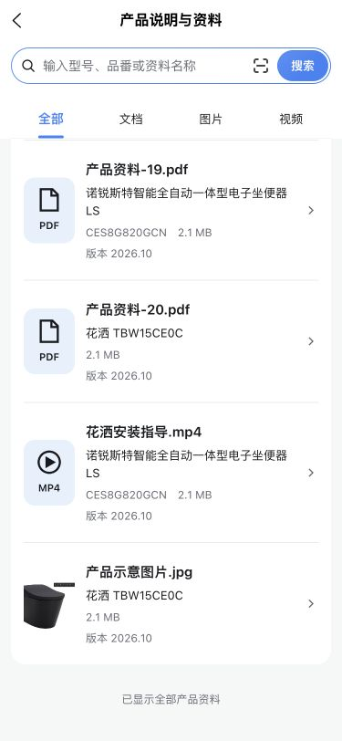
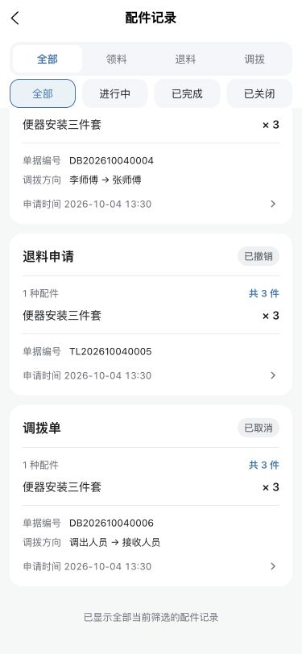
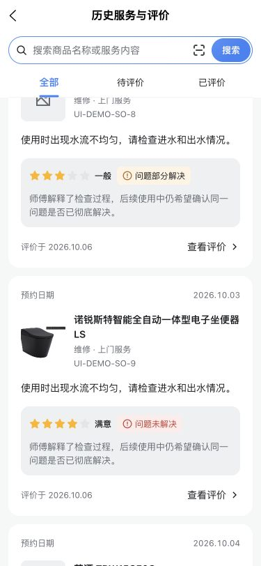

# 两端列表吸顶与底部留白

- 编号／类型／标题：OPT-20261007-SHARED-LIST-LAYOUT-01；体验优化；两端列表顶部吸顶、分页反馈与底部留白统一。
- 应用／入口：消费者资料、历史评价、投诉记录及商品／服务选择；人员任务、库存、技术资料、配件记录与指南／库存选择。
- 来源／日期：用户要求加载更多与结束提示同样式，并进一步要求两端搜索／状态吸顶、底部空间及前端约束统一；2026-10-07。
- 优先级／状态／负责人：P1；待验证（研发完成，微信原生及真机待验）；研发Codex，验收负责人待分配。

## 确认规则与公共实现

两端等价增加AppListToolbar／AppListContent／AppListFooter，基础11示例同源同步。消费者ConsumerRecordToolbar与ConsumerRecordListFooter只保留业务选项、结束数据名称及事件映射，不再持有私有外观；此前ConsumerRecordListEnd由Footer替代。

查询顶部默认通栏纯色主题表面、16rpx顶部／24rpx水平内距、8rpx控件间距，统一sticky＋virtualHost。普通导航取--window-top，自定义导航使用useNavigationMetrics实时高度；根／祖先overflow必须允许页面吸顶，不复制44px高度。人员任务／库存原概览保留，首轮将列表查询区改为通栏公共容器；后续按用户最新确认恢复卡片样式，见[服务人员首页查询卡片恢复](#worker-query-card-restore-20261007)。配件记录双Type和技术资料搜索／范围均固定。指南问题搜索与内容Type置于同一查询容器；退料／调拨库存搜索使用可铺满父级gutter的bleed容器。表单内选择、地图及详情控件仍按自身滚动语义，不全局固定基础Type。

列表末端净留白48rpx（375px视口24px），由AppListContent独立提供。无底栏默认增加安全区；有Tab或AppBottomActions由对应组件负责占位／安全区，正文safeArea=false。移除资料／历史30px尾部、投诉最后列表20px额外margin、人员任务／库存私有8rpx尾部及页根重复留白；最后任务卡取消末尾margin。指南列表因复杂混合内容沿用页面容器，按同一48rpx末端约束实现。短列表自然剩余视口不强制填满。

分页操作与结束提示均为24rpx／400字重／1.5行高／次级灰色／居中，顶部32rpx间距、最小88rpx区域。加载更多、重试复用AppButton，保留触控、焦点、按压、加载中转圈及禁用；业务仍决定何时出现、分页／重试行为及endText，不伪造全量数量。投诉独立发起／商品选择、评价资格、接口与缓存契约保持。

已同步两仓AGENTS.md、design-system.md、shared-foundation.md及项目UI规范；后续新查询列表直接使用公共组件，无法复用的复杂页按同一占位与留白规则执行。

## 研发验证与边界

两端pnpm check通过：消费者40项租户／上传检查、318项单元、4项路由、12项审计；人员38／254／5／12项。含typecheck、ESLint、Stylelint、双端demo:check、路由与租户派生检查。更新任务页既有回归的导航度量适配及公共布局断言，不删除业务行为断言。两端H5与微信development最终构建通过，源码／文档diff与文档影响检查通过。

H5使用实际编译页面及仅本机、拒绝所有业务写请求的合成接口：375px投诉上滑4825px后顶部仍44px／全宽375px，结束提示12px灰字，滚动到底距固定操作栏24px；资料与历史上滑后顶部同为44px／375px，末端788px距812px视口24px。人员配件记录上滑938px后顶部44px／全宽375px，尾部788px距812px视口24px；任务、库存两页上滑后公共查询区停在44px，第二页自动追加后出现对应结束提示，正文末端24px；技术资料搜索TBW15CE0C得到单条匹配指南并显示“已显示全部匹配的商品指南”。消费者深色加载更多为12px／400、次级灰rgb(176,180,186)，44px触控区且顶部／卡片／底栏可读。状态控件切换事件／选中反馈已核对，合成配件记录返回不替代后端状态过滤业务验收。

本次未操作用户微信开发工具，原生吸顶、安全区设备实测、所有指南／退料／调拨分支、人员其他深色场景与真机仍待复核。H5／构建不等于业务验收，功能计数不变；未Git提交、推送、上传或部署。原始夹具／日志留在忽略目录.local/verification-artifacts/20261007-shared-list-layout/，仅保留两张最终合成数据关键布局图。

## 2026-10-07 消费者原生外壳与搜索净间距修正

用户反馈历史服务上滑时查询栏仍滚走，且搜索与Type留白过大。检查微信编译结构发现，外壳真实consumer-ui保留overflow-x:hidden，原页面级class／deep修改不能作为原生组件内布局的可靠依据。ConsumerPage增加list-layout，由组件自身控制真实根view的overflow:visible及consumer-content零padding；历史只在记录列表开启，评价详情保持原布局，投诉记录／选择使用列表布局。移除页面级穿透补丁。

两端AppListToolbar统一设置--app-search-margin:0，AppSearch的共同样式读取该变量，独立搜索保留原24rpx底部／16rpx上下默认留白。此前容器8rpx与搜索底部24rpx叠加为32rpx；现在搜索与Type净间距8rpx（375px视口4px），高度更紧凑。旧库存样式测试更新为检查独立搜索默认留白及容器覆盖，不改业务断言。基础11继续复用实际公共组件，两端Demo和开发约束同步。

三页搜索占位改为“搜索产品型号或资料名称”“搜索商品名称或服务内容”“搜索商品名称或投诉内容”，不在占位夹带已加载记录、品番或内部单号术语。历史已有problemDescription搜索不变；投诉增加本人公开content参与原已加载记录匹配，与状态交集、分页、错误及归属边界保持，空态继续说明可加载更多。资料继续原关键词API。

本次两端pnpm check通过（消费者318项／人员254项单元回归，含类型、ESLint、Stylelint、Demo一致性及其他既有检查）；两端H5／微信development构建通过。微信产物核对ConsumerPage真实根view包含consumer-page--list，局部WXSS同时设置overflow:visible和正文零padding，三页占位与共享搜索变量均进入产物。

实际H5 375×812：历史上滑2436px、投诉与资料上滑1624px后，查询区都停在导航下44px／全宽375px，搜索与Type实际净间距4px；历史支持服务描述“水流”及待评价交集、清空搜索；投诉“再次出现”仅存在公开content，也成功匹配；资料型号CES8G820GCN请求得到匹配资料和对应结束提示。只读评价详情根未开启list-layout，保留20px 20px 30px原内距，避免列表规则污染详情。人员资料页搜索margin为0，搜索与范围净距4px，上滑查询区保持44px。仅使用拒绝业务写请求的本地合成数据，未写真实业务。

微信工具读取正常，但原生输入工具报无可操作窗口，未完成原生滚动手势，不能用构建或H5替代微信吸顶验收。源码双端差异与文档影响检查通过，未提交／推送／上传／部署；本轮保留一张合成历史页上滑最终截图，旧两张用于前一阶段末端留白证据。

## 2026-10-07 本轮提交收尾

2026-10-07 本轮代码已本地提交：消费者`f4b63f5`、服务人员`3a62d91`（Committer：snow），归并项目v0.23.16。提交副本双端pnpm check通过（消费者310项／人员254项单元回归），正常提交Hook及文档影响检查通过；此前H5／微信构建和H5关键布局证据保持。微信原生滚动／真机及业务验收仍待复核，未推送／上传／部署。其他任务的菜单、个人资料及上传修复保留在工作区，不纳入本轮版本。

## 2026-10-07 服务人员首页查询卡片恢复

- 编号／类型／标题：OPT-20261007-WORKER-QUERY-CARD-01；体验修正；任务／库存首页查询区恢复白色圆角渐变卡片。
- 应用／入口：服务人员任务首页W01／库存首页W05；消费者页面布局保持。
- 来源／日期：用户要求撤回消费者通栏搜索／Type优化对人员两个首页的外观影响；2026-10-07。
- 优先级／状态／负责人：P1；源码修正完成，页面效果由用户自验；研发Codex，验收用户。

定位到服务人员`3a62d91`：两个panel宽度由calc(100% + 32rpx)扩至calc(100% + 64rpx)，旧查询卡片顶部圆角与渐隐遮罩被通栏Toolbar替代。本次仅恢复这两页panel宽度与正文横向16rpx内距，并使用公共AppListToolbar显式variant="card"：白色语义表面、顶部overlay圆角、任务72rpx／库存32rpx向下渐隐；库存查询卡保留16rpx底内距。panel既有白色向页面底色渐变继续保留。查询、Type切换、导航实时高度、sticky、搜索／Type净间距8rpx、分页、48rpx末端留白及业务权限不改。

公共可选card样式与基础11示例两端等价同步，默认plain仍供消费者记录页及其他现有通栏调用使用；不恢复页面私有sticky实现，也不批量改变其他业务页面。

双端pnpm check通过，含类型、ESLint、Stylelint、既有测试、Demo一致性、路由及租户派生检查；源码diff检查通过。按用户最新要求，后续不打开或操作小程序／浏览器、不另启动服务或重启已有编译监听；最终界面、滚动及真机效果由用户自验，本次无完整视觉验收结论。未提交／推送／上传／部署，入口及验收计数不变。

## 2026-10-08 提交收尾

共同card皮肤／基础示例已分仓本地提交：消费者`33f9cb8d`、人员`42c2fd7f`（Committer：snow）；人员提交同时包含远程开始按钮层级微调。双端完整verify及H5基础示例构建通过，正常Hook及文档影响检查通过；页面效果仍由用户自验，本次未进行微信／浏览器视觉操作，未推送／上传／部署。微调不单独升版，与维修流程修复同轮归并v0.23.19，业务验收计数不变。
