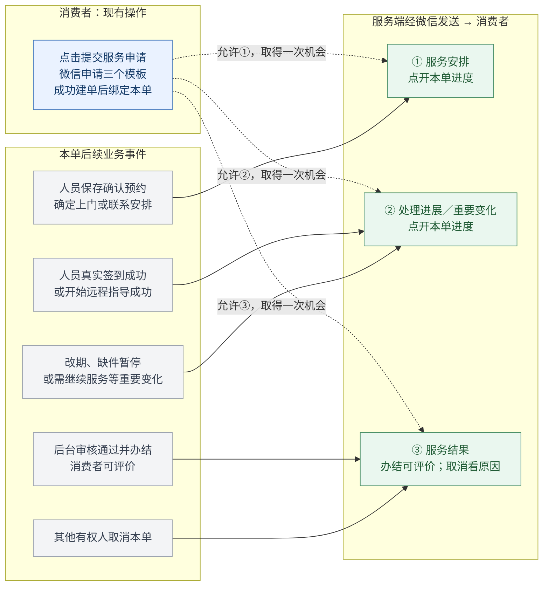
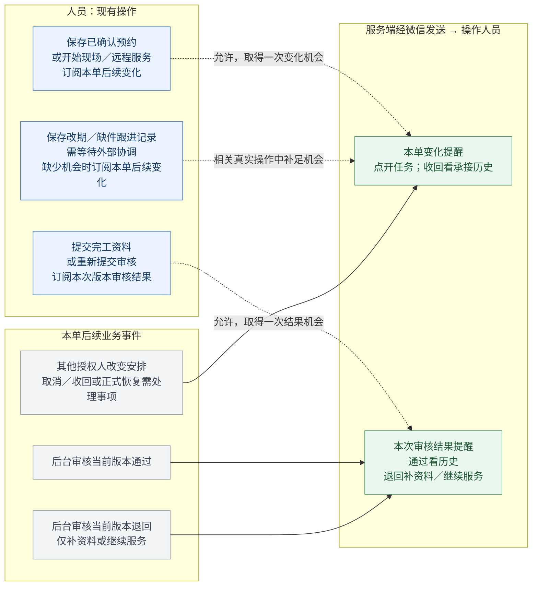
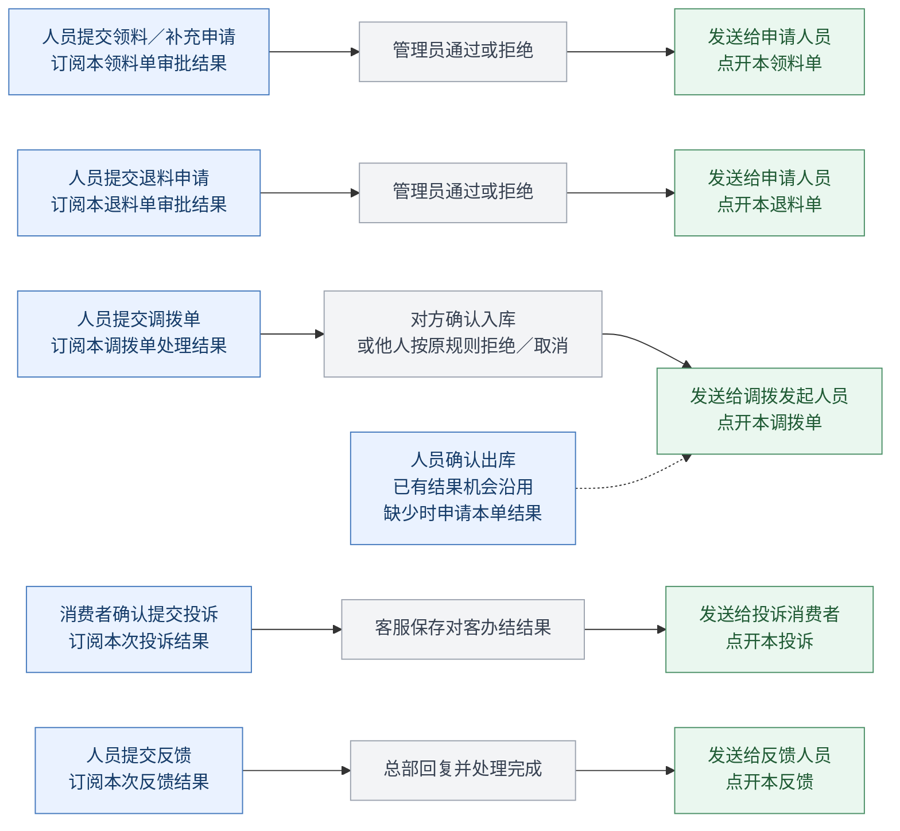

# 两端小程序订阅消息设计

- 编号／类型：CR-20261007-01，新增能力设计。
- 状态：用户已确认本期只在现有业务操作按钮中申请订阅，不新增主动订阅入口；下列具体节点与消息分配为修订设计稿，尚未开发、配置模板、发布或验收。
- 来源／首次提出／最后更新：用户2026-10-07提出两端消息通知设计，并要求制作流程图；同日明确按“当前业务操作 → 本单后续变化／结果”重新设计。
- 应用／角色视角：消费者小程序、服务人员小程序；不适用。
- 模块／入口：消费者C07服务申请、C10／C11进度与评价、C19投诉；人员W02任务详情、W04服务处理、W05～W11配件、W15问题反馈。首页、进度页和“我的”不新增订阅按钮或提醒设置。
- 关联需求：CAPP-006／015／017、WAPP-006／008／011／012；配件和人员反馈沿用各自Spec。本稿为唯一设计入口，确认后并入既有正式需求。
- 优先级／负责人：建议P1；待分配。
- 成功标准：每个订阅都能对应一个现有操作及其后续业务事件；只通知本人本单；每次最多三个实际模板，每个获准模板一次机会；拒绝订阅不影响业务完成。
- 证据边界：已只读核对现有按钮、工单状态、配件流转和功能Spec；未取得两个AppID的实际模板清单或微信真机发送回执。

## 1. 本期设计原则与操作对应表

**用户做了哪件事，就在这个现有操作里申请接收这件事的后续变化或结果。** 不新增“接收任务提醒”“接收后续提醒”“接收配件提醒”等入口，不新增订阅勾选框、设置页或额外确认页，也不把查看列表、打开详情、刷新和普通保存当作凑次数的机会。

| 端／现有操作 | 订阅什么 | 后续哪个事件发送 | 接收人／范围 |
| --- | --- | --- | --- |
| 消费者提交服务申请 | 本单安排、处理进展、服务结果，最多三个模板 | 确认预约；真实开始服务或重要变化；审核通过办结或他人取消 | 提交申请的消费者／本工单 |
| 人员保存联系记录，结果为确认预约 | 本单后续变化，一个模板 | 后续由其他授权人改变原约定、取消／收回或要求重新安排 | 当前人员／本次承接 |
| 人员点击开始现场服务／开始远程指导 | 本单后续变化，一个模板 | 后续由其他授权人改变执行安排、取消或正式恢复需处理事项 | 当前人员／本次承接 |
| 人员保存跟进记录，登记改期／缺件等需外部协调事项 | 本单后续变化，一个模板 | 后续有人完成协调，保存真实恢复或新的执行安排 | 当前人员／本次承接 |
| 人员提交完工资料 | 本次完工审核结果，一个模板 | 当前提交版本审核通过或退回 | 提交人员／本次提交版本 |
| 人员重新提交审核 | 新版本审核结果，一个模板 | 新版本审核通过或退回 | 重提人员／新提交版本 |
| 人员提交领料申请／提交补充申请 | 本张领料审批结果，一个模板 | 管理员通过或拒绝 | 申请人员／本领料单 |
| 人员提交退料申请 | 本张退料审批结果，一个模板 | 管理员通过或拒绝 | 申请人员／本退料单 |
| 人员提交调拨单 | 本张调拨处理结果，一个模板 | 接收人员确认入库；或其他有权人按现有规则拒绝／取消 | 发起人员／本调拨单 |
| 人员确认出库 | 沿用本单调拨结果机会；缺少时在此现有操作中申请 | 接收人员后续确认入库 | 出库人员／本调拨单 |
| 消费者确认提交投诉 | 本次投诉结果，一个模板 | 客服保存消费者可见办结结果 | 投诉消费者／本投诉 |
| 人员提交反馈 | 本次反馈结果，一个模板 | 总部保存回复并完成处理 | 反馈人员／本反馈 |

“最多三个”是上限，不是每次都申请三条。**消费者提交申请申请三个；人员处理工单只申请变化，提交完工时再申请审核结果；领退料和调拨各申请本单结果。** 不在开始处理时夹带下一张新任务，也不提前申请还没提交的完工版本结果。

已获准、尚未消费且业务范围一致的机会直接沿用，不因同一单从保存预约走到开始服务就重复弹窗。机会已用完时，只在后续真实、相关的业务操作中再次申请；没有这种操作就不补订。

## 2. 流程图：现有按钮在哪里订阅，后续哪里发送

蓝色是已有操作及订阅，灰色是后续业务事件，绿色是服务端经微信发送的消息。**虚线表示取得对应发送机会，实线表示业务事件触发发送；不是订阅后立即发送。** 所有绿色节点都须检查对应模板已获准、还有本单机会、事件和权限仍有效。拒绝／取消微信订阅仍继续原操作。

### 图1 · 消费者提交服务申请后接收本单进度

正常路径是**预约确定 → 开始服务 → 审核通过后的办结／评价**。②的一次机会用于开始服务或重要变化中的一个：若缺件／改期先发生并通知，后面开始服务不再凭原授权发送；若开始服务已通知，后面异常也不能再凭原授权发送。①、③同样各一次，不借用其他类型的机会。

本期没有消费者主动补订入口；消费者通常只在提交本单时取得这三个机会，后续进度仍在小程序完整显示。只读取进度、评价服务或提交投诉时不夹带本工单补订。

### 图2 · 人员处理工单订阅变化，提交完工订阅审核结果

本人的保存预约、签到、保存草稿和提交成功只反馈到页面，不再发消息给本人。审核退回由“审核结果”通知一次，不同时再发“本单变化”。收到退回结果后，该次结果机会已经用完；点击现有“重新提交审核”时为新版本再次申请。

### 图3 · 配件、投诉和反馈：提交后接收对应结果

每条流程均经过微信授权并绑定成功提交的单据，灰色事件保存成功后才检查并发送。现有人员调拨没有管理员审批，只有出库／入库等原有流转，消息叫“调拨处理结果”，不新增审批。发起人自己的确认出库不通知自己；接收人确认入库成功也只显示页面反馈，后续结果通知发起人。

## 3. 消费者服务消息规则

| 业务类型 | 发送事件 | 不发送／时效条件 | 落地页 |
| --- | --- | --- | --- |
| `C_ARRANGEMENT` 服务安排 | 首次有效确认预约保存成功 | 客户期望时间、内部派站派人不触发；旧承接被释放后不发送原预约 | 本人本单服务进度 |
| `C_PROGRESS` 处理进展 | 现场签到或远程开始成功；或对客有实际影响的改期、缺件暂停、需继续服务 | 同一机会只发首次仍有效的重要事件；不对内部备注、普通保存或仅补资料的退回发送 | 本人本单服务进度 |
| `C_RESULT` 服务结果 | 当前版本审核通过且已办结；或其他有权人取消本单 | 提交完工不等于审核通过；本人取消不发给本人；取消不带评价入口 | 可评价时进入本单评价；已评价看记录；取消看本单进度 |

三个类型都只来自本次“提交服务申请”。消费者拒绝部分模板时只记录获准类型，不把“订阅工单进度”解释成任意状态都能连续发。

- 消费者页面保留“服务安排 → 服务处理 → 服务完成”。人员提交完工时仍按原契约展示服务完成，微信结果通知建议留给审核通过后可评价的节点。
- 本期处理进展通知改为真实开始服务／重要变化，不再设计预约前两小时的定时通知，不生成“师傅正在赶来”等缺少事实的消息。
- 首次预约已通知后的改约属于处理进展类；如果对应机会已用完，只更新进度，不换个模板再次发送。
- 同一未发送进展消息遇到多个有效事件时，先通知需要重新安排／暂停服务的变化，内容以发送前最新事实为准；已发送消息不能合并成未消费状态。
- 缺件单领料通过不等于服务恢复，不直接通知消费者“已预约好上门”。仍由人员联系并保存新安排。
- 仅补资料的审核退回不通知消费者；需继续服务且影响执行时，可使用尚未用掉的处理进展机会。
- 本流程进入终态后作废未用的安排／进展绑定。取消恢复或再次服务不自动复活旧预算，也不为其新增消费者订阅操作。
- 远程指导沿用三类消息，文字表达联系安排和远程处理，不包含上门或签到位置。

## 4. 人员工单消息规则

### 4.1 处理本单 → 等待本单变化

`W_TASK_CHANGE`仅绑定当前工单、当前人员和本次承接。以下现有业务操作可取得或沿用一次机会：

1. “保存联系记录”，结果确为预约确认／改约，人员接下来需要按本约定执行。
2. 任务详情“开始现场服务／开始远程指导”，人员进入本单作业流程。
3. “保存跟进记录”，本次确为缺件、改期等需要后续协调的情况。

普通沟通备注、电话号码复制、查看详情、继续打开草稿等不申请。尚有同范围可用机会时不重复申请；已消费后在下一次真实相关操作中才再次申请。业务动作并发或幂等重试不重复计次。

后续发送仅用于**其他有权人造成的、本人需要关注的执行变化**：改变已确认约定、取消／收回、正式恢复需继续安排等。本人登记的异常不反向通知本人；后台普通备注不发送。收回通知落到本次脱敏承接历史，不恢复客户电话、地图或办理权限。

点击详情“开始现场服务”是进入作业页，不等于已经签到。通知订阅可在此现有点击中完成并绑定已获权工单；真实服务开始事实仍须后续签到／远程开始成功保存。进入操作流程但最终未开始时，不伪造服务开始事件。

### 4.2 提交本版完工 → 等待本版审核

`W_REVIEW_RESULT`在现有“提交完工资料”或“重新提交审核”中申请，提交成功后绑定准确版本。只有最终提交按钮申请，不在“继续补齐证据”“核对并准备提交”中提前申请，不在开始处理时提前申请。

| 当前版本结果 | 通知内容 | 下一步 |
| --- | --- | --- |
| 审核通过 | 本次完工审核通过，已办结 | 历史详情；不新增交单待办 |
| 退回，仅补资料 | 需补充资料及本人可见要求摘要 | 原补充页，修正后重新提交审核 |
| 退回，继续服务 | 需继续服务及本人可见要求摘要 | 原本单处理入口，不只引导补照片 |

同一版本只通知一个有效审核决定。退回已通知后重提，是新的真实业务动作和新版本，可再取得一次结果机会；不能据一版授权无限通知所有重提结果。即使没有发送资格，退回仍进入原待补资料／处理分类。

## 5. 配件与其他结果消息规则

| 类型 | 申请绑定 | 发送条件 | 操作边界 |
| --- | --- | --- | --- |
| `W_REQUISITION_RESULT` 领料审批结果 | 本张领料单，含工单领料和常备补充 | 管理员通过或拒绝 | 通过后库存事务已完成，不再要求申请人确认收件 |
| `W_RETURN_RESULT` 退料审批结果 | 本张退料单 | 管理员通过或拒绝 | 本人撤销不通知本人 |
| `W_TRANSFER_RESULT` 调拨处理结果 | 本张人员调拨单及发起人员 | 对方确认入库，或其他有权人按现有规则拒绝／取消 | 只使用原流程已有动作，不新增调拨管理员审批；自己创建／出库／撤销不发给自己 |
| `C_COMPLAINT_RESULT` 投诉结果 | 本张本人投诉 | 客服保存对客办结结果 | 内部跟进不发；不向被投诉人员发送消费者投诉原文 |
| `W_FEEDBACK_RESULT` 反馈结果 | 本张本人反馈 | 总部回复并完成处理 | 独立反馈流程，不承诺即时求助或改变工单 |

领退料和调拨是不同业务用途，模板选择要分别核对，不强行把调拨入库完成塞进“审批通过”模板。领退料不同单据即使映射同一实际模板，每张申请获准的机会仍分别绑定，不能一条授权覆盖两张单据。

调拨“提交调拨单”已取得且未消费的结果机会，在“确认出库”时沿用；缺少时可在该现有确认操作中申请。确认出库不向发起人发送中间状态，因此不提前耗掉等待对方入库的机会。出库前拒绝／取消仅在实际既有动作和权限成立时通知，不增加移动端拒绝按钮。

## 6. 本期不设置的通知场景

| 场景 | 本期处理 | 原因 |
| --- | --- | --- |
| 新任务正式分配给人员 | 原任务首页／日程展示，沿用原协调方式 | 在获派之前没有“当前任务”的相关操作；不在处理上一单时订阅下一张新任务，不新增提前订阅入口 |
| 调拨接收人待入库提醒 | 原配件列表展示待入库，由原调拨流程协调 | 接收人在出库前没有可见本单和相关订阅操作；发起人不能代其授权 |
| 消费者线下退款／费用纠正结果 | 原本人费用详情查询 | 当前只有只读查看，没有消费者申请退款／纠正的已确认操作；不新增按钮来取得订阅 |
| 消费者预约前定时提醒 | 查看已确认预约；本期微信消息按实际业务变化发送 | 本轮收敛到提交后本单进度与结果，不新增定时提醒任务 |
| 订阅次数用完后的主动补订 | 后续相关真实业务操作可申请；否则只更新页面 | 不新增主动订阅，不把刷新、查看或重复点击当补次数机制 |

这些是本期范围收敛，不影响原业务流程。首页和单据中的原有待办／状态仍完整展示，通知不是派单或状态流转的前置条件。

## 7. 现有操作中怎样接入授权

每次点击的推荐顺序是：**现有本地同步校验 → 当前点击链内请求微信订阅 → 无论允许／拒绝都继续原业务操作 → 成功后绑定单据／版本。** 配置和短期场景凭证提前加载，不在HTTP成功回调中再强行拉起授权。

- 不增加自定义“是否接收通知”弹窗、订阅勾选框或新业务页面；通知授权只由微信原生面板选择。
- 一次操作只申请与它直接相关且当前需要的实际模板。消费者最多三个，其他本期操作通常一个；已有可用同范围机会则不申请。
- 现有业务确认弹窗保留，订阅仍须在平台认可的用户操作链内申请。提交／出库在等待授权时保持原按钮防重复状态；拒绝、取消或授权失败继续原操作，不显示业务提交失败。
- 消费者提交方法目前含异步联系／资格检查；现场签到含定位授权。实施时需核对点击链，避免把订阅放在异步HTTP／定位结果之后失去合法触发条件。现场订阅优先挂在详情进入作业流程的原按钮，不在签到处重复请求。
- 创建单据／提交版本时，授权记录先关联本次业务请求号，业务事务成功再绑定真实ID及版本；后台事件必须在绑定完成后才能领取发送，防止自动审核先于授权绑定。
- 开始处理已存在的任务时，授权按服务端确认的人员、当前承接及工单绑定；进入流程与真实开始事实保持独立。
- 业务失败保留原草稿和幂等请求号。已获准但未绑定的记录只可用于同一操作重试，放弃后作废，不挪给另一张单据；同一次回调重放不重复加次数。
- 只有订阅或上报失败时仍允许业务成功，但账本不能凭空增加次数；此时记录通知机会不可用，等待后续相关业务操作，不引导点击新订阅入口。
- 记住允许选择后仍需在合法业务点击中调用接口并取得新的成功结果；微信设置显示允许不是永久发送权。拒绝记住选择或关闭总开关时不循环请求或强制跳设置。
- H5执行正常业务操作，不假装具备微信订阅；共用封装和基础控件按两端共同底座规则同步，类型与模板配置分别管理。

## 8. 发送、次数和消息跳转

本稿使用一次性订阅。每次调用最多三个不同标题的模板；每个获准实际模板增加一次机会。一个模板的机会不能分配成多种各一次，也不能从另一个类型、另一张单据、另一个人员或另一个小程序借用。

平台依据：[腾讯官方小程序订阅消息实践](https://cloud.tencent.com/document/product/1301/103770)、[微信订阅接口](https://developers.weixin.qq.com/miniprogram/dev/api/open-api/subscribe-message/wx.requestSubscribeMessage.html)、[微信订阅消息说明](https://developers.weixin.qq.com/miniprogram/dev/framework/open-ability/subscribe-message.html)。此前已取得腾讯官方实践内容；微信开发文档直连未成功读取，具体模板和真机行为仍待接入验证。

业务类型名不是已经取得的微信模板名称／ID。两个AppID分别核对可选标题、用途、字段和字数。若消费者三类只能映射到同一个实际模板，必须合并一次机会并调整通知节点，不能把同模板重复传入伪造三个机会。模板更换不把旧授权转成新授权。

必要支撑只有模板配置、带单据／承接／版本范围的订阅记录，以及可靠通知事件和发送结果，不另建完整通知平台或站内消息中心：

1. 业务成功时在事务内登记可靠事件，事务外异步发送；微信异常不回滚工单、库存或审核。
2. 发送前核对当前权限、事件版本、接收人和对应机会。按AppID、接收人、业务ID／版本和事件类型去重，原子预占机会。
3. 改派、旧预约、已处理事项和过时审核结果不发送；新授权不触发扫描历史事件补发。
4. 确定失败按原因处理，拒绝／缺资格不自动重试；确定未受理的临时故障可有限重试。受理结果不明的超时保留占用并待核对，不盲目重发。
5. 成功只记“微信已受理”，不当作用户已读；不把通知当业务办结或审核通过凭证。
6. 消费者普通安排／办结建议08:00～21:00发送，夜间延后前重新核对；影响当下执行的变化及时发送。人员待处理变化和审核／配件结果按实际业务及时发送，不增加日常催办。
7. 消息摘要只含必要编号、服务类型、时间、本人／对客可见的结果；客户电话、详细地址、内部分析和财务账号留在鉴权页面。
8. 点开进入本单进度、评价、任务、配件、投诉或反馈详情。未登录沿用原登录恢复，无权／已收回按原规则拒绝或展示脱敏历史，不恢复旧办理权限。
9. 订阅上报以服务端场景凭证、会话、模板白名单、单据和请求号校验；客户端不能指定OpenID／接收人或任意加次数。项目账本保守记录，最终能否发送仍以微信为准。
10. 同人多单、双执行器和重复请求不得争用同一次机会；实际发送页面须在对应AppID目标版本中存在，凭据只保存服务端。

## 9. 流程推演

| 流程 | 当前操作怎样订阅 | 后续怎样发送 |
| --- | --- | --- |
| 正常消费者服务 | 提交本单允许三个类型 | 预约确定发安排；真实开始发进展；审核通过发结果 |
| 消费者先遇到缺件 | 提交本单取得的进展机会仍在 | 缺件暂停先发进展，后续恢复／开始无新机会则不再发；最终结果机会独立保留 |
| 人员正常作业 | 保存确认预约／开始处理时允许本单变化；最终提交时允许审核结果 | 他人引起的有效变化发一次；本人普通操作不发；审核决定发结果 |
| 人员审核退回重提 | 第一次提交订阅第一版结果；退回后点击“重新提交审核”订阅新版本 | 每版最多一条审核结果，不同时再发变化；无机会仍显示原待办 |
| 人员缺件申请领料 | 保存缺件跟进可订本单后续变化；提交领料另订本领料结果 | 管理员通过发领料结果；不自动认为工单恢复，不对同一审批再发一条工单变化 |
| 人员调拨 | 提交调拨订最终结果；确认出库沿用，缺少时可申请 | 本人出库不发给本人；对方确认入库后通知发起人；本期无接收方待入库微信提醒 |
| 消费者投诉／人员反馈 | 各自在现有提交按钮中订阅本次结果 | 客服办结投诉／总部回复反馈后通知各自提交人 |

## 10. 接入依据与验证清单

业务依据：[状态与单据说明](../02-技术设计/13-服务工单状态机与单据状态说明.md)、[消费者三阶段与办结](2026-09-23-服务工单办结与抽样回访独立状态.md)、[三类服务](2026-09-26-安装维修指导三类服务流程.md)、[人员承接历史](2026-10-03-工单两级退回与重新分配.md)、[配件库存](2026-09-10-配件库存独立系统全栈首版.md)、[线下收费](2026-10-03-服务工单线下收费开发计划.md)、[人员反馈](2026-10-05-服务人员问题反馈首版.md)。

源码已核对：消费者服务流及投诉提交；人员任务详情的确认预约／跟进与开始服务入口、作业页“提交完工资料”、补充页“重新提交审核”；配件“提交领料申请／提交补充申请”“提交退料申请”“提交调拨单”和“确认出库”；人员“提交反馈”。定位签到／远程开始有真实写接口，调拨当前走双确认。按钮文案与权限继续以各仓router、页面和后端actions为准。

| 验证 | 预期 |
| --- | --- |
| 页面和入口核对 | 没有新订阅按钮、勾选框、设置页；只有表内真实业务操作会申请 |
| 三模板全部／部分允许、全部拒绝、关闭总开关 | 分别记结果；原业务继续；未获准类型不发送 |
| 同一单尚有机会、再次真实操作及重试 | 沿用已有机会；缺少时才申请；业务／回调重放不重复计次 |
| 消费者三个正常节点、先异常后开始 | 正常各一条；进展一次机会不会因多个变化连续发送；没有主动补订引导 |
| 人员处理与审核分离 | 开始处理只订本单变化；最终提交才订本版审核；下一张任务不夹带 |
| 两类审核退回与新版本重提 | 每版结果准确；仅补资料不扰消费者；新版本需新适用机会 |
| 领退料通过／拒绝、调拨出入库 | 按真实原状态发送；调拨不增加审批；接收方无授权不发 |
| 多工单、跨端／站／租户、取消／改派 | 预算和接收范围不串用，旧事件不补发，落地权限有效 |
| 业务／授权失败、发送超时及双执行器 | 业务不被通知阻断；不重复申请、占用或发送；未知回执待核对 |
| 真机点击链与落地 | 在原按钮上允许 → 后续真实业务事件 → 微信通知 → 正确单据；H5不调用微信订阅 |

先核对两个AppID实际模板及真机点击链，再接入共用底座、工单主线、配件和投诉／反馈。不得用构建通过代替微信真机闭环，也不把研发验证写为业务验收。

本次修订只更新本设计稿、流程图及第11节消息文案方案，未修改源码、配置或其他功能Spec，未更新已实现／验收计数，未提交或发布。用户确认的“仅现有业务按钮”已落实到设计；具体模板映射、事件优先级、发送时段及消息文案仍待评审和实际核验。

## 11. 消息标题、说明和目标字段

本轮先细化此前讨论的八种核心模板：消费者三个服务模板、人员两个工单模板、领料／退料／调拨三个结果模板。投诉和反馈保留原流程，本轮不扩展其字段方案。

### 11.1 标题、描述和实际消息的区别

- **目标标题**：用户在微信订阅面板和消息中看到的通知类别。最终取决于微信后台选用或获准的模板，发送接口不能任意改标题；本节是选型或模板申请的目标文案，尚未取得模板ID。
- **用途说明**：帮助评审及选型明确“订阅什么”的一句话描述，不假定微信原生面板支持我们自由添加描述。它不形成新增说明页、订阅勾选框或自定义确认弹窗。
- **目标字段**：希望从实际模板关键词中选择的字段。关键词名称、类型和序号以最终模板为准；不能在发送时自行增加“处理提示”等字段。以下均按五个目标字段设计，便于控制信息量。
- **动态值与点开目的**：服务端根据真实业务事件填写状态、摘要及操作提示；点开进入原单据。提示是消息内容，不是微信按钮文字或新增业务动作。

所有消息尽量回答三件事：**是哪项服务／哪张单据、发生了什么、点开后做什么。** 消费者使用“服务”，人员使用“工单／申请／调拨”。标题不写内部状态码，消息不只写“状态已更新”“请查看详情”或“有新消息”。

| 对象／业务类型 | 目标标题 | 用途说明 |
| --- | --- | --- |
| 消费者／C_ARRANGEMENT | 服务预约确认通知 | 本次预约确认后，告知上门或远程联系时间及服务人员。 |
| 消费者／C_PROGRESS | 服务进度通知 | 本次服务开始或发生重要变化时，告知当前情况和后续安排。 |
| 消费者／C_RESULT | 服务结果通知 | 本次服务完成或取消后，查看服务结果、评价或取消原因。 |
| 人员／W_TASK_CHANGE | 工单变更通知 | 当前工单安排变更、取消、收回或恢复处理时，告知需要关注的事项。 |
| 人员／W_REVIEW_RESULT | 完工审核结果通知 | 本次完工提交审核后，告知通过结果或补资料、继续服务要求。 |
| 人员／W_REQUISITION_RESULT | 领料申请结果通知 | 本次领料申请审批后，告知结果、原因和库存处理情况。 |
| 人员／W_RETURN_RESULT | 退料申请结果通知 | 本次退料申请审批后，告知结果、原因和库存处理情况。 |
| 人员／W_TRANSFER_RESULT | 配件调拨结果通知 | 本次调拨完成或被关闭后，告知对方入库或关闭结果。 |

### 11.2 消费者三个模板

#### A. 服务预约确认通知

| 目标字段 | 建议类型 | 示例值 | 表达目的 |
| --- | --- | --- | --- |
| 服务内容 | thing | 智能坐便器维修 | 知道是哪件产品、哪类服务 |
| 预约时间 | time | 2026年10月10日 09:00 | 知道已确认的上门或联系时间 |
| 服务人员 | thing | 李师傅 | 知道由谁服务；使用真实对客称呼 |
| 温馨提示 | thing | 查看预约安排，留意师傅联系 | 知道点开看安排，留意联系 |
| 服务单号 | character_string | FW202610070018 | 区分本人多次服务 |

远程指导时服务内容可为“智能坐便器远程指导”，温馨提示用“查看联系安排，留意远程联系”。预约时间使用真实确认时间；只有客户期望时间时不发。时间字段如需表达区间，按真实模板的时间格式支持核对，不自行拼接不受支持的时段。

此模板只有“预约已经确认”这一含义，不在提醒中写“等待预约”或把内部派单成功当预约成功。

#### B. 服务进度通知

| 目标字段 | 建议类型 | 示例值 | 表达目的 |
| --- | --- | --- | --- |
| 当前进度 | phrase | 服务开始 | 首先看懂发生了什么 |
| 服务内容 | thing | 智能坐便器维修 | 识别本次服务 |
| 进展说明 | thing | 师傅已到场，开始维修 | 用真实事实补充状态 |
| 温馨提示 | thing | 查看本次服务进度 | 告知点开目的 |
| 服务单号 | character_string | FW202610070018 | 与本人本单对应 |

同一个标题下，用不同的动态值表达真实变化，不改变模板标题，也不把一次机会变成多条：

| 真实事件 | 当前进度 | 进展说明 | 温馨提示／点开目的 |
| --- | --- | --- | --- |
| 现场开始 | 服务开始 | 师傅已到场，开始维修 | 查看本次服务进度 |
| 远程开始 | 服务开始 | 已开始远程指导 | 查看本次指导进度 |
| 改期 | 需要改期 | 原预约时间需重新确认 | 查看安排变化，留意联系 |
| 缺件暂停 | 等待配件 | 服务暂停，等待所需配件 | 查看暂停原因和后续安排 |
| 需继续服务 | 继续处理 | 本次服务仍需继续处理 | 查看后续服务安排 |

“需要改期”和“等待配件”不用消费者难懂的内部枚举；“继续处理”不透露内部审核分析。没有确定的新预约时不能写“已为您重新安排”。本次机会已消费则只更新原页面。

#### C. 服务结果通知

| 目标字段 | 建议类型 | 完成示例值 | 表达目的 |
| --- | --- | --- | --- |
| 服务结果 | phrase | 已完成 | 区分完成与取消 |
| 服务内容 | thing | 智能坐便器维修 | 识别本次服务 |
| 结果说明 | thing | 本次维修记录已保存 | 表达已结束并有记录可查 |
| 温馨提示 | thing | 查看服务结果并评价 | 明确点开可评价 |
| 服务单号 | character_string | FW202610070018 | 对应准确服务记录 |

| 真实结果 | 服务结果 | 结果说明 | 温馨提示／点开目的 |
| --- | --- | --- | --- |
| 审核通过、真实办结且可评价 | 已完成 | 本次维修记录已保存 | 查看服务结果并评价 |
| 他人取消本单 | 已取消 | 本次服务已取消 | 查看取消原因，必要时联系客服 |

取消原因如果有简短、真实且对客可见的摘要，结果说明可替换为该摘要；完整原因在本单进度查看。完成不写“故障已解决”，除非已有独立可核实的解决事实；不能从审核通过推断维修一定解决问题。消费者标题及状态不使用“审核通过／已办结”等内部词。取消时绝不带评价指引。

### 11.3 人员两个工单模板

#### D. 工单变更通知

| 目标字段 | 建议类型 | 示例值 | 表达目的 |
| --- | --- | --- | --- |
| 任务状态 | phrase | 安排变更 | 看懂变更类型 |
| 工单号 | character_string | FW202610070018 | 找到准确工单 |
| 服务内容 | thing | 智能坐便器维修 | 识别任务内容 |
| 变更说明 | thing | 已改为10月11日14:00 | 提供有效的新安排或变化事实 |
| 处理提示 | thing | 核对新时间，按新安排处理 | 明确点开需要做什么 |

| 真实变化 | 任务状态 | 变更说明 | 处理提示／点开目的 |
| --- | --- | --- | --- |
| 已确认时间被他人改变 | 安排变更 | 已改为10月11日14:00 | 核对新时间，按新安排处理 |
| 需重新联系安排 | 待联系 | 需要重新确认服务时间 | 联系客户，重新确认预约 |
| 原流程正式恢复执行 | 恢复处理 | 本单已恢复，需继续安排 | 查看恢复情况，联系客户 |
| 他人取消 | 已取消 | 本次任务已取消 | 查看取消原因，停止本次服务 |
| 服务站收回 | 已收回 | 服务站已收回本次任务 | 查看收回记录，无需继续处理 |

变更说明只写已成功保存的事实；不能因为领料通过就写工单已恢复。取消／收回以现有状态门禁为准，点开不恢复旧操作权限。当前人员自己登记的变化不触发此消息。

#### E. 完工审核结果通知

| 目标字段 | 建议类型 | 退回示例值 | 表达目的 |
| --- | --- | --- | --- |
| 审核结果 | phrase | 需补资料 | 一眼区分通过、补资料和继续服务 |
| 工单号 | character_string | FW202610070018 | 找到准确工单 |
| 服务内容 | thing | 智能坐便器维修 | 识别本次作业 |
| 审核说明 | thing | 第2次：铭牌照片不清晰 | 用当前版本及本人可见摘要说明原因 |
| 处理提示 | thing | 补清晰照片后重新提交审核 | 直接说明下一步动作 |

| 当前版本结果 | 审核结果 | 审核说明示例 | 处理提示／点开目的 |
| --- | --- | --- | --- |
| 通过 | 已通过 | 第2次提交审核通过 | 查看审核结果和完工记录 |
| 退回，仅补资料 | 需补资料 | 第2次：铭牌照片不清晰 | 补清晰照片后重新提交审核 |
| 退回，继续服务 | 继续服务 | 第2次：需继续处理漏水问题 | 查看要求，联系客户继续服务 |

审核说明来自当前版本的真实可见记录，不能自动编造具体缺项或专业维修方案。没有可安全压缩的原因时用“第2次提交需补充资料”等中性摘要，处理提示用“查看补充要求后重新提交”。“继续服务”与“补资料”有不同落地页，不笼统写“审核未通过，请查看详情”。通过不催促再次交单。

### 11.4 人员三个配件结果模板

#### F. 领料申请结果通知

| 目标字段 | 建议类型 | 通过示例值 | 表达目的 |
| --- | --- | --- | --- |
| 审批结果 | phrase | 已通过 | 先看审批结果 |
| 领料单号 | character_string | LL202610070006 | 找到准确领料申请 |
| 配件摘要 | thing | 密封圈等3种，共5件 | 看懂申请对象及规模 |
| 结果说明 | thing | 领料已完成，个人库存已更新 | 区分审批与实际库存结果 |
| 处理提示 | thing | 查看领料明细，核对个人库存 | 明确点开核对什么 |

拒绝示例：审批结果“已拒绝”；结果说明“服务站可用库存不足”；处理提示“查看原因，调整后重新申请”。拒绝原因必须来自真实记录。通过后不写“请确认收件”，也不承诺实物已经送达。需要重新安排服务时仍按原联系流程操作。

#### G. 退料申请结果通知

| 目标字段 | 建议类型 | 通过示例值 | 表达目的 |
| --- | --- | --- | --- |
| 审批结果 | phrase | 已通过 | 先看审批结果 |
| 退料单号 | character_string | TL202610070003 | 找到准确退料申请 |
| 配件摘要 | thing | 密封圈等2种，共3件 | 识别本张申请 |
| 结果说明 | thing | 退料已完成，个人库存已更新 | 知道退料已完成库存处理 |
| 处理提示 | thing | 查看退料明细，核对个人库存 | 明确点开目的 |

拒绝示例：审批结果“已拒绝”；结果说明“退料数量需要核对”；处理提示“查看原因，核对后重新申请”。仍以真实审批记录为准，不伪造拒绝原因；拒绝不写库存已扣减，本人撤销不发送。

#### H. 配件调拨结果通知

| 目标字段 | 建议类型 | 完成示例值 | 表达目的 |
| --- | --- | --- | --- |
| 调拨结果 | phrase | 已完成 | 区分完成与关闭，不写审核通过 |
| 调拨单号 | character_string | DB202610070002 | 找到准确调拨单 |
| 配件摘要 | thing | 密封圈等2种，共4件 | 识别本次调拨 |
| 结果说明 | thing | 王师傅已确认入库 | 明确对方已完成原入库动作 |
| 处理提示 | thing | 查看调拨明细和出库记录 | 发起人点开查看结果，不重复出库 |

取消示例：调拨结果“已取消”；结果说明“本次调拨已取消”；处理提示“查看取消原因和库存记录”。若原流程真实发生拒绝，结果用“已拒绝”，说明取真实摘要，提示“查看拒绝原因和库存记录”。只发送给发起人；本期不发送接收方待入库提醒。自己的出库或撤销不通知自己。

### 11.5 字段长度、短文案与模板匹配

本次以短文本为目标：状态词不超过5个汉字，事物型摘要／提示不超过20个字符；编号优选字符串型，预约时间优选时间型。腾讯CloudBase官方字段说明列出thing不超过20字、phrase不超过5字，且发送字段名必须与已选模板匹配，见[官方模板字段说明](https://docs.cloudbase.net/recipes/add-subscribe-message-cloud-function)。最终仍核对微信后台实际关键词类型及校验规则，不把这些目标字段当成现成模板。

- 表内单号、日期、人员、配件和原因均为文案演示，不变更项目编号规则或制造真实业务记录；实际发送读取真实单据与快照。
- 编号完整发送，不用数据库ID或随意截断正式单号。若实际模板不能容纳，重新匹配适用字段；不为这次文案设计新增一套短号机制。
- 配件摘要以数量和种类优先；一项可写短名称及数量，多项使用“密封圈等3种，共5件”或“共3种配件，合计5件”。按实际单位组织，不把不同计量单位强行相加成“件”。长名称不能挤掉结果和下一步。
- 原因超长时使用经过业务映射的事实摘要，完整原因留在原详情。保留“已取消／需补资料／继续服务”等状态和动作，不能只截取原文前20字导致含义改变。
- 同一标题下按状态填写不同处理提示；不把“已通过／需补资料”动态拼进固定模板标题，不把模板描述当自由消息正文发送。
- 优先选有“状态／结果、业务对象、说明、备注／提示”等适用关键词的模板。缺少独立提示字段时，把下一步合并进可用的说明字段，例如“铭牌照片不清晰，请补清晰照片”；不自行添加字段。实际字段少于五个时优先保留结果、识别对象和下一步。
- 原生“查看详情／进入小程序”跳转文案由微信控制，本设计不假定可改为“立即评价／立即处理”。用户应该在动态字段中已经看懂目的，进入原页面后才能执行有权限的操作。

### 11.6 本轮文案核对

接入前逐项确认：八类标题各自能说明订阅对象；每个实际模板标题及关键词与本稿匹配；状态及摘要长度合法；允许、拒绝、取消、补资料、继续服务等示例不会混淆；消费者完成／取消和人员审核分支跳到正确原页面；无新订阅入口或新办理步骤。最终以微信真机订阅面板、消息卡片和实际落地页核对，不以本稿示例代替模板获批或视觉验收。
