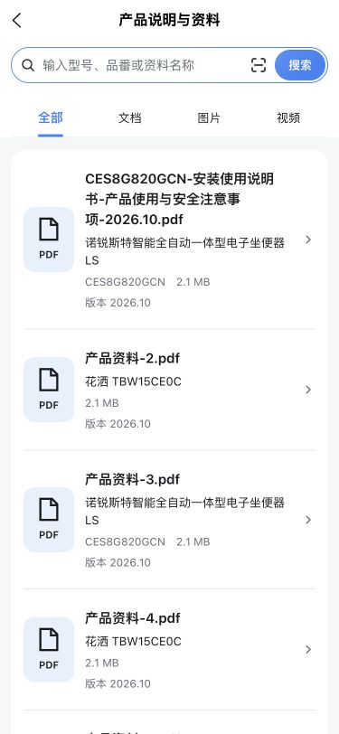
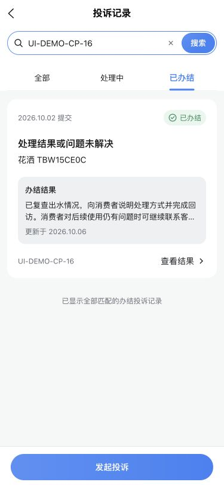

# 消费者三项记录页重设计验证

- 编号／类型／标题：OPT-20261006-CONSUMER-RECORDS-01；体验优化；资料、历史服务与评价、投诉记录的信息层次与操作重设计。
- 应用／角色／入口：消费者小程序；角色视角不适用；我的资料库、C15、C19。
- 来源／日期：用户明确请求并指定UI/UX Pro Max、Taste Skill；首次与更新日期2026-10-06。
- 优先级／状态／负责人：P1；待验证（研发检查完成，最终业务验收未完成）；研发Codex，验收负责人待分配。
- 关联：[资料契约](../../2026-09-26-三端技术资料与官方样例贯通.md#consumer-records-redesign-20261006)、[历史服务契约](../../2026-09-24-消费者服务评价与工单展示.md#consumer-records-redesign-20261006)、[投诉契约](../../2026-09-10-投诉管理独立系统全栈.md#consumer-records-redesign-20261006)。
- 验证标准：真实字段分层且无虚构日期／进度；资料检索与分页可用；取消记录不误导评价；投诉结果与发起入口清楚；长内容、空态、失败恢复及明暗样式可读。

## 研发检查

消费者仓执行 pnpm check 通过：40项上传检查、316项单元、4项控件、12项构建隔离；包含类型、ESLint、Stylelint、双端Demo门禁、路由与租户检查。新5项测试覆盖日期有效性与时区、预约／评价日期标签、取消服务的陈旧资格、投诉旧状态两态兼容以及文件类型／大小边界。既有历史卡片与runtime共209项定向回归通过。

最终 pnpm build:h5 TOTO development 和 pnpm build TOTO development 通过。首次H5构建发现新增样式放在Sass @use前，已修复；最终检查与产物包含修复和投诉简化契约。未变更公共基础组件、接口、数据库或人员端业务页；保留任务开始前的其他未提交改动。

## 页面证据与边界

H5验证使用实际完整编译页面和本机只读合成数据接口，所有业务写请求拒绝，不向真实投诉提交内容。375px核对浅深色、长文件名、产品快捷搜索、类型筛选及第二页资料，历史待评价与已评价、评分／解决情况／长意见、取消记录；投诉状态过滤、服务选择与已有投诉转详情、办结结果前置及底部操作；空投诉可进入服务选择，无服务可联系客服；历史空态与资料错误提示／重试恢复已核对。资料页812px横屏无横向溢出。分类仅过滤已加载记录，分页仍可继续。

微信开发者工具已有真实登录会话与本机后端被复用，实际历史列表的商品图、五星、解决状态及长内容已目视核对；最终资料列表4份、本人TBW15CE0C快捷查询单份官方说明书及HTTP 200，真实投诉列表1条历史办结无结果兜底、处理中筛选空态和本人9条服务选择已核对。真实微信历史完整筛选／评价提交、投诉完整详情及新建、文档／图片／视频原生打开、原生下拉刷新、深色和真机未全量验收。H5合成数据证据不等于真实业务验收，不新增功能验收计数。

原始日志、只读夹具与过程截图留在已忽略 .local/verification-artifacts/20261006-records-redesign/，仅保留最终有代表性的布局图；图中UI-DEMO为合成数据，无真实用户信息。未Git提交、上传或共享测试环境发布。

## 同日前次补充：白色渐变容器与吸顶 Type（已由下方最终方向覆盖）

用户后续确认参考服务人员首页的 task-panel：三页搜索／Type 与列表置于同一个圆角大容器，顶部白色向下过渡到页面灰底，资料行和记录小卡片嵌入其中。资料页搜索、本人型号与资料类型一起吸顶；历史页评价类型吸顶；投诉页记录／发起及记录状态两层切换一起吸顶，发起服务选择只固定第一层。已加载说明随正文滚动，顶部短渐变不遮淡说明文字。使用既有表面／背景主题变量，深色仍沿用对应主题。

本次仅调整三个业务列表的结构与布局，增加消费者业务布局样式 recordList.scss；未修改基础控件或人员端底座。类型检查、三页 ESLint／Stylelint、布局 Stylelint、双端 demo:check、H5／微信构建和 diff --check 均通过。前述完整 check 属于最初重设计检查，本次样式补充未重复全量业务测试。

实际 H5 编译页面在375×812视口核对三页初始布局和上滑：滚动792px后，三页顶部控件均停在原生H5导航栏下44px，宽度375px无横向溢出；投诉吸顶时可切换已办结及发起服务选择，历史说明文字可读，投诉深色表面与渐变正常。合成只读接口仍拒绝写请求。微信开发者工具已目视核对真实历史列表的白色大容器及嵌套卡片；工具滚动操作未能执行，微信三页吸顶、原生深色及真机仍待验，不将H5结果等同于微信验收。未提交或发布。

## 同日前次方向：通栏纯色顶部与独立发起投诉入口（顶部与说明由下方继续收敛）

用户最新确认覆盖前次渐变方案：三个列表顶部无圆角外壳、无渐变，使用通栏纯色表面固定在导航下方，下面使用灰底卡片内容。资料页移除“按我的产品查找”及本人型号切换，只保留搜索与全部／文档／图片／视频 Type；原从商品带入的型号关键词仍可搜索，商品上下文说明放到正文。历史页只保留全部／待评价／已评价 Type；投诉页只保留全部／处理中／已办结 Type，默认展示投诉记录。

“发起投诉”改为底部固定主按钮，通过独立页面栈入口进入选择，原生返回可回到列表，不再与记录状态并列切换。先按已加载本人服务的实例ID归并商品，再显示该商品对应服务；保留继续加载服务记录以发现其他商品／旧服务，不把首15条视为全量。匹配商品图与品番时只使用 system-instance 身份，避免扫码标识与实例ID同值时误配。服务页仍实时核对本人归属和未结案投诉；已有处理中转进度，已办结的原服务可再次进入既有表单。没有可投诉服务时可联系客服，不新增无关联商品投诉接口或放宽服务资格。

完整 pnpm check 再次通过（40项上传、316项单元、4项控件、12项构建隔离，含类型／ESLint／Stylelint／Demo／路由检查）；39项导航与历史定向回归通过；H5与微信重新构建通过，源码及文档 diff --check 通过。未修改基础控件、人员端或数据库。

实际编译H5使用只读合成数据核对：375×812下三个顶部left=0／right=375，无横向溢出；初始与滚动792px后都停在导航下44px，历史／投诉Type高44px、资料搜索与Type高108px。底部主操作留有控件占位且可见；投诉状态过滤、底部进入商品选择、商品下服务隔离、关联ID带入原表单、表单返回保留商品、已有投诉转详情及返回默认记录均通过；空记录仍有发起入口，无服务有客服兜底。资料型号搜索得到11份资料，图片Type显示对应图片；历史待评价筛选正常；投诉深色顶部／底栏及卡片可读。未提交业务表单，夹具拒绝全部POST。

微信开发者工具复用现有会话与本机服务，已目视核对实际资料页纯色通栏搜索／Type、4份文件卡片；原生吸顶、另外两页本轮最终交互、深色及真机尚待核对。H5合成验证与自动化检查不等于业务验收。未Git提交、上传或发布。

## 同日前次补充：搜索／Type统一、移除说明数量、统一结束提示（文案由下方继续收敛）

按用户明确要求，三页移除正文列表说明与加载数量：资料的公开产品资料／搜索结果与已加载份数，历史的已结束服务说明／筛选说明与已加载条数，投诉的处理进展与办结结果及条数都不再显示。已有商品带入的上下文、记录内的真实日期和内容保留。

历史与投诉低成本复用AppSearch，三页顶部统一108px搜索＋Type通栏表面，随内容上滑固定在导航下方；资料保留原API关键词查询。历史／投诉现有接口没有关键词参数，本轮仅增加已加载记录客户端搜索，输入占位明确其范围，保留继续分页，不暗示全库搜索。历史匹配商品名称、服务单号、问题及评价意见，投诉匹配商品、投诉编号、服务单号及公开结果；关键词匹配不区分大小写、忽略首尾空格，与类型／状态条件取交集，清除后恢复该类型列表，会话失效同步清空。未匹配且仍有分页时提示继续加载，全部加载仍未匹配时提示换关键词／类型。

三页成功加载完成且有可见内容时，统一底部文案“已加载全部”、辅助字号与颜色；加载中、错误、仍有下一页时不提前显示。空列表／筛选无匹配继续使用空态，不叠加结束文案。投诉商品／服务选择的分页完成也使用同一结束提示，底部独立发起与原投诉表单守卫不改。

本次类型、三页与搜索工具／测试ESLint、三页与业务布局Stylelint、双端Demo核对均通过；新增1项搜索边界测试，与既有导航／历史共45项定向测试通过；H5和微信最终构建通过。上述前次完整check保留其检查时点，本次未重复全量测试。未修改基础控件／人员端、API、数据库或其他并行改动。

H5实际编译375×812页面核对：三页说明与数量消失；历史／投诉新增输入与状态组合，搜索后续页服务SO-17、投诉CP-16正确，清除及无匹配空态正常；三页首屏分页未完成不出现结束文案，加载第二页后均出现“已加载全部”；投诉结束提示在底部发起栏上方，不遮挡。投诉顶部高108px、left=0／right=375，滚动721px后top仍44px；历史顶部高108px；投诉深色输入、状态、卡片和底部按钮可读，无横向溢出。合成接口拒绝全部POST，未提交业务数据。本轮微信实际消费者页面未核对：开发工具前台已切换人员项目，保留用户当前页面；原生吸顶／搜索／结束提示、深色与真机待验。未提交、上传或发布，业务验收计数不变。

## 同日最新补充：共用顶部组件与按数据范围变化的结束提示

按用户请求抽取ConsumerRecordToolbar，三页统一复用既有AppSearch＋AppChoiceTabs，组件控制纯色表面、通栏108px高度、间距与导航下吸顶；页面传入关键词、Type、选项与标签，组件转发输入、搜索、清除及切换事件，查询／分页仍归页面。微信组件采用virtualHost，编译产物已确认带该配置，避免自定义组件宿主影响根节点吸顶。约束已写入消费者docs/design-system.md。此次是消费者业务组合组件，未修改公共基础控件、Demo资源或人员端；两端基础一致性检查通过。

ConsumerRecordListEnd统一辅助字号／颜色与文案函数，成功完成、有可见内容且无加载／错误时显示。资料Type对应产品资料／文档资料／图片资料／视频资料；历史Type对应历史服务记录／待评价服务／评价记录；投诉状态对应投诉记录／处理中投诉／办结投诉记录；商品与服务选择分别为可投诉商品／该商品的服务记录。统一“已显示全部…”格式，已应用搜索增加“匹配的”，例如“已显示全部匹配的评价记录”；未提交输入不改变结果范围文案。不增加虚构数量，空态／无匹配／失败／未完成保持原反馈与分页。

本次vue-tsc、组件／页面／工具ESLint、组件／页面／业务布局Stylelint、46项导航／历史／呈现测试、pnpm demo:check与H5／微信development构建通过。新增测试覆盖数据名称及搜索词空白／匹配提示；前述完整check保留其历史检查时点。本次未改接口／数据库／基础控件，无提交、上传或发布。

实际编译H5在375×812核对：投诉组件left=0／right=375、高108px，滚动792px后仍top=44px；后续页加载完成显示“已显示全部投诉记录”，状态＋CP-16搜索显示“已显示全部匹配的办结投诉记录”，切换处理中显示无匹配空态且无结束提示，清除恢复“已显示全部处理中投诉”。历史加载后已评价显示“已显示全部评价记录”，SO-17搜索显示“已显示全部匹配的评价记录”；资料首屏仍显示加载更多，加载后图片Type显示“已显示全部图片资料”。顶部搜索／切换事件及分页恢复正常，深色顶部与输入／状态／卡片可读，375px无横向溢出。只读合成接口拒绝写请求。本轮未打断用户当前人员端微信页面，消费者原生吸顶／组件交互与真机仍待验，合成证据不计业务验收。

## 2026-10-07 底部反馈与双端布局统一

按最新确认，加载更多与结束提示统一次级灰字、24rpx／400／1.5，收敛为ConsumerRecordListFooter并委托双端共同AppListFooter；顶部委托AppListToolbar，正文使用AppListContent提供48rpx净留白及安全区单次占位。替代此前各页尾部留白与End组件。三页及投诉商品／服务选择接入，最后投诉列表不再叠加20px间距。双端范围、检查、最终页面及微信／真机边界见[公共布局记录](../../2026-10-07-两端列表吸顶与底部留白.md)。

## 最终布局预览

以下两张是375px真实编译页面的合成数据布局证据，不代表真实用户投诉或业务验收。更新为最新精简布局：资料初始状态与投诉搜索＋已办结筛选结果，展示三页共用的搜索／Type、灰底卡片、随数据范围变化的底部结束提示及独立发起入口。

## 2026-10-07 本轮提交收尾

2026-10-07 本轮代码已本地提交：消费者`f4b63f5`、服务人员`3a62d91`（Committer：snow），归并项目v0.23.16。提交副本双端pnpm check通过（消费者310项／人员254项单元回归），正常提交Hook及文档影响检查通过；此前H5／微信构建和H5关键布局证据保持。微信原生滚动／真机及业务验收仍待复核，未推送／上传／部署。其他任务的菜单、个人资料及上传修复保留在工作区，不纳入本轮版本。
